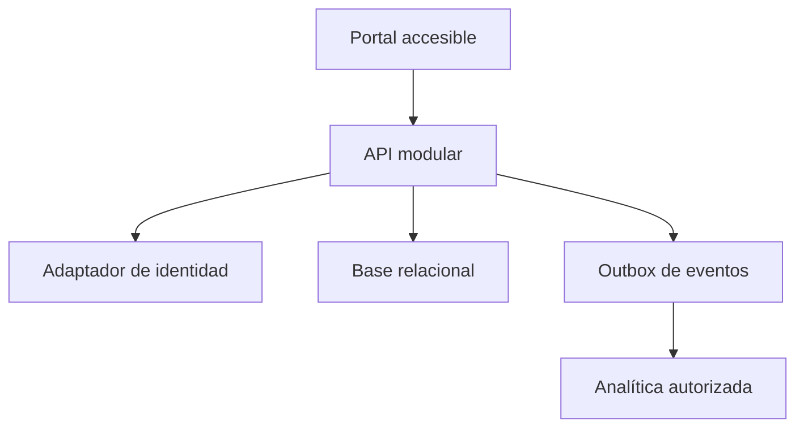

# Arquitectura — EduProgress

## Módulos

- progreso: reglas y consultas;
- evidencias: creación idempotente e historial;
- autorización: políticas por actor, curso y estudiante;
- auditoría: eventos de cambio;
- reporting: proyecciones agregadas.

## Datos

Base relacional inicial para invariantes y transacciones. La outbox se confirma en la misma transacción que la evidencia. No se incorpora otro motor hasta demostrar una carga que lo necesite.

## Fallos

- identidad no disponible: no aceptar escrituras ni reutilizar autorización antigua más allá de su política;
- base lenta: timeout, señal de degradación y no reintentar escritura ciegamente;
- evento no publicado: el worker reintenta desde outbox idempotente;
- analítica caída: el flujo transaccional continúa y acumula eventos dentro de límites.

## Despliegue inicial

Monolito modular y un worker. Simplifica operación y conserva fronteras para extracción futura.
