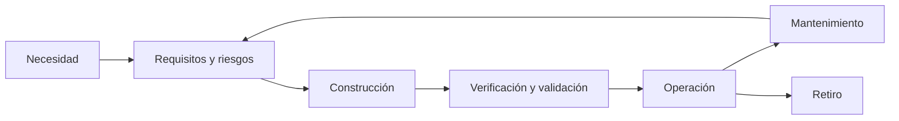

# SE-003 — Ciclo de vida completo y responsabilidades profesionales

[← SE-002](https://github.com/vladimiracunadev-create/modern-software-engineering-program/blob/main/classes/part-00-ingenieria-de-software-como-profesion/se-002-historia-de-la-crisis-del-software-a-la-ingenieria-continua/README.md) · [↑ Parte 00](https://github.com/vladimiracunadev-create/modern-software-engineering-program/blob/main/classes/part-00-ingenieria-de-software-como-profesion/README.md) · [📚 Índice completo](https://github.com/vladimiracunadev-create/modern-software-engineering-program/blob/main/classes/README.md) · [SE-004 →](https://github.com/vladimiracunadev-create/modern-software-engineering-program/blob/main/classes/part-00-ingenieria-de-software-como-profesion/se-004-etica-interes-publico-y-consecuencias-de-las-decisiones-tecnicas/README.md)

> Estado: **GUIDED**. Clase desarrollada y revisada contra el estándar pedagógico; no implica evidencia de ejecución productiva.

## Antes de empezar

La clase anterior mostró que automatizar o modularizar responde a causas concretas,
pero ninguna práctica aislada sostiene un producto. Vuelve al mapa de Campus Abierto:
¿quién responde cuando cambia una regla, falla una migración, vence un certificado o
debe eliminarse información después del retiro?

Aquí transformarás el mapa estático en una **película del ciclo de vida**. Marcarás
decisiones, handoffs, señales y recuperación desde la necesidad hasta el retiro. Ese
recorrido hará visible la autoridad que `SE-004` someterá a juicio ético: poder decidir
también significa responder por consecuencias previsibles.

## Prerrequisitos

Fronteras y retroalimentación de `SE-001`–`SE-002`.

## Problema auténtico

Una función se declara terminada al fusionar código. Después nadie vigila comportamiento, actualiza dependencias, atiende incidentes o retira datos. La definición de terminado excluyó responsabilidades previsibles.

## Objetivos observables

Modelarás desde necesidad hasta retiro, asignarás autoridad sin crear silos y diseñarás transferencias con evidencia y recuperación.

## Temas y por qué importan

| Momento | Decisión clave |
| --- | --- |
| Concepción | problema y criterio de no construir |
| Desarrollo | arquitectura, datos, pruebas y suministro |
| Transición | migración, despliegue y reversión |
| Operación | niveles de servicio y respuesta |
| Mantenimiento | compatibilidad y aprendizaje |
| Retiro | exportación, conservación y eliminación |

## Mapa conceptual

Los retornos muestran que operación corrige requisitos y diseño. El gráfico no prescribe fases separadas.

## Conceptos y decisiones

### 1. Ciclo de vida no significa una secuencia rígida de fases

El **ciclo de vida** reúne las actividades mediante las cuales un sistema o producto
nace, cambia, opera y deja de existir. Un modelo las ordena para poder razonar; no
obliga a ejecutarlas una sola vez ni por departamentos separados. ISO/IEC/IEEE 12207
describe procesos aplicables de manera concurrente, iterativa y recursiva. Mientras se
opera una versión, puede descubrirse la siguiente, mantenerse una anterior y retirarse
otra dependencia.

Confundir ciclo de vida con cascada produce dos errores. El primero es rechazar
actividades necesarias —requisitos, validación o retiro— porque se asocian a una
metodología. El segundo es tratarlas como handoffs irreversibles: “análisis terminó, ya
no puede aprender”. Un ciclo profesional conserva bucles; la operación informa nuevos
requisitos y una dificultad de retiro revela una decisión de diseño pendiente.

### 2. Cada momento responde preguntas distintas

En **concepción y descubrimiento** se aclaran necesidad, afectados, alternativas y
condición de no construir. En **realización** se convierten decisiones en arquitectura,
datos, código, pruebas y artefactos reproducibles. La **transición** prepara migración,
configuración, capacitación, comunicación, reversión y aceptación. **Operación**
observa el servicio real, atiende incidentes y mantiene controles. **Mantenimiento y
evolución** adaptan sin perder compatibilidad. **Retiro** desactiva capacidad, migra o
elimina datos, revoca accesos y comunica consecuencias.

“Terminado” cambia según la unidad. Un cambio puede estar fusionado, desplegado,
liberado, adoptado o producir el resultado esperado. Estos estados no son sinónimos.
Si el equipo usa “done” sin decir cuál, el trabajo restante queda invisible y suele
caer sobre operación, soporte o usuarios.

### 3. Responsabilidad, ejecución, autoridad y custodia

La persona que ejecuta una tarea no necesariamente posee la decisión. **Autoridad** es
la capacidad legítima de aceptar, detener o cambiar un curso. **Responsabilidad** es la
obligación de producir o cuidar un resultado. **Custodia** conserva un activo bajo
reglas acordadas. **Competencia** es la capacidad de emitir juicio. Diseñar gobernanza
consiste en alinear estas dimensiones, no en repartir iniciales en una tabla.

Quien diseña un esquema quizá no ejecute la migración, pero debe considerar
compatibilidad y recuperación porque su decisión crea esas condiciones. Quien opera
puede detectar el peligro, pero necesita autoridad de parada. Si una matriz asigna
responsabilidad sin acceso, tiempo o facultad de decidir, documenta una ficción.

### 4. Un handoff es un protocolo de aceptación y feedback

Transferir trabajo no equivale a enviar un enlace. Un handoff mínimo declara emisor,
receptor, artefacto o estado transferido, supuestos, evidencia, criterio de aceptación,
plazo, canal de dudas y mecanismo de devolución. La aceptación importa porque revela
si ambas partes comparten significado. Sin ella, el emisor puede considerar terminada
una tarea que el receptor no puede operar.

El handoff sano tampoco crea una pared. Si operación descubre que no puede distinguir
dos fallos, existe un bucle hacia diseño e instrumentación. Si soporte crea una
solución manual repetida, el producto debe observarla como evidencia de una capacidad
faltante. El protocolo distribuye trabajo y conserva aprendizaje.

### 5. Retirar es una actividad de ingeniería

Los productos acumulan consumidores, datos, identidades y expectativas. Apagar un
servidor no retira esas relaciones. Deben identificarse consumidores, fechas,
alternativas, exportación, obligaciones de conservación y borrado, credenciales,
dominios, documentación y señales que demuestran que el uso terminó.

El retiro puede fallar de dos formas opuestas: eliminar demasiado pronto y causar
pérdida, o conservar indefinidamente y mantener exposición, costo y datos sin
propósito. La política necesita autoridad y evidencia para ambos extremos. Diseñar con
retiro en mente favorece formatos exportables, dependencias reemplazables y propiedad
clara desde el inicio.

## Caso conductor: cambio del proveedor de identidad

Campus Abierto debe sustituir su proveedor antes del siguiente período. Producto
define qué experiencia no puede perderse; identidad conoce contratos y credenciales;
datos identifica relaciones; soporte prepara recuperación; seguridad revisa secretos;
operación establece señales y parada. El proveedor antiguo continúa activo durante una
ventana controlada para evitar cortar sesiones legítimas.

La decisión atraviesa el ciclo:

1. **concepción:** por qué cambiar y qué condición permitiría renovar en vez de migrar;
2. **realización:** adaptación de contrato, compatibilidad de identificadores y pruebas;
3. **transición:** cohorte pequeña, reconciliación, comunicación y reversión;
4. **operación:** fallos por proveedor, tasa de recuperación y soporte;
5. **retiro:** revocación de secretos, cierre contractual, eliminación o exportación y
   verificación de que no quedan consumidores.

El artefacto pasa el gate cuando un revisor puede localizar quién detiene la migración,
qué señal usa y quién decide reanudar. Una lista de tareas sin estados de aceptación ni
feedback sigue siendo planificación, no control de ciclo de vida.

## Definiciones de trabajo

- **verificación:** conformidad con especificación;
- **validación:** utilidad en contexto;
- **transición:** cambio controlado entre configuraciones;
- **mantenimiento:** corrección, adaptación o mejora posterior;
- **retiro:** eliminación controlada de capacidad, dependencias y datos.

## Glosario

**Baseline** es una versión acordada. **Owner** posee autoridad de decisión. **Custodio** conserva un activo bajo reglas sin poseer su propósito.

## Ejemplo mínimo

Un script depende de credencial personal y falla cuando la persona se va. El defecto nació en construcción, apareció en operación y se previene con identidad de servicio, rotación y propietario.

## Ejemplo profesional

Al cambiar proveedor de correo, producto define experiencia; ingeniería adapta contrato; seguridad revisa secretos; soporte comunica; operaciones observa; legal decide conservación. El retiro revoca credenciales antiguas.

## Práctica guiada

Crea `lifecycle.md`. Para cada momento registra entrada, decisión, evidencia, responsable y salida. Añade dos bucles de feedback y un plan de retiro. Revisa con alguien en rol de operación.

## Ejercicios

1. Diferencia desplegado, liberado, adoptado y retirado.
2. Encuentra responsabilidades ausentes en un ticket que termina en PR fusionado.
3. Diseña transferencia de una migración con rollback.

## Reto verificable

Una persona identifica quién detiene el cambio, con qué evidencia y cómo recupera. Actividad sin dueño o dueño sin autoridad es defecto.

## Preguntas frecuentes

### ¿Agile elimina etapas?
No. Solapa actividades; requisitos, validación, operación y retiro permanecen.

### ¿Responsabilidad compartida es difusa?
No. El resultado puede ser colectivo, pero cada decisión requiere autoridad.

## Fallo controlado y diagnóstico

Quita rotación de credenciales y simula salida de una persona. Traza síntoma, dependencia, responsable y recuperación; corrige el sistema, no solo el secreto.

## Errores comunes y cómo corregirlos

| Síntoma | Causa | Corrección |
| --- | --- | --- |
| el ciclo termina en despliegue | se definió entrega como final del producto | añade operación, evolución, conservación y retiro con responsables |
| RACI contiene muchas “R” y ninguna parada | se repartió actividad sin autoridad | declara una persona decisora y condiciones de escalamiento |
| el handoff es un enlace a documentación | falta aceptación y feedback | agrega receptor, criterio, prueba de comprensión y devolución |
| rollback significa “volver el código” | se ignoraron datos y efectos externos | diseña compatibilidad, compensación y punto de no retorno |
| retiro equivale a apagar infraestructura | se omitieron consumidores y obligaciones | inventaría dependencias, datos, accesos, comunicación y evidencia de cierre |

## Entorno y archivos clave

`lifecycle.md`, `responsibility-matrix.md`, `handoff-checklist.md`, `retirement.md`; sin producción.

## Seguridad, ética y accesibilidad

Incluye abuso, privacidad, accesibilidad y conservación en todas las etapas. El retiro debe ofrecer exportación cuando se pierde una capacidad.

## Transferencia

Compara web, biblioteca y firmware: actualización inmediata, coordinada o físicamente costosa.

## Evaluación y evidencia

Aprueba un mapa con ciclo completo, transferencias, autoridad de parada y recuperación; una lista lineal no basta.

## Fuentes

- [ISO/IEC/IEEE 12207:2026](https://www.iso.org/standard/90219.html), ciclo completo.
- [NASA Systems Engineering Handbook](https://www.nasa.gov/reference/systems-engineering-handbook/), expectativas, realización y revisiones.
- [SWEBOK v4.0a](https://www.computer.org/education/bodies-of-knowledge/software-engineering/v4), práctica profesional.

## Límites y siguiente paso

El mapa no resuelve conflictos de interés. `SE-004` introduce juicio ético.

---

[← SE-002](https://github.com/vladimiracunadev-create/modern-software-engineering-program/blob/main/classes/part-00-ingenieria-de-software-como-profesion/se-002-historia-de-la-crisis-del-software-a-la-ingenieria-continua/README.md) · [↑ Parte 00](https://github.com/vladimiracunadev-create/modern-software-engineering-program/blob/main/classes/part-00-ingenieria-de-software-como-profesion/README.md) · [SE-004 →](https://github.com/vladimiracunadev-create/modern-software-engineering-program/blob/main/classes/part-00-ingenieria-de-software-como-profesion/se-004-etica-interes-publico-y-consecuencias-de-las-decisiones-tecnicas/README.md)
