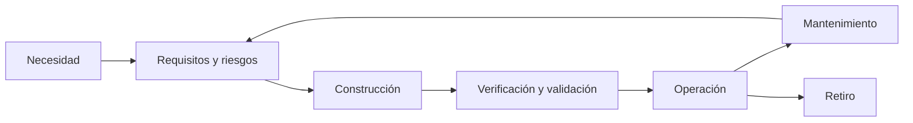

# SE-003 — Ciclo de vida completo y responsabilidades profesionales

[← SE-002](https://github.com/vladimiracunadev-create/software-engineering-learning-suite/blob/main/classes/part-00-ingenieria-de-software-como-profesion/se-002-historia-de-la-crisis-del-software-a-la-ingenieria-continua/README.md) · [↑ Parte 00](https://github.com/vladimiracunadev-create/software-engineering-learning-suite/blob/main/classes/part-00-ingenieria-de-software-como-profesion/README.md) · [📚 Índice completo](https://github.com/vladimiracunadev-create/software-engineering-learning-suite/blob/main/classes/README.md) · [SE-004 →](https://github.com/vladimiracunadev-create/software-engineering-learning-suite/blob/main/classes/part-00-ingenieria-de-software-como-profesion/se-004-etica-interes-publico-y-consecuencias-de-las-decisiones-tecnicas/README.md)

> Estado: **GUIDED**. Clase desarrollada y revisada contra el estándar pedagógico; no implica evidencia de ejecución productiva.

## Prerrequisitos

Fronteras y retroalimentación de `SE-001`–`SE-002`.

## Problema auténtico

Una función se declara terminada al fusionar código. Después nadie vigila comportamiento, actualiza dependencias, atiende incidentes o retira datos. La definición de terminado excluyó responsabilidades previsibles.

## Objetivos observables

Modelarás desde necesidad hasta retiro, asignarás autoridad sin crear silos y diseñarás transferencias con evidencia y recuperación.

## Temas y por qué importan

| Momento | Decisión clave |
| --- | --- |
| Concepción | problema y criterio de no construir |
| Desarrollo | arquitectura, datos, pruebas y suministro |
| Transición | migración, despliegue y reversión |
| Operación | niveles de servicio y respuesta |
| Mantenimiento | compatibilidad y aprendizaje |
| Retiro | exportación, conservación y eliminación |

## Mapa conceptual

Los retornos muestran que operación corrige requisitos y diseño. El gráfico no prescribe fases separadas.

## Conceptos y decisiones

El **ciclo de vida** reúne estados y procesos de un sistema, producto o servicio. Un **modelo** los organiza, pero no elimina responsabilidades. ISO 12207 admite aplicación concurrente, iterativa y recursiva.

Responsabilidad sigue al efecto de la decisión. Quien diseña un esquema considera migración y recuperación aunque otra persona opere la base. No todos hacen todo: cada transferencia necesita emisor, receptor, artefacto, aceptación y feedback.

RACI aclara autoridad, pero falla si sustituye conversación o asigna resultado sin capacidad. Cada riesgo necesita alguien que decide, contribuyentes y evidencia.

## Definiciones de trabajo

- **verificación:** conformidad con especificación;
- **validación:** utilidad en contexto;
- **transición:** cambio controlado entre configuraciones;
- **mantenimiento:** corrección, adaptación o mejora posterior;
- **retiro:** eliminación controlada de capacidad, dependencias y datos.

## Glosario

**Baseline** es una versión acordada. **Owner** posee autoridad de decisión. **Custodio** conserva un activo bajo reglas sin poseer su propósito.

## Ejemplo mínimo

Un script depende de credencial personal y falla cuando la persona se va. El defecto nació en construcción, apareció en operación y se previene con identidad de servicio, rotación y propietario.

## Ejemplo profesional

Al cambiar proveedor de correo, producto define experiencia; ingeniería adapta contrato; seguridad revisa secretos; soporte comunica; operaciones observa; legal decide conservación. El retiro revoca credenciales antiguas.

## Práctica guiada

Crea `lifecycle.md`. Para cada momento registra entrada, decisión, evidencia, responsable y salida. Añade dos bucles de feedback y un plan de retiro. Revisa con alguien en rol de operación.

## Ejercicios

1. Diferencia desplegado, liberado, adoptado y retirado.
2. Encuentra responsabilidades ausentes en un ticket que termina en PR fusionado.
3. Diseña transferencia de una migración con rollback.

## Reto verificable

Una persona identifica quién detiene el cambio, con qué evidencia y cómo recupera. Actividad sin dueño o dueño sin autoridad es defecto.

## Preguntas frecuentes

### ¿Agile elimina etapas?
No. Solapa actividades; requisitos, validación, operación y retiro permanecen.

### ¿Responsabilidad compartida es difusa?
No. El resultado puede ser colectivo, pero cada decisión requiere autoridad.

## Fallo controlado y diagnóstico

Quita rotación de credenciales y simula salida de una persona. Traza síntoma, dependencia, responsable y recuperación; corrige el sistema, no solo el secreto.

## Entorno y archivos clave

`lifecycle.md`, `responsibility-matrix.md`, `handoff-checklist.md`, `retirement.md`; sin producción.

## Seguridad, ética y accesibilidad

Incluye abuso, privacidad, accesibilidad y conservación en todas las etapas. El retiro debe ofrecer exportación cuando se pierde una capacidad.

## Transferencia

Compara web, biblioteca y firmware: actualización inmediata, coordinada o físicamente costosa.

## Evaluación y evidencia

Aprueba un mapa con ciclo completo, transferencias, autoridad de parada y recuperación; una lista lineal no basta.

## Fuentes

- [ISO/IEC/IEEE 12207:2026](https://www.iso.org/standard/90219.html), ciclo completo.
- [NASA Systems Engineering Handbook](https://www.nasa.gov/reference/systems-engineering-handbook/), expectativas, realización y revisiones.
- [SWEBOK v4.0a](https://www.computer.org/education/bodies-of-knowledge/software-engineering/v4), práctica profesional.

## Límites y siguiente paso

El mapa no resuelve conflictos de interés. `SE-004` introduce juicio ético.

---

[← SE-002](https://github.com/vladimiracunadev-create/software-engineering-learning-suite/blob/main/classes/part-00-ingenieria-de-software-como-profesion/se-002-historia-de-la-crisis-del-software-a-la-ingenieria-continua/README.md) · [↑ Parte 00](https://github.com/vladimiracunadev-create/software-engineering-learning-suite/blob/main/classes/part-00-ingenieria-de-software-como-profesion/README.md) · [SE-004 →](https://github.com/vladimiracunadev-create/software-engineering-learning-suite/blob/main/classes/part-00-ingenieria-de-software-como-profesion/se-004-etica-interes-publico-y-consecuencias-de-las-decisiones-tecnicas/README.md)
