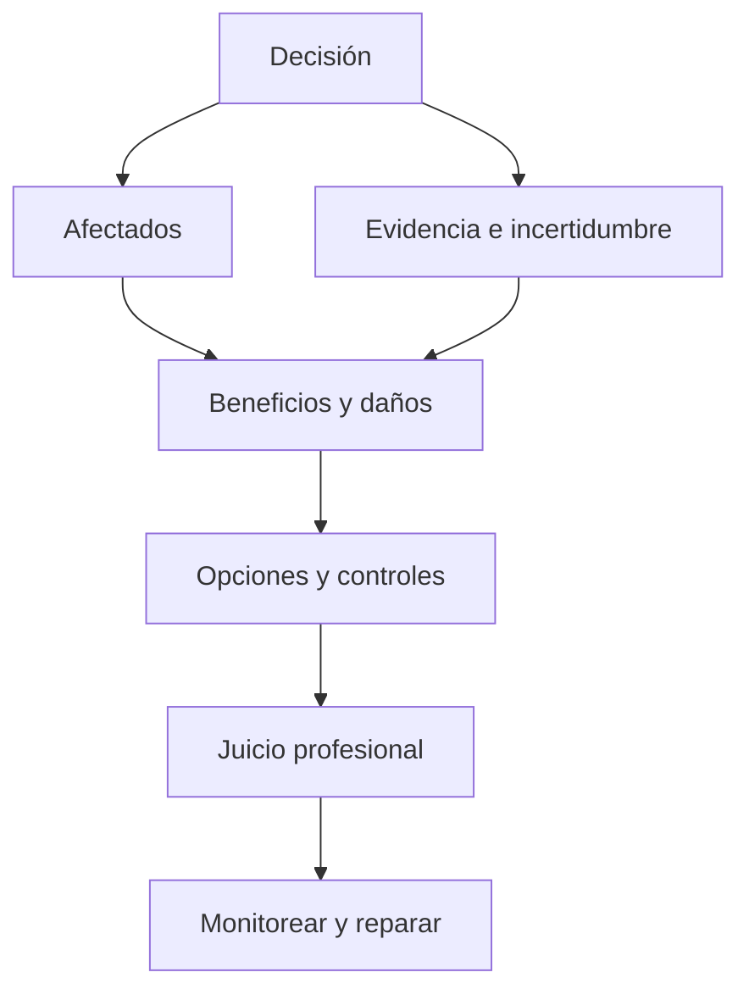

# SE-004 — Ética, interés público y consecuencias de las decisiones técnicas

[← SE-003](https://github.com/vladimiracunadev-create/software-engineering-learning-suite/blob/main/classes/part-00-ingenieria-de-software-como-profesion/se-003-ciclo-de-vida-completo-y-responsabilidades-profesionales/README.md) · [↑ Parte 00](https://github.com/vladimiracunadev-create/software-engineering-learning-suite/blob/main/classes/part-00-ingenieria-de-software-como-profesion/README.md) · [📚 Índice completo](https://github.com/vladimiracunadev-create/software-engineering-learning-suite/blob/main/classes/README.md) · [SE-005 →](https://github.com/vladimiracunadev-create/software-engineering-learning-suite/blob/main/classes/part-00-ingenieria-de-software-como-profesion/se-005-roles-especialidades-y-colaboracion-interdisciplinaria/README.md)

> Estado: **GUIDED**. Clase desarrollada y revisada contra el estándar pedagógico; no implica evidencia de ejecución productiva.

## Antes de empezar

Ya sabes ubicar una decisión en el ciclo de vida y asignarle una persona responsable.
Eso todavía no responde si la decisión es defendible. En Campus Abierto, un modelo de
priorización reduce el tiempo promedio, pero rechaza con mayor frecuencia a quienes
estudian y trabajan, y no existe canal de apelación.

La meta de hoy no es etiquetar la situación como “ética” o “no ética”. Construirás un
análisis que muestre afectados, beneficios, daños, incertidumbre, alternativas y
reparación. En `SE-005` convertirás esas obligaciones en interfaces de colaboración:
quién debe participar, quién puede detener y quién revisa.

## Prerrequisitos

Stakeholders, ciclo de vida y autoridad (`SE-001`–`SE-003`).

## Problema auténtico

Un modelo mejora conversión global, pero rechaza más a un grupo pequeño y no ofrece apelación. El encargo parece legal y rentable. ¿Qué obligaciones conserva el equipo?

## Objetivos observables

Identificarás afectados, separarás legalidad de responsabilidad, analizarás distribución de daño y documentarás mitigación, desacuerdo y reparación.

## Temas y por qué importan

| Tema | Riesgo de omitirlo |
| --- | --- |
| Interés público | optimizar solo para cliente |
| Daño y beneficio | promedios que ocultan grupos |
| Honestidad | incertidumbre presentada como certeza |
| Competencia | aceptar autoridad sin capacidad |
| Reparación | detectar daño sin apelación |

## Mapa conceptual

El código orienta juicio; no es un algoritmo. Principios pueden entrar en tensión.

## Conceptos y decisiones

La ética aparece cuando una decisión afecta autonomía, seguridad, privacidad, oportunidades o cargas. «El cliente lo pidió» no transfiere toda responsabilidad. ACM e IEEE-CS/ACM exigen interés público, calidad, juicio independiente, revisión y competencia.

Evitar daño requiere buscarlo: quién falta en datos, quién no puede usar el canal, qué ocurre al equivocarse y cómo se impugna. Sin queja no hay prueba de ausencia de daño si reclamar es difícil.

La gobernanza debe ser proporcional. Un error reversible de recomendación no equivale a un bloqueo financiero. A mayor severidad, escala e irreversibilidad, mayor evidencia, revisión independiente y autoridad de parada.

Escalar significa registrar hechos, separar inferencias, citar políticas, proponer alternativas y acudir a autoridad. La divulgación externa depende de jurisdicción; esta clase no es asesoría jurídica.

## Definiciones de trabajo

- **interés público:** bienestar y derechos más allá del contrato inmediato;
- **daño:** deterioro previsible de seguridad, derechos, oportunidades o dignidad;
- **conflicto de intereses:** incentivo capaz de sesgar juicio;
- **apelación:** revisión efectiva de una decisión;
- **reparación:** corregir o compensar consecuencias.

## Glosario

**Consentimiento informado** requiere información comprensible y opción real. **Dark pattern** manipula decisiones. **Whistleblowing** revela irregularidades por canales internos o externos.

## Ejemplo mínimo

Una casilla de marketing marcada aumenta aceptación, pero no demuestra preferencia libre. Desmarcar y explicar finalidad reduce conversión y mejora autonomía.

## Ejemplo profesional

El equipo segmenta errores, detiene lanzamiento automático y propone uso asistido, revisión humana, razones, apelación y umbral de suspensión. Declara que la muestra no representa todos los contextos.

## Práctica guiada

Redacta `ethics-case.md` con afectados, derechos, daños, evidencia y conflictos. Compara proceder, proceder con controles y detener. Añade memo de escalamiento y respuesta a una persona afectada.

## Ejercicios

1. Analiza privacidad frente a observabilidad en un incidente.
2. Da un caso legal pero irresponsable.
3. Diseña apelación sin lenguaje técnico.

## Reto verificable

Una revisión adversarial debe encontrar un stakeholder omitido o confirmar cobertura. La decisión cita evidencia, incertidumbre, principio y condición de parada.

## Preguntas frecuentes

### ¿El código es ley?
No necesariamente; orienta expectativas. Regulación y contrato se analizan aparte.

### ¿La ética corresponde a un comité?
No. El comité revisa; cada profesional conserva obligaciones.

## Fallo controlado y diagnóstico

Decide con promedio global y luego segmenta por grupo y severidad. Registra el cambio de conclusión con datos sintéticos.

## Entorno y archivos clave

`ethics-case.md`, `options.md`, `escalation-memo.md`, `appeal-flow.md`.

## Seguridad, ética y accesibilidad

Protege identidades, evita estereotipos y usa lenguaje claro. No simules denuncias reales ni publiques acusaciones.

## Transferencia

Repite para moderación y dispositivo de salud; compara severidad, reversibilidad y autoridad.

## Evaluación y evidencia

Se evalúan afectados, tensiones, alternativas, reparación e incertidumbre. Nombrar ética sin cambiar decisiones no aprueba.

## Fuentes

- [ACM Code of Ethics](https://www.acm.org/code-of-ethics), bienestar, daño, honestidad y privacidad.
- [Software Engineering Code of Ethics](https://www.computer.org/education/code-of-ethics), obligaciones específicas de la profesión.
- [SWEBOK v4.0a](https://www.computer.org/education/bodies-of-knowledge/software-engineering/v4), práctica profesional.

## Límites y siguiente paso

No reemplaza asesoría jurídica ni investigación con comunidades. `SE-005` distribuye conocimiento y autoridad.

---

[← SE-003](https://github.com/vladimiracunadev-create/software-engineering-learning-suite/blob/main/classes/part-00-ingenieria-de-software-como-profesion/se-003-ciclo-de-vida-completo-y-responsabilidades-profesionales/README.md) · [↑ Parte 00](https://github.com/vladimiracunadev-create/software-engineering-learning-suite/blob/main/classes/part-00-ingenieria-de-software-como-profesion/README.md) · [SE-005 →](https://github.com/vladimiracunadev-create/software-engineering-learning-suite/blob/main/classes/part-00-ingenieria-de-software-como-profesion/se-005-roles-especialidades-y-colaboracion-interdisciplinaria/README.md)
