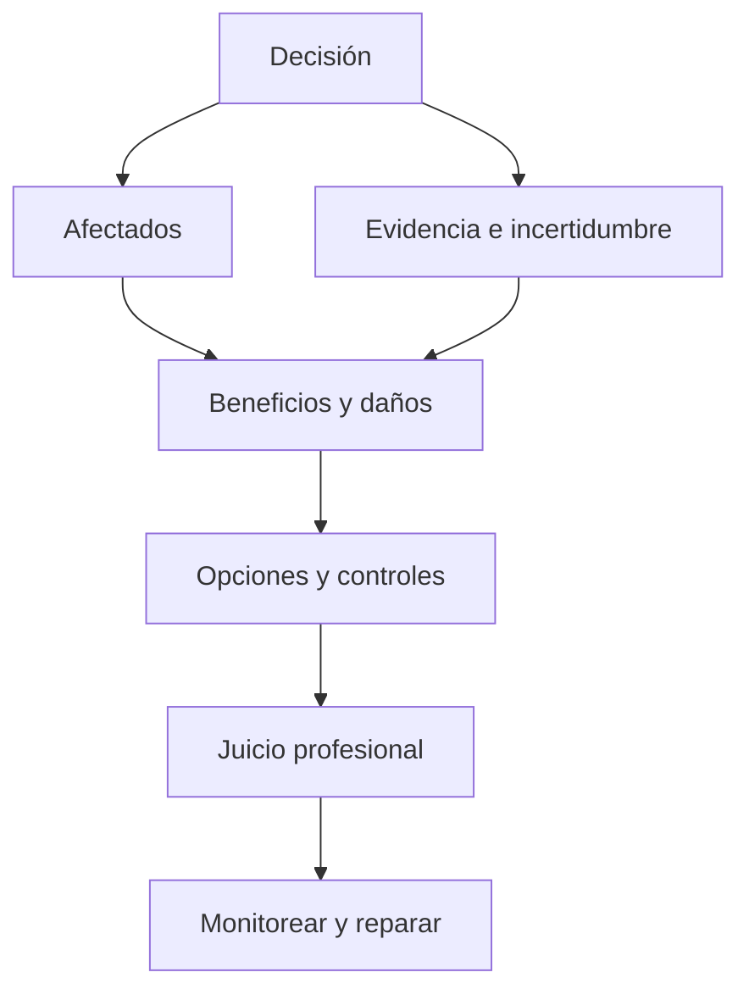

# SE-004 — Ética, interés público y consecuencias de las decisiones técnicas

[← SE-003](https://github.com/vladimiracunadev-create/modern-software-engineering-program/blob/main/classes/part-00-ingenieria-de-software-como-profesion/se-003-ciclo-de-vida-completo-y-responsabilidades-profesionales/README.md) · [↑ Parte 00](https://github.com/vladimiracunadev-create/modern-software-engineering-program/blob/main/classes/part-00-ingenieria-de-software-como-profesion/README.md) · [📚 Índice completo](https://github.com/vladimiracunadev-create/modern-software-engineering-program/blob/main/classes/README.md) · [SE-005 →](https://github.com/vladimiracunadev-create/modern-software-engineering-program/blob/main/classes/part-00-ingenieria-de-software-como-profesion/se-005-roles-especialidades-y-colaboracion-interdisciplinaria/README.md)

## Antes de empezar

Ya sabes ubicar una decisión en el ciclo de vida y asignarle una persona responsable.
Eso todavía no responde si la decisión es defendible. En Campus Abierto, un modelo de
priorización reduce el tiempo promedio, pero rechaza con mayor frecuencia a quienes
estudian y trabajan, y no existe canal de apelación.

La meta de hoy no es etiquetar la situación como “ética” o “no ética”. Construirás un
análisis que muestre afectados, beneficios, daños, incertidumbre, alternativas y
reparación. En `SE-005` convertirás esas obligaciones en interfaces de colaboración:
quién debe participar, quién puede detener y quién revisa.

## Prerrequisitos

Stakeholders, ciclo de vida y autoridad (`SE-001`–`SE-003`).

## Problema auténtico

Un modelo mejora conversión global, pero rechaza más a un grupo pequeño y no ofrece apelación. El encargo parece legal y rentable. ¿Qué obligaciones conserva el equipo?

## Objetivos observables

Identificarás afectados, separarás legalidad de responsabilidad, analizarás distribución de daño y documentarás mitigación, desacuerdo y reparación.

## Temas y por qué importan

| Tema | Riesgo de omitirlo |
| --- | --- |
| Interés público | optimizar solo para cliente |
| Daño y beneficio | promedios que ocultan grupos |
| Honestidad | incertidumbre presentada como certeza |
| Competencia | aceptar autoridad sin capacidad |
| Reparación | detectar daño sin apelación |

## Mapa conceptual

El código orienta juicio; no es un algoritmo. Principios pueden entrar en tensión.

## Conceptos y decisiones

### 1. Legalidad, política y ética responden preguntas diferentes

La ley establece obligaciones y prohibiciones en una jurisdicción. Un contrato reparte
compromisos entre partes. Una política institucional define conducta interna. La ética
profesional pregunta además qué debe hacer una persona con conocimiento especializado
cuando una decisión afecta bienestar, autonomía, seguridad, privacidad u oportunidades.
Que una opción sea legal o solicitada no demuestra que sea responsable; que parezca
injusta tampoco autoriza a ignorar procesos legales o afirmar hechos sin evidencia.

Los códigos de ACM y de IEEE-CS/ACM no son algoritmos que produzcan una respuesta
única. Ofrecen principios y deberes que pueden entrar en tensión: privacidad frente a
observabilidad, acceso frente a prevención de abuso, obligación con empleador frente a
interés público. El juicio profesional consiste en hacer visible esa tensión, buscar
alternativas y justificar por qué una obligación recibe mayor peso en el caso concreto.

### 2. El daño debe buscarse más allá de la persona usuaria promedio

Un stakeholder es cualquier persona o grupo capaz de afectar o ser afectado. Incluye a
quien usa la interfaz, quien queda excluido, quien soporta una decisión, quien trabaja
para corregirla y quien recibirá efectos futuros. Si solo se consulta a quienes
completaron el flujo, desaparecen quienes abandonaron, no tenían dispositivo o fueron
rechazados antes de poder reclamar.

Analizar daño exige preguntar por **distribución**, no solo promedio. Una mejora global
puede concentrar errores graves en un grupo pequeño. También importan escala,
severidad, duración, reversibilidad y posibilidad de impugnar. Un mensaje incómodo
reversible no tiene la misma gobernanza que perder una beca sin explicación, aunque
ambos afecten al mismo número de personas.

La ausencia de quejas no demuestra ausencia de daño. Reclamar puede ser desconocido,
costoso, inaccesible o peligroso. Por eso se diseñan señales proactivas, revisión de
casos y canales de apelación comprensibles. Escuchar es parte del mecanismo de control,
no una cortesía posterior.

### 3. Deliberar es construir opciones, no elegir entre obedecer o bloquear

Una deliberación defendible sigue una secuencia:

1. describir la decisión y separar observaciones, inferencias e incertidumbre;
2. identificar afectados, derechos, beneficios, daños e incentivos del equipo;
3. proponer al menos una alternativa material, incluida la opción de no proceder;
4. comparar prevención, detección, apelación, reparación y costo desplazado;
5. definir autoridad, condición de parada y revisión posterior.

El análisis pierde valor si todas las alternativas son variaciones cosméticas de una
decisión ya tomada. También falla cuando solo enumera principios sin cambiar diseño.
Una consideración ética se vuelve operativa cuando modifica población, datos,
automatización, umbral, supervisión, comunicación o derecho de apelación.

### 4. Competencia, honestidad y conflicto de interés

Aceptar una decisión para la que no se posee competencia puede ser un riesgo ético. La
respuesta no siempre es retirarse: se puede limitar alcance, pedir revisión, realizar
una prueba o incorporar conocimiento de dominio. Lo irresponsable es presentar certeza
o autoridad que no se tiene.

Los conflictos de interés deben declararse porque cambian cómo se interpreta el
juicio. Un equipo evaluado por conversión tiene incentivo para minimizar abandonos
causados por presión. Una empresa que vende el modelo no es fuente independiente sobre
su equidad. Declarar el conflicto no invalida automáticamente la evidencia, pero exige
controles y revisión adecuados.

### 5. Escalamiento, parada y reparación

Escalar profesionalmente significa construir un registro verificable: hechos,
inferencias, personas afectadas, principios, políticas, opciones, urgencia y respuesta
solicitada. Un mensaje que acusa sin separar estos elementos dificulta actuar y puede
dañar a otras personas. La autoridad de parada debe definirse antes de la crisis y ser
proporcional al impacto.

Cuando el daño ocurre, eliminar la función puede evitar repetición, pero no repara el
caso pasado. La reparación puede requerir restaurar una oportunidad, corregir datos,
explicar la decisión, compensar, disculparse o permitir revisión humana. Debe ser
accesible para quien sufrió el efecto y dejar aprendizaje para rediseñar el sistema.
La divulgación externa o denuncia depende de hechos y jurisdicción; esta clase enseña
documentación y escalamiento, no sustituye asesoría jurídica.

## Caso conductor: priorización de solicitudes en Campus Abierto

El modelo ordena solicitudes según probabilidad de completar el proceso. El promedio
de espera baja, pero estudiantes que trabajan acceden en horarios menos frecuentes y
quedan sistemáticamente al final. La muestra histórica contiene el mismo patrón, de
modo que una predicción precisa puede reproducir una distribución injusta.

Las opciones reales no son solo “usar” o “no usar” el modelo:

| Opción | Beneficio buscado | Daño o límite | Control necesario |
| --- | --- | --- | --- |
| priorización automática | reducir cola promedio | reproduce exclusión y oculta criterio | no procede sin rediseño y evidencia |
| apoyo a revisión humana | ordenar información sin decidir | sesgo de automatización | razones visibles, muestreo y autoridad humana |
| regla transparente de urgencia | criterio discutible y auditable | puede ser menos eficiente | participación, revisión y apelación |
| orden temporal con capacidad adicional | igualdad procedimental | no resuelve necesidades diferentes | monitoreo por grupo y canal de urgencia |

La decisión provisional adopta una regla transparente, añade un canal de apelación y
segmenta resultados sin usar datos innecesarios. Se suspende si aparece una diferencia
grave no explicada o si la revisión no puede responder a tiempo. El caso no queda
“resuelto éticamente”: queda gobernado con límites, voz y reparación.

## Definiciones de trabajo

- **interés público:** bienestar y derechos más allá del contrato inmediato;
- **daño:** deterioro previsible de seguridad, derechos, oportunidades o dignidad;
- **conflicto de intereses:** incentivo capaz de sesgar juicio;
- **apelación:** revisión efectiva de una decisión;
- **reparación:** corregir o compensar consecuencias.

## Glosario

**Consentimiento informado** requiere información comprensible y opción real. **Dark pattern** manipula decisiones. **Whistleblowing** revela irregularidades por canales internos o externos.

## Ejemplo mínimo

Una casilla de marketing marcada aumenta aceptación, pero no demuestra preferencia libre. Desmarcar y explicar finalidad reduce conversión y mejora autonomía.

## Ejemplo profesional

El equipo segmenta errores, detiene lanzamiento automático y propone uso asistido, revisión humana, razones, apelación y umbral de suspensión. Declara que la muestra no representa todos los contextos.

## Práctica guiada

Redacta `ethics-case.md` con afectados, derechos, daños, evidencia y conflictos. Compara proceder, proceder con controles y detener. Añade memo de escalamiento y respuesta a una persona afectada.

## Ejercicios

1. Analiza privacidad frente a observabilidad en un incidente.
2. Da un caso legal pero irresponsable.
3. Diseña apelación sin lenguaje técnico.

## Reto verificable

Una revisión adversarial debe encontrar un stakeholder omitido o confirmar cobertura. La decisión cita evidencia, incertidumbre, principio y condición de parada.

## Preguntas frecuentes

### ¿El código es ley?
No necesariamente; orienta expectativas. Regulación y contrato se analizan aparte.

### ¿La ética corresponde a un comité?
No. El comité revisa; cada profesional conserva obligaciones.

## Fallo controlado y diagnóstico

Decide con promedio global y luego segmenta por grupo y severidad. Registra el cambio de conclusión con datos sintéticos.

## Errores comunes y cómo corregirlos

| Síntoma | Causa | Corrección |
| --- | --- | --- |
| “es ético porque cumple la ley” | se confundió mínimo jurídico con deber profesional | analiza daño, interés público y alternativas además del cumplimiento |
| lista genérica de stakeholders | no se siguió quién recibe beneficio o carga | describe mecanismo, consecuencia y posibilidad de participar o apelar |
| comité al final del proyecto | la ética se trató como aprobación tardía | incorpora revisión antes de fijar datos, umbrales y automatización |
| consentimiento como casilla | no existe comprensión u opción real | explica finalidad, minimiza datos y ofrece alternativa sin castigo indebido |
| retirar la función se presenta como reparación | se atendió el futuro, no el daño ocurrido | diseña corrección individual, explicación y aprendizaje sistémico |

## Entorno y archivos clave

`ethics-case.md`, `options.md`, `escalation-memo.md`, `appeal-flow.md`.

## Seguridad, ética y accesibilidad

Protege identidades, evita estereotipos y usa lenguaje claro. No simules denuncias reales ni publiques acusaciones.

## Transferencia

Repite para moderación y dispositivo de salud; compara severidad, reversibilidad y autoridad.

## Evaluación y evidencia

Se evalúan afectados, tensiones, alternativas, reparación e incertidumbre. Nombrar ética sin cambiar decisiones no aprueba.

## Fuentes

- [ACM Code of Ethics](https://www.acm.org/code-of-ethics), bienestar, daño, honestidad y privacidad.
- [Software Engineering Code of Ethics](https://www.computer.org/education/code-of-ethics), obligaciones específicas de la profesión.
- [SWEBOK v4.0a](https://www.computer.org/education/bodies-of-knowledge/software-engineering/v4), práctica profesional.

## Límites y siguiente paso

No reemplaza asesoría jurídica ni investigación con comunidades. `SE-005` distribuye conocimiento y autoridad.

---

[← SE-003](https://github.com/vladimiracunadev-create/modern-software-engineering-program/blob/main/classes/part-00-ingenieria-de-software-como-profesion/se-003-ciclo-de-vida-completo-y-responsabilidades-profesionales/README.md) · [↑ Parte 00](https://github.com/vladimiracunadev-create/modern-software-engineering-program/blob/main/classes/part-00-ingenieria-de-software-como-profesion/README.md) · [SE-005 →](https://github.com/vladimiracunadev-create/modern-software-engineering-program/blob/main/classes/part-00-ingenieria-de-software-como-profesion/se-005-roles-especialidades-y-colaboracion-interdisciplinaria/README.md)
