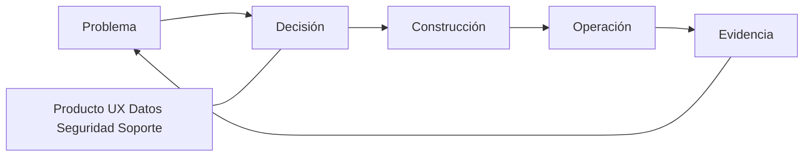

# SE-005 — Roles, especialidades y colaboración interdisciplinaria

[← SE-004](https://github.com/vladimiracunadev-create/software-engineering-learning-suite/blob/main/classes/part-00-ingenieria-de-software-como-profesion/se-004-etica-interes-publico-y-consecuencias-de-las-decisiones-tecnicas/README.md) · [↑ Parte 00](https://github.com/vladimiracunadev-create/software-engineering-learning-suite/blob/main/classes/part-00-ingenieria-de-software-como-profesion/README.md) · [📚 Índice completo](https://github.com/vladimiracunadev-create/software-engineering-learning-suite/blob/main/classes/README.md) · [SE-006 →](https://github.com/vladimiracunadev-create/software-engineering-learning-suite/blob/main/classes/part-00-ingenieria-de-software-como-profesion/se-006-evidencia-incertidumbre-y-pensamiento-critico-en-ingenieria/README.md)

> Estado: **GUIDED**. Clase desarrollada y revisada contra el estándar pedagógico; no implica evidencia de ejecución productiva.

## Antes de empezar

El análisis ético de `SE-004` identificó voces que una decisión técnica no puede
ignorar. Ahora debes incorporarlas al trabajo sin convertir cada decisión en una
reunión masiva. Campus Abierto sufre un incidente: soporte ve síntomas, datos detecta
un patrón, seguridad limita accesos y desarrollo conoce el cambio reciente, pero la
información no cruza las fronteras organizativas.

Diseñarás una red de autoridad, consulta, evidencia y escalamiento. El producto de la
clase no será un organigrama, sino interfaces de colaboración que puedan funcionar
bajo presión. `SE-006` preguntará cómo esas personas distinguen convicción de evidencia
cuando deben escoger una explicación.

## Prerrequisitos

Responsabilidad y juicio profesional de `SE-003`–`SE-004`.

## Problema auténtico

Un incidente pasa entre desarrollo, datos, seguridad y soporte. Todos participaron, nadie tenía la imagen completa y cada equipo optimizó su métrica. Nombrar más roles no repara interfaces de colaboración.

## Objetivos observables

Relacionarás roles con decisiones, diseñarás transferencias y revisiones, distinguirás especialización de silo y crearás una matriz de autoridad.

## Temas y por qué importan

| Área | Pregunta |
| --- | --- |
| Producto | ¿qué resultado y para quién? |
| Diseño/UX | ¿qué tarea y contexto? |
| Ingeniería | ¿qué comportamiento y cambio? |
| Calidad/seguridad | ¿qué riesgo y evidencia? |
| Operación/soporte | ¿qué ocurre realmente? |

## Mapa conceptual

Los roles aportan perspectivas al mismo bucle; no son etapas que lanzan trabajo sobre una pared.

## Conceptos y decisiones

### 1. Rol, especialidad, responsabilidad y cargo no son equivalentes

Un **rol** agrupa responsabilidades necesarias en un contexto: quien facilita una
retrospectiva o responde por un servicio puede cambiar sin que cambie su cargo. Una
**especialidad** expresa profundidad de conocimiento y juicio. La **responsabilidad**
se refiere a un resultado; la **autoridad**, a la capacidad legítima de decidir. Un
cargo organizativo puede combinar varios roles o no describirlos con precisión.

Separar estos conceptos evita diseñar el trabajo alrededor de títulos. Campus Abierto
necesita que alguien decida semántica de cupos, que una persona competente revise
privacidad y que operación pueda detener una liberación. No necesita necesariamente
tres departamentos con esos nombres. En un equipo pequeño una persona puede usar
varios “sombreros”, pero los conflictos y las competencias siguen existiendo y deben
declararse.

### 2. Especialización aporta profundidad; el silo interrumpe el aprendizaje

Un especialista puede reconocer modos de fallo invisibles para un generalista. El
problema aparece cuando su conocimiento entra tarde como aprobación o cuando una señal
no puede cruzar el límite del equipo. Si seguridad conoce un patrón de abuso, pero solo
revisa al final, el diseño ya puede depender de supuestos costosos de cambiar. Si
soporte resuelve manualmente el mismo error sin registrarlo, ingeniería pierde evidencia
del comportamiento real.

La alternativa no es que todas las personas hagan todo. Se diseñan momentos y
artefactos donde la especialidad cambia la decisión: modelado de amenazas antes de
fijar el flujo, revisión de accesibilidad con prototipo, criterios operativos antes de
desplegar y feedback de soporte después. La colaboración efectiva conserva profundidad
y hace permeable el conocimiento relevante.

### 3. Las interfaces de colaboración también se diseñan

Una reunión no garantiza colaboración. Puede reunir perspectivas sin producir una
decisión, ocultar desacuerdo o excluir a quien no comparte horario o idioma. Una
interfaz de trabajo saludable declara:

- qué información o artefacto recibe;
- qué pregunta debe responder y con qué competencia;
- qué salida y criterio de aceptación produce;
- en qué plazo y por qué canal;
- qué ocurre si falta evidencia o existe desacuerdo;
- quién posee la decisión final y quién puede escalar.

El contrato no busca burocracia, sino reducir espera y reproceso. Puede ser una tabla
breve en una decisión, una prueba de contrato, un runbook o una revisión asincrónica.
Debe ajustarse al riesgo: cambiar un texto reversible no requiere la gobernanza de una
migración de identidad.

### 4. Derechos de decisión y revisión independiente

RACI ayuda a visualizar quién responde, ejecuta, consulta y recibe información, pero
no resuelve por sí solo cómo se decide. Una matriz puede contener una “A” sin tiempo,
competencia o acceso a evidencia. Conviene añadir quién propone, quién acepta el riesgo,
quién puede detener y cómo se conserva el desacuerdo.

La revisión independiente aporta una perspectiva menos comprometida con la autoría.
No significa desconocimiento ni neutralidad absoluta. La persona revisora necesita
contexto y autoridad para cuestionar. En equipos pequeños, si la misma persona propone
y revisa, se limita el alcance, se buscan criterios automatizados o revisión externa y
se registra la limitación. A mayor impacto e irreversibilidad, más importante es separar
incentivos.

### 5. Colaborar bajo presión requiere protocolos previos

Durante un incidente no hay tiempo para descubrir quién posee una dependencia o qué
canal es confiable. El protocolo define liderazgo operativo, registro temporal,
comunicación, especialistas convocables y autoridad para mitigar. La persona que
coordina no necesita diagnosticar todo; mantiene una imagen compartida y evita cambios
contradictorios.

Una retrospectiva posterior analiza condiciones, no culpabilidad individual. Pregunta
qué información faltó, qué interfaz retrasó y qué protección habría reducido el daño.
Si solo concluye “comunicar mejor”, no ha diseñado ninguna mejora verificable.

## Caso conductor: incidente de matrículas duplicadas

Soporte recibe reclamos; datos detecta escrituras repetidas; seguridad observa
reintentos desde sesiones legítimas; desarrollo recuerda un cambio de timeout. Cada
equipo posee una parte y puede equivocarse si actúa aislado. Bloquear cuentas reduce
duplicados, pero daña a personas; revertir código puede no revertir escrituras.

La red de colaboración asigna: soporte clasifica y comunica impacto; una persona lidera
el incidente y conserva la línea temporal; desarrollo compara el cambio; datos diseña
reconciliación; seguridad diferencia abuso de reintento; producto decide la experiencia
de reparación. Operación puede detener nuevas confirmaciones si cruza el umbral
acordado. La decisión final registra evidencia y voces disidentes.

El flujo no termina al restaurar el servicio. Las personas afectadas reciben estado y
corrección; el contrato de idempotencia cambia; la señal de duplicado entra al tablero;
y el mapa de decisiones se actualiza. Así la colaboración produce aprendizaje y no
solo coordinación momentánea.

## Definiciones de trabajo

- **rol:** conjunto contextual de responsabilidades;
- **especialidad:** profundidad para emitir juicio en un dominio;
- **handoff:** transferencia de trabajo y contexto con aceptación;
- **revisión independiente:** evaluación sin autoría directa ni incentivo dominante;
- **escalamiento:** traslado explícito a autoridad capaz de decidir.

## Glosario

**Bus factor** mide concentración de conocimiento. **Team topology** describe límites e interacción de equipos. **Facilitación** estructura participación sin apropiarse de la decisión.

## Ejemplo mínimo

«Backend entrega endpoint» es insuficiente. Un contrato útil incluye semántica, errores, privacidad, ejemplos, compatibilidad y persona que acepta.

## Ejemplo profesional

En recuperación de cuenta, producto define resultado, UX diseña prueba comprensible, seguridad modela abuso, soporte aporta casos y plataforma implementa identidad. La decisión sobre fricción pertenece al conjunto porque reduce fraude y puede excluir usuarios.

## Práctica guiada

Crea `decision-map.md` con diez decisiones y roles que proponen, deciden, revisan y operan. Modela un handoff y realiza una revisión con una perspectiva ausente.

## Ejercicios

1. Convierte un organigrama en mapa de decisiones.
2. Detecta un rol con responsabilidad sin autoridad.
3. Diseña colaboración asincrónica para dos zonas horarias.

## Reto verificable

Simula un incidente: otra persona debe encontrar dueño, experto, autoridad de parada y canal de comunicación en menos de tres minutos.

## Preguntas frecuentes

### ¿Quién tiene la última palabra?
Depende de la decisión. Debe declararse antes del conflicto y respetar obligaciones profesionales.

### ¿Un generalista reemplaza especialistas?
No en riesgos que requieren competencia profunda; sí puede mejorar interfaces y visión sistémica.

## Fallo controlado y diagnóstico

Entrega un artefacto sin criterio de aceptación. Registra espera y reproceso; corrige la interfaz, no culpes al receptor.

## Errores comunes y cómo corregirlos

| Síntoma | Causa | Corrección |
| --- | --- | --- |
| el mapa replica cargos | se modeló estructura, no decisiones | parte de decisiones y asigna competencia, autoridad y operación |
| todos son “responsables” | se evitó declarar autoridad | nombra quién acepta, detiene y escala cada decisión |
| más reuniones ante cada fallo | falta una interfaz de información | define entrada, salida, aceptación, plazo y canal asincrónico |
| seguridad o accesibilidad revisan al final | se usan especialidades como gate tardío | incorpora su evidencia antes de fijar decisiones costosas |
| la retrospectiva culpa a quien actuó | se ignoran condiciones del sistema | reconstruye señales, incentivos, límites y protecciones faltantes |

## Entorno y archivos clave

`decision-map.md`, `handoff.md`, `review-log.md`, con nombres de roles ficticios.

## Seguridad, ética y accesibilidad

Evita exponer a personas en retrospectivas; analiza condiciones. Incluye representación de usuarios y canales accesibles.

## Transferencia

Adapta el mapa a open source y a una organización regulada; compara autoridad formal e influencia.

## Evaluación y evidencia

Se exige autoridad explícita, interfaces, revisión, manejo de desacuerdo y reducción del bus factor.

## Fuentes

- [SWEBOK v4.0a](https://www.computer.org/education/bodies-of-knowledge/software-engineering/v4), práctica profesional y trabajo en equipo.
- [ACM Code of Ethics](https://www.acm.org/code-of-ethics), competencia, revisión y liderazgo responsable.
- [NASA Software Activities Review](https://swehb.nasa.gov/spaces/7150/pages/16449741/SWE-018+-+Software+Activities+Review), participación de stakeholders y cierre de asuntos.

## Límites y siguiente paso

La matriz no garantiza buenas decisiones. `SE-006` evalúa la calidad de la evidencia con que se decide.

---

[← SE-004](https://github.com/vladimiracunadev-create/software-engineering-learning-suite/blob/main/classes/part-00-ingenieria-de-software-como-profesion/se-004-etica-interes-publico-y-consecuencias-de-las-decisiones-tecnicas/README.md) · [↑ Parte 00](https://github.com/vladimiracunadev-create/software-engineering-learning-suite/blob/main/classes/part-00-ingenieria-de-software-como-profesion/README.md) · [SE-006 →](https://github.com/vladimiracunadev-create/software-engineering-learning-suite/blob/main/classes/part-00-ingenieria-de-software-como-profesion/se-006-evidencia-incertidumbre-y-pensamiento-critico-en-ingenieria/README.md)
