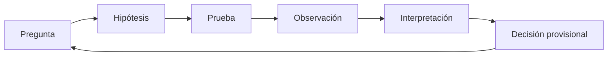

# SE-006 — Evidencia, incertidumbre y pensamiento crítico en ingeniería

[← SE-005](https://github.com/vladimiracunadev-create/software-engineering-learning-suite/blob/main/classes/part-00-ingenieria-de-software-como-profesion/se-005-roles-especialidades-y-colaboracion-interdisciplinaria/README.md) · [↑ Parte 00](https://github.com/vladimiracunadev-create/software-engineering-learning-suite/blob/main/classes/part-00-ingenieria-de-software-como-profesion/README.md) · [📚 Índice completo](https://github.com/vladimiracunadev-create/software-engineering-learning-suite/blob/main/classes/README.md) · [SE-007 →](https://github.com/vladimiracunadev-create/software-engineering-learning-suite/blob/main/classes/part-00-ingenieria-de-software-como-profesion/se-007-calidad-interna-externa-y-calidad-en-uso/README.md)

> Estado: **GUIDED**. Clase desarrollada y revisada contra el estándar pedagógico; no implica evidencia de ejecución productiva.

## Antes de empezar

Campus Abierto ya tiene responsables y canales de colaboración, pero varias personas
explican el incidente de forma distinta. Una muestra pequeña culpa a la base de datos;
otra observación apunta al proveedor de identidad. Tener roles claros no elimina la
incertidumbre ni convierte una métrica en conclusión.

Esta clase introduce el ciclo pregunta → hipótesis → prueba → observación → decisión
provisional. Crearás un registro que permita a otra persona refutar tu interpretación.
En `SE-007` usarás esa disciplina para evitar que “calidad” sea una opinión o una
colección de indicadores cómodos.

## Prerrequisitos

Poder formular decisiones y reconocer perspectivas de `SE-001`–`SE-005`.

## Problema auténtico

Tras optimizar una consulta, un benchmark muestra 40% menos tiempo. ¿El cambio es mejor? Puede medir caché caliente, pocos datos o una máquina distinta. El número es observación; la conclusión necesita modelo e incertidumbre.

## Objetivos observables

Separarás hecho, inferencia e hipótesis; diseñarás comprobaciones que puedan refutarte; estimarás incertidumbre práctica y decidirás cuándo obtener más evidencia.

## Temas y por qué importan

| Elemento | Pregunta |
| --- | --- |
| Observación | ¿qué ocurrió y cómo se midió? |
| Inferencia | ¿qué explicación conecta datos y conclusión? |
| Incertidumbre | ¿qué no sabemos y cuánto cambia la decisión? |
| Falsación | ¿qué resultado demostraría que estamos equivocados? |

## Mapa conceptual

La decisión es provisional: nueva evidencia puede cambiarla.

## Conceptos y decisiones

### 1. Separar lo observado de la historia que contamos

Una **observación** registra qué ocurrió mediante un método: “el p95 fue 480 ms en
estas solicitudes, intervalo y entorno”. Una **inferencia** conecta observaciones con
una conclusión: “la dependencia contribuyó a la demora”. Una **hipótesis** formula una
explicación contrastable: “si la dependencia es la causa dominante, aislarla reducirá
la cola”. Un **supuesto** es una condición aceptada provisionalmente, como considerar
representativa la carga de prueba.

Mezclarlos impide aprender. “La base de datos estuvo lenta” parece un hecho, pero ya
atribuye causa. Puede haber esperado conexiones o bloqueo de aplicación. El registro
debe permitir que otra persona acepte la observación y dispute la inferencia sin negar
los datos.

### 2. La fuerza de la evidencia depende de la decisión

No existe evidencia “alta” por su formato. Una prueba unitaria es fuerte para un caso
determinista y débil para experiencia de uso. Un testimonio puede revelar un modo de
fallo que una métrica agregada oculta, aunque no estime su frecuencia. Evalúa al menos:

- **relevancia:** responde la pregunta que cambia la decisión;
- **validez:** el método mide razonablemente el fenómeno declarado;
- **fiabilidad:** condiciones semejantes producen observaciones compatibles;
- **representatividad:** casos y entorno cubren la población pertinente;
- **trazabilidad:** se conservan origen, configuración, tiempo y transformaciones.

Una prueba que siempre pasa, una captura sin fecha o un promedio sin población pueden
ser datos auténticos y aun así aportar poca discriminación entre opciones. Calidad de
evidencia no es cantidad de archivos.

### 3. Predicción, causalidad y mecanismos

Una correlación puede ayudar a anticipar, pero no demuestra qué ocurrirá al intervenir.
Si latencia y concurrencia crecen juntas, limitar concurrencia podría ayudar o solo
ocultar una dependencia saturada. Una explicación causal combina temporalidad,
mecanismo plausible, predicciones y exclusión razonada de alternativas.

En ingeniería rara vez se controla todo. Se puede comparar antes y después, aislar una
dependencia, variar un parámetro, reproducir con una carga sintética y revisar trazas.
Cuando no es posible experimentar —por riesgo o costo— se triangulan métodos y se
reduce la fuerza de la conclusión. “Compatible con” es a veces la afirmación más
honesta.

Los **confusores** cambian junto con la variable estudiada. Un benchmark después de
optimizar también puede usar caché caliente, menos datos o hardware distinto. Mantener
condiciones, aleatorizar orden o registrar diferencias reduce la confusión; no la
elimina automáticamente.

### 4. Diseñar la posibilidad de estar equivocados

Una hipótesis útil produce una predicción cuya ausencia la debilita. “El sistema está
lento por muchas razones” puede ser cierto, pero no orienta una prueba. “El pool de
conexiones es el cuello de botella; al aumentar temporalmente su capacidad bajará la
espera sin trasladarla a la base” crea observaciones que pueden contradecirla.

Buscar solo confirmación es fácil: elegir el intervalo que coincide, descartar outliers
sin regla o consultar únicamente a quien adoptó el producto. La defensa es escribir
antes qué resultado cuenta contra la hipótesis, comparar explicaciones rivales y pedir
que una revisión intente refutar, no solo aprobar.

### 5. Decidir con incertidumbre y costo de información

La incertidumbre puede expresarse con rangos, escenarios, sensibilidad o confianza
argumentada. Una cifra con decimales no es más honesta si el método no permite esa
precisión. Conviene preguntar si cambiar un supuesto cambia la opción preferida. Si no
la cambia, quizá investigar más no aporte valor; si invierte una decisión irreversible,
la evidencia adicional puede ser esencial.

En un cambio reversible y de bajo impacto, una exposición pequeña y observada puede
ser el experimento adecuado. Ante consecuencias graves, el umbral de evidencia y
revisión aumenta. La decisión incluye siempre señales de parada y revisión: reconocer
incertidumbre no es paralizarse, sino gobernar lo que todavía no se sabe.

## Caso conductor: cuatro explicaciones para la latencia

Campus Abierto registra demoras después de un despliegue. Compiten cuatro hipótesis:
consulta más costosa, pool agotado, proveedor de identidad lento o mezcla de tráfico
distinta. Se construye una matriz antes de tocar producción:

| Hipótesis | Predicción discriminante | Prueba segura | Resultado que la debilita |
| --- | --- | --- | --- |
| consulta costosa | tiempo de DB crece en la ruta afectada | reproducir con conjunto representativo | DB estable mientras aumenta espera previa |
| pool agotado | cola de conexión precede a latencia | observar y variar en entorno controlado | conexiones disponibles durante el pico |
| identidad externa | trazas concentran demora en esa llamada | usar stub y comparar | la cola persiste sin dependencia |
| mezcla de tráfico | cambian rutas y tamaños de solicitud | segmentar por ruta y cohorte | misma mezcla con distinta latencia |

La decisión provisional puede ser limitar exposición mientras se ejecuta la prueba de
mayor valor informativo. El log conserva configuración y observaciones; no reemplaza
la incertidumbre por una causa conveniente.

## Definiciones de trabajo

- **hecho observado:** registro producido por un método declarado;
- **inferencia:** conclusión derivada de observaciones y supuestos;
- **hipótesis:** explicación contrastable;
- **confusor:** variable que altera relación aparente;
- **reproducibilidad:** posibilidad de repetir método con información suficiente.

## Glosario

**Base rate** es frecuencia previa relevante. **Proxy** es medida indirecta. **Intervalo** expresa rango compatible con método y datos, no promesa absoluta.

## Ejemplo mínimo

«La API estuvo lenta» mezcla observación e interpretación. Mejor: p95 subió de 220 a 480 ms durante 15 minutos en región A; coincidió con despliegue X; faltan datos de dependencia Y.

## Ejemplo profesional

El benchmark de consulta se repite con datos fríos y calientes, mismos recursos y múltiples corridas. La mediana mejora, pero la cola empeora con alta concurrencia. La decisión cambia de «adoptar» a «probar bajo carga representativa».

## Práctica guiada

Escribe `evidence-log.md` con afirmación, observación, método, supuesto y contraevidencia. Diseña dos pruebas que podrían cambiar la decisión y priorízalas por costo de información.

## Ejercicios

1. Reescribe cinco afirmaciones absolutas como hipótesis.
2. Encuentra un proxy que pueda incentivar conducta indeseada.
3. Decide con evidencia incompleta y declara condición de revisión.

## Reto verificable

Otra persona reproduce una medición y obtiene resultado compatible o explica la diferencia. Debe existir un resultado que refute tu hipótesis.

## Preguntas frecuentes

### ¿Más datos siempre reducen incertidumbre?
No; datos sesgados o irrelevantes pueden reforzar una conclusión incorrecta.

### ¿Sin certeza no se decide?
Se decide con riesgo explícito, reversibilidad y señales de revisión.

## Fallo controlado y diagnóstico

Ejecuta una medición una vez, concluye y luego cambia orden o caché. Registra por qué la primera evidencia era débil.

## Errores comunes y cómo corregirlos

| Síntoma | Causa | Corrección |
| --- | --- | --- |
| una métrica se presenta como conclusión | se omitieron inferencia y supuestos | separa registro, interpretación y alternativa rival |
| benchmark sin configuración | se perdió trazabilidad | fija datos, entorno, versiones, orden y múltiples corridas |
| hipótesis imposible de refutar | se formuló una explicación elástica | escribe predicción y resultado que obligaría a cambiarla |
| promedio único | se ocultaron distribución y contexto | segmenta, observa colas y declara población |
| “necesitamos más datos” sin decisión | no se evaluó valor de información | indica qué dato puede cambiar qué opción y a qué costo |

## Entorno y archivos clave

Datos sintéticos, reloj monotónico cuando midas tiempo: `evidence-log.md`, `experiment.md`, `decision.md`.

## Seguridad, ética y accesibilidad

No recolectes datos personales «por si acaso». Documenta exclusiones de muestra y evita presentar promedios como experiencia universal.

## Transferencia

Aplica el método a rendimiento, usabilidad y seguridad; compara qué evidencia puede producirse sin causar daño.

## Evaluación y evidencia

Se exige trazabilidad, método reproducible, contraevidencia e incertidumbre que cambie la decisión.

## Fuentes

- [NASA Systems Engineering Handbook](https://www.nasa.gov/reference/systems-engineering-handbook/), revisiones y criterios de éxito.
- [SWEBOK v4.0a](https://www.computer.org/education/bodies-of-knowledge/software-engineering/v4), medición y práctica profesional.
- [ACM Code of Ethics](https://www.acm.org/code-of-ethics), honestidad y evaluaciones exhaustivas.

## Límites y siguiente paso

No es un curso de estadística. `SE-007` usa esta disciplina para distinguir perspectivas de calidad.

---

[← SE-005](https://github.com/vladimiracunadev-create/software-engineering-learning-suite/blob/main/classes/part-00-ingenieria-de-software-como-profesion/se-005-roles-especialidades-y-colaboracion-interdisciplinaria/README.md) · [↑ Parte 00](https://github.com/vladimiracunadev-create/software-engineering-learning-suite/blob/main/classes/part-00-ingenieria-de-software-como-profesion/README.md) · [SE-007 →](https://github.com/vladimiracunadev-create/software-engineering-learning-suite/blob/main/classes/part-00-ingenieria-de-software-como-profesion/se-007-calidad-interna-externa-y-calidad-en-uso/README.md)
