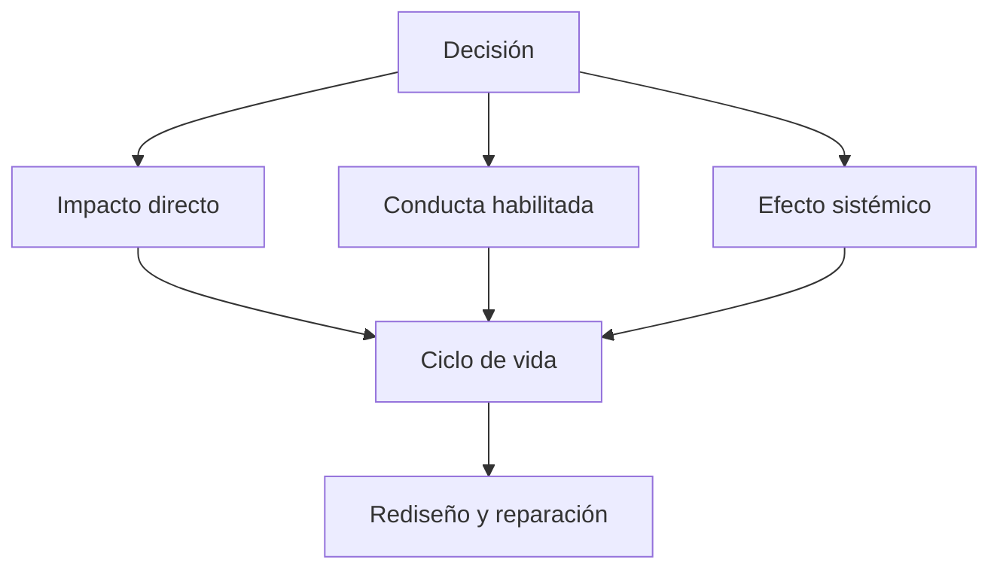

# SE-009 — Sostenibilidad, inclusión y responsabilidad social

[← SE-008](https://github.com/vladimiracunadev-create/software-engineering-learning-suite/blob/main/classes/part-00-ingenieria-de-software-como-profesion/se-008-restricciones-riesgos-y-compromisos-entre-atributos/README.md) · [↑ Parte 00](https://github.com/vladimiracunadev-create/software-engineering-learning-suite/blob/main/classes/part-00-ingenieria-de-software-como-profesion/README.md) · [📚 Índice completo](https://github.com/vladimiracunadev-create/software-engineering-learning-suite/blob/main/classes/README.md) · [SE-010 →](https://github.com/vladimiracunadev-create/software-engineering-learning-suite/blob/main/classes/part-00-ingenieria-de-software-como-profesion/se-010-como-leer-estandares-documentacion-y-literatura-tecnica/README.md)

> Estado: **GUIDED**. Clase desarrollada y revisada contra el estándar pedagógico; no implica evidencia de ejecución productiva.

## Antes de empezar

En `SE-008` hiciste visibles ganadores, pérdidas y riesgos de una decisión. Falta mirar
efectos que suelen quedar fuera del sprint. Campus Abierto reduce trámites presenciales,
pero exige dispositivos recientes, transfiere datos innecesarios y concentra guardias
en pocas personas. La mejora local puede crear deuda humana, social o ambiental.

Analizarás impactos directos, habilitados y sistémicos a lo largo del ciclo de vida.
No buscarás una etiqueta de “software verde”, sino alternativas y señales que cambien
el diseño. `SE-010` te dará el método para respaldar estas afirmaciones sin usar una
bibliografía como decoración.

## Prerrequisitos
Stakeholders, ética y trade-offs (`SE-004`, `SE-008`).

## Problema auténtico
Un servicio reduce papel pero obliga a renovar dispositivos, excluye conexiones lentas y conserva datos indefinidamente. «Digital» no equivale a sostenible ni inclusivo.

## Objetivos observables
Analizarás impactos directos, habilitados y sistémicos; diseñarás alternativas inclusivas; conectarás sostenibilidad técnica, humana y ambiental con decisiones de ciclo de vida.

## Temas y por qué importan
| Dimensión | Ejemplos |
| --- | --- |
| Ambiental | energía, hardware, transferencia, residuos |
| Social | acceso, poder, trabajo, comunidades |
| Técnica | mantenibilidad, dependencia, obsolescencia |
| Humana | carga cognitiva, guardias, salud laboral |

## Mapa conceptual

Optimizar consumo por transacción puede aumentar consumo total si el servicio induce más uso: efecto rebote.

## Conceptos y decisiones

### 1. Sostenibilidad pregunta qué capacidad dejamos disponible mañana

Sostener un sistema implica satisfacer una necesidad actual sin degradar de manera
irresponsable la capacidad futura de personas, organizaciones y ambiente. En software
esto incluye energía e infraestructura, pero también mantenibilidad, dependencia,
conocimiento, condiciones laborales, acceso y posibilidad de retirar datos y hardware.
Una solución eficiente durante una demostración puede ser insostenible si requiere
guardias permanentes o un proveedor imposible de sustituir.

Las dimensiones se relacionan. Reducir capacidad del servidor puede bajar consumo y
costo, pero trasladar cómputo y transferencia a dispositivos de personas con menos
recursos. Conservar compatibilidad prolonga vida de hardware y aumenta superficie de
pruebas. La decisión no busca una etiqueta “verde”; declara frontera, período,
beneficiados, cargas y evidencia.

### 2. Impactos directos, habilitados y sistémicos

El impacto **directo** procede de construir y operar: cómputo, red, almacenamiento,
dispositivos y trabajo. El impacto **habilitado** aparece cuando el software cambia una
conducta, como sustituir viajes o inducir más consumo. El impacto **sistémico** surge de
adopción acumulada, incentivos o cambios institucionales, por ejemplo convertir el
canal digital en única vía y cerrar alternativas presenciales.

Optimizar una transacción no garantiza reducir el total. Si hacerla más barata aumenta
mucho la demanda, ocurre un efecto rebote. Tampoco todo efecto de segundo orden puede
predecirse: se formulan hipótesis, se monitorean señales y se conserva capacidad de
corregir. El análisis responsable no inventa certeza sobre sistemas sociales.

### 3. Accesibilidad, inclusión y equidad no son intercambiables

La accesibilidad elimina barreras para personas con discapacidades y contextos
diversos; WCAG aporta criterios verificables para contenido web, pero su cumplimiento
no demuestra que el servicio completo sea inclusivo. La inclusión pregunta quién puede
participar con dignidad y alcanzar el resultado. La equidad observa si reglas y apoyos
consideran desigualdades relevantes en vez de ofrecer formalmente lo mismo.

Una interfaz compatible con teclado puede seguir excluyendo si el trámite exige video
en vivo, conectividad estable, lenguaje experto o respuesta en horario laboral. Diseñar
una alternativa no significa crear una ruta lenta y estigmatizante. Debe conservar el
resultado esencial, plazo comparable, privacidad y derecho a recuperación.

Las dimensiones también interactúan con seguridad. Una persona en contexto de
violencia puede necesitar ocultar historial o notificaciones. Un canal “conveniente”
puede exponerla. Por eso contexto de uso incluye entorno social, no solo navegador y
resolución.

### 4. Ciclo de vida ambiental y técnico

La huella no se limita al servidor durante ejecución. Incluye fabricación y renovación
de dispositivos, transferencia, almacenamiento, copias, entrenamiento o inferencia si
aplica, y retiro. Sin datos comparables no se atribuyen cifras: se identifica qué medir,
con qué frontera y qué decisión cambiaría.

La sostenibilidad técnica considera que el software pueda entenderse, adaptarse y
retirarse. Dependencias sin mantenimiento, formatos cerrados y conocimiento concentrado
crean obsolescencia. Mantener todo indefinidamente tampoco es sostenible: aumenta
costo, exposición y carga cognitiva. Políticas de versión, migración y retiro equilibran
continuidad con reducción de legado.

### 5. Trabajo y organización forman parte del sistema

Una automatización puede reducir tarea repetitiva y simultáneamente trasladar
excepciones difíciles a personas con menos tiempo y apoyo. Las guardias concentradas,
interrupciones continuas y metas incompatibles degradan la capacidad futura del equipo.
La calidad de vida laboral no es un beneficio accesorio: afecta errores, rotación y
conocimiento operacional.

Responsabilidad social pregunta quién obtiene valor, quién absorbe costo y quién puede
participar en decidir. Escenarios creados por el equipo son un inicio, no representación
auténtica de comunidades. Cuando una decisión afecta materialmente a un grupo, se
necesitan investigación, consentimiento y canales de participación apropiados.

## Caso conductor: una matrícula “solo digital”

Campus Abierto propone eliminar atención presencial porque la tasa global de uso web es
alta. El análisis descubre hogares con dispositivo compartido, zonas de baja
conectividad, personas que usan tecnología asistiva y estudiantes que necesitan
privacidad. Además, el nuevo flujo carga imágenes pesadas, conserva documentos sin
plazo y exige guardia nocturna durante cada período.

La alternativa combina HTML liviano, reanudación sin pérdida, documentos mínimos,
confirmación por canal elegible y atención asistida con el mismo plazo. Se prueba el
resultado completo, no solo la conformidad de la interfaz. Datos temporales tienen
retención declarada; métricas segmentadas observan finalización y carga sin crear
vigilancia excesiva; las guardias se rediseñan con automatización y rotación.

El equipo no afirma que la alternativa representa todas las necesidades. Registra
grupos aún no consultados, impacto que no puede cuantificar y señal que exigiría nueva
participación. La sostenibilidad se convierte en gobierno continuo, no en un sello.

## Definiciones de trabajo
- **impacto directo:** recursos consumidos por construir y operar;
- **impacto habilitado:** cambio de conducta que el software facilita;
- **efecto sistémico:** consecuencia acumulada o de segundo orden;
- **inclusión:** participación con dignidad y resultado equivalente;
- **obsolescencia:** pérdida de utilidad por cambios técnicos u organizativos.

## Glosario
**Efecto rebote** contrarresta eficiencia mediante más consumo. **Degradación progresiva** conserva función esencial bajo menos capacidades. **Just transition** considera a quienes cargan el cambio.

## Ejemplo mínimo
Una imagen comprimida reduce transferencia sin cambiar tarea; bloquear navegadores antiguos reduce soporte pero excluye dispositivos. La decisión necesita datos de uso y alternativa.

## Ejemplo profesional
Un trámite exige video en vivo. Se diseña ruta asincrónica con documentos mínimos, atención accesible y plazo equivalente. Se mide éxito por finalización y carga, no por adopción del canal nuevo.

## Práctica guiada
Crea `impact-map.md` para una función. Incluye ciclo de vida, grupos excluidos, alternativa de baja conectividad y una métrica con guardrail. Entrevistas reales requieren consentimiento; puedes trabajar con escenarios.

## Ejercicios
1. Encuentra un efecto rebote en una optimización.
2. Diseña alternativa sin smartphone.
3. Analiza impacto laboral de automatizar una revisión.

## Reto verificable
Un revisor elige un grupo o etapa omitida. Debes mostrar decisión, evidencia, alternativa y métrica; una lista de buenas intenciones no pasa.

## Preguntas frecuentes
### ¿Sostenibilidad es solo energía?
No; incluye continuidad técnica, personas e impactos sociales.
### ¿Diseñar para extremos encarece todo?
Puede cambiar prioridades, pero también revela fallos que afectan a muchos.

## Fallo controlado y diagnóstico
Evalúa solo servidor y luego amplía a cliente, red, hardware y efecto habilitado. Documenta el cambio de conclusión.

## Errores comunes y cómo corregirlos

| Síntoma | Causa | Corrección |
| --- | --- | --- |
| “digital elimina papel, por tanto es sostenible” | frontera demasiado estrecha | compara ciclo de vida, conducta habilitada y alternativas |
| promedio de adopción justifica canal único | quienes no acceden quedaron fuera de la muestra | segmenta, investiga abandono y conserva resultado alternativo |
| accesibilidad se reduce a auditor automático | criterio técnico confundido con uso | prueba tareas y recuperación con contextos representativos |
| comunidad hipotética presentada como validada | se sustituyó participación por imaginación | declara escenario y plan de consulta, no una conclusión final |
| eficiencia por transacción es la única métrica | se omitieron volumen y rebote | mide consumo total y cambio de conducta dentro de la frontera |

## Entorno y archivos clave
`impact-map.md`, `inclusion-scenarios.md`, `alternatives.md`, `measures.md`.

## Seguridad, ética y accesibilidad
No representes comunidades sin participación como verdad final. Protege datos y ofrece formatos alternativos.

## Transferencia
Compara nube, aplicación móvil y dispositivo embebido.

## Evaluación y evidencia
Se exigen múltiples escalas, alternativa inclusiva, trade-off y límite de evidencia.

## Fuentes
- [ACM Code of Ethics](https://www.acm.org/code-of-ethics), bienestar, justicia, privacidad y calidad de vida laboral.
- [WCAG 2.2](https://www.w3.org/TR/WCAG22/), criterios de accesibilidad web.
- [ISO/IEC 25019:2023](https://www.iso.org/standard/78177.html), consecuencias en contexto de uso.

## Límites y siguiente paso
Un análisis hipotético no sustituye participación. `SE-010` enseña a leer fuentes normativas sin exagerar su alcance.

---
[← SE-008](https://github.com/vladimiracunadev-create/software-engineering-learning-suite/blob/main/classes/part-00-ingenieria-de-software-como-profesion/se-008-restricciones-riesgos-y-compromisos-entre-atributos/README.md) · [↑ Parte 00](https://github.com/vladimiracunadev-create/software-engineering-learning-suite/blob/main/classes/part-00-ingenieria-de-software-como-profesion/README.md) · [SE-010 →](https://github.com/vladimiracunadev-create/software-engineering-learning-suite/blob/main/classes/part-00-ingenieria-de-software-como-profesion/se-010-como-leer-estandares-documentacion-y-literatura-tecnica/README.md)
