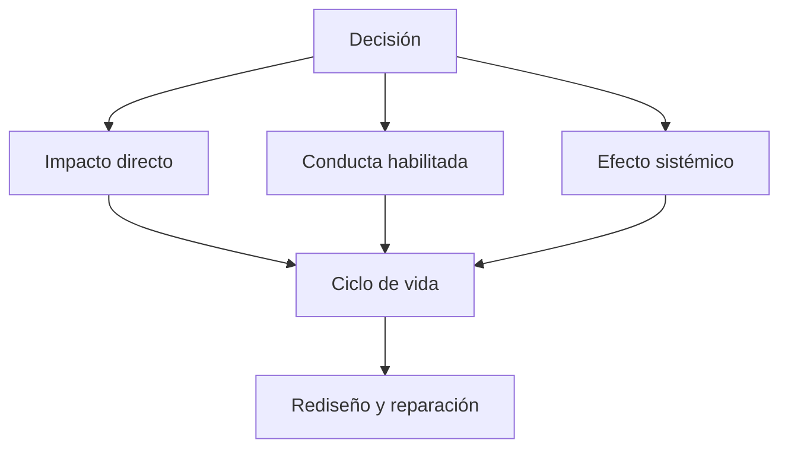

# SE-009 — Sostenibilidad, inclusión y responsabilidad social

[← SE-008](https://github.com/vladimiracunadev-create/software-engineering-learning-suite/blob/main/classes/part-00-ingenieria-de-software-como-profesion/se-008-restricciones-riesgos-y-compromisos-entre-atributos/README.md) · [↑ Parte 00](https://github.com/vladimiracunadev-create/software-engineering-learning-suite/blob/main/classes/part-00-ingenieria-de-software-como-profesion/README.md) · [📚 Índice completo](https://github.com/vladimiracunadev-create/software-engineering-learning-suite/blob/main/classes/README.md) · [SE-010 →](https://github.com/vladimiracunadev-create/software-engineering-learning-suite/blob/main/classes/part-00-ingenieria-de-software-como-profesion/se-010-como-leer-estandares-documentacion-y-literatura-tecnica/README.md)

> Estado: **GUIDED**. Clase desarrollada y revisada contra el estándar pedagógico; no implica evidencia de ejecución productiva.

## Prerrequisitos
Stakeholders, ética y trade-offs (`SE-004`, `SE-008`).

## Problema auténtico
Un servicio reduce papel pero obliga a renovar dispositivos, excluye conexiones lentas y conserva datos indefinidamente. «Digital» no equivale a sostenible ni inclusivo.

## Objetivos observables
Analizarás impactos directos, habilitados y sistémicos; diseñarás alternativas inclusivas; conectarás sostenibilidad técnica, humana y ambiental con decisiones de ciclo de vida.

## Temas y por qué importan
| Dimensión | Ejemplos |
| --- | --- |
| Ambiental | energía, hardware, transferencia, residuos |
| Social | acceso, poder, trabajo, comunidades |
| Técnica | mantenibilidad, dependencia, obsolescencia |
| Humana | carga cognitiva, guardias, salud laboral |

## Mapa conceptual

Optimizar consumo por transacción puede aumentar consumo total si el servicio induce más uso: efecto rebote.

## Conceptos y decisiones
Sostenibilidad significa satisfacer necesidades actuales sin degradar capacidad futura. En software incluye infraestructura, dispositivos, datos, mantenimiento y organización. Medir solo CPU del servidor omite red, cliente y fabricación.

Inclusión no es «usuario promedio». Restricciones de visión, movilidad, idioma, alfabetización, ingreso, conectividad y seguridad cambian interacción. Diseñar alternativa no significa experiencia inferior: conserva el resultado esencial.

Responsabilidad social exige observar quién obtiene beneficio y quién carga costo. Una función puede ser accesible técnicamente y peligrosa para alguien en contexto de violencia; contexto y amenaza importan.

## Definiciones de trabajo
- **impacto directo:** recursos consumidos por construir y operar;
- **impacto habilitado:** cambio de conducta que el software facilita;
- **efecto sistémico:** consecuencia acumulada o de segundo orden;
- **inclusión:** participación con dignidad y resultado equivalente;
- **obsolescencia:** pérdida de utilidad por cambios técnicos u organizativos.

## Glosario
**Efecto rebote** contrarresta eficiencia mediante más consumo. **Degradación progresiva** conserva función esencial bajo menos capacidades. **Just transition** considera a quienes cargan el cambio.

## Ejemplo mínimo
Una imagen comprimida reduce transferencia sin cambiar tarea; bloquear navegadores antiguos reduce soporte pero excluye dispositivos. La decisión necesita datos de uso y alternativa.

## Ejemplo profesional
Un trámite exige video en vivo. Se diseña ruta asincrónica con documentos mínimos, atención accesible y plazo equivalente. Se mide éxito por finalización y carga, no por adopción del canal nuevo.

## Práctica guiada
Crea `impact-map.md` para una función. Incluye ciclo de vida, grupos excluidos, alternativa de baja conectividad y una métrica con guardrail. Entrevistas reales requieren consentimiento; puedes trabajar con escenarios.

## Ejercicios
1. Encuentra un efecto rebote en una optimización.
2. Diseña alternativa sin smartphone.
3. Analiza impacto laboral de automatizar una revisión.

## Reto verificable
Un revisor elige un grupo o etapa omitida. Debes mostrar decisión, evidencia, alternativa y métrica; una lista de buenas intenciones no pasa.

## Preguntas frecuentes
### ¿Sostenibilidad es solo energía?
No; incluye continuidad técnica, personas e impactos sociales.
### ¿Diseñar para extremos encarece todo?
Puede cambiar prioridades, pero también revela fallos que afectan a muchos.

## Fallo controlado y diagnóstico
Evalúa solo servidor y luego amplía a cliente, red, hardware y efecto habilitado. Documenta el cambio de conclusión.

## Entorno y archivos clave
`impact-map.md`, `inclusion-scenarios.md`, `alternatives.md`, `measures.md`.

## Seguridad, ética y accesibilidad
No representes comunidades sin participación como verdad final. Protege datos y ofrece formatos alternativos.

## Transferencia
Compara nube, aplicación móvil y dispositivo embebido.

## Evaluación y evidencia
Se exigen múltiples escalas, alternativa inclusiva, trade-off y límite de evidencia.

## Fuentes
- [ACM Code of Ethics](https://www.acm.org/code-of-ethics), bienestar, justicia, privacidad y calidad de vida laboral.
- [WCAG 2.2](https://www.w3.org/TR/WCAG22/), criterios de accesibilidad web.
- [ISO/IEC 25019:2023](https://www.iso.org/standard/78177.html), consecuencias en contexto de uso.

## Límites y siguiente paso
Un análisis hipotético no sustituye participación. `SE-010` enseña a leer fuentes normativas sin exagerar su alcance.

---
[← SE-008](https://github.com/vladimiracunadev-create/software-engineering-learning-suite/blob/main/classes/part-00-ingenieria-de-software-como-profesion/se-008-restricciones-riesgos-y-compromisos-entre-atributos/README.md) · [↑ Parte 00](https://github.com/vladimiracunadev-create/software-engineering-learning-suite/blob/main/classes/part-00-ingenieria-de-software-como-profesion/README.md) · [SE-010 →](https://github.com/vladimiracunadev-create/software-engineering-learning-suite/blob/main/classes/part-00-ingenieria-de-software-como-profesion/se-010-como-leer-estandares-documentacion-y-literatura-tecnica/README.md)
