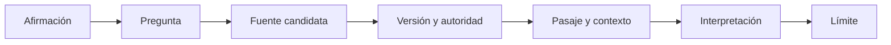

# SE-010 — Cómo leer estándares, documentación y literatura técnica

[← SE-009](https://github.com/vladimiracunadev-create/modern-software-engineering-program/blob/main/classes/part-00-ingenieria-de-software-como-profesion/se-009-sostenibilidad-inclusion-y-responsabilidad-social/README.md) · [↑ Parte 00](https://github.com/vladimiracunadev-create/modern-software-engineering-program/blob/main/classes/part-00-ingenieria-de-software-como-profesion/README.md) · [📚 Índice completo](https://github.com/vladimiracunadev-create/modern-software-engineering-program/blob/main/classes/README.md) · [SE-011 →](https://github.com/vladimiracunadev-create/modern-software-engineering-program/blob/main/classes/part-00-ingenieria-de-software-como-profesion/se-011-taller-anatomia-verificable-de-un-producto-real/README.md)

> Estado: **GUIDED**. Clase desarrollada y revisada contra el estándar pedagógico; no implica evidencia de ejecución productiva.

## Antes de empezar

Las clases anteriores formularon afirmaciones sobre ciclo de vida, ética, calidad e
impacto. Ahora auditarás de dónde salen. En Campus Abierto alguien afirma que “cumple
ISO 25010” porque leyó una página comercial; otra persona cita una edición retirada.
El problema no es carecer de enlaces, sino confundir autoridad, alcance y evidencia.

Construirás una cadena trazable entre afirmación, pregunta, fuente, pasaje,
interpretación y límite. En `SE-011` usarás esa cadena junto con todas las lentes
anteriores para inspeccionar un producto real sin repetir lo que dice su README.

## Prerrequisitos
Evidencia, incertidumbre y fuentes de las clases anteriores.

## Problema auténtico
Una guía cita un estándar para afirmar algo que el resumen público no contiene y copia un ejemplo obsoleto de documentación. Tener enlace no equivale a respaldo.

## Objetivos observables
Distinguirás norma, especificación, guía y estudio; localizarás alcance, lenguaje normativo y versión; construirás una cadena afirmación→fuente→pasaje→interpretación→límite.

## Temas y por qué importan
| Fuente | Uso responsable |
| --- | --- |
| Estándar | vocabulario, requisitos o modelos consensuados |
| Especificación | contrato preciso e interoperabilidad |
| Documentación oficial | comportamiento soportado de una versión |
| Artículo/libro | explicación o evidencia con método y contexto |

## Mapa conceptual

Leer solo el título salta los pasos que sostienen la afirmación.

## Conceptos y decisiones
### 1. Comenzar por la afirmación y la pregunta

Buscar primero una cita favorece encontrar texto que suena compatible. El método
comienza escribiendo una afirmación suficientemente precisa para poder ser falsa:
objeto, versión, contexto y alcance. Después se pregunta qué tipo de evidencia podría
sostenerla. “Los reintentos de este método son seguros bajo esta condición” requiere
una especificación y una decisión local; “esta estrategia redujo fallos en nuestro
servicio” requiere observaciones del contexto.

La cadena afirmación → pregunta → fuente evita dos extremos: citar una autoridad que
no habla del punto y usar una experiencia local como regla universal. También permite
descubrir que una afirmación mezcla varias proposiciones y necesita fuentes diferentes.

### 2. Tipo de fuente y autoridad sobre el objeto

Un estándar ofrece vocabulario, modelos o requisitos consensuados dentro de un alcance.
Una especificación define contratos e interoperabilidad. La documentación oficial
describe comportamiento soportado de un producto o versión. Un artículo de investigación
aporta método, datos y discusión; un libro o guía secundaria puede explicar y conectar.

“Oficial” no significa universalmente verdadero. El fabricante tiene autoridad sobre
la interfaz soportada, pero incentivo y alcance limitados al comparar alternativas. Una
norma puede definir características de calidad sin indicar el umbral adecuado para
Campus Abierto. Una fuente secundaria puede ser pedagógicamente superior y aun así
requerir la primaria cuando se afirma conformidad.

La selección se basa en **aptitud para la afirmación**, no en prestigio general. Se
prefiere la fuente más próxima capaz de sostenerla y se añade contexto cuando el lector
necesita interpretación.

### 3. Alcance, lenguaje normativo y excepciones

Antes de buscar una frase se leen propósito, alcance, definiciones y estructura. Un
documento puede ser descriptivo, normativo o ambas cosas en secciones distintas. Los
términos `shall`, `should` y `may` solo adquieren sentido normativo según las
convenciones definidas por la propia publicación. Copiar una frase sin condición o
excepción altera su significado.

También hay que distinguir requisito de ejemplo. Un ejemplo informativo muestra una
posibilidad; no obliga a implementarla. Una nota puede aclarar sin formar parte del
requisito. El registro resume el pasaje con sus condiciones y evita reproducir más
texto del permitido por licencia.

### 4. Edición, vigencia y cadena de sustitución

Los documentos cambian. Se registra número o identificador, edición o versión, fecha,
estado, errata y documento que sustituye o actualiza. Una referencia histórica puede
ser correcta aunque esté retirada; el error consiste en presentarla como requisito
actual sin contexto.

ISO/IEC 25010:2011 combinaba modelos de producto y calidad en uso. La edición de 2023
sitúa calidad del producto en ISO/IEC 25010 y el modelo de calidad en uso en
ISO/IEC 25019. Por eso escribir solo “ISO 25010” puede ocultar qué edición y modelo se
usa. De manera semejante, un RFC puede ser actualizado parcialmente por otros; el
encabezado y las relaciones forman parte de la lectura.

### 5. Del pasaje a la interpretación y su límite

Una cita no ejecuta el razonamiento. El registro explica qué afirma la fuente, cómo se
aplica al caso y qué decisión local permanece abierta. ISO puede nombrar una
característica; el equipo todavía debe seleccionar escenarios y umbrales. Un RFC puede
permitir reintento; el producto debe gestionar idempotencia y efectos propios.

La **cita de proximidad** se coloca junto a la afirmación sustentada para que el lector
no adivine qué respalda una bibliografía. Si el estándar completo es de pago y solo se
consultó su ficha pública, se cita la ficha únicamente para metadatos visibles. No se
inventa acceso ni se atribuyen cláusulas no leídas.

Contrastar una fuente complementaria ayuda a descubrir límites: errata, evidencia
empírica, guía de adopción o crítica metodológica. No se crea falsa equivalencia; se
explica qué pregunta responde cada una.

## Caso conductor: auditar “Campus Abierto cumple ISO 25010”

La afirmación original carece de edición, alcance y evidencia. Se divide en preguntas:
¿qué modelo se aplicó?, ¿qué características se evaluaron?, ¿con qué escenarios y
medidas?, ¿quién afirma conformidad? La ficha oficial confirma nombre, edición y
alcance general; no demuestra evaluación del producto.

La versión corregida dice: “El catálogo de escenarios usa las características del
modelo de calidad de producto ISO/IEC 25010:2023 como vocabulario. Esta revisión
interna evaluó únicamente fiabilidad, eficiencia de desempeño y compatibilidad en los
entornos declarados; no constituye certificación ni evidencia de calidad en uso”. Para
calidad en uso se enlaza ISO/IEC 25019:2023 y se documenta el método local.

El cambio parece menos grandioso y es profesionalmente más fuerte: otra persona puede
ver qué procede de la fuente, qué decidió el equipo y qué permanece sin demostrar.

## Definiciones de trabajo
- **normativo:** parte que establece requisitos dentro del alcance;
- **informativo:** explicación o ejemplo no obligatorio;
- **edición:** versión formal de una publicación;
- **vigencia:** estado actual, retirado o sustituido;
- **cita de proximidad:** enlace colocado junto a la afirmación sustentada.

## Glosario
**DOI** identifica publicaciones; **ISBN** identifica ediciones de libros; **RFC** es una serie con estados y actualizaciones; **errata** corrige sin necesariamente crear edición nueva.

## Ejemplo mínimo
«ISO 25010 mide usabilidad» es impreciso: el estándar define un modelo de producto y no ejecuta mediciones. Debe indicarse característica, edición y método de medida elegido.

## Ejemplo profesional
Para decidir semántica de reintento HTTP, se consulta RFC 9110, se localiza método y condición, se revisan actualizaciones y se documenta qué decisión local no prescribe el RFC.

## Práctica guiada
Elige una afirmación de `SE-001`–`SE-009`. Crea `source-trace.md` con pregunta, fuente, autoridad, versión, pasaje resumido, interpretación y límite. Busca una fuente contradictoria o complementaria.

## Ejercicios
1. Clasifica cuatro fuentes del repositorio.
2. Encuentra una fuente retirada y su reemplazo.
3. Reescribe una cita decorativa como evidencia de proximidad.

## Reto verificable
Un revisor abre el enlace y debe hallar soporte sin adivinar. Si la fuente es cerrada, cita metadatos y resumen público sin fingir acceso al texto completo.

## Preguntas frecuentes
### ¿Oficial significa correcto para mi caso?
No; significa autoridad sobre un objeto, no adecuación universal.
### ¿Puedo citar un resumen?
Sí para lo que el resumen afirma; no para detalles no visibles.

## Fallo controlado y diagnóstico
Cita una versión antigua como actual, detecta la sustitución y registra qué conclusiones cambian. No reescribas historia legítima.

## Errores comunes y cómo corregirlos

| Síntoma | Causa | Corrección |
| --- | --- | --- |
| bibliografía extensa al final | no existe relación afirmación–fuente | coloca citas de proximidad y registra el pasaje relevante |
| “según ISO” sin edición | se omitieron vigencia y alcance | añade identificador, año, modelo usado y límite |
| resumen comercial respalda una cláusula | se atribuyó contenido no visible | limita la afirmación a metadatos o consulta fuente accesible |
| documentación oficial se toma como comparación imparcial | autoridad confundida con adecuación | añade evidencia contextual y fuentes complementarias |
| una cita reemplaza la decisión local | no se hizo interpretación | separa lo prescrito de umbral, método y riesgo elegidos |

## Entorno y archivos clave
Navegador, gestor bibliográfico opcional: `source-trace.md`, `currency-check.md`, `claims.md`.

## Seguridad, ética y accesibilidad
Respeta licencias y límites de cita. No eludas paywalls. Añade título y autoridad para lectores que no puedan abrir el enlace.

## Transferencia
Compara un RFC, una norma ISO y documentación de una biblioteca.

## Evaluación y evidencia
Se exige trazabilidad de afirmación, edición, pasaje, interpretación y límite.

## Fuentes
- [SWEBOK v4.0a](https://www.computer.org/education/bodies-of-knowledge/software-engineering/v4), cuerpo de conocimiento y referencias.
- [ISO/IEC 25010:2023](https://www.iso.org/standard/78176.html) e [ISO/IEC 25019:2023](https://www.iso.org/standard/78177.html), ejemplo de separación entre ediciones.
- [RFC 9110](https://www.rfc-editor.org/rfc/rfc9110), especificación primaria accesible.

## Límites y siguiente paso
La clase no enseña revisión sistemática completa. `SE-011` integra las diez clases en la anatomía de un producto.

---
[← SE-009](https://github.com/vladimiracunadev-create/modern-software-engineering-program/blob/main/classes/part-00-ingenieria-de-software-como-profesion/se-009-sostenibilidad-inclusion-y-responsabilidad-social/README.md) · [↑ Parte 00](https://github.com/vladimiracunadev-create/modern-software-engineering-program/blob/main/classes/part-00-ingenieria-de-software-como-profesion/README.md) · [SE-011 →](https://github.com/vladimiracunadev-create/modern-software-engineering-program/blob/main/classes/part-00-ingenieria-de-software-como-profesion/se-011-taller-anatomia-verificable-de-un-producto-real/README.md)
