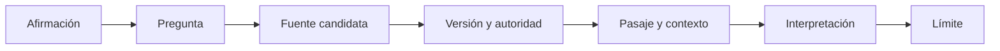

# SE-010 — Cómo leer estándares, documentación y literatura técnica

[← SE-009](https://github.com/vladimiracunadev-create/software-engineering-learning-suite/blob/main/classes/part-00-ingenieria-de-software-como-profesion/se-009-sostenibilidad-inclusion-y-responsabilidad-social/README.md) · [↑ Parte 00](https://github.com/vladimiracunadev-create/software-engineering-learning-suite/blob/main/classes/part-00-ingenieria-de-software-como-profesion/README.md) · [📚 Índice completo](https://github.com/vladimiracunadev-create/software-engineering-learning-suite/blob/main/classes/README.md) · [SE-011 →](https://github.com/vladimiracunadev-create/software-engineering-learning-suite/blob/main/classes/part-00-ingenieria-de-software-como-profesion/se-011-taller-anatomia-verificable-de-un-producto-real/README.md)

> Estado: **GUIDED**. Clase desarrollada y revisada contra el estándar pedagógico; no implica evidencia de ejecución productiva.

## Prerrequisitos
Evidencia, incertidumbre y fuentes de las clases anteriores.

## Problema auténtico
Una guía cita un estándar para afirmar algo que el resumen público no contiene y copia un ejemplo obsoleto de documentación. Tener enlace no equivale a respaldo.

## Objetivos observables
Distinguirás norma, especificación, guía y estudio; localizarás alcance, lenguaje normativo y versión; construirás una cadena afirmación→fuente→pasaje→interpretación→límite.

## Temas y por qué importan
| Fuente | Uso responsable |
| --- | --- |
| Estándar | vocabulario, requisitos o modelos consensuados |
| Especificación | contrato preciso e interoperabilidad |
| Documentación oficial | comportamiento soportado de una versión |
| Artículo/libro | explicación o evidencia con método y contexto |

## Mapa conceptual

Leer solo el título salta los pasos que sostienen la afirmación.

## Conceptos y decisiones
Primero identifica propósito y alcance. Un documento puede definir un modelo sin prescribir implementación. Palabras como shall, should y may tienen funciones distintas cuando el documento las define.

Verifica versión, estado y sustitución. ISO 25010:2011 combinaba modelos que en 2023 se separaron entre ISO 25010 e ISO 25019; citar el número sin edición cambia significado.

Una fuente primaria describe directamente especificación, experimento o decisión. Una secundaria puede enseñar mejor, pero no debe reemplazarla cuando se afirma conformidad. Autoridad no elimina límites: documentación oficial puede omitir comparaciones o errores conocidos.

## Definiciones de trabajo
- **normativo:** parte que establece requisitos dentro del alcance;
- **informativo:** explicación o ejemplo no obligatorio;
- **edición:** versión formal de una publicación;
- **vigencia:** estado actual, retirado o sustituido;
- **cita de proximidad:** enlace colocado junto a la afirmación sustentada.

## Glosario
**DOI** identifica publicaciones; **ISBN** identifica ediciones de libros; **RFC** es una serie con estados y actualizaciones; **errata** corrige sin necesariamente crear edición nueva.

## Ejemplo mínimo
«ISO 25010 mide usabilidad» es impreciso: el estándar define un modelo de producto y no ejecuta mediciones. Debe indicarse característica, edición y método de medida elegido.

## Ejemplo profesional
Para decidir semántica de reintento HTTP, se consulta RFC 9110, se localiza método y condición, se revisan actualizaciones y se documenta qué decisión local no prescribe el RFC.

## Práctica guiada
Elige una afirmación de `SE-001`–`SE-009`. Crea `source-trace.md` con pregunta, fuente, autoridad, versión, pasaje resumido, interpretación y límite. Busca una fuente contradictoria o complementaria.

## Ejercicios
1. Clasifica cuatro fuentes del repositorio.
2. Encuentra una fuente retirada y su reemplazo.
3. Reescribe una cita decorativa como evidencia de proximidad.

## Reto verificable
Un revisor abre el enlace y debe hallar soporte sin adivinar. Si la fuente es cerrada, cita metadatos y resumen público sin fingir acceso al texto completo.

## Preguntas frecuentes
### ¿Oficial significa correcto para mi caso?
No; significa autoridad sobre un objeto, no adecuación universal.
### ¿Puedo citar un resumen?
Sí para lo que el resumen afirma; no para detalles no visibles.

## Fallo controlado y diagnóstico
Cita una versión antigua como actual, detecta la sustitución y registra qué conclusiones cambian. No reescribas historia legítima.

## Entorno y archivos clave
Navegador, gestor bibliográfico opcional: `source-trace.md`, `currency-check.md`, `claims.md`.

## Seguridad, ética y accesibilidad
Respeta licencias y límites de cita. No eludas paywalls. Añade título y autoridad para lectores que no puedan abrir el enlace.

## Transferencia
Compara un RFC, una norma ISO y documentación de una biblioteca.

## Evaluación y evidencia
Se exige trazabilidad de afirmación, edición, pasaje, interpretación y límite.

## Fuentes
- [SWEBOK v4.0a](https://www.computer.org/education/bodies-of-knowledge/software-engineering/v4), cuerpo de conocimiento y referencias.
- [ISO/IEC 25010:2023](https://www.iso.org/standard/78176.html) e [ISO/IEC 25019:2023](https://www.iso.org/standard/78177.html), ejemplo de separación entre ediciones.
- [RFC 9110](https://www.rfc-editor.org/rfc/rfc9110), especificación primaria accesible.

## Límites y siguiente paso
La clase no enseña revisión sistemática completa. `SE-011` integra las diez clases en la anatomía de un producto.

---
[← SE-009](https://github.com/vladimiracunadev-create/software-engineering-learning-suite/blob/main/classes/part-00-ingenieria-de-software-como-profesion/se-009-sostenibilidad-inclusion-y-responsabilidad-social/README.md) · [↑ Parte 00](https://github.com/vladimiracunadev-create/software-engineering-learning-suite/blob/main/classes/part-00-ingenieria-de-software-como-profesion/README.md) · [SE-011 →](https://github.com/vladimiracunadev-create/software-engineering-learning-suite/blob/main/classes/part-00-ingenieria-de-software-como-profesion/se-011-taller-anatomia-verificable-de-un-producto-real/README.md)
