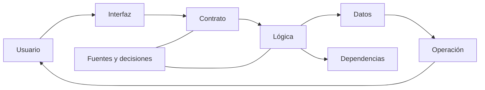

# SE-011 — Taller: anatomía verificable de un producto real

[← SE-010](https://github.com/vladimiracunadev-create/software-engineering-learning-suite/blob/main/classes/part-00-ingenieria-de-software-como-profesion/se-010-como-leer-estandares-documentacion-y-literatura-tecnica/README.md) · [↑ Parte 00](https://github.com/vladimiracunadev-create/software-engineering-learning-suite/blob/main/classes/part-00-ingenieria-de-software-como-profesion/README.md) · [📚 Índice completo](https://github.com/vladimiracunadev-create/software-engineering-learning-suite/blob/main/classes/README.md) · [SE-012 →](https://github.com/vladimiracunadev-create/software-engineering-learning-suite/blob/main/classes/part-00-ingenieria-de-software-como-profesion/se-012-proyecto-mapa-profesional-y-contrato-personal-de-aprendizaje/README.md)

> Estado: **GUIDED**. Clase desarrollada y revisada contra el estándar pedagógico; no implica evidencia de ejecución productiva.

## Antes de empezar

Hasta aquí estudiaste una lente por vez y la aplicaste a Campus Abierto. El taller
cambia la dirección: recibirás un producto real y deberás reconstruirlo desde evidencia.
Necesitarás decidir su frontera, seguir una tarea, ubicar responsabilidades, leer
fuentes, formular riesgos y distinguir lo observado de lo inferido.

La anatomía resultante debe mostrar una ruta vertical desde la necesidad hasta la
operación, además de huecos honestos. No ejecutes código desconocido para llenar esos
huecos. `SE-012` usará esta evidencia integrada para que tu plan profesional parta de
capacidades demostradas y no de una lista aspiracional de tecnologías.

## Prerrequisitos
Clases `SE-001`–`SE-010` y capacidad de leer un repositorio sin ejecutar código desconocido.

## Problema auténtico
Recibes un producto y una descripción comercial. Debes determinar qué hace realmente, para quién, con qué dependencias, evidencia y riesgos. Repetir el README no constituye una revisión.

## Objetivos observables
Reconstruirás una anatomía desde evidencia, diferenciarás afirmación de observación, seguirás un flujo vertical y producirás preguntas que puedan cambiar una decisión.

## Temas y por qué importan
| Capa | Evidencia buscada |
| --- | --- |
| Propósito | problema, usuarios, resultado y límites |
| Contrato | entradas, salidas, errores y compatibilidad |
| Implementación | módulos, datos, dependencias y decisiones |
| Entrega | build, artefactos, configuración y procedencia |
| Operación | señales, recuperación, soporte y retiro |

## Mapa conceptual

El recorrido es vertical: una tarea cruza superficies. Inventariar carpetas sin seguir comportamiento produce una anatomía nominal.

## Conceptos y decisiones
Empieza por una pregunta, no por archivos. Busca una ruta observable: por ejemplo crear una tarea. Localiza interfaz, contrato, validación, persistencia, respuesta, prueba y señal operativa. Registra saltos que no puedas demostrar.

La evidencia tiene jerarquía contextual. Código y configuración muestran implementación; pruebas muestran ejemplos verificados; documentación muestra intención; historial muestra cambio. Ninguna fuente aislada garantiza comportamiento de producción.

No ejecutes scripts por confianza. Lee instrucciones, dependencias y efectos; trabaja en copia y usa datos sintéticos. Si no puedes ejecutar, declara revisión estática y no inventes resultados.

## Definiciones de trabajo
- **flujo vertical:** recorrido completo de una tarea por capas;
- **punto de entrada:** interfaz que inicia comportamiento;
- **fuente de verdad:** artefacto autorizado para una afirmación concreta;
- **evidencia negativa:** ausencia o contradicción relevante, no prueba automática de defecto;
- **gap:** pregunta necesaria que la evidencia disponible no responde.

## Glosario
**Happy path** es recorrido esperado; **degraded path** conserva capacidad limitada; **traceability** conecta necesidad, decisión, implementación y evidencia.

## Ejemplo mínimo
El README dice «datos cifrados». La configuración muestra TLS para tránsito, pero no cifrado de almacenamiento. La conclusión correcta delimita lo observado y pregunta por la capa ausente.

## Ejemplo profesional
En el producto de referencia, sigue la creación de una solicitud desde OpenAPI hasta requisitos, arquitectura, pruebas y runbook. Si el contrato admite reintento pero no hay idempotencia documentada, registra riesgo, no afirmes defecto ejecutado.

## Práctica guiada
1. Selecciona el producto de `blueprints/reference-product/` u otro repositorio autorizado.
2. Declara alcance y método en `review-plan.md`.
3. Sigue un flujo normal y uno degradado.
4. Construye `evidence-map.md` con enlaces por afirmación.
5. Registra cinco gaps y prioriza por consecuencia.
6. Pide revisión cruzada y corrige inferencias excesivas.

## Ejercicios
1. Encuentra una afirmación documentada que el código no basta para confirmar.
2. Distingue dependencia directa, transitiva y servicio externo.
3. Explica cómo retirarías una capacidad sin romper consumidores.

## Reto verificable
Una segunda persona reproduce tres hallazgos desde tus rutas y clasifica cada uno como hecho, inferencia o incógnita. Ningún enlace puede apuntar solo a la raíz del repositorio.

## Preguntas frecuentes
### ¿Debo ejecutar todo?
No. Ejecuta solo lo autorizado y seguro; declara qué quedó estático.
### ¿Más archivos significan más evidencia?
No. Importan relevancia, trazabilidad y capacidad de refutar.

## Fallo controlado y diagnóstico
Sigue deliberadamente el README como única fuente y compara con contrato o configuración. Documenta la primera contradicción y corrige el método.

## Entorno y archivos clave
Editor, Git y navegador. Entrega `review-plan.md`, `system-map.md`, `evidence-map.md`, `gaps.md`, `review.md`. No instales dependencias innecesarias.

## Seguridad, ética y accesibilidad
No abras secretos, datos reales ni producción. Examina si la interfaz y soporte contemplan acceso alternativo y recuperación.

## Transferencia
Repite el flujo en un proyecto de otro stack; conserva preguntas y cambia herramientas.

## Evaluación y evidencia
Se evalúan flujo vertical, citas precisas, límites, riesgo y revisión reproducible. Una ficha descriptiva no aprueba.

## Fuentes
- [SWEBOK v4.0a](https://www.computer.org/education/bodies-of-knowledge/software-engineering/v4), áreas de conocimiento usadas en la inspección.
- [NASA Systems Engineering Handbook](https://www.nasa.gov/reference/systems-engineering-handbook/), trazabilidad y revisiones técnicas.
- [ACM Code of Ethics](https://www.acm.org/code-of-ethics), autorización, competencia y evaluación exhaustiva.

## Límites y siguiente paso
Es una revisión acotada, no certificación de seguridad ni producción. `SE-012` convierte resultados en un plan profesional verificable.

---
[← SE-010](https://github.com/vladimiracunadev-create/software-engineering-learning-suite/blob/main/classes/part-00-ingenieria-de-software-como-profesion/se-010-como-leer-estandares-documentacion-y-literatura-tecnica/README.md) · [↑ Parte 00](https://github.com/vladimiracunadev-create/software-engineering-learning-suite/blob/main/classes/part-00-ingenieria-de-software-como-profesion/README.md) · [SE-012 →](https://github.com/vladimiracunadev-create/software-engineering-learning-suite/blob/main/classes/part-00-ingenieria-de-software-como-profesion/se-012-proyecto-mapa-profesional-y-contrato-personal-de-aprendizaje/README.md)
