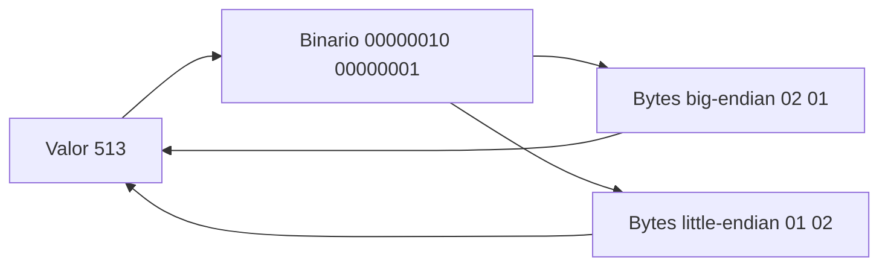

# SE-014 — Bits, bytes, bases numéricas y representación

[← SE-013](https://github.com/vladimiracunadev-create/modern-software-engineering-program/blob/main/classes/part-01-computadores-y-representacion-de-informacion/se-013-arquitectura-basica-de-un-computador-moderno/README.md) · [↑ Parte 01](https://github.com/vladimiracunadev-create/modern-software-engineering-program/blob/main/classes/part-01-computadores-y-representacion-de-informacion/README.md) · [📚 Índice completo](https://github.com/vladimiracunadev-create/modern-software-engineering-program/blob/main/classes/README.md) · [SE-015 →](https://github.com/vladimiracunadev-create/modern-software-engineering-program/blob/main/classes/part-01-computadores-y-representacion-de-informacion/se-015-texto-unicode-codificaciones-y-mojibake/README.md)

> Estado: **PLANNED** · Borrador público conservado íntegramente y sometido a auditoría técnica y pedagógica.

## Punto profesional y fundamento pedagógico

**Punto profesional.** La clase existe para interpretar un valor binario solo cuando se declaran base, ancho, signo y orden de bytes.

**Por qué aparece aquí.** Se sitúa después de **Arquitectura básica de un computador moderno** y antes de **Texto, Unicode, codificaciones y mojibake**: convierte el conocimiento anterior en una decisión observable que la clase siguiente podrá reutilizar. La continuidad se comprueba en el artefacto, no por compartir vocabulario.

**Error conceptual que debe corregir.** Creer que una secuencia de bytes posee signo y orden por sí misma.

**Secuencia de aprendizaje.** Antes de leer la solución, el estudiante predice el resultado del caso normal y del error conceptual anterior. Luego explica un caso resuelto paso a paso, construye un contraejemplo que cambie la decisión y, sin consultar el texto, reconstruye el mecanismo y lo aplica a una entrada nueva. La secuencia usa predicción, explicación propia, contraste y recuperación. [ICAP](https://icap.education.asu.edu/research) distingue participación de construcción de conocimiento; [How People Learn II](https://nap.nationalacademies.org/catalog/24783/how-people-learn-ii-learners-contexts-and-cultures) exige conectar conocimiento previo, contexto y transferencia; la [práctica de recuperación](https://pubmed.ncbi.nlm.nih.gov/16507066/) respalda producir de nuevo la explicación tras una demora; y [Education for Life and Work](https://nap.nationalacademies.org/resource/13398/dbasse_084153.pdf) exige devolución que explique la causa del error.

**Evidencia de aprendizaje.** Representations.md con valor↔bits↔bytes, round trips y un desbordamiento explicado. Debe contener predicción previa, observación, explicación causal, contraejemplo, criterio de aceptación y una nota de qué dato haría cambiar la conclusión.

**Límite de la conclusión.** Los enteros de Python no reproducen un registro de ancho fijo sin imponerlo.

### Trazabilidad fuente → afirmación

| Fuente primaria u oficial | Afirmación que respalda | Lo que no prueba |
|---|---|---|
| [RISC-V ISA Introduction](https://docs.riscv.org/reference/isa/unpriv/intro.html) |  declara el byte de ocho bits y variantes de ancho | No demuestra por sí sola que el artefacto del estudiante sea correcto. |
| [Python integer methods](https://docs.python.org/3/library/stdtypes.html#int.to_bytes) |  define serialización, orden y signo | No demuestra por sí sola que el artefacto del estudiante sea correcto. |
| [Python `struct`](https://docs.python.org/3/library/struct.html) |  documenta formatos binarios y byte order | No demuestra por sí sola que el artefacto del estudiante sea correcto. |

## Antes de empezar

`SE-013` localizó capas y contratos. Ahora abrimos el dato que las atraviesa. El byte
`01000001` puede significar 65, `A`, una máscara o parte de una instrucción: los bits
aportan estados; el formato aporta significado. Prepararás la serialización numérica de
el analizador local de eventos para que `SE-015` pueda explicar texto sin confundirlo con bytes.

## Prerrequisitos

Mapa de capas de `SE-013`, suma y potencias enteras básicas, Python 3.11+.

## Problema auténtico

Dos servicios intercambian cuatro bytes. Uno lee `1`; el otro, `16777216`. Ambos
conservan los mismos bits, pero asumieron distinto orden. Sin contrato de representación,
“los datos llegaron intactos” no significa que conservaron significado.

## Objetivos observables

Convertirás entre bases usando valor posicional; explicarás rango y signo; serializarás
enteros con orden explícito; y diagnosticarás overflow o endianess sin probar valores al
azar.

## Temas y por qué importan

| Tema | Mecanismo | Por qué importa |
| --- | --- | --- |
| Bit y byte | agrupan estados discretos | son unidad de contratos binarios |
| Base posicional | pesos por potencia | permite leer y verificar representaciones |
| Signo y rango | reserva patrones para valores | explica overflow e interoperabilidad |
| Endianess | ordena bytes de valores multibyte | evita decodificaciones incompatibles |
## Mapa conceptual

El valor es el mismo solo cuando el lector conoce ancho, signo y orden. El mapa no
aplica a texto hasta que `SE-015` defina una codificación.

## Conceptos y decisiones

### 1. Un bit distingue estados; el contexto les da significado

Un bit modela dos estados, usualmente escritos 0 y 1. Ocho bits forman un byte en las
plataformas estudiadas. Con `n` bits existen `2**n` patrones. Eso no decide qué
representan: el mismo patrón puede interpretarse como entero, flags o fragmento de un
formato.

### 2. La notación posicional conserva valor entre bases

En base `b`, cada dígito pesa una potencia de `b`. `1011₂` vale
`1×2³ + 0×2² + 1×2¹ + 1×2⁰ = 11`. Hexadecimal agrupa cuatro bits por dígito y facilita
inspección: `0x0B` expresa el mismo valor. Convertir no cambia el valor; cambia la
notación. Verifica reconstruyendo la suma, no mediante memoria visual.

### 3. Ancho y signo determinan el rango

Un entero sin signo de `n` bits cubre `0` a `2**n - 1`. Complemento a dos usa el bit
más significativo como parte de una representación cuyo rango es `-2**(n-1)` a
`2**(n-1)-1`. La suma modular descarta acarreo fuera del ancho. Python usa enteros de
precisión arbitraria, por lo que debes imponer el ancho cuando simulas un protocolo.

### 4. Endianess ordena bytes, no bits dentro de una explicación informal

Un valor multibyte puede serializarse con el byte más significativo primero
(`big-endian`) o al final (`little-endian`). El contrato debe fijarlo. Cambiar el orden
de visualización de bits dentro de cada byte introduce otra cuestión y no debe mezclarse.
`int.to_bytes` y `int.from_bytes` exigen declarar orden y signo.

### 5. Tamaño, unidad y prefijo también son contratos

Un byte no es un carácter. `KB` y `KiB` pueden representar bases distintas según el
estándar y producto. Un identificador de 32 bits no tiene el mismo rango que una
cantidad de 32 bytes. Escribe unidad, ancho y representación cerca del dato.

## Caso conductor: longitud binaria del analizador local de eventos

El analizador local de eventos agrega un campo `sequence=513`. Se decide serializarlo en dos bytes sin signo y
big-endian: `02 01`. El lector valida exactamente dos bytes. Si el dominio puede superar
65535, el contrato debe ampliar ancho o rechazar; truncar silenciosamente cambia la
identidad.

## Definiciones de trabajo

- **bit:** unidad con dos estados distinguibles;
- **byte:** grupo de ocho bits en este programa;
- **base:** cantidad de dígitos y pesos de una notación posicional;
- **overflow:** resultado fuera del rango representable;
- **endianess:** orden de bytes en un valor multibyte.

## Glosario

**MSB/LSB** señalan bit o byte más/menos significativo según contexto. **Nibble** son
cuatro bits. **Máscara** selecciona posiciones mediante operaciones bit a bit.

## Ejemplo mínimo

`255` cabe en un byte sin signo (`ff`) y no en un byte con signo. `(-1).to_bytes(1,
'big', signed=True)` produce `ff`; leerlo como no firmado devuelve 255.

## Ejemplo profesional

Un encabezado de red fija ancho y orden. El productor que usa orden nativo puede pasar
pruebas locales y fallar al interoperar. La solución es contrato explícito y vectores
de prueba compartidos, no detectar plataforma en cada extremo.

## Práctica guiada

1. Crea `representations.py` con funciones que muestren decimal, binario y hexadecimal.
2. Convierte manualmente 13, 255 y 513 y verifica con `format`.
3. Serializa 513 en dos bytes, ambos órdenes, y registra `hex()`.
4. Lee cada secuencia con el orden contrario y explica el valor resultante.
5. Prueba fronteras 0, 65535, -1 y 65536 con signo declarado.
6. Entrega `conversion-table.md`, `representations.py` y `observations.md`.

## Ejercicios

1. Demuestra por qué `0xff` no determina por sí solo -1 o 255.
2. Diseña un campo de flags y dos máscaras.
3. Propón una migración de 16 a 32 bits compatible con lectores antiguos.

## Reto verificable

Otra persona recibe cinco secuencias y tu contrato. Debe recuperar valores y rechazar
las inválidas sin preguntarte ancho, signo u orden.

## Preguntas frecuentes

### ¿Hexadecimal ocupa menos memoria?
No necesariamente; es una notación textual compacta para humanos.

### ¿El orden nativo es más rápido?
Puede evitar conversiones locales, pero la interoperabilidad requiere un contrato estable.

## Fallo controlado y diagnóstico

Codifica 513 como big-endian y léelo como little-endian. Conserva bytes, valor erróneo,
hipótesis y corrección. No “arregles” invirtiendo hasta que funcione: fija el contrato.

## Errores comunes y cómo corregirlos

| Síntoma | Causa | Corrección |
| --- | --- | --- |
| conversión aprendida de memoria | falta modelo posicional | reconstruye pesos y suma |
| overflow no aparece en Python | entero arbitrario oculta ancho | valida rango o usa serialización fija |
| “un byte es un carácter” | capas mezcladas | define codificación en SE-015 |
| bytes invertidos entre sistemas | endianess implícito | fija orden y vector de prueba |

## Entorno y archivos clave

Python 3.11+, sin dependencias: `representations.py`, `conversion-table.md`, `observations.md`. Limpieza: elimina el directorio de práctica.

## Seguridad, ética y accesibilidad

Usa valores sintéticos. Presenta binario agrupado y con equivalente decimal para
lectores con distintas necesidades. No confíes en overflow para validación de seguridad.

## Transferencia

Inspecciona un color RGB o un encabezado documentado y separa patrón, formato y significado.

## Evaluación y evidencia

Se evalúan conversiones justificadas, contrato completo, fronteras y diagnóstico reproducible.

## Fuentes

- [RISC-V ISA Introduction](https://docs.riscv.org/reference/isa/unpriv/intro.html) declara el byte de ocho bits y variantes de ancho.
- [Python integer methods](https://docs.python.org/3/library/stdtypes.html#int.to_bytes) define serialización, orden y signo.
- [Python `struct`](https://docs.python.org/3/library/struct.html) documenta formatos binarios y byte order.

## Límites y siguiente paso

No cubre álgebra booleana ni formatos de archivo completos. `SE-015` asigna texto a secuencias de bytes.

---
[← SE-013](https://github.com/vladimiracunadev-create/modern-software-engineering-program/blob/main/classes/part-01-computadores-y-representacion-de-informacion/se-013-arquitectura-basica-de-un-computador-moderno/README.md) · [↑ Parte 01](https://github.com/vladimiracunadev-create/modern-software-engineering-program/blob/main/classes/part-01-computadores-y-representacion-de-informacion/README.md) · [SE-015 →](https://github.com/vladimiracunadev-create/modern-software-engineering-program/blob/main/classes/part-01-computadores-y-representacion-de-informacion/se-015-texto-unicode-codificaciones-y-mojibake/README.md)
