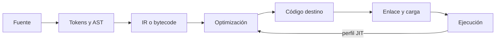

# SE-020 — Compilación, interpretación, bytecode y JIT

[← SE-019](https://github.com/vladimiracunadev-create/modern-software-engineering-program/blob/main/classes/part-01-computadores-y-representacion-de-informacion/se-019-procesos-hilos-interrupciones-y-entrada-salida/README.md) · [↑ Parte 01](https://github.com/vladimiracunadev-create/modern-software-engineering-program/blob/main/classes/part-01-computadores-y-representacion-de-informacion/README.md) · [📚 Índice completo](https://github.com/vladimiracunadev-create/modern-software-engineering-program/blob/main/classes/README.md) · [SE-021 →](https://github.com/vladimiracunadev-create/modern-software-engineering-program/blob/main/classes/part-01-computadores-y-representacion-de-informacion/se-021-runtimes-maquinas-virtuales-y-recoleccion-de-basura/README.md)

> Estado: **PLANNED** · Borrador público conservado íntegramente y sometido a auditoría técnica y pedagógica.

## Punto profesional y fundamento pedagógico

**Punto profesional.** La clase existe para seguir fuente, AST, bytecode, IR y ejecución para localizar la etapa que introduce un fallo.

**Por qué aparece aquí.** Se sitúa después de **Procesos, hilos, interrupciones y entrada/salida** y antes de **Runtimes, máquinas virtuales y recolección de basura**: convierte el conocimiento anterior en una decisión observable que la clase siguiente podrá reutilizar. La continuidad se comprueba en el artefacto, no por compartir vocabulario.

**Error conceptual que debe corregir.** Creer que interpretar excluye compilar o que JIT compila todo antes de iniciar.

**Secuencia de aprendizaje.** Antes de leer la solución, el estudiante predice el resultado del caso normal y del error conceptual anterior. Luego explica un caso resuelto paso a paso, construye un contraejemplo que cambie la decisión y, sin consultar el texto, reconstruye el mecanismo y lo aplica a una entrada nueva. La secuencia usa predicción, explicación propia, contraste y recuperación. [ICAP](https://icap.education.asu.edu/research) distingue participación de construcción de conocimiento; [How People Learn II](https://nap.nationalacademies.org/catalog/24783/how-people-learn-ii-learners-contexts-and-cultures) exige conectar conocimiento previo, contexto y transferencia; la [práctica de recuperación](https://pubmed.ncbi.nlm.nih.gov/16507066/) respalda producir de nuevo la explicación tras una demora; y [Education for Life and Work](https://nap.nationalacademies.org/resource/13398/dbasse_084153.pdf) exige devolución que explique la causa del error.

**Evidencia de aprendizaje.** Pipeline.md con representaciones, tres etapas de fallo y contraste con otra VM. Debe contener predicción previa, observación, explicación causal, contraejemplo, criterio de aceptación y una nota de qué dato haría cambiar la conclusión.

**Límite de la conclusión.** Inspeccionar IR no prueba optimizaciones ni código nativo final.

### Trazabilidad fuente → afirmación

| Fuente primaria u oficial | Afirmación que respalda | Lo que no prueba |
|---|---|---|
| [Python `ast`](https://docs.python.org/3/library/ast.html) | , [`dis`](https://docs.python.org/3/library/dis.html) y [`py_compile`](https://docs.python.org/3/library/py_compile.html) definen las vistas usadas | No demuestra por sí sola que el artefacto del estudiante sea correcto. |
| [LLVM documentation](https://llvm.org/docs/) |  describe IR, generación y JIT | No demuestra por sí sola que el artefacto del estudiante sea correcto. |
| [JVM Specification](https://docs.oracle.com/javase/specs/) |  ofrece un formato de clase y VM especificados | No demuestra por sí sola que el artefacto del estudiante sea correcto. |

## Antes de empezar

Hasta ahora trataste el analizador local de eventos como fuente que “se ejecuta”. `SE-017` advirtió que una línea
no es una instrucción. Esta clase abre las traducciones entre texto, estructura,
representaciones intermedias y máquina. `SE-021` estudiará los servicios que permanecen activos durante esa ejecución.

## Prerrequisitos

ISA y bytecode distinguidos en `SE-017`, procesos de `SE-019`, Python 3.11+.

## Problema auténtico

“Python es interpretado y C compilado” se usa para explicar rendimiento. La frase
oculta que ambos atraviesan etapas, que CPython compila bytecode y que un runtime puede
compilar en ejecución. La decisión técnica nace de una dicotomía falsa.

## Objetivos observables

Seguirás análisis léxico/sintáctico, AST, IR, generación, enlace y carga; distinguirás
estrategia de traducción y momento; inspeccionarás AST/bytecode; explicarás límites de JIT.

## Temas y por qué importan

| Tema | Mecanismo | Por qué importa |
| --- | --- | --- |
| Frontend | valida sintaxis y produce estructura | separa lenguaje de máquina destino |
| IR/bytecode | conserva operaciones en formato intermedio | habilita portabilidad y optimización |
| AOT/JIT | elige cuándo generar código | intercambia arranque, adaptación y costo |
| Enlace/carga | resuelve dependencias y prepara proceso | explica fallos posteriores a compilar |
## Mapa conceptual

No todos los sistemas usan todas las cajas ni en ese orden. El bucle muestra que un JIT
puede usar evidencia de ejecución; no garantiza mejor rendimiento.

## Conceptos y decisiones

### 1. El frontend transforma texto en estructura con significado

Lexer y parser reconocen unidades y gramática; el AST descarta detalles de superficie y
conserva estructura. Análisis semántico resuelve nombres, tipos o reglas según lenguaje.
Un error de sintaxis ocurre antes de ejecutar la rama, aunque algunos entornos difieran en cuándo procesan el archivo.

### 2. Una representación intermedia crea una nueva interfaz

IR y bytecode permiten analizar y transformar sin atarse inmediatamente a una ISA.
Pueden ser portables o específicos de versión. El bytecode de CPython está dirigido a
su máquina virtual y no es contrato estable para persistencia o interoperabilidad.

### 3. Optimizar preserva semántica dentro de supuestos

Eliminar trabajo, plegar constantes o reasignar registros cambia implementación sin
cambiar comportamiento permitido. Lenguajes con efectos, reflexión o excepciones
limitan transformaciones. “Optimizado” no significa menor latencia en toda carga; puede
aumentar tamaño o tiempo de compilación.

### 4. Compilar e interpretar describen mecanismos combinables

Un intérprete ejecuta una representación mediante otro programa. AOT genera artefactos
antes de ejecutar. Un JIT compila durante ejecución, usando información observada. Una
VM puede interpretar al inicio y compilar rutas calientes después. La elección considera
arranque, pico, portabilidad, memoria, depuración y distribución.

### 5. Enlace y carga completan el camino

Compilar una unidad no resuelve todas las dependencias. Enlace combina símbolos y
artefactos; carga mapea código y datos, resuelve bibliotecas y prepara estado. Versiones,
ABI y rutas pueden fallar aunque el fuente sea correcto. Empaquetado es parte del contrato.

## Caso conductor: tres representaciones del analizador local de eventos

Se elige una función `summarize(values)`. `ast.dump` muestra la estructura;
`dis.dis` muestra bytecode del intérprete actual; la ejecución produce resultados. La
clase no afirma qué código nativo termina ejecutando CPython. Cada artefacto responde una pregunta diferente.

## Definiciones de trabajo

- **AST:** árbol de estructura sintáctica relevante;
- **IR:** representación diseñada para análisis o traducción;
- **bytecode:** instrucciones de una máquina virtual;
- **AOT:** traducción antes de ejecutar;
- **JIT:** traducción durante ejecución.

## Glosario

**Frontend/backend** separan lenguaje fuente y destino. **Linker** resuelve artefactos.
**Loader** prepara ejecución. **Hot path** es ruta observada con alta actividad.

## Ejemplo mínimo

`python -m ast` y `python -m dis` ofrecen vistas diferentes del mismo fuente. Cambiar
versión puede cambiar bytecode sin cambiar el resultado del lenguaje.

## Ejemplo profesional

Una función JIT tarda al inicio y mejora después de calentamiento. Un benchmark que
mide una sola llamada favorece AOT; otro que descarta arranque favorece estado estable. Se reportan ambos según uso.

## Práctica guiada

1. Crea `translation_probe.py` con una función pura del analizador local de eventos.
2. Guarda AST con `ast.dump(..., indent=2)` y bytecode con `dis`.
3. Modifica una constante y un `if`; compara qué representación cambia.
4. Genera `.pyc` con `py_compile` en el directorio de práctica.
5. Registra versión y advierte que `.pyc` no es artefacto portable universal.
6. Elimina `__pycache__` y documenta limpieza.

## Ejercicios

1. Ubica tres errores en etapa de sintaxis, enlace/carga y ejecución.
2. Compara AOT y JIT para CLI breve y servidor duradero.
3. Explica por qué menos bytecode no garantiza menos instrucciones físicas.

## Reto verificable

Otra persona reconstruye cuatro etapas con tus artefactos y clasifica cada afirmación
por representación. Debe detectar una conclusión que el bytecode no permite.

## Preguntas frecuentes

### ¿Un lenguaje es compilado o interpretado?
La especificación y sus implementaciones pueden admitir múltiples estrategias.

### ¿El JIT siempre optimiza?
No; paga compilación y necesita perfiles representativos, memoria y tiempo de vida suficiente.

## Fallo controlado y diagnóstico

Conserva un `.pyc`, cambia versión de intérprete solo si ya está instalada y prueba
cargarlo. No fuerces compatibilidad: regenera desde fuente y documenta procedencia.

## Errores comunes y cómo corregirlos

| Síntoma | Causa | Corrección |
| --- | --- | --- |
| lenguaje clasificado por una palabra | etapas combinadas ocultas | dibuja traducción real de implementación |
| bytecode = máquina | niveles confundidos | nombra VM y versión |
| benchmark ignora calentamiento | JIT/arranque omitido | mide fases por separado |
| compilar = desplegar | enlace, carga y dependencias omitidos | inventaría artefactos y runtime |

## Entorno y archivos clave

Python 3.11+, `ast`, `dis`, `py_compile`; `translation_probe.py`, `ast.txt`, `bytecode.txt`, `map.md`.

## Seguridad, ética y accesibilidad

Inspecciona solo fuente propio; no cargues bytecode recibido. Publica representaciones textuales y versiones.

## Transferencia

Compara el mapa con JVM o LLVM usando su especificación, sin asumir equivalencia uno a uno.

## Evaluación y evidencia

Se exige mapa por etapas, artefactos versionados, comparación y límite sobre código nativo.

## Fuentes

- [Python `ast`](https://docs.python.org/3/library/ast.html), [`dis`](https://docs.python.org/3/library/dis.html) y [`py_compile`](https://docs.python.org/3/library/py_compile.html) definen las vistas usadas.
- [LLVM documentation](https://llvm.org/docs/) describe IR, generación y JIT.
- [JVM Specification](https://docs.oracle.com/javase/specs/) ofrece un formato de clase y VM especificados.

## Límites y siguiente paso

No implementa compilador ni inspecciona código nativo. `SE-021` estudia runtime y memoria automática.

---
[← SE-019](https://github.com/vladimiracunadev-create/modern-software-engineering-program/blob/main/classes/part-01-computadores-y-representacion-de-informacion/se-019-procesos-hilos-interrupciones-y-entrada-salida/README.md) · [↑ Parte 01](https://github.com/vladimiracunadev-create/modern-software-engineering-program/blob/main/classes/part-01-computadores-y-representacion-de-informacion/README.md) · [SE-021 →](https://github.com/vladimiracunadev-create/modern-software-engineering-program/blob/main/classes/part-01-computadores-y-representacion-de-informacion/se-021-runtimes-maquinas-virtuales-y-recoleccion-de-basura/README.md)
