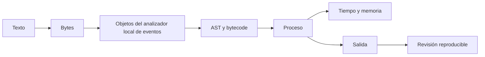

# SE-023 — Taller: observar un programa desde el código hasta la máquina

[← SE-022](https://github.com/vladimiracunadev-create/modern-software-engineering-program/blob/main/classes/part-01-computadores-y-representacion-de-informacion/se-022-rendimiento-consumo-energetico-y-limites-fisicos/README.md) · [↑ Parte 01](https://github.com/vladimiracunadev-create/modern-software-engineering-program/blob/main/classes/part-01-computadores-y-representacion-de-informacion/README.md) · [📚 Índice completo](https://github.com/vladimiracunadev-create/modern-software-engineering-program/blob/main/classes/README.md) · [SE-024 →](https://github.com/vladimiracunadev-create/modern-software-engineering-program/blob/main/classes/part-01-computadores-y-representacion-de-informacion/se-024-proyecto-informe-reproducible-de-comportamiento-y-recursos/README.md)

## Punto profesional y fundamento pedagógico

**Punto profesional.** La clase existe para integrar las capas del computador en una explicación causal que separe observación, inferencia e hipótesis.

**Por qué aparece aquí.** Se sitúa después de **Rendimiento, consumo energético y límites físicos** y antes de **Proyecto: informe reproducible de comportamiento y recursos**: convierte el conocimiento anterior en una decisión observable que la clase siguiente podrá reutilizar. La continuidad se comprueba en el artefacto, no por compartir vocabulario.

**Error conceptual que debe corregir.** Elegir una causa a partir de una sola métrica o presentar una captura como explicación.

**Secuencia de aprendizaje.** Antes de leer la solución, el estudiante predice el resultado del caso normal y del error conceptual anterior. Luego explica un caso resuelto paso a paso, construye un contraejemplo que cambie la decisión y, sin consultar el texto, reconstruye el mecanismo y lo aplica a una entrada nueva. La secuencia usa predicción, explicación propia, contraste y recuperación. [ICAP](https://icap.education.asu.edu/research) distingue participación de construcción de conocimiento; [How People Learn II](https://nap.nationalacademies.org/catalog/24783/how-people-learn-ii-learners-contexts-and-cultures) exige conectar conocimiento previo, contexto y transferencia; la [práctica de recuperación](https://pubmed.ncbi.nlm.nih.gov/16507066/) respalda producir de nuevo la explicación tras una demora; y [Education for Life and Work](https://nap.nationalacademies.org/resource/13398/dbasse_084153.pdf) exige devolución que explique la causa del error.

**Evidencia de aprendizaje.** End-to-end-trace.md con mapa fuente→runtime→SO→máquina y vacíos explícitos. Debe contener predicción previa, observación, explicación causal, contraejemplo, criterio de aceptación y una nota de qué dato haría cambiar la conclusión.

**Límite de la conclusión.** La traza explica solo el caso y el entorno instrumentados.

### Trazabilidad fuente → afirmación

| Fuente primaria u oficial | Afirmación que respalda | Lo que no prueba |
|---|---|---|
| [Python 3 documentation](https://docs.python.org/3/) |  sustenta todas las interfaces del taller | No demuestra por sí sola que el artefacto del estudiante sea correcto. |
| [Unicode Standard 17.0](https://www.unicode.org/versions/Unicode17.0.0/) |  sustenta la entrada textual | No demuestra por sí sola que el artefacto del estudiante sea correcto. |
| [RISC-V specifications](https://docs.riscv.org/reference/isa/) |  delimitan lo que una ISA sí describe | No demuestra por sí sola que el artefacto del estudiante sea correcto. |

## Antes de empezar

Las clases anteriores abrieron una capa por vez. El taller vuelve a cerrar el sistema:
seguirás una ejecución del analizador local de eventos desde caracteres y bytes hasta AST, bytecode, proceso,
tiempo y memoria. La disciplina central es separar evidencia directa de interpretación.
El dossier será la entrada de `SE-024`.

## Prerrequisitos

Artefactos de `SE-013`–`SE-022`, Python 3.11+, terminal y editor.

## Problema auténtico

Un informe reúne capturas de `dis`, tiempos y memoria, pero no conecta una pregunta con
ellas. Más herramientas no producen explicación: hace falta una ruta vertical,
controles y límites.

## Objetivos observables

Seguirás una unidad de información por seis capas; reproducirás una ejecución; enlazarás
cada afirmación a evidencia; formularás hipótesis rivales; y entregarás limpieza y revisión.

## Temas y por qué importan

| Etapa | Evidencia | Por qué importa |
| --- | --- | --- |
| Entrada | texto, puntos y bytes | fija significado inicial |
| Traducción | fuente, AST y bytecode | muestra transformaciones del runtime |
| Ejecución | proceso, CPU/pared y salida | conecta trabajo con entorno |
| Recursos | asignación y archivos | descubre costos y persistencia |
## Mapa conceptual

Las flechas representan relaciones verificadas en el taller. No implican correspondencia uno a uno con instrucciones físicas.

## Conceptos y decisiones

### 1. La unidad de seguimiento debe permanecer identificable

Se elige un evento sintético con `sequence`, texto y valor. Un hash permite comprobar
que las variantes procesan el mismo contenido. Sin identidad e invariantes, no es
posible saber si una “optimización” observó el mismo trabajo.

### 2. Cada instrumento tiene un alcance

`unicodedata` observa propiedades; `ast`, estructura; `dis`, bytecode; `platform`,
etiquetas; `time`, relojes; `tracemalloc`, asignación rastreada por Python. El dossier
incluye una columna “no demuestra” para evitar que la herramienta se convierta en autoridad universal.

### 3. Una ruta vertical conecta causa y consecuencia

La entrada codificada produce bytes; el parser crea objetos; la función se traduce; el
proceso ejecuta y solicita I/O; el resultado conserva invariantes. Se identifican saltos
que no pueden observarse, como instrucciones nativas exactas o energía.

### 4. Comparar exige cambiar una variable relevante

El taller compara materializar y streaming bajo la misma entrada. Cambiar código,
tamaño y orden a la vez elimina atribución. Se fija semilla, se alterna orden y se
conservan muestras. Una diferencia pequeña frente a variación se reporta como inconclusa.

### 5. Reproducibilidad incluye recuperación

El README declara preparación, comando, salidas, limpieza y versiones. Un script solo
es reproducible si sus efectos son conocidos y acotados. La revisión cruzada ejecuta en
un segundo entorno o, si no puede, inspecciona pasos y explica el límite.

## Caso conductor: protocolo integrado del analizador local de eventos

La entrada canónica es JSON UTF-8 con texto multilingüe y valores límite. El analizador local de eventos valida,
normaliza según contrato, calcula un resumen y escribe salida temporal. Se captura
representación, AST/bytecode de la función, identificador del proceso, tiempos y pico
Python. El dossier enlaza cada observación a archivo y comando.

## Definiciones de trabajo

- **ruta vertical:** seguimiento de una capacidad a través de capas;
- **invariante:** propiedad que debe conservarse entre variantes;
- **instrumento:** mecanismo que produce una observación con alcance;
- **procedencia:** origen, versión y transformación de evidencia;
- **reproducción:** repetición documentada del método.

## Glosario

**Probe** es observación acotada. **Fixture** es entrada estable. **Cold/warm** distingue
estados inicial y estabilizado según protocolo.

## Ejemplo mínimo

El hash de salida coincide y el pico baja. Esto respalda equivalencia del contenido y
diferencia en memoria Python; no demuestra menor energía ni igual comportamiento en producción.

## Ejemplo profesional

Un reporte de regresión incluye commit, runtime, carga, muestras y perfil. El equipo
puede repetir y decidir; una captura de “antes/después” no ofrece ese contrato.

## Práctica guiada

1. Crea `work/SE-023/` con `input.json`, `event_analyzer.py` y `README.md`.
2. Valida puntos de código, bytes y hash esperado.
3. Guarda AST y bytecode de la función principal.
4. Ejecuta variantes materializada y streaming con protocolo de `SE-022`.
5. Captura pared, CPU y pico Python; no mezcles instrumentos si alteran la medida.
6. Completa `evidence-map.md` con observado/inferido/desconocido.
7. Pide reproducción de tres hallazgos y corrige.
8. Ejecuta `cleanup.py --dry-run` y después elimina solo el directorio temporal creado.

## Ejercicios

1. Añade una entrada Unicode normalizada de dos formas y preserva semántica.
2. Localiza una afirmación que `dis` no puede sostener.
3. Cambia sistema operativo o versión y explica diferencias sin llamarlas fallo.

## Reto verificable

Una segunda persona reproduce entrada, hash y tendencia de memoria o entrega una
explicación basada en entorno. Debe clasificar diez afirmaciones sin contexto oral.

## Preguntas frecuentes

### ¿Necesito desensamblador nativo?
No. El alcance llega a bytecode y señales del proceso; cualquier herramienta adicional es opcional y documentada.

### ¿Si la tendencia cambia, fallé?
No. Una diferencia explicada puede revelar una variable o límite del método.

## Fallo controlado y diagnóstico

Elimina versión o tamaño de entrada del primer reporte. Pide reproducir, registra la
ambigüedad y corrige el contrato sin ocultar el intento fallido.

## Errores comunes y cómo corregirlos

| Síntoma | Causa | Corrección |
| --- | --- | --- |
| colección de capturas | falta pregunta y ruta | enlaza evidencia a transición |
| variante produce otro resultado | invariante no comprobado | verifica hash antes de comparar recursos |
| bytecode prueba CPU | frontera instrumental ignorada | declara VM y capa física desconocida |
| limpieza borra rutas amplias | alcance no validado | usa directorio explícito y dry-run |

## Entorno y archivos clave

Python 3.11+, biblioteca estándar. `event_analyzer.py`, `input.json`, `evidence-map.md`, `samples.csv`, `review.md`, `cleanup.py`.

## Seguridad, ética y accesibilidad

Solo datos ficticios; tamaño acotado; ninguna elevación. Salidas en texto y tablas. Revisa que la limpieza permanezca dentro de `work/SE-023/`.

## Transferencia

Aplica el protocolo a una CLI propia de otro lenguaje y sustituye instrumentos manteniendo preguntas.

## Evaluación y evidencia

Se exigen ruta completa, invariantes, evidencia trazable, revisión cruzada y recuperación segura.

## Fuentes

- [Python 3 documentation](https://docs.python.org/3/) sustenta todas las interfaces del taller.
- [Unicode Standard 17.0](https://www.unicode.org/versions/Unicode17.0.0/) sustenta la entrada textual.
- [RISC-V specifications](https://docs.riscv.org/reference/isa/) delimitan lo que una ISA sí describe.

## Límites y siguiente paso

No observa energía, contadores físicos ni producción. `SE-024` exige diseñar una investigación propia.

---
[← SE-022](https://github.com/vladimiracunadev-create/modern-software-engineering-program/blob/main/classes/part-01-computadores-y-representacion-de-informacion/se-022-rendimiento-consumo-energetico-y-limites-fisicos/README.md) · [↑ Parte 01](https://github.com/vladimiracunadev-create/modern-software-engineering-program/blob/main/classes/part-01-computadores-y-representacion-de-informacion/README.md) · [SE-024 →](https://github.com/vladimiracunadev-create/modern-software-engineering-program/blob/main/classes/part-01-computadores-y-representacion-de-informacion/se-024-proyecto-informe-reproducible-de-comportamiento-y-recursos/README.md)
