# Parte 2 — Sistemas operativos y entorno de trabajo

Un programa no se ejecuta “en el computador” de manera abstracta. Se ejecuta como un proceso, bajo una identidad, con permisos concretos, dentro de un sistema de archivos, atendiendo reglas del sistema operativo y dependiendo de una configuración reproducible. Esta parte convierte ese entorno —que suele permanecer invisible hasta que algo falla— en un objeto de razonamiento técnico.

El recorrido continúa el caso **Pulso** de la Parte 1 y lo transforma en **Faro**, un kit local de diagnóstico multiplataforma. Faro no repara el equipo a ciegas: observa, explica qué encontró, diferencia hechos de hipótesis y propone acciones reversibles. Esa decisión conecta todas las clases. Cada concepto nuevo se incorpora al mismo sistema hasta producir, en la clase final, un diagnóstico ejecutable y auditable en Windows, Linux y macOS.

## Pregunta rectora

> ¿Cómo construir y diagnosticar un entorno de ejecución que otra persona pueda comprender, reproducir y reparar sin depender de “en mi máquina funciona”?

## Lo que cambia al completar esta parte

Al finalizar podrás:

- distinguir responsabilidades del kernel, el espacio de usuario, los servicios y las aplicaciones;
- explicar cómo rutas, enlaces, metadatos y permisos determinan el acceso efectivo a un archivo;
- observar procesos, señales, servicios, flujos estándar y códigos de salida sin confundir síntomas con causas;
- escribir procedimientos equivalentes para PowerShell y Bash sin fingir que ambos shells son iguales;
- separar configuración, secretos y estado mutable;
- evaluar una instalación por su procedencia, alcance, reversibilidad y efecto sobre el sistema;
- construir evidencia diagnóstica útil, minimizada y segura;
- entregar un kit multiplataforma que falla de forma comprensible.

## Caso conductor: Faro

Faro comienza con un incidente deliberadamente pequeño: Pulso funciona en el equipo de quien lo creó, pero falla al entregarlo a otra persona. La causa no está necesariamente en su lógica. Puede ser una ruta asumida, una variable ausente, un permiso distinto, una versión incompatible o un proceso que conserva un recurso.

En cada clase se añade una capacidad al kit:

```mermaid
flowchart LR
    A[Identificar plataforma] --> B[Resolver rutas]
    B --> C[Comprobar identidad y permisos]
    C --> D[Observar procesos y servicios]
    D --> E[Ejecutar comandos con contratos]
    E --> F[Leer configuración sin exponer secretos]
    F --> G[Inventariar dependencias]
    G --> H[Recolectar evidencia]
    H --> I[Explicar y proponer recuperación]
```

El diagrama no representa una receta rígida. Representa un orden de reducción de incertidumbre: primero se describe el contexto; luego se verifica cada frontera; al final se interviene. Saltar directamente a “reinstalar todo” destruye evidencia y vuelve irreproducible el aprendizaje.

## Recorrido clase por clase

| Clase | Pregunta profesional | Aporte concreto a Faro |
|---|---|---|
| [SE-025](https://github.com/vladimiracunadev-create/software-engineering-learning-suite/blob/main/classes/part-02-sistemas-operativos-terminal-y-automatizacion-base/se-025-windows-linux-macos-y-sus-modelos-operativos/) | ¿Qué abstrae realmente un sistema operativo? | Inventario de plataforma, kernel, arquitectura y sesión |
| [SE-026](https://github.com/vladimiracunadev-create/software-engineering-learning-suite/blob/main/classes/part-02-sistemas-operativos-terminal-y-automatizacion-base/se-026-sistemas-de-archivos-rutas-enlaces-y-metadatos/) | ¿Por qué una ruta válida en un equipo falla en otro? | Resolución de rutas y metadatos sin supuestos ocultos |
| [SE-027](https://github.com/vladimiracunadev-create/software-engineering-learning-suite/blob/main/classes/part-02-sistemas-operativos-terminal-y-automatizacion-base/se-027-usuarios-grupos-permisos-y-elevacion-de-privilegios/) | ¿Quién intenta hacer qué sobre qué recurso? | Diagnóstico de identidad, autorización y elevación mínima |
| [SE-028](https://github.com/vladimiracunadev-create/software-engineering-learning-suite/blob/main/classes/part-02-sistemas-operativos-terminal-y-automatizacion-base/se-028-procesos-senales-servicios-y-tareas-programadas/) | ¿Cómo vive y termina un programa? | Observación del ciclo de vida de procesos y servicios |
| [SE-029](https://github.com/vladimiracunadev-create/software-engineering-learning-suite/blob/main/classes/part-02-sistemas-operativos-terminal-y-automatizacion-base/se-029-terminales-shells-y-composicion-de-comandos/) | ¿Cómo se compone automatización confiable? | Contratos de entrada, salida, error y estado |
| [SE-030](https://github.com/vladimiracunadev-create/software-engineering-learning-suite/blob/main/classes/part-02-sistemas-operativos-terminal-y-automatizacion-base/se-030-powershell-bash-y-portabilidad-de-scripts/) | ¿Qué debe compartirse y qué debe adaptarse por shell? | Adaptadores PowerShell y Bash con semántica equivalente |
| [SE-031](https://github.com/vladimiracunadev-create/software-engineering-learning-suite/blob/main/classes/part-02-sistemas-operativos-terminal-y-automatizacion-base/se-031-variables-de-entorno-configuracion-y-secretos/) | ¿Cómo se configura sin filtrar credenciales? | Precedencia explícita, validación y redacción de secretos |
| [SE-032](https://github.com/vladimiracunadev-create/software-engineering-learning-suite/blob/main/classes/part-02-sistemas-operativos-terminal-y-automatizacion-base/se-032-instalacion-de-software-y-gestores-de-paquetes-del-sistema/) | ¿Qué significa instalar de forma responsable? | Inventario de procedencia, versión, alcance y desinstalación |
| [SE-033](https://github.com/vladimiracunadev-create/software-engineering-learning-suite/blob/main/classes/part-02-sistemas-operativos-terminal-y-automatizacion-base/se-033-logs-del-sistema-y-diagnostico-de-fallos/) | ¿Qué evidencia permite explicar un fallo? | Paquete diagnóstico correlacionado y minimizado |
| [SE-034](https://github.com/vladimiracunadev-create/software-engineering-learning-suite/blob/main/classes/part-02-sistemas-operativos-terminal-y-automatizacion-base/se-034-virtualizacion-wsl-y-aislamiento-local/) | ¿Qué aísla cada frontera y qué sigue compartido? | Detección de virtualización y límites de aislamiento |
| [SE-035](https://github.com/vladimiracunadev-create/software-engineering-learning-suite/blob/main/classes/part-02-sistemas-operativos-terminal-y-automatizacion-base/se-035-taller-preparar-y-reparar-un-entorno-reproducible/) | ¿Cómo se repara sin borrar la causa? | Procedimiento seguro de diagnóstico y recuperación |
| [SE-036](https://github.com/vladimiracunadev-create/software-engineering-learning-suite/blob/main/classes/part-02-sistemas-operativos-terminal-y-automatizacion-base/se-036-proyecto-kit-de-diagnostico-multiplataforma/) | ¿Cómo se entrega una herramienta operable por terceros? | Kit final, pruebas cruzadas, informe y límites conocidos |

## Hilo pedagógico

Las clases 25 a 28 construyen el modelo mental del sistema: plataforma, archivos, autoridad y procesos. Las clases 29 a 32 convierten ese modelo en automatización reproducible: contratos de shell, portabilidad, configuración e instalación. Las clases 33 y 34 enseñan a observar y delimitar el sistema. Las clases 35 y 36 integran todo en intervención controlada y entrega profesional.

Cada clase exige una explicación causal antes del comando. El comando es evidencia de una hipótesis, no un conjuro. La práctica conserva una bitácora con contexto, observación, interpretación, decisión y resultado. Si una acción requiere privilegios, modifica estado o puede revelar datos, debe declararlo antes de ejecutarse.

## Evidencias de aprendizaje

La parte no se aprueba por completar lecturas. Se evalúan cuatro evidencias conectadas:

1. **Mapa del entorno:** fronteras entre hardware, kernel, servicios, shell, proceso y recursos.
2. **Bitácora diagnóstica:** hipótesis contrastables, comandos utilizados, salidas pertinentes y descarte de alternativas.
3. **Adaptadores de plataforma:** implementaciones PowerShell y Bash que respetan un contrato compartido.
4. **Kit Faro:** ejecución segura, informe legible, pruebas reproducibles y declaración honesta de límites.

## Criterio de calidad

Una entrega competente no es la que “funciona en tres sistemas” una vez. Es la que especifica qué soporta, detecta dónde está, valida sus precondiciones, protege información sensible, conserva códigos de salida significativos y permite que otra persona reproduzca tanto el éxito como el fallo.

## Fuentes base

Las clases enlazan la fuente específica junto a cada mecanismo. El bloque se apoya principalmente en documentación normativa u oficial:

- [The Open Group Base Specifications, Issue 8](https://pubs.opengroup.org/onlinepubs/9799919799/)
- [Microsoft Learn: Windows documentation](https://learn.microsoft.com/windows/)
- [Microsoft Learn: PowerShell documentation](https://learn.microsoft.com/powershell/)
- [GNU Bash Reference Manual](https://www.gnu.org/software/bash/manual/)
- [Apple Platform Deployment: File system basics](https://support.apple.com/guide/deployment/intro-to-file-system-apd0b895e8e1/web)
- [systemd manual pages](https://www.freedesktop.org/software/systemd/man/latest/)
- [Windows Subsystem for Linux documentation](https://learn.microsoft.com/windows/wsl/)

Estas fuentes describen contratos y comportamientos; no eliminan las diferencias entre versiones, distribuciones, políticas corporativas o equipos administrados. Faro debe registrar esas diferencias, no ocultarlas.
