# Parte 2 — Sistemas operativos y entorno de trabajo

Un programa no se ejecuta “en el computador” de manera abstracta. Se ejecuta como un proceso, bajo una identidad, con permisos concretos, dentro de un sistema de archivos, atendiendo reglas del sistema operativo y dependiendo de una configuración reproducible. Esta parte convierte ese entorno —que suele permanecer invisible hasta que algo falla— en un objeto de razonamiento técnico.

El recorrido continúa el caso **Pulso** de la Parte 1 y lo transforma en **Faro**, un kit local de diagnóstico multiplataforma. Faro no repara el equipo a ciegas: observa, explica qué encontró, diferencia hechos de hipótesis y propone acciones reversibles. Esa decisión conecta todas las clases. Cada concepto nuevo se incorpora al mismo sistema hasta producir, en la clase final, un diagnóstico ejecutable y auditable en Windows, Linux y macOS.

## Pregunta rectora

> ¿Cómo construir y diagnosticar un entorno de ejecución que otra persona pueda comprender, reproducir y reparar sin depender de “en mi máquina funciona”?

## Lo que cambia al completar esta parte

Al finalizar podrás:

- distinguir responsabilidades del kernel, el espacio de usuario, los servicios y las aplicaciones;
- explicar cómo rutas, enlaces, metadatos y permisos determinan el acceso efectivo a un archivo;
- observar procesos, señales, servicios, flujos estándar y códigos de salida sin confundir síntomas con causas;
- escribir procedimientos equivalentes para PowerShell y Bash sin fingir que ambos shells son iguales;
- separar configuración, secretos y estado mutable;
- evaluar una instalación por su procedencia, alcance, reversibilidad y efecto sobre el sistema;
- construir evidencia diagnóstica útil, minimizada y segura;
- entregar un kit multiplataforma que falla de forma comprensible.

## Caso conductor: Faro

Faro comienza con un incidente deliberadamente pequeño: Pulso funciona en el equipo de quien lo creó, pero falla al entregarlo a otra persona. La causa no está necesariamente en su lógica. Puede ser una ruta asumida, una variable ausente, un permiso distinto, una versión incompatible o un proceso que conserva un recurso.

En cada clase se añade una capacidad al kit:

```mermaid
flowchart LR
    A[Identificar plataforma] --> B[Resolver rutas]
    B --> C[Comprobar identidad y permisos]
    C --> D[Observar procesos y servicios]
    D --> E[Ejecutar comandos con contratos]
    E --> F[Leer configuración sin exponer secretos]
    F --> G[Inventariar dependencias]
    G --> H[Recolectar evidencia]
    H --> I[Explicar y proponer recuperación]
```

El diagrama no representa una receta rígida. Representa un orden de reducción de incertidumbre: primero se describe el contexto; luego se verifica cada frontera; al final se interviene. Saltar directamente a “reinstalar todo” destruye evidencia y vuelve irreproducible el aprendizaje.

## Guía razonada clase por clase

La tabla final permite localizar cada material, pero primero hace falta comprender la
transformación que produce. En cada paso se explican el fallo que Faro debe distinguir,
el mecanismo del sistema operativo que lo causa, la evidencia que se conserva y la
pregunta que queda abierta para la clase siguiente.

### Bloque 1 — Hacer visible el sistema que ejecuta el programa

#### SE-025 — Windows, Linux, macOS y sus modelos operativos

Faro comienza rechazando la idea de que «el sistema operativo» sea solo un nombre y
una versión. Kernel, espacio de usuario, distribución, arquitectura, sesión y políticas
de administración pueden variar de forma independiente. La clase enseña qué abstrae el
sistema, qué expone a una aplicación y por qué dos equipos aparentemente iguales no
constituyen el mismo entorno de ejecución.

El estudiante produce un inventario mínimo y redactado que separa hechos observables de
inferencias. No identifica compatibilidad por marca: registra plataforma, arquitectura,
runtime, shell y restricciones relevantes. Ese contexto impide diagnosticar una ruta o
un permiso fuera de su sistema real y se convierte en la entrada de `SE-026`.

#### SE-026 — Sistemas de archivos, rutas, enlaces y metadatos

Con la plataforma identificada, Faro debe encontrar recursos sin asumir separadores,
mayúsculas, directorio actual ni estructura personal. La clase distingue nombre, ruta,
objeto, enlace y metadato; explica resolución componente por componente y muestra cómo
normalizar una cadena puede cambiar su apariencia sin demostrar que el destino existe o
es seguro.

La práctica compara rutas absolutas, relativas, simbólicas y resueltas, e inspecciona
tipo, tamaño y tiempos sin seguir enlaces de manera inadvertida. El artefacto resultante
es un resolvedor que declara base, política y error. Cuando la ruta existe pero el
acceso falla, `SE-027` introduce identidad y autorización.

#### SE-027 — Usuarios, grupos, permisos y elevación de privilegios

«Acceso denegado» no explica quién pidió la operación, bajo qué identidad efectiva ni
qué componente de la ruta la impidió. La clase relaciona sujeto, recurso, operación y
política; diferencia autenticación de autorización y permisos del archivo de los de sus
directorios, ACL y controles adicionales del sistema.

Faro registra identidad y comprobaciones relevantes sin intentar elevarse de forma
automática. El estudiante reproduce un caso permitido y otro denegado, localiza la
primera frontera y propone la corrección de menor privilegio, con reversión. La pregunta
siguiente ya no es quién puede iniciar el programa, sino cómo vive y termina en
`SE-028`.

#### SE-028 — Procesos, señales, servicios y tareas programadas

Un ejecutable en disco no es un proceso, y un proceso no equivale al servicio que lo
supervisa. La clase sigue creación, identidad, recursos, estados, relación padre-hijo,
salida y terminación; contrasta señales cooperativas, terminación forzada y gestores de
servicio sin fingir una semántica idéntica entre plataformas.

El estudiante construye una línea temporal de Faro, distingue PID de identidad estable
y comprueba qué ocurre al interrumpirlo o dejar un recurso abierto. Conserva código de
salida y limpieza como evidencia. Esa vida observable necesita una interfaz de control
reproducible, que `SE-029` modela mediante terminal y shell.

### Bloque 2 — Convertir conocimiento del entorno en automatización

#### SE-029 — Terminales, shells y composición de comandos

La terminal presenta texto; el shell interpreta lenguaje, expande argumentos, conecta
procesos y decide códigos de salida. Confundirlos convierte comillas, tuberías y
redirecciones en ensayo y error. La clase explica `stdin`, `stdout`, `stderr`, estado de
salida y composición, y muestra por qué una tubería transporta bytes o registros pero no
preserva por sí sola el significado del dato.

Faro define un contrato por comando: entradas, salida de datos, diagnóstico, efectos y
fallos. El laboratorio prueba un caso sano y uno donde una etapa intermedia falla, sin
ocultar el error tras la última orden. Ese contrato común permite que `SE-030` compare
PowerShell y Bash por semántica y no por traducción literal de sintaxis.

#### SE-030 — PowerShell, Bash y portabilidad de scripts

PowerShell compone objetos dentro de su proceso; Bash compone programas principalmente
mediante flujos de texto y convenciones POSIX. La clase identifica lo que puede
compartirse —contrato, algoritmo, códigos y fixtures— y lo que debe adaptarse: quoting,
expansión, tipos, descubrimiento de comandos y tratamiento de errores.

El estudiante implementa dos adaptadores pequeños que producen el mismo esquema de
resultado y fallan de forma equivalente. Las pruebas comparan comportamiento, no líneas
idénticas. La configuración deja de estar incrustada en el script y pasa a una frontera
explícita que `SE-031` ordena sin exponer secretos.

#### SE-031 — Variables de entorno, configuración y secretos

Una variable de entorno es estado heredado por procesos, no un almacén secreto. La
clase diseña una precedencia entre valores predeterminados, archivos, entorno y
argumentos; exige validar tipo, rango y combinación, y separa ausencia, vacío y valor
inválido. También explica por qué imprimir el entorno completo durante un fallo puede
convertir diagnóstico en filtración.

Faro incorpora un cargador que indica la fuente efectiva de cada opción sin revelar el
valor sensible. Los casos prueban precedencia, error temprano y redacción. Con el
contrato de configuración visible, `SE-032` puede estudiar de dónde provienen el
runtime y las herramientas que esa configuración intenta ejecutar.

#### SE-032 — Instalación de software y gestores de paquetes del sistema

Instalar no significa únicamente copiar un binario: puede añadir repositorios, claves,
servicios, rutas, asociaciones y actualizaciones automáticas. La clase compara alcance
de sistema y usuario, origen, firma o checksum, resolución de dependencias, actualización
y desinstalación. Un comando popular no sustituye una decisión sobre confianza y
reversibilidad.

El estudiante crea un manifiesto de herramientas de Faro con fuente, versión, motivo,
alcance y procedimiento de retirada. La práctica inspecciona antes de modificar y evita
instaladores remotos ejecutados a ciegas. Ese inventario da contexto a los registros que
`SE-033` usará para reconstruir un fallo.

### Bloque 3 — Observar sin destruir la evidencia

#### SE-033 — Logs del sistema y diagnóstico de fallos

Un log es una observación producida desde un punto concreto, con reloj, nivel, formato y
política de retención; no es la causa misma. La clase correlaciona eventos por tiempo e
identificador, separa síntoma de hipótesis y advierte que ausencia de registro puede
significar que el componente no arrancó, no tuvo permiso o escribió en otro destino.

Faro reúne un paquete mínimo con contexto, pasos, eventos pertinentes y redacción de
datos sensibles. El estudiante alinea una ejecución sana y una fallida hasta localizar
la primera divergencia. Si el proceso ocurre dentro de una frontera virtual, esa
evidencia cambia de alcance; `SE-034` hace explícito qué está aislado y qué sigue
compartido.

#### SE-034 — Virtualización, WSL y aislamiento local

Máquina virtual, contenedor y WSL no son sinónimos de «otro computador». Cada mecanismo
reutiliza o reemplaza capas diferentes: kernel, hardware virtual, red, reloj, montaje,
identidad y recursos. La clase razona sobre esas fronteras y evita atribuir seguridad o
reproducibilidad total a una etiqueta de aislamiento.

El estudiante compara una ejecución nativa y otra aislada, registra kernel observado,
montajes, red y límites, y demuestra al menos un recurso compartido. Faro usa esa
información para explicar diferencias sin ocultarlas. `SE-035` integra todo el modelo en
una reparación que preserve causa, evidencia y posibilidad de volver atrás.

### Bloque 4 — Reparar y entregar una capacidad operable

#### SE-035 — Taller: preparar y reparar un entorno reproducible

El taller presenta un entorno deliberadamente degradado: versión incorrecta, ruta
dependiente del usuario, configuración ausente o permiso excesivo. La meta no es llegar
rápido a verde, sino conservar el síntoma, formular hipótesis rivales y aplicar la
intervención mínima que permita distinguirlas.

El estudiante captura estado inicial, reproduce, reduce, corrige y vuelve a ejecutar;
después revierte o limpia todos los cambios. Una segunda persona sigue el procedimiento
sin instrucciones orales. La bitácora y los adaptadores validados se convierten en los
componentes que `SE-036` debe empaquetar como producto coherente.

#### SE-036 — Proyecto: kit de diagnóstico multiplataforma

La clase final convierte piezas aisladas en **Faro**: una herramienta que detecta su
entorno, valida precondiciones, observa sin privilegios innecesarios y produce un informe
comprensible. El proyecto debe distinguir no soportado, configuración inválida, fallo
de dependencia y error interno; devolver un único “falló” destruiría la capacidad de
diagnóstico construida durante la parte.

La aceptación se ejecuta en Windows, Linux y macOS dentro del alcance disponible y
declara combinaciones no verificadas. Se revisan redacción, códigos de salida,
repetibilidad, limpieza y límites. El informe de recursos y comportamiento enlaza con
la petición observable que la Parte 3 seguirá fuera del equipo local.

## Resumen operativo del recorrido

| Clase | Pregunta profesional | Aporte concreto a Faro |
|---|---|---|
| [SE-025](https://github.com/vladimiracunadev-create/software-engineering-learning-suite/blob/main/classes/part-02-sistemas-operativos-terminal-y-automatizacion-base/se-025-windows-linux-macos-y-sus-modelos-operativos/) | ¿Qué abstrae realmente un sistema operativo? | Inventario de plataforma, kernel, arquitectura y sesión |
| [SE-026](https://github.com/vladimiracunadev-create/software-engineering-learning-suite/blob/main/classes/part-02-sistemas-operativos-terminal-y-automatizacion-base/se-026-sistemas-de-archivos-rutas-enlaces-y-metadatos/) | ¿Por qué una ruta válida en un equipo falla en otro? | Resolución de rutas y metadatos sin supuestos ocultos |
| [SE-027](https://github.com/vladimiracunadev-create/software-engineering-learning-suite/blob/main/classes/part-02-sistemas-operativos-terminal-y-automatizacion-base/se-027-usuarios-grupos-permisos-y-elevacion-de-privilegios/) | ¿Quién intenta hacer qué sobre qué recurso? | Diagnóstico de identidad, autorización y elevación mínima |
| [SE-028](https://github.com/vladimiracunadev-create/software-engineering-learning-suite/blob/main/classes/part-02-sistemas-operativos-terminal-y-automatizacion-base/se-028-procesos-senales-servicios-y-tareas-programadas/) | ¿Cómo vive y termina un programa? | Observación del ciclo de vida de procesos y servicios |
| [SE-029](https://github.com/vladimiracunadev-create/software-engineering-learning-suite/blob/main/classes/part-02-sistemas-operativos-terminal-y-automatizacion-base/se-029-terminales-shells-y-composicion-de-comandos/) | ¿Cómo se compone automatización confiable? | Contratos de entrada, salida, error y estado |
| [SE-030](https://github.com/vladimiracunadev-create/software-engineering-learning-suite/blob/main/classes/part-02-sistemas-operativos-terminal-y-automatizacion-base/se-030-powershell-bash-y-portabilidad-de-scripts/) | ¿Qué debe compartirse y qué debe adaptarse por shell? | Adaptadores PowerShell y Bash con semántica equivalente |
| [SE-031](https://github.com/vladimiracunadev-create/software-engineering-learning-suite/blob/main/classes/part-02-sistemas-operativos-terminal-y-automatizacion-base/se-031-variables-de-entorno-configuracion-y-secretos/) | ¿Cómo se configura sin filtrar credenciales? | Precedencia explícita, validación y redacción de secretos |
| [SE-032](https://github.com/vladimiracunadev-create/software-engineering-learning-suite/blob/main/classes/part-02-sistemas-operativos-terminal-y-automatizacion-base/se-032-instalacion-de-software-y-gestores-de-paquetes-del-sistema/) | ¿Qué significa instalar de forma responsable? | Inventario de procedencia, versión, alcance y desinstalación |
| [SE-033](https://github.com/vladimiracunadev-create/software-engineering-learning-suite/blob/main/classes/part-02-sistemas-operativos-terminal-y-automatizacion-base/se-033-logs-del-sistema-y-diagnostico-de-fallos/) | ¿Qué evidencia permite explicar un fallo? | Paquete diagnóstico correlacionado y minimizado |
| [SE-034](https://github.com/vladimiracunadev-create/software-engineering-learning-suite/blob/main/classes/part-02-sistemas-operativos-terminal-y-automatizacion-base/se-034-virtualizacion-wsl-y-aislamiento-local/) | ¿Qué aísla cada frontera y qué sigue compartido? | Detección de virtualización y límites de aislamiento |
| [SE-035](https://github.com/vladimiracunadev-create/software-engineering-learning-suite/blob/main/classes/part-02-sistemas-operativos-terminal-y-automatizacion-base/se-035-taller-preparar-y-reparar-un-entorno-reproducible/) | ¿Cómo se repara sin borrar la causa? | Procedimiento seguro de diagnóstico y recuperación |
| [SE-036](https://github.com/vladimiracunadev-create/software-engineering-learning-suite/blob/main/classes/part-02-sistemas-operativos-terminal-y-automatizacion-base/se-036-proyecto-kit-de-diagnostico-multiplataforma/) | ¿Cómo se entrega una herramienta operable por terceros? | Kit final, pruebas cruzadas, informe y límites conocidos |

## Hilo pedagógico

Las clases 25 a 28 construyen el modelo mental del sistema: plataforma, archivos, autoridad y procesos. Las clases 29 a 32 convierten ese modelo en automatización reproducible: contratos de shell, portabilidad, configuración e instalación. Las clases 33 y 34 enseñan a observar y delimitar el sistema. Las clases 35 y 36 integran todo en intervención controlada y entrega profesional.

Cada clase exige una explicación causal antes del comando. El comando es evidencia de una hipótesis, no un conjuro. La práctica conserva una bitácora con contexto, observación, interpretación, decisión y resultado. Si una acción requiere privilegios, modifica estado o puede revelar datos, debe declararlo antes de ejecutarse.

## Evidencias de aprendizaje

La parte no se aprueba por completar lecturas. Se evalúan cuatro evidencias conectadas:

1. **Mapa del entorno:** fronteras entre hardware, kernel, servicios, shell, proceso y recursos.
2. **Bitácora diagnóstica:** hipótesis contrastables, comandos utilizados, salidas pertinentes y descarte de alternativas.
3. **Adaptadores de plataforma:** implementaciones PowerShell y Bash que respetan un contrato compartido.
4. **Kit Faro:** ejecución segura, informe legible, pruebas reproducibles y declaración honesta de límites.

## Criterio de calidad

Una entrega competente no es la que “funciona en tres sistemas” una vez. Es la que especifica qué soporta, detecta dónde está, valida sus precondiciones, protege información sensible, conserva códigos de salida significativos y permite que otra persona reproduzca tanto el éxito como el fallo.

## Fuentes base

Las clases enlazan la fuente específica junto a cada mecanismo. El bloque se apoya principalmente en documentación normativa u oficial:

- [The Open Group Base Specifications, Issue 8](https://pubs.opengroup.org/onlinepubs/9799919799/)
- [Microsoft Learn: Windows documentation](https://learn.microsoft.com/windows/)
- [Microsoft Learn: PowerShell documentation](https://learn.microsoft.com/powershell/)
- [GNU Bash Reference Manual](https://www.gnu.org/software/bash/manual/)
- [Apple Platform Deployment: File system basics](https://support.apple.com/guide/deployment/intro-to-file-system-apd0b895e8e1/web)
- [systemd manual pages](https://www.freedesktop.org/software/systemd/man/latest/)
- [Windows Subsystem for Linux documentation](https://learn.microsoft.com/windows/wsl/)

Estas fuentes describen contratos y comportamientos; no eliminan las diferencias entre versiones, distribuciones, políticas corporativas o equipos administrados. Faro debe registrar esas diferencias, no ocultarlas.
