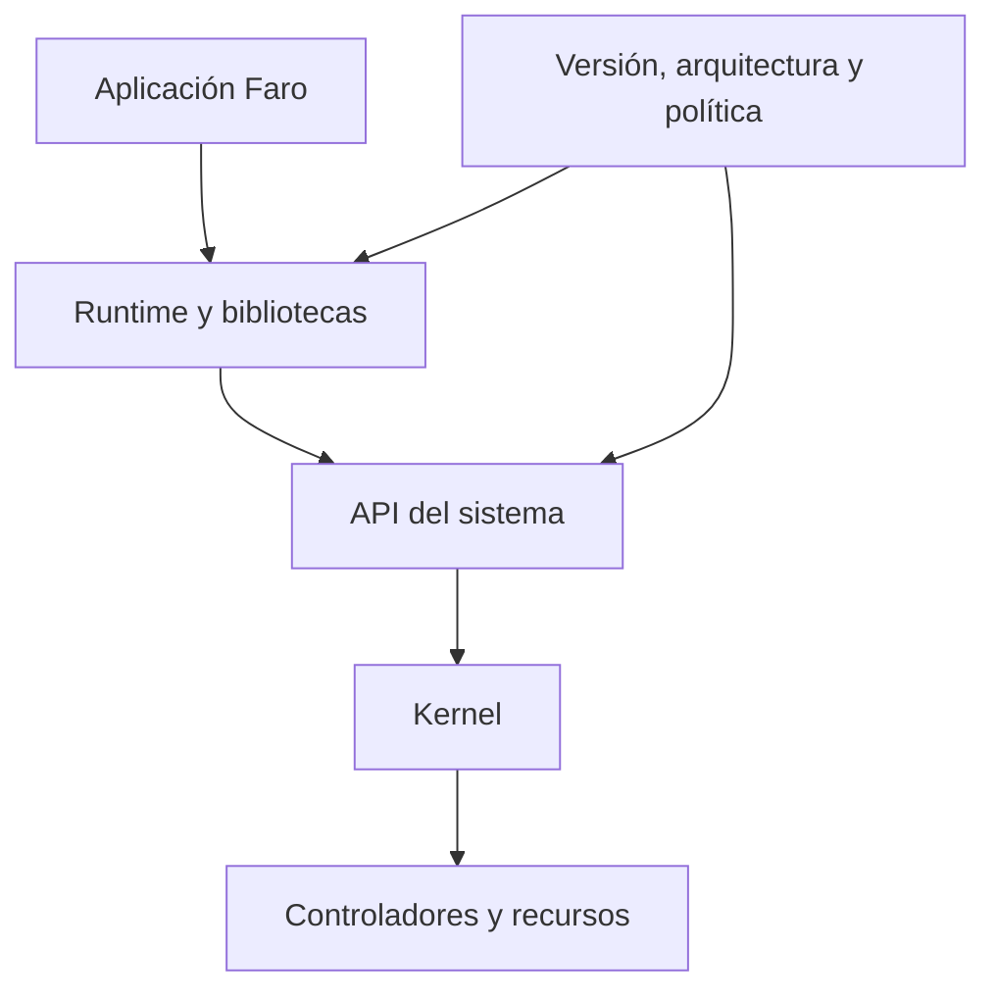
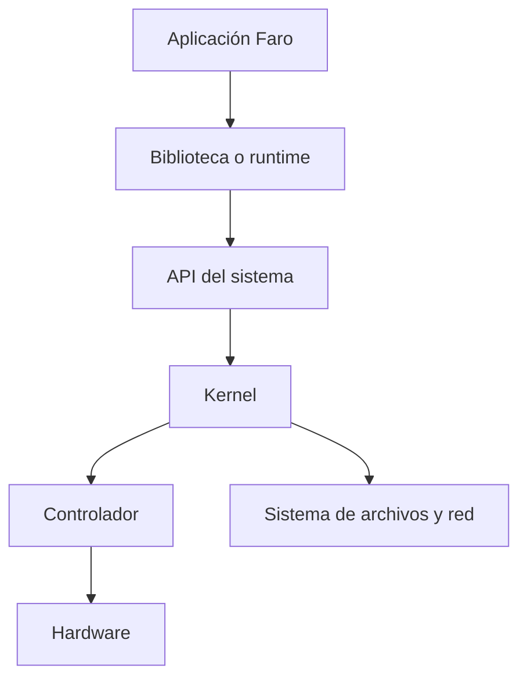

# SE-025 — Windows, Linux, macOS y sus modelos operativos

[← SE-024](https://github.com/vladimiracunadev-create/software-engineering-learning-suite/blob/main/classes/part-01-computadores-y-representacion-de-informacion/se-024-proyecto-informe-reproducible-de-comportamiento-y-recursos/README.md) · [↑ Parte 02](https://github.com/vladimiracunadev-create/software-engineering-learning-suite/blob/main/classes/part-02-sistemas-operativos-terminal-y-automatizacion-base/README.md) · [📚 Índice completo](https://github.com/vladimiracunadev-create/software-engineering-learning-suite/blob/main/classes/README.md) · [SE-026 →](https://github.com/vladimiracunadev-create/software-engineering-learning-suite/blob/main/classes/part-02-sistemas-operativos-terminal-y-automatizacion-base/se-026-sistemas-de-archivos-rutas-enlaces-y-metadatos/README.md)

> Estado: **GUIDED**. Clase comparativa y diagnóstica; no sustituye documentación específica de versión ni administración autorizada.

## Antes de empezar

Pulso ya demostró que un programa atraviesa procesador, memoria y dispositivos. Ahora aparece una dificultad profesional: el mismo código no encuentra la configuración en otro equipo. Decir “es un problema de Windows” o “en Linux sí funciona” no explica nada. Necesitamos identificar qué capa tomó la decisión y qué contrato cambió.

En esta clase comienza **Faro**, el kit de diagnóstico que acompañará toda la parte. Su primera versión solo observa: plataforma, arquitectura, versión del sistema, identidad de la sesión y directorios relevantes. No intenta uniformar sistemas distintos; produce una descripción comparable.

### Resultado de aprendizaje

Al terminar podrás ubicar un fallo en una capa —aplicación, biblioteca, espacio de usuario, llamada al sistema, kernel o controlador— y justificar qué evidencia permite distinguirla.

## Prerrequisitos

`SE-024`, capacidad para separar observación e inferencia, y acceso no privilegiado a una terminal. Recupera el mapa de arquitectura de Pulso: lenguaje, runtime, sistema operativo, ISA y hardware.

## Problema auténtico

Pulso funciona en el equipo de desarrollo y falla al entregarse. El equipo atribuye el fallo al nombre del sistema operativo, pero todavía no sabe si cambió una API, la arquitectura del binario, una política o una herramienta disponible. La etiqueta de plataforma está ocultando la frontera causal.

## Objetivos observables

Podrás distinguir kernel y espacio de usuario; comparar Windows, Linux y macOS sin falsas equivalencias; separar API, ABI e ISA; producir una ficha de capacidades; y formular una prueba que discrimine fallos en dos capas distintas.

## Temas y por qué importan

| Tema | Mecanismo | Decisión habilitada |
| --- | --- | --- |
| Abstracción del sistema | convierte recursos físicos en procesos, archivos y sockets | ubicar la operación que realmente falló |
| Protección | separa kernel y procesos de usuario | evitar elevar sin necesidad |
| API, ABI e ISA | definen contratos en capas distintas | elegir artefacto y diagnóstico correctos |
| Capacidad observable | comprueba una función disponible | degradar explícitamente sin adivinar por versión |

## Mapa conceptual



Las flechas no representan propiedad, sino solicitudes y restricciones. Versión, arquitectura y política pueden alterar más de una frontera; por eso Faro registra contexto antes de culpar una capa.

## Conceptos y decisiones

### El sistema operativo administra recursos y ofrece abstracciones

El hardware expone procesadores, memoria y dispositivos con detalles muy específicos. El sistema operativo arbitra su uso y ofrece abstracciones estables: procesos en vez de secuencias crudas de instrucciones; archivos en vez de bloques físicos; sockets en vez de manipular directamente una interfaz de red.

La abstracción no elimina el hardware. Lo representa con un contrato. Cuando una aplicación abre un archivo, una biblioteca prepara la operación, una llamada al sistema cruza la frontera de protección y el kernel consulta permisos y delega en el sistema de archivos o el controlador correspondiente.



Leer el diagrama de arriba hacia abajo permite formular una pregunta diagnóstica por frontera: ¿la aplicación construyó bien la petición?, ¿la API existe en esta plataforma?, ¿el kernel la autorizó?, ¿el controlador pudo atenderla?

### Kernel y espacio de usuario son dominios de confianza distintos

El kernel ejecuta con privilegios para administrar memoria, planificación, interrupciones y dispositivos. Las aplicaciones normales viven en espacio de usuario con autoridad limitada. El cruce se realiza mediante interfaces controladas; no es una llamada de función ordinaria aunque una biblioteca la haga parecer así.

Esta separación contiene fallos: un proceso no debería escribir memoria de otro libremente. También explica por qué algunas operaciones fallan con acceso denegado y por qué elevar privilegios cambia el riesgo. Un kernel modular, híbrido o monolítico distribuye componentes de manera diferente, pero ninguna etiqueta reemplaza el análisis de la operación concreta.

### Windows, Linux y macOS comparten categorías, no implementaciones

Los tres administran procesos, memoria virtual, archivos, usuarios y dispositivos. Sin embargo, exponen familias de API, convenciones de rutas, modelos de servicio y herramientas diferentes.

- Windows se organiza alrededor del kernel NT y subsistemas de usuario; Win32 y PowerShell son interfaces frecuentes, no “el kernel”.
- Linux es un kernel usado con distintas distribuciones, bibliotecas, gestores y sistemas de inicio. “Linux” no identifica por sí solo una experiencia de usuario completa.
- macOS combina el kernel XNU con marcos y servicios de Apple; su base Unix no vuelve idénticas sus políticas, rutas o herramientas a las de una distribución Linux.

La portabilidad se construye definiendo una intención común y adaptadores por plataforma. Copiar el mismo comando en tres entornos solo desplaza el fallo.

### API, ABI e ISA responden preguntas distintas

Una API define cómo el código fuente solicita una capacidad. Una ABI fija detalles binarios —convención de llamadas, disposición de datos, formato de ejecutable— necesarios para que componentes compilados cooperen. La ISA es el contrato de instrucciones con el procesador.

Un script puede usar una API portable y aun depender de una herramienta ausente. Un binario puede apuntar al sistema correcto pero a otra arquitectura. Faro registra sistema operativo y arquitectura porque “Windows 11” no informa si un artefacto es x86-64 o Arm64.

### Versión, edición y política también forman parte de la plataforma

Dos equipos con el mismo nombre de sistema pueden diferir en versión, parches, edición, shell disponible, políticas corporativas y capacidades habilitadas. El diagnóstico debe capturar solo los datos necesarios y evitar identificadores personales innecesarios.

La documentación de [Windows](https://learn.microsoft.com/windows/), las páginas de manual de [Linux](https://man7.org/linux/man-pages/) y la documentación de [Apple Developer](https://developer.apple.com/documentation/) permiten verificar interfaces concretas. Una etiqueta genérica nunca sustituye la fuente de la versión realmente observada.

### Detectar capacidades es más robusto que adivinar por nombres

Comprobar “¿existe esta orden?” o “¿esta API está disponible?” suele ser más fiable que una lista de versiones. La detección de capacidades reduce ramas frágiles y permite mensajes accionables. Aun así, una capacidad presente puede estar bloqueada por permisos o políticas; detectar no equivale a autorizar.

## Definiciones de trabajo

- **sistema operativo:** software que administra recursos y ofrece abstracciones protegidas a programas;
- **plataforma efectiva:** combinación de sistema, versión, arquitectura, políticas y capacidades observadas;
- **API:** interfaz de programación visible en fuente o runtime;
- **ABI:** contrato binario entre ejecutable, bibliotecas y plataforma;
- **capacidad:** operación cuya disponibilidad puede comprobarse sin asumirla por nombre.

## Caso conductor: Faro identifica dónde está

La primera ficha de Faro contiene:

```text
plataforma: windows | linux | macos | desconocida
version: valor informado por el sistema
arquitectura_proceso: x86_64 | arm64 | otra
arquitectura_sistema: valor si está disponible
shell: nombre y versión
directorio_trabajo: ruta resuelta
observaciones: capacidades ausentes o acceso limitado
```

La distinción entre arquitectura del proceso y del sistema importa: una capa de compatibilidad puede ejecutar un proceso x86-64 sobre hardware Arm. Faro no infiere una desde la otra. Si un dato no puede obtenerse sin elevar permisos, registra `no disponible` y explica la razón.

Un ejemplo causal: Faro encuentra el archivo de Pulso en macOS, pero el ejecutable descargado no inicia. La clasificación correcta todavía no es “macOS bloquea el programa”. Primero se separan hipótesis: arquitectura incompatible, bit de ejecución ausente, política de procedencia o dependencia dinámica faltante. Cada una requiere evidencia distinta.

## Práctica guiada

1. Obtén plataforma, versión, arquitectura y shell mediante herramientas documentadas de tu sistema.
2. Registra cada comando, su código de salida y qué afirmación sustenta.
3. Dibuja el recorrido de una operación de lectura desde Faro hasta el dispositivo.
4. Formula tres fallos posibles en fronteras distintas y una observación que los discrimine.
5. Repite la ficha en otro sistema o contrástala con la de un compañero; evita convertir diferencias en errores.

La entrega es una tabla `dato → fuente → interpretación → límite`. Una captura de pantalla sin interpretación no basta.

## Ejemplo mínimo

Dos equipos informan “Windows”, pero uno ejecuta un proceso Arm64 y otro x86-64. El nombre del producto coincide; el contrato binario no. La observación mínima útil combina plataforma, arquitectura del proceso y formato del artefacto.

## Ejemplo profesional

Un instalador falla solo en equipos corporativos. La misma versión funciona en un equipo personal. Faro detecta que la API existe y el binario coincide, pero la ejecución está bloqueada por una política. La corrección se dirige al canal autorizado de distribución; recompilar al azar no aborda el mecanismo.

## Ejercicios

1. Clasifica cinco afirmaciones como API, ABI, ISA, política o implementación.
2. Diseña una detección de capacidad para una herramienta opcional sin basarte únicamente en la versión del SO.
3. Explica qué cambia y qué permanece cuando un proceso x86-64 corre mediante compatibilidad sobre Arm64.

## Reto verificable

Entrega dos fichas de plataforma y una hipótesis que solo una de ellas permite descartar. Otra persona debe poder reconstruir la capa y fuente de cada dato sin acceder a tu equipo.

## Preguntas frecuentes

### ¿Linux es un sistema operativo completo?

Linux nombra el kernel; una instalación utilizable combina distribución, bibliotecas, herramientas y políticas.

### ¿Detectar macOS, Windows o Linux garantiza portabilidad?

No. Solo abre una rama de contexto; aún deben comprobarse arquitectura, API, permisos y dependencias.

## Fallo controlado y diagnóstico

Configura una comprobación para buscar deliberadamente una orden inexistente. Faro debe clasificar “capacidad ausente”, continuar si es opcional y salir con precondición incumplida si es esencial. Corrige cualquier excepción cruda que no distinga ambos casos.

## Errores comunes y cómo corregirlos

| Síntoma | Causa conceptual | Corrección |
|---|---|---|
| “Linux” aparece como una sola plataforma uniforme | Se confundió kernel con distribución y espacio de usuario | Registrar kernel, distribución, versión y herramientas relevantes por separado |
| Se usa “64 bits” como diagnóstico completo | Se mezclaron ISA, arquitectura del proceso y formato del artefacto | Identificar cada contrato y verificar el binario real |
| El primer intento exige administrador | Se trató el privilegio como comodidad | Observar primero sin elevación y justificar cada capacidad adicional |
| Un comando ausente se interpreta como SO incompatible | Se confundió herramienta con capacidad | Detectar alternativas documentadas y declarar el adaptador |
| Se copian datos del equipo entero | No se minimizó evidencia | Recoger solo lo necesario y redactar identificadores sensibles |

## Entorno y archivos clave

Python 3.11+, PowerShell o Bash; `platform-report.json`, `layer-map.md` y `observations.md`. Todo se ejecuta sin elevación y en una carpeta de laboratorio.

## Seguridad, ética y accesibilidad

No publiques nombre de host, cuenta, número de serie ni rutas personales. Acompaña el diagrama con explicación textual y no uses una arquitectura como sustituto de medir requisitos de accesibilidad o desempeño.

## Transferencia

Aplica el mapa a un teléfono o a una función serverless. Indica qué capa controla el proveedor y qué observaciones siguen disponibles para el equipo.

## Evaluación y evidencia

Se exige mapa causal, ficha minimizada, cinco afirmaciones trazables, una hipótesis descartada y límites. Nombrar tres sistemas sin explicar contratos no demuestra el resultado.

## Criterio de cierre

Puedes explicar la ruta de una solicitud desde aplicación a hardware, distinguir API/ABI/ISA, comparar los tres sistemas sin caricaturizarlos y producir una ficha cuya evidencia permita a otra persona verificar tus conclusiones.

## Límites y siguiente paso

Esta clase no enseña administración profunda de kernels ni promete que una API conserve idéntica conducta entre versiones. Tampoco demuestra compatibilidad por detectar el nombre del sistema. La siguiente clase baja a una abstracción concreta —el sistema de archivos— donde pequeñas diferencias de rutas, enlaces y metadatos producen fallos muy visibles.

## Fuentes

- [Microsoft Learn — Windows documentation](https://learn.microsoft.com/windows/)
- [Linux man-pages project](https://man7.org/linux/man-pages/)
- [Apple Developer Documentation](https://developer.apple.com/documentation/)
- [The Open Group Base Specifications, Issue 8](https://pubs.opengroup.org/onlinepubs/9799919799/)

## Glosario

- **ABI:** contrato binario que permite cooperar a ejecutables, bibliotecas y sistema.
- **Espacio de usuario:** dominio de ejecución restringido donde viven aplicaciones y servicios no privilegiados.
- **Kernel:** componente privilegiado que arbitra recursos y expone operaciones controladas.
- **Llamada al sistema:** transición controlada mediante la que un proceso solicita una operación al kernel.
- **Plataforma:** combinación relevante de hardware, sistema, versión, políticas y capacidades; no solo un nombre comercial.

---
[← SE-024](https://github.com/vladimiracunadev-create/software-engineering-learning-suite/blob/main/classes/part-01-computadores-y-representacion-de-informacion/se-024-proyecto-informe-reproducible-de-comportamiento-y-recursos/README.md) · [↑ Parte 02](https://github.com/vladimiracunadev-create/software-engineering-learning-suite/blob/main/classes/part-02-sistemas-operativos-terminal-y-automatizacion-base/README.md) · [📚 Índice completo](https://github.com/vladimiracunadev-create/software-engineering-learning-suite/blob/main/classes/README.md) · [SE-026 →](https://github.com/vladimiracunadev-create/software-engineering-learning-suite/blob/main/classes/part-02-sistemas-operativos-terminal-y-automatizacion-base/se-026-sistemas-de-archivos-rutas-enlaces-y-metadatos/README.md)
