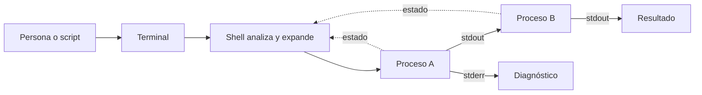
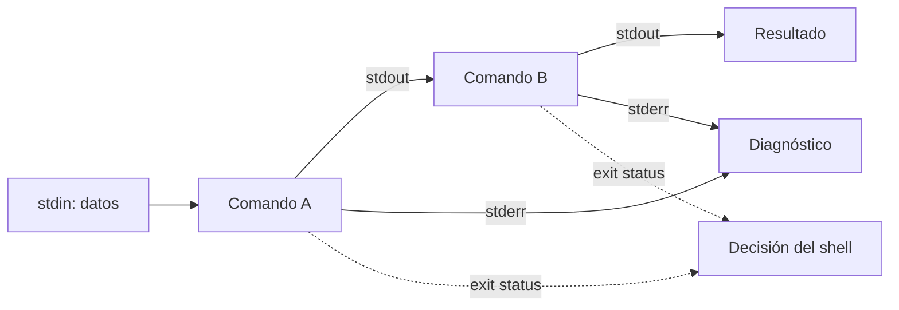

# SE-029 — Terminales, shells y composición de comandos

[← SE-028](https://github.com/vladimiracunadev-create/modern-software-engineering-program/blob/main/classes/part-02-sistemas-operativos-terminal-y-automatizacion-base/se-028-procesos-senales-servicios-y-tareas-programadas/README.md) · [↑ Parte 02](https://github.com/vladimiracunadev-create/modern-software-engineering-program/blob/main/classes/part-02-sistemas-operativos-terminal-y-automatizacion-base/README.md) · [📚 Índice completo](https://github.com/vladimiracunadev-create/modern-software-engineering-program/blob/main/classes/README.md) · [SE-030 →](https://github.com/vladimiracunadev-create/modern-software-engineering-program/blob/main/classes/part-02-sistemas-operativos-terminal-y-automatizacion-base/se-030-powershell-bash-y-portabilidad-de-scripts/README.md)

## Punto profesional y fundamento pedagógico

**Punto profesional.** La clase existe para predecir cómo el shell analiza texto, expande argumentos y conecta flujos.

**Por qué aparece aquí.** Se sitúa después de **Procesos, señales, servicios y tareas programadas** y antes de **PowerShell, Bash y portabilidad de scripts**: convierte el conocimiento anterior en una decisión observable que la clase siguiente podrá reutilizar. La continuidad se comprueba en el artefacto, no por compartir vocabulario.

**Error conceptual que debe corregir.** Pensar que una tubería pasa objetos en todos los shells o que citar es decorativo.

**Secuencia de aprendizaje.** Antes de leer la solución, el estudiante predice el resultado del caso normal y del error conceptual anterior. Luego explica un caso resuelto paso a paso, construye un contraejemplo que cambie la decisión y, sin consultar el texto, reconstruye el mecanismo y lo aplica a una entrada nueva. La secuencia usa predicción, explicación propia, contraste y recuperación. [ICAP](https://icap.education.asu.edu/research) distingue participación de construcción de conocimiento; [How People Learn II](https://nap.nationalacademies.org/catalog/24783/how-people-learn-ii-learners-contexts-and-cultures) exige conectar conocimiento previo, contexto y transferencia; la [práctica de recuperación](https://pubmed.ncbi.nlm.nih.gov/16507066/) respalda producir de nuevo la explicación tras una demora; y [Education for Life and Work](https://nap.nationalacademies.org/resource/13398/dbasse_084153.pdf) exige devolución que explique la causa del error.

**Evidencia de aprendizaje.** Shell-trace.md con tokens, stdin/stdout/stderr, quoting y resultado en dos shells. Debe contener predicción previa, observación, explicación causal, contraejemplo, criterio de aceptación y una nota de qué dato haría cambiar la conclusión.

**Límite de la conclusión.** La portabilidad exige declarar shell y versión.

### Trazabilidad fuente → afirmación

| Fuente primaria u oficial | Afirmación que respalda | Lo que no prueba |
|---|---|---|
| [GNU Bash Reference Manual 5.3](https://www.gnu.org/software/bash/manual/) | documenta parsing, expansión, quoting, pipelines y estado de salida en Bash | No demuestra por sí sola que el artefacto del estudiante sea correcto. |
| [Microsoft Learn — PowerShell documentation](https://learn.microsoft.com/powershell/) | documenta el comportamiento de Windows o PowerShell que se compara con el contrato POSIX | No demuestra por sí sola que el artefacto del estudiante sea correcto. |
| [The Open Group — Shell Command Language](https://pubs.opengroup.org/onlinepubs/9799919799/utilities/V3_chap02.html) | define el contrato portable de procesos, rutas, entorno o shell que se contrasta entre sistemas | No demuestra por sí sola que el artefacto del estudiante sea correcto. |

## Antes de empezar

Hasta ahora usamos comandos como instrumentos de observación. Pero una línea de terminal contiene varias capas: la terminal transporta interacción; el shell analiza sintaxis, expande valores y conecta procesos; cada programa interpreta sus propios argumentos. Confundirlas produce errores de comillas, tuberías y manejo de fallos.

### Resultado de aprendizaje

Al terminar podrás construir un pipeline con contratos explícitos de entrada, salida, error y estado, y explicar qué parte interpreta cada carácter.

## Prerrequisitos

`SE-028`, manejo básico de una terminal y capacidad para crear procesos de laboratorio. Recupera la diferencia entre texto, bytes y codificación de `SE-015`.

## Problema auténtico

Una automatización genera JSON, pero el archivo contiene mensajes de progreso y el pipeline informa éxito aunque la primera etapa falló. La consola “se veía bien”; sus canales y estados no tenían contrato.

## Objetivos observables

Podrás distinguir terminal, shell y programa; seguir análisis y expansión de argumentos; separar stdin/stdout/stderr; conservar fallos en pipelines; y diseñar una CLI componible con códigos documentados.

## Temas y por qué importan

| Tema | Mecanismo | Decisión habilitada |
| --- | --- | --- |
| Análisis del shell | convierte texto en invocaciones y redirecciones | proteger argumentos y evitar reevaluación |
| Flujos estándar | separan datos y diagnóstico | componer sin contaminar resultados |
| Pipeline | conecta productor y consumidor | procesar en streaming y propagar fallos |
| Código de salida | resume resultado para el padre | automatizar decisiones explícitas |
## Mapa conceptual

La terminal transporta interacción; el shell crea la topología; los programas interpretan argumentos. Los flujos llevan datos, mientras los estados gobiernan decisiones.

## Conceptos y decisiones

### Terminal y shell no son sinónimos

La terminal es una interfaz de entrada/salida —hoy normalmente un emulador— conectada a una sesión. El shell es un intérprete y lenguaje que lee órdenes, realiza expansiones y lanza comandos. Dentro de Windows Terminal pueden ejecutarse PowerShell, `cmd` o un shell de WSL; cambiar la ventana no cambia automáticamente la semántica del lenguaje.

Cuando el kit de diagnóstico multiplataforma documenta una orden, registra shell y versión. `>` o `$variable` no tienen una interpretación universal.

### El análisis ocurre antes de que el programa reciba argumentos

El shell separa tokens, procesa comillas, variables, comodines y redirecciones según sus reglas. El programa recibe una colección de argumentos ya construida —con diferencias de plataforma en cómo se materializa— y no ve necesariamente el texto original.

Las comillas no “viajan” siempre al programa: protegen espacios o inhiben expansiones durante el análisis. Construir una orden completa como una cadena y evaluarla de nuevo crea una segunda interpretación y aumenta errores e inyección. Las API de procesos que reciben lista de argumentos evitan esa ambigüedad.

### Entrada, salida y error son canales con propósitos distintos

Un proceso suele recibir entrada estándar y producir salida estándar y error estándar. La salida puede reservarse para datos componibles; el error, para diagnóstico humano. Redirigir o combinar canales cambia quién los consume.

Si un programa mezcla advertencias con JSON en stdout, rompe al siguiente consumidor. El kit de diagnóstico multiplataforma separa informe estructurado y mensajes operativos.

### Un pipeline conecta procesos pero puede ocultar el fallo inicial

La salida de un proceso alimenta la entrada del siguiente. Cada etapa puede almacenar, transformar o filtrar, y la presión de retorno limita a un productor rápido cuando el consumidor no alcanza. Leer toda la salida antes de consumir puede agotar memoria; no leer un pipe lleno puede bloquear procesos.

El estado final del pipeline depende del shell y su configuración. En Bash, `pipefail` modifica qué fallos se propagan; en PowerShell, el pipeline transporta objetos dentro del entorno PowerShell y texto al cruzar a procesos nativos. Por eso debe verificarse la semántica, no extrapolarla.

### Los códigos de salida son una interfaz pequeña pero crítica

Por convención, cero representa éxito y otros valores categorías de fallo, aunque el significado preciso pertenece al programa. Un mensaje “ERROR” no cambia por sí solo el código. Una automatización robusta comprueba el estado inmediatamente, conserva contexto y decide si reintenta, degrada o detiene.

El kit de diagnóstico multiplataforma define: `0` diagnóstico completo sin hallazgos bloqueantes; `2` uso inválido; `3` precondición ausente; `4` diagnóstico parcial; `5` fallo interno. El texto puede traducirse, pero los significados permanecen documentados.

### Composición segura requiere contratos de datos

Texto delimitado por espacios es frágil ante nombres con espacios, saltos de línea o codificaciones distintas. Para datos estructurados se elige un formato y codificación, se valida el esquema y se limita tamaño. JSON no soluciona autenticidad ni secreto; solo representa estructura.

El [Bash Reference Manual](https://www.gnu.org/software/bash/manual/) y la documentación de [PowerShell](https://learn.microsoft.com/powershell/) son fuentes de sus respectivas semánticas. POSIX cubre una base compartida de utilidades y shell, pero no convierte extensiones en portables.

## Definiciones de trabajo

- **terminal:** interfaz que transporta entrada y salida de una sesión;
- **shell:** lenguaje que analiza órdenes y coordina procesos;
- **argumento:** valor entregado a un programa tras la interpretación correspondiente;
- **pipeline:** conexión de salida de una etapa con entrada de otra;
- **código de salida:** valor discreto con significado documentado para el proceso padre.

## Caso conductor: el kit de diagnóstico multiplataforma ofrece un contrato de línea de comandos

El kit de diagnóstico multiplataforma acepta opciones explícitas, escribe el informe JSON en stdout, envía progreso y advertencias a stderr y termina con códigos documentados. La opción `--human` cambia la representación de salida, no el significado.

Una prueba ejecuta el kit de diagnóstico multiplataforma con una ruta que contiene espacios y caracteres no ASCII. Otra induce diagnóstico parcial. El consumidor debe guardar JSON solo si el código y la validación lo permiten. Así se evita un archivo “válido” que en realidad contiene mensajes mezclados.

## Práctica guiada

1. Escribe un productor que emita tres registros y una advertencia separada.
2. Conecta un consumidor que valide y cuente registros.
3. Induce un fallo en la primera etapa y observa estado con y sin política de propagación.
4. Prueba argumento vacío, espacio, comodín literal y texto Unicode.
5. Documenta quién interpreta cada elemento y cuál es el contrato observable.

La práctica debe tener pruebas negativas; un único ejemplo feliz no demuestra un contrato.

## Ejemplo mínimo

Un productor escribe `42` en stdout, una advertencia en stderr y termina con cero. Redirigir stdout conserva un archivo limpio; redirigir ambos mezcla propósitos. El consumidor valida `42` y no analiza la advertencia.

## Ejemplo profesional

Un pipeline de exportación transforma miles de registros. La etapa inicial falla tras diez, pero la última herramienta termina correctamente con entrada parcial. La política de propagación detiene la entrega y conserva stderr correlacionado; éxito visual del último comando deja de ser el criterio.

## Ejercicios

1. Indica qué componente interpreta comillas, comodines y una opción del programa.
2. Diseña códigos para éxito, uso inválido, parcial y fallo interno.
3. Explica cómo un pipe lleno puede bloquear al productor.

## Reto verificable

Construye productor y consumidor que soporten espacios, texto Unicode y un fallo inducido en la primera etapa. El archivo de datos debe seguir siendo válido y el estado final no puede indicar éxito falso.

## Preguntas frecuentes

### ¿stderr significa siempre error fatal?

No. Es un canal de diagnóstico; la severidad y el resultado los define el contrato junto con el código.

### ¿Citar una cadena la vuelve segura en todos los shells?

No. Las reglas varían y evaluar otra vez reabre interpretación. Es preferible pasar colecciones de argumentos mediante APIs.

## Fallo controlado y diagnóstico

Haz que el productor falle después de emitir un registro. Observa qué archivo y estado deja el pipeline, activa la política adecuada y repite. Documenta qué cambió y qué shell lo interpretó.

## Errores comunes y cómo corregirlos

| Síntoma | Causa conceptual | Corrección |
|---|---|---|
| Un archivo JSON contiene mensajes de progreso | stdout y stderr no tienen roles definidos | Reservar stdout para datos y stderr para diagnóstico |
| Una ruta con espacios se divide | El shell interpretó una cadena sin protección | Pasar argumentos como colección o citar según el shell |
| Falla la primera etapa y el script sigue | Solo se observó el último estado | Activar/comprobar la política apropiada y probar cada etapa crítica |
| Se invoca `eval` para montar comandos | Se introdujo una segunda interpretación | Usar funciones y listas de argumentos |
| Un pipeline grande se bloquea | No se consumen ambos flujos o se almacena todo | Procesar en streaming y drenar canales |

## Entorno y archivos clave

Usa una ruta de workspace con espacios al invocar el [laboratorio compartido](https://github.com/vladimiracunadev-create/modern-software-engineering-program/tree/main/labs/part-02-cross-platform-diagnostic-kit); conserva por separado el JSON de datos y el código de salida para demostrar que quoting y estado son partes distintas del contrato.

`work/SE-029/producer`, `consumer`, `result.jsonl`, `diagnostic.log` y `contract.md`. Usa solo datos ficticios y límites pequeños.

## Seguridad, ética y accesibilidad

No conviertas entradas en código ni incluyas secretos en argumentos. Mensajes y estados deben ser comprensibles sin color y stdout debe ofrecer formato documentado.

## Transferencia

Traslada el contrato a una API HTTP: cuerpo, canal de diagnóstico, estado y reintento. Señala qué analogías dejan de funcionar.

## Evaluación y evidencia

Se exige topología explicada, separación de canales, cinco casos adversos y propagación comprobada. Una línea de shell que solo funciona con un nombre simple no aprueba.

## Criterio de cierre

Puedes señalar qué hace la terminal, qué hace el shell y qué recibe el proceso; construir un pipeline que conserva errores; y demostrar el contrato CLI del kit de diagnóstico multiplataforma con casos adversos.

## Límites y siguiente paso

No cubrimos interfaces interactivas complejas, pseudo-terminales ni todas las reglas de cada shell. La siguiente clase compara PowerShell y Bash para decidir qué lógica puede compartirse y qué necesita adaptadores explícitos.

## Fuentes

- [GNU Bash Reference Manual 5.3](https://www.gnu.org/software/bash/manual/) — documenta parsing, expansión, quoting, pipelines y estado de salida en Bash.
- [Microsoft Learn — PowerShell documentation](https://learn.microsoft.com/powershell/) — documenta el comportamiento de Windows o PowerShell que se compara con el contrato POSIX.
- [The Open Group — Shell Command Language](https://pubs.opengroup.org/onlinepubs/9799919799/utilities/V3_chap02.html) — define el contrato portable de procesos, rutas, entorno o shell que se contrasta entre sistemas.
- [Microsoft Learn — about_Pipelines](https://learn.microsoft.com/powershell/module/microsoft.powershell.core/about/about_pipelines) — documenta el comportamiento de Windows o PowerShell que se compara con el contrato POSIX.

## Glosario

- **Pipeline:** composición donde la salida de una etapa alimenta la entrada de otra.
- **Redirección:** cambio del origen o destino de un flujo.
- **Shell:** intérprete y lenguaje para lanzar y coordinar procesos.
- **stderr:** canal convencional de diagnóstico.
- **stdout:** canal convencional de resultados o datos.

---
[← SE-028](https://github.com/vladimiracunadev-create/modern-software-engineering-program/blob/main/classes/part-02-sistemas-operativos-terminal-y-automatizacion-base/se-028-procesos-senales-servicios-y-tareas-programadas/README.md) · [↑ Parte 02](https://github.com/vladimiracunadev-create/modern-software-engineering-program/blob/main/classes/part-02-sistemas-operativos-terminal-y-automatizacion-base/README.md) · [📚 Índice completo](https://github.com/vladimiracunadev-create/modern-software-engineering-program/blob/main/classes/README.md) · [SE-030 →](https://github.com/vladimiracunadev-create/modern-software-engineering-program/blob/main/classes/part-02-sistemas-operativos-terminal-y-automatizacion-base/se-030-powershell-bash-y-portabilidad-de-scripts/README.md)
