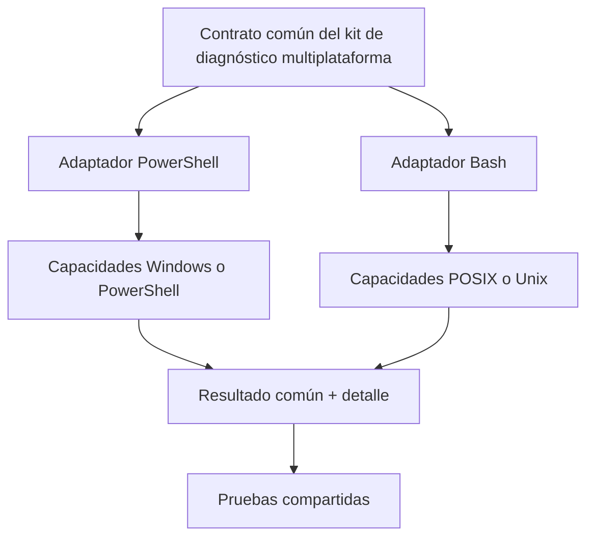
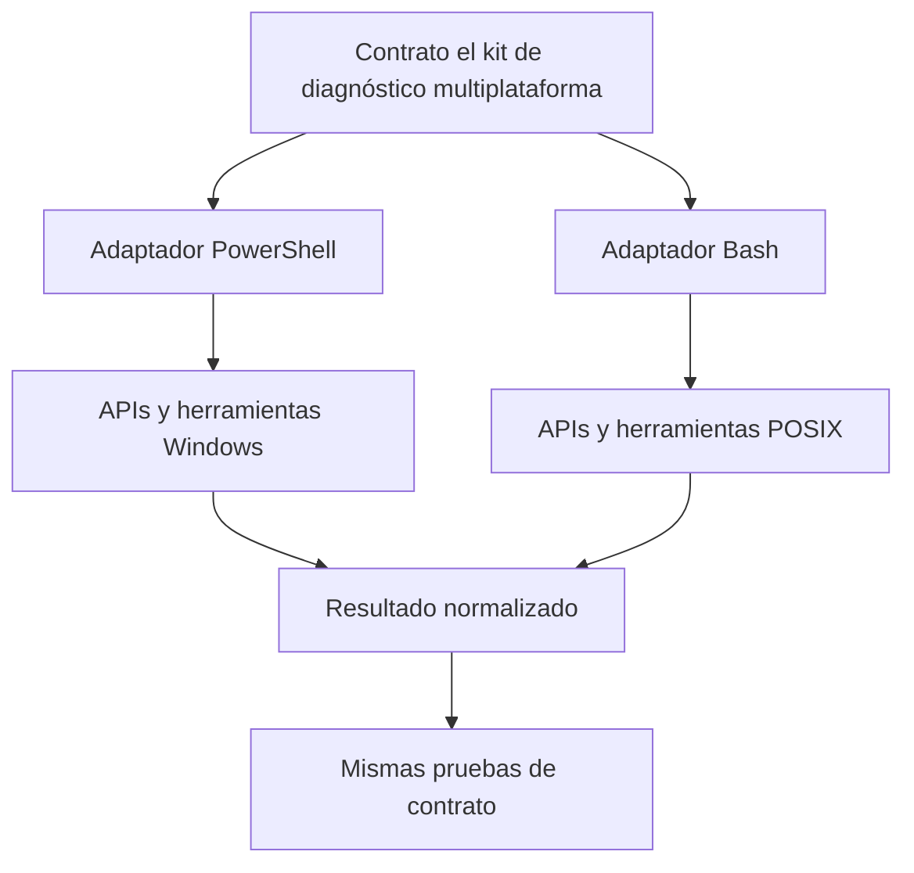

# SE-030 — PowerShell, Bash y portabilidad de scripts

[← SE-029](https://github.com/vladimiracunadev-create/modern-software-engineering-program/blob/main/classes/part-02-sistemas-operativos-terminal-y-automatizacion-base/se-029-terminales-shells-y-composicion-de-comandos/README.md) · [↑ Parte 02](https://github.com/vladimiracunadev-create/modern-software-engineering-program/blob/main/classes/part-02-sistemas-operativos-terminal-y-automatizacion-base/README.md) · [📚 Índice completo](https://github.com/vladimiracunadev-create/modern-software-engineering-program/blob/main/classes/README.md) · [SE-031 →](https://github.com/vladimiracunadev-create/modern-software-engineering-program/blob/main/classes/part-02-sistemas-operativos-terminal-y-automatizacion-base/se-031-variables-de-entorno-configuracion-y-secretos/README.md)

> Estado: **PLANNED** · Borrador público conservado íntegramente y sometido a auditoría técnica y pedagógica.

## Punto profesional y fundamento pedagógico

**Punto profesional.** La clase existe para preservar intención al portar scripts entre PowerShell y Bash.

**Por qué aparece aquí.** Se sitúa después de **Terminales, shells y composición de comandos** y antes de **Variables de entorno, configuración y secretos**: convierte el conocimiento anterior en una decisión observable que la clase siguiente podrá reutilizar. La continuidad se comprueba en el artefacto, no por compartir vocabulario.

**Error conceptual que debe corregir.** Traducir sintaxis línea por línea ignorando tipos, errores y códigos de salida.

**Secuencia de aprendizaje.** Antes de leer la solución, el estudiante predice el resultado del caso normal y del error conceptual anterior. Luego explica un caso resuelto paso a paso, construye un contraejemplo que cambie la decisión y, sin consultar el texto, reconstruye el mecanismo y lo aplica a una entrada nueva. La secuencia usa predicción, explicación propia, contraste y recuperación. [ICAP](https://icap.education.asu.edu/research) distingue participación de construcción de conocimiento; [How People Learn II](https://nap.nationalacademies.org/catalog/24783/how-people-learn-ii-learners-contexts-and-cultures) exige conectar conocimiento previo, contexto y transferencia; la [práctica de recuperación](https://pubmed.ncbi.nlm.nih.gov/16507066/) respalda producir de nuevo la explicación tras una demora; y [Education for Life and Work](https://nap.nationalacademies.org/resource/13398/dbasse_084153.pdf) exige devolución que explique la causa del error.

**Evidencia de aprendizaje.** Paired-scripts.md con contrato común, casos límite y tabla de divergencias. Debe contener predicción previa, observación, explicación causal, contraejemplo, criterio de aceptación y una nota de qué dato haría cambiar la conclusión.

**Límite de la conclusión.** Equivalencia funcional no implica equivalencia de seguridad ni rendimiento.

### Trazabilidad fuente → afirmación

| Fuente primaria u oficial | Afirmación que respalda | Lo que no prueba |
|---|---|---|
| [GNU Bash Reference Manual](https://www.gnu.org/software/bash/manual/) | documenta parsing, expansión, quoting, pipelines y estado de salida en Bash | No demuestra por sí sola que el artefacto del estudiante sea correcto. |
| [Microsoft Learn — About PowerShell](https://learn.microsoft.com/powershell/module/microsoft.powershell.core/about/) | documenta el comportamiento de Windows o PowerShell que se compara con el contrato POSIX | No demuestra por sí sola que el artefacto del estudiante sea correcto. |
| [The Open Group — Shell Command Language](https://pubs.opengroup.org/onlinepubs/9799919799/utilities/V3_chap02.html) | define el contrato portable de procesos, rutas, entorno o shell que se contrasta entre sistemas | No demuestra por sí sola que el artefacto del estudiante sea correcto. |

## Antes de empezar

El kit de diagnóstico multiplataforma necesita adaptadores para Windows, Linux y macOS. Traducir comandos palabra por palabra no funciona: PowerShell compone objetos .NET dentro de sus pipelines; Bash compone principalmente flujos de bytes y texto entre procesos. La portabilidad profesional preserva intención y contrato, no apariencia.

### Resultado de aprendizaje

Al terminar podrás diseñar una automatización con núcleo conceptual compartido, adaptadores PowerShell/Bash y pruebas que detecten divergencias reales.

## Prerrequisitos

`SE-029`, acceso a PowerShell 7 o Bash 5 para al menos una ejecución y capacidad de leer ejemplos del otro. No necesitas instalar otro shell; las afirmaciones no ejecutadas se marcan como diseño.

## Problema auténtico

Un script “portable” reemplaza nombres de órdenes, pero sigue parseando columnas, usa reglas de comillas de Bash en PowerShell y consulta el estado equivocado. Arranca en ambos shells y falla ante la primera ruta con espacios.

## Objetivos observables

Podrás comparar modelos de datos y error; separar contrato de adaptador; declarar una matriz de soporte; comprobar capacidades; y demostrar equivalencia semántica con casos compartidos.

## Temas y por qué importan

| Tema | Mecanismo | Decisión habilitada |
| --- | --- | --- |
| Modelo de datos | objetos frente a palabras y flujos | evitar traducciones superficiales |
| Error | excepciones, estados y flujos propios | detener o degradar con criterio |
| Adaptador | traduce contrato a capacidades locales | conservar intención sin ocultar diferencias |
| Matriz de soporte | separa objetivo de evidencia ejecutada | prometer solo lo probado |
## Mapa conceptual

El contrato converge en significado, no en sintaxis. Los detalles de plataforma se conservan en un espacio explícito para no falsear equivalencia.

## Conceptos y decisiones

### Los dos shells tienen modelos de datos diferentes

En Bash, expansiones producen palabras y los pipelines conectan flujos de procesos. Convenciones como líneas, delimitadores y códigos de salida sostienen la composición. En PowerShell, los cmdlets emiten objetos con propiedades y el motor enlaza parámetros; al invocar ejecutables nativos vuelve a existir una frontera textual.

Esta diferencia explica por qué `Select-Object` no equivale simplemente a cortar columnas de texto y por qué parsear la presentación de un comando es frágil en ambos entornos.

### Variables, ámbitos y evaluación siguen reglas propias

Bash distingue variables del shell y entorno exportado, y aplica expansiones con reglas de división y globbing. PowerShell maneja objetos, ámbitos y proveedores; sus operadores de comparación y conversión no son los de Bash.

Una guía portable define nombres y valores en un contrato externo —por ejemplo, un esquema JSON— y cada adaptador valida y transforma. No comparte fragmentos de sintaxis como si fueran lenguaje neutral.

### El manejo de errores tiene canales múltiples

En Bash importan el estado de órdenes, listas condicionales, pipelines y opciones como `errexit`, cuyos límites deben entenderse en contexto. En PowerShell hay errores terminantes y no terminantes, `$?`, excepciones y `$LASTEXITCODE` para programas nativos. Configurar una preferencia global sin comprender la frontera puede cambiar conducta de módulos ajenos.

El kit de diagnóstico multiplataforma encapsula cada llamada externa, captura stdout/stderr, verifica estado y convierte el resultado a una estructura común. La política se prueba con fallos inducidos.

El resultado normalizado no debe borrar información específica necesaria para diagnosticar. Puede incluir un bloque común y otro `platform_details` documentado.

### La portabilidad tiene niveles

Un script puede ser portable entre versiones de un shell, entre sistemas que ofrecen ese shell o entre implementaciones distintas. PowerShell funciona en varias plataformas, pero los cmdlets y proveedores disponibles cambian. Bash puede instalarse en Windows, pero no convierte las API subyacentes en POSIX.

Antes de prometer portabilidad se declara matriz: sistemas, arquitecturas, versiones mínimas, dependencias y escenarios probados. “Multiplataforma” sin matriz es marketing, no evidencia.

### Descubrimiento de capacidades y degradación explícita

Cada adaptador comprueba versiones y órdenes requeridas. Una capacidad opcional produce un informe parcial con motivo; una precondición esencial detiene la ejecución antes de modificar estado. El modo degradado debe ser visible en salida y código, no un silencio que aparenta éxito.

### Seguridad de argumentos y archivos temporales

Los dos shells pueden sufrir inyección si datos se convierten en código. No se evalúan cadenas provenientes de rutas o configuración. Los temporales se crean con mecanismos seguros, permisos restringidos y limpieza controlada; nombres predecibles en directorios compartidos abren carreras y sustitución.

Las referencias normativas son el [manual de Bash](https://www.gnu.org/software/bash/manual/) y la documentación [about de PowerShell](https://learn.microsoft.com/powershell/module/microsoft.powershell.core/about/). Los ejemplos deben fijar la versión probada porque ambos evolucionan.

## Definiciones de trabajo

- **núcleo:** lógica que opera sobre el contrato común sin conocer comandos concretos;
- **adaptador:** traducción entre una capacidad local y el modelo común;
- **equivalencia semántica:** mismo resultado observable dentro de límites declarados;
- **matriz de soporte:** plataformas, versiones y escenarios realmente probados;
- **degradación:** resultado parcial explícito cuando una capacidad opcional falta.

## Caso conductor: dos adaptadores, un contrato

El kit de diagnóstico multiplataforma define una operación `inspect_path` con entrada `path` y salida común: ruta resuelta, existencia, tipo y estado de acceso. La implementación PowerShell usa APIs/cmdlets nativos; la implementación Bash usa herramientas disponibles y evita parsear columnas decorativas.

Las pruebas entregan rutas con espacios, ausencia, directorio y acceso limitado. Comparan campos semánticos, no el orden visual. Si una plataforma aporta ACL detallada y otra no, el campo de capacidad explica la diferencia.

## Práctica guiada

1. Escribe el contrato de una operación sin sintaxis de shell.
2. Implementa un adaptador PowerShell y uno Bash.
3. Añade comprobación de dependencias y versión.
4. Ejecuta los mismos casos de contrato en ambos.
5. Registra divergencias legítimas y fallos de implementación.
6. Añade modo `--dry-run` a cualquier operación que pudiera modificar estado.

Una traducción superficial que solo cambia nombres de comandos no satisface la práctica.

## Ejemplo mínimo

Bash entrega líneas de texto desde una herramienta; PowerShell entrega objetos desde un cmdlet. Ambos adaptadores producen `{exists, type}` y mantienen la salida original solo como detalle diagnóstico. Las pruebas comparan campos, no presentación.

## Ejemplo profesional

Una herramienta corporativa necesita inventariar versión en tres sistemas. Cada adaptador consulta una fuente estable, normaliza una versión y reporta `unavailable` cuando la política bloquea acceso. El tablero no confunde desconocido con versión cero.

## Ejercicios

1. Reescribe una intención de archivo sin mencionar ninguna orden de shell.
2. Compara `$LASTEXITCODE`, `$?` y el estado de una orden en Bash con ejemplos delimitados.
3. Diseña una matriz con diseñado, ejecutado, aprobado y no soportado.

## Reto verificable

Ejecuta el mismo fixture con un adaptador real y uno simulado del otro shell. Deben satisfacer el mismo esquema y producir una divergencia documentada, no un campo inventado.

## Preguntas frecuentes

### ¿PowerShell multiplataforma elimina la necesidad de adaptadores?

No. El lenguaje puede estar disponible, pero proveedores, cmdlets y sistema subyacente cambian.

### ¿POSIX shell y Bash son lo mismo?

No. Bash implementa y extiende un lenguaje; usar sus extensiones reduce el alcance portable.

## Fallo controlado y diagnóstico

Entrega una ruta con espacios y un comodín literal al adaptador. Si se divide o expande, identifica la fase de interpretación y corrige el paso de argumentos sin usar evaluación dinámica.

## Errores comunes y cómo corregirlos

| Síntoma | Causa conceptual | Corrección |
|---|---|---|
| Se parsean columnas coloreadas | Se confundió presentación humana con interfaz | Usar salida estructurada o API estable |
| PowerShell y Bash “pasan” casos distintos | No existe contrato compartido | Definir fixtures y aserciones semánticas comunes |
| `$?` se consulta tarde | Otro comando reemplazó el estado | Capturarlo inmediatamente y encapsular la invocación |
| El script evalúa una ruta | Datos se transformaron en código | Pasar argumentos sin reevaluación |
| “Compatible” significa que el shell inicia | No se verificaron capacidades subyacentes | Publicar y probar una matriz de soporte |

## Entorno y archivos clave

`work/SE-030/contract.json`, `diagnostic_kit.ps1`, `diagnostic_kit.sh`, `fixtures/` y `support-matrix.md`. No instala shells ni herramientas globales.

## Seguridad, ética y accesibilidad

No evalúes entradas, crea temporales seguros y redáctalos al fallar. Los dos adaptadores deben ofrecer mensajes equivalentes y códigos consumibles sin depender del formato visual.

## Transferencia

Aplica el patrón a dos SDK de nube o dos motores de base de datos. Decide qué pertenece al contrato y qué debe permanecer como detalle del proveedor.

## Evaluación y evidencia

Se exige contrato previo, dos adaptadores, fixtures compartidos, matriz honesta y fallo controlado. Código parecido no demuestra comportamiento equivalente.

## Criterio de cierre

Puedes explicar las diferencias de datos y error, implementar adaptadores que preservan un contrato y presentar evidencia de la matriz realmente probada.

## Límites y siguiente paso

No buscamos cubrir toda la sintaxis ni producir scripts idénticos. Aún falta decidir cómo ambos adaptadores reciben configuración sin convertir el entorno o los logs en un almacén de secretos; ese es el foco siguiente.

## Fuentes

- [GNU Bash Reference Manual](https://www.gnu.org/software/bash/manual/) — documenta parsing, expansión, quoting, pipelines y estado de salida en Bash.
- [Microsoft Learn — About PowerShell](https://learn.microsoft.com/powershell/module/microsoft.powershell.core/about/) — documenta el comportamiento de Windows o PowerShell que se compara con el contrato POSIX.
- [Microsoft Learn — about_Automatic_Variables](https://learn.microsoft.com/powershell/module/microsoft.powershell.core/about/about_automatic_variables) — documenta el comportamiento de Windows o PowerShell que se compara con el contrato POSIX.
- [The Open Group — Shell Command Language](https://pubs.opengroup.org/onlinepubs/9799919799/utilities/V3_chap02.html) — define el contrato portable de procesos, rutas, entorno o shell que se contrasta entre sistemas.

## Glosario

- **Adaptador:** implementación específica que traduce un contrato común a una plataforma.
- **Contrato:** definición observable de entradas, salidas, errores y efectos.
- **Modo degradado:** ejecución limitada que declara capacidades ausentes.
- **Portabilidad:** grado de funcionamiento demostrado dentro de una matriz definida.
- **Proveedor de PowerShell:** interfaz que presenta almacenes como espacios navegables.

---
[← SE-029](https://github.com/vladimiracunadev-create/modern-software-engineering-program/blob/main/classes/part-02-sistemas-operativos-terminal-y-automatizacion-base/se-029-terminales-shells-y-composicion-de-comandos/README.md) · [↑ Parte 02](https://github.com/vladimiracunadev-create/modern-software-engineering-program/blob/main/classes/part-02-sistemas-operativos-terminal-y-automatizacion-base/README.md) · [📚 Índice completo](https://github.com/vladimiracunadev-create/modern-software-engineering-program/blob/main/classes/README.md) · [SE-031 →](https://github.com/vladimiracunadev-create/modern-software-engineering-program/blob/main/classes/part-02-sistemas-operativos-terminal-y-automatizacion-base/se-031-variables-de-entorno-configuracion-y-secretos/README.md)
