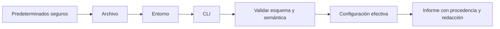
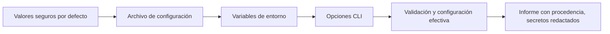

# SE-031 — Variables de entorno, configuración y secretos

[← SE-030](https://github.com/vladimiracunadev-create/software-engineering-learning-suite/blob/main/classes/part-02-sistemas-operativos-terminal-y-automatizacion-base/se-030-powershell-bash-y-portabilidad-de-scripts/README.md) · [↑ Parte 02](https://github.com/vladimiracunadev-create/software-engineering-learning-suite/blob/main/classes/part-02-sistemas-operativos-terminal-y-automatizacion-base/README.md) · [📚 Índice completo](https://github.com/vladimiracunadev-create/software-engineering-learning-suite/blob/main/classes/README.md) · [SE-032 →](https://github.com/vladimiracunadev-create/software-engineering-learning-suite/blob/main/classes/part-02-sistemas-operativos-terminal-y-automatizacion-base/se-032-instalacion-de-software-y-gestores-de-paquetes-del-sistema/README.md)

> Estado: **GUIDED**. Usa secretos centinela ficticios; no manipula credenciales reales ni sustituye un sistema de gestión de secretos.

## Antes de empezar

Los adaptadores de Faro ya comparten un contrato, pero necesitan saber qué inspeccionar y cómo comportarse. Introducir valores directamente en el código impide reutilizarlo; cargar todo desde variables de entorno vuelve invisible la procedencia; guardar credenciales junto con configuración las expone. Configurar es diseñar una interfaz operativa.

### Resultado de aprendizaje

Al terminar podrás definir una precedencia de configuración, validar valores antes de usarlos y mantener secretos fuera de código, argumentos, informes y registros.

## Prerrequisitos

`SE-030`, contrato CLI de Faro y uso de datos ficticios. Crea un secreto centinela que no tenga valor real y pueda buscarse de extremo a extremo.

## Problema auténtico

El archivo de configuración parece correcto, pero Faro usa otra ruta. Una variable heredada tiene mayor precedencia y nadie puede ver la configuración efectiva. Al activar depuración, el equipo imprime todo el entorno y expone un token.

## Objetivos observables

Podrás diseñar esquema y precedencia; distinguir ausente, vacío y valor inválido; explicar herencia del entorno; redactar secretos antes de serializar; y demostrar qué configuración efectiva gobernó una ejecución.

## Temas y por qué importan

| Tema | Mecanismo | Decisión habilitada |
| --- | --- | --- |
| Precedencia | combina fuentes en orden determinista | reconstruir por qué ganó un valor |
| Validación | aplica tipo, rango y relaciones | fallar antes de producir efectos |
| Herencia | propaga entorno a procesos hijos | limitar exposición y sorpresas |
| Secreto | exige ciclo de vida y redacción | diagnosticar sin divulgar autoridad |

## Mapa conceptual



La precedencia explica el origen; la validación decide si el resultado es admisible. La redacción ocurre antes de cualquier salida, no como limpieza posterior.

## Conceptos y decisiones

### Configuración separa decisiones de despliegue del programa

Una opción configurable representa una decisión que puede variar sin recompilar: ruta de trabajo, nivel de detalle o plazo de espera. No toda constante debe volverse configurable; demasiadas opciones amplían estados, pruebas y combinaciones inválidas.

Cada opción necesita nombre, tipo, valor predeterminado, rango, sensibilidad, fuente permitida y momento de aplicación. “Lee un `.env`” es una técnica, no un modelo completo.

### La precedencia debe ser determinista y observable

Faro adopta una cadena explícita:



La fuente de mayor precedencia reemplaza solo campos definidos. El programa informa de dónde provino cada valor no sensible. Una cadena silenciosa genera incidentes donde una variable olvidada domina al archivo esperado.

### El entorno es heredado por procesos y carece de tipado

Las variables de entorno son pares de nombres y valores que normalmente se heredan al crear procesos. Pueden distinguir mayúsculas según plataforma y toda entrada llega como texto. Ausente, vacío, `false` y `0` requieren reglas explícitas.

Un proceso hijo puede recibir más variables de las necesarias. Faro construye un entorno mínimo al invocar herramientas y nunca vuelca el entorno completo en diagnóstico. Las variables son útiles para configuración efímera, pero no constituyen por sí solas un almacén seguro.

### Validar configuración es comprobar semántica, no solo sintaxis

Un JSON bien formado puede contener una ruta inexistente, un plazo negativo o combinaciones incompatibles. La validación ocurre antes de iniciar efectos y produce mensajes que señalan campo, regla y procedencia. Los valores desconocidos pueden tratarse como error para detectar errores tipográficos, salvo que el esquema diseñe extensiones.

Faro distingue error de uso, configuración inválida y recurso inaccesible porque requieren respuestas diferentes.

### Un secreto es información cuyo uso debe controlarse

Tokens, claves y contraseñas no se protegen solo renombrándolos. Deben obtenerse de un almacén apropiado cuando exista, limitarse en alcance y duración, rotarse y no registrarse. Pasarlos como argumento puede hacerlos visibles en historial o inspección de procesos; guardarlos en un repositorio conserva copias incluso después de borrar la línea actual.

La aplicación debe manejar el secreto como valor sensible desde su ingreso hasta su descarte. Una máscara parcial puede seguir revelando longitud o fragmentos; un hash permite correlación y también puede ser sensible. La política de redacción responde al propósito del informe.

### Plantillas y archivos de ejemplo enseñan sin publicar valores reales

Un archivo `config.example.json` documenta nombres y valores ficticios. El archivo real se excluye del control de versiones, pero ignorarlo no revoca un secreto ya comprometido. Si se detecta exposición, se rota la credencial y se investiga el alcance; reescribir historial es una decisión adicional, no la única corrección.

### La configuración efectiva debe poder explicarse

Faro ofrece `config explain`: muestra valor no sensible o `<redactado>`, procedencia, regla aplicada y advertencias. Así una persona puede descubrir que `FARO_TIMEOUT` reemplazó el archivo sin imprimir ninguna credencial.

La documentación [about_Environment_Variables](https://learn.microsoft.com/powershell/module/microsoft.powershell.core/about/about_environment_variables) y el estándar [`environ`](https://pubs.opengroup.org/onlinepubs/9799919799/basedefs/stdlib.h.html) describen mecanismos; la política de secretos debe adaptarse al riesgo y plataforma.

## Definiciones de trabajo

- **esquema:** contrato de nombres, tipos, restricciones y sensibilidad;
- **precedencia:** orden que determina qué fuente gana por campo;
- **configuración efectiva:** valores resultantes junto con su procedencia;
- **secreto centinela:** valor ficticio reconocible usado para comprobar filtraciones;
- **redacción:** transformación previa a salida que oculta información sensible.

## Caso conductor: Faro carga sin filtrar

El kit define un esquema con `target_path`, `timeout_seconds`, `output_format` y un token opcional para una integración futura. El token nunca aparece en el informe. Faro carga las capas, valida tipos y rangos, y genera una vista efectiva:

```text
target_path = C:\laboratorio\pulso   (cli)
timeout_seconds = 10                 (archivo)
output_format = json                 (predeterminado)
integration_token = <redactado>      (almacén/entorno)
```

Una prueba inyecta deliberadamente el texto del token y busca que no aparezca en stdout, stderr, archivo ni excepción. No se declara “seguro” solo por pasar esta prueba; se declara la propiedad concreta verificada.

## Práctica guiada

1. Especifica esquema y precedencia de cuatro opciones.
2. Implementa carga separada de resolución para poder probar ambas.
3. Cubre ausente, vacío, tipo inválido, valor fuera de rango y opción desconocida.
4. Añade un valor centinela secreto y verifica redacción en todas las salidas.
5. Documenta cómo rotar el secreto si se expone.

Trabaja con valores ficticios; no uses credenciales personales.

## Ejemplo mínimo

El archivo declara `timeout=10`, el entorno `FARO_TIMEOUT=0` y la CLI no lo cambia. La procedencia muestra entorno, pero la validación rechaza cero. La ejecución no sustituye silenciosamente otro valor ni inicia trabajo parcial.

## Ejemplo profesional

Un servicio rota un token en un almacén, pero un volcado de entorno conserva el anterior. La corrección elimina volcados generales, construye un entorno mínimo para hijos y prueba el centinela en excepciones y paquetes diagnósticos.

## Ejercicios

1. Define tipo, fuente y regla para cuatro opciones de Faro.
2. Diseña casos para ausente, vacío, booleano ambiguo y campo desconocido.
3. Traza un secreto desde ingreso hasta descarte e identifica cuatro fugas posibles.

## Reto verificable

Ejecuta doce combinaciones de fuentes y produce una tabla de valor efectivo/procedencia. El secreto centinela no debe aparecer en stdout, stderr, logs ni archivo final.

## Preguntas frecuentes

### ¿Una variable de entorno es un almacén seguro?

No por sí sola. Puede heredarse, inspeccionarse o registrarse; su riesgo depende de plataforma y proceso.

### ¿Ignorar `.env` en Git resuelve una exposición anterior?

No. Debe rotarse la credencial y evaluarse historial y copias.

## Fallo controlado y diagnóstico

Introduce un token centinela y fuerza una excepción de validación. Busca el valor en todas las salidas. Si aparece, centraliza representación segura y repite hasta demostrar la propiedad acotada.

## Errores comunes y cómo corregirlos

| Síntoma | Causa conceptual | Corrección |
|---|---|---|
| Cambiar el archivo no cambia la ejecución | Una variable de mayor precedencia quedó activa | Mostrar configuración efectiva y procedencia |
| `false` se interpreta como verdadero | Se convirtió texto por presencia | Definir y validar un vocabulario booleano |
| El token aparece en una excepción | La redacción se aplicó solo al log normal | Centralizar serialización segura y probar fallos |
| Se borró un secreto del último commit y se da por resuelto | Se ignoraron copias e historial | Revocar/rotar primero y evaluar exposición |
| Cada opción puede venir de cualquier fuente | No se controló la superficie operativa | Limitar fuentes y documentar precedencia por campo |

## Entorno y archivos clave

`work/SE-031/config.example.json`, `config.local.json` ignorado, `config-report.json` y pruebas. Solo valores ficticios y carpeta desechable.

## Seguridad, ética y accesibilidad

No uses credenciales reales. Mensajes de validación deben nombrar el campo y regla sin repetir el valor sensible; ofrece ejemplos copiables y legibles por tecnología asistiva.

## Transferencia

Aplica precedencia y redacción a una aplicación web con configuración por despliegue. Identifica qué valores requieren reinicio y cuáles pueden cambiar dinámicamente.

## Evaluación y evidencia

Se exige esquema, matriz de precedencia, pruebas negativas, secreto centinela ausente y límites. Ocultar solo el campo llamado `password` no demuestra protección.

## Criterio de cierre

Puedes reconstruir la configuración efectiva, demostrar validación temprana y comprobar que un secreto centinela no aparece en las salidas previstas, declarando todavía los límites de esa comprobación.

## Límites y siguiente paso

No diseñamos una infraestructura empresarial de secretos ni garantizamos borrado físico de memoria. Faro también depende de herramientas instaladas; la siguiente clase analiza gestores de paquetes, procedencia y reversibilidad.

## Fuentes

- [Microsoft Learn — about_Environment_Variables](https://learn.microsoft.com/powershell/module/microsoft.powershell.core/about/about_environment_variables)
- [The Open Group — Environment Variables](https://pubs.opengroup.org/onlinepubs/9799919799/basedefs/V1_chap08.html)
- [OWASP — Secrets Management Cheat Sheet](https://cheatsheetseries.owasp.org/cheatsheets/Secrets_Management_Cheat_Sheet.html)
- [Python documentation — configparser](https://docs.python.org/3/library/configparser.html)

## Glosario

- **Configuración efectiva:** resultado final tras aplicar fuentes, precedencia y validación.
- **Precedencia:** orden determinista para resolver valores de múltiples fuentes.
- **Redacción:** sustitución deliberada de datos sensibles en una representación.
- **Rotación:** reemplazo de una credencial y retiro de la anterior.
- **Secreto:** dato cuya divulgación permite o facilita una acción no autorizada.

---
[← SE-030](https://github.com/vladimiracunadev-create/software-engineering-learning-suite/blob/main/classes/part-02-sistemas-operativos-terminal-y-automatizacion-base/se-030-powershell-bash-y-portabilidad-de-scripts/README.md) · [↑ Parte 02](https://github.com/vladimiracunadev-create/software-engineering-learning-suite/blob/main/classes/part-02-sistemas-operativos-terminal-y-automatizacion-base/README.md) · [📚 Índice completo](https://github.com/vladimiracunadev-create/software-engineering-learning-suite/blob/main/classes/README.md) · [SE-032 →](https://github.com/vladimiracunadev-create/software-engineering-learning-suite/blob/main/classes/part-02-sistemas-operativos-terminal-y-automatizacion-base/se-032-instalacion-de-software-y-gestores-de-paquetes-del-sistema/README.md)
