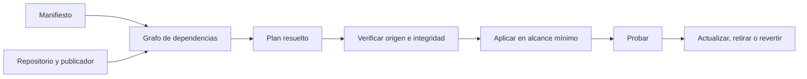
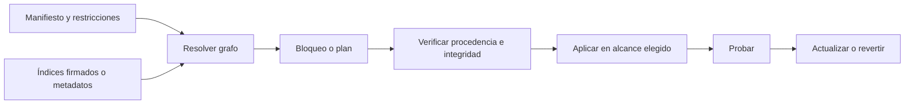

# SE-032 — Instalación de software y gestores de paquetes del sistema

[← SE-031](https://github.com/vladimiracunadev-create/modern-software-engineering-program/blob/main/classes/part-02-sistemas-operativos-terminal-y-automatizacion-base/se-031-variables-de-entorno-configuracion-y-secretos/README.md) · [↑ Parte 02](https://github.com/vladimiracunadev-create/modern-software-engineering-program/blob/main/classes/part-02-sistemas-operativos-terminal-y-automatizacion-base/README.md) · [📚 Índice completo](https://github.com/vladimiracunadev-create/modern-software-engineering-program/blob/main/classes/README.md) · [SE-033 →](https://github.com/vladimiracunadev-create/modern-software-engineering-program/blob/main/classes/part-02-sistemas-operativos-terminal-y-automatizacion-base/se-033-logs-del-sistema-y-diagnostico-de-fallos/README.md)

> Estado: **PLANNED** · Borrador público conservado íntegramente y sometido a auditoría técnica y pedagógica.

## Punto profesional y fundamento pedagógico

**Punto profesional.** La clase existe para distinguir paquetes del sistema, del lenguaje y artefactos descargados por procedencia y alcance.

**Por qué aparece aquí.** Se sitúa después de **Variables de entorno, configuración y secretos** y antes de **Logs del sistema y diagnóstico de fallos**: convierte el conocimiento anterior en una decisión observable que la clase siguiente podrá reutilizar. La continuidad se comprueba en el artefacto, no por compartir vocabulario.

**Error conceptual que debe corregir.** Mezclar gestores o ejecutar instalaciones sin plan de reversión.

**Secuencia de aprendizaje.** Antes de leer la solución, el estudiante predice el resultado del caso normal y del error conceptual anterior. Luego explica un caso resuelto paso a paso, construye un contraejemplo que cambie la decisión y, sin consultar el texto, reconstruye el mecanismo y lo aplica a una entrada nueva. La secuencia usa predicción, explicación propia, contraste y recuperación. [ICAP](https://icap.education.asu.edu/research) distingue participación de construcción de conocimiento; [How People Learn II](https://nap.nationalacademies.org/catalog/24783/how-people-learn-ii-learners-contexts-and-cultures) exige conectar conocimiento previo, contexto y transferencia; la [práctica de recuperación](https://pubmed.ncbi.nlm.nih.gov/16507066/) respalda producir de nuevo la explicación tras una demora; y [Education for Life and Work](https://nap.nationalacademies.org/resource/13398/dbasse_084153.pdf) exige devolución que explique la causa del error.

**Evidencia de aprendizaje.** Software-inventory.md con origen, versión, checksum o firma, alcance y rollback. Debe contener predicción previa, observación, explicación causal, contraejemplo, criterio de aceptación y una nota de qué dato haría cambiar la conclusión.

**Límite de la conclusión.** La presencia de firma no prueba ausencia de vulnerabilidades.

### Trazabilidad fuente → afirmación

| Fuente primaria u oficial | Afirmación que respalda | Lo que no prueba |
|---|---|---|
| [Microsoft Learn — WinGet](https://learn.microsoft.com/windows/package-manager/winget/) | documenta el comportamiento de Windows o PowerShell que se compara con el contrato POSIX | No demuestra por sí sola que el artefacto del estudiante sea correcto. |
| [Debian Administrator's Handbook — APT](https://www.debian.org/doc/manuals/debian-handbook/apt.en.html) | delimita el contrato técnico que debe cumplirse al distinguir paquetes del sistema, del lenguaje y artefactos descargados por procedencia y alcance | No demuestra por sí sola que el artefacto del estudiante sea correcto. |
| [Homebrew Documentation](https://docs.brew.sh/) | delimita el contrato técnico que debe cumplirse al distinguir paquetes del sistema, del lenguaje y artefactos descargados por procedencia y alcance | No demuestra por sí sola que el artefacto del estudiante sea correcto. |
| [Python Packaging User Guide](https://packaging.python.org/en/latest/) | define la semántica y los límites de la API de Python utilizada en el experimento | No demuestra por sí sola que el artefacto del estudiante sea correcto. |

## Antes de empezar

El kit de diagnóstico multiplataforma necesita herramientas auxiliares. “Instala la última versión” parece sencillo hasta que aparecen varios gestores, repositorios, ámbitos y rutas. Instalar modifica estado y añade confianza en publicadores y mecanismos de actualización. La pregunta profesional no es solo cómo instalar, sino qué se instala, desde dónde, para quién y cómo se revierte.

### Resultado de aprendizaje

Al terminar podrás evaluar una instalación por identidad, procedencia, integridad, alcance, resolución de dependencias y camino de desinstalación.

## Prerrequisitos

`SE-031`, un entorno desechable o modo de simulación y permiso explícito para cualquier instalación real. La práctica puede completarse solo con inspección documental si no existe un entorno seguro.

## Problema auténtico

El kit de diagnóstico multiplataforma requiere una herramienta y una guía recomienda “instala el paquete del mismo nombre”. Existen homónimos en varios registros, el comando solicita elevación y ejecuta scripts. La instrucción omite identidad, origen, alcance y reversión.

## Objetivos observables

Podrás describir paquete y grafo de dependencias; verificar procedencia disponible; elegir alcance; revisar un plan antes de aplicar; y demostrar qué revierte y qué permanece tras desinstalar.

## Temas y por qué importan

| Tema | Mecanismo | Decisión habilitada |
| --- | --- | --- |
| Identidad de paquete | combina nombre, ecosistema, origen y versión | evitar homónimos y confusión |
| Resolución | satisface restricciones de un grafo | anticipar cambios transitivos |
| Procedencia | relaciona artefacto con publicador y canal | fundamentar confianza disponible |
| Reversibilidad | inventaría efectos y estado | recuperar sin fingir limpieza total |
## Mapa conceptual

La verificación ocurre antes del cambio y la reversión se diseña antes de necesitarla. Un lockfile fija resoluciones, pero no convierte el origen en confiable.

## Conceptos y decisiones

### Un paquete combina artefactos, metadatos y relaciones

Un gestor no descarga únicamente un ejecutable. Interpreta nombre, versión, arquitectura, dependencias, conflictos, scripts y fuente. Luego resuelve un conjunto compatible e instala bajo reglas de alcance. La identidad debe incluir ecosistema y origen; el mismo nombre en otro registro puede no representar el mismo proyecto.

El kit de diagnóstico multiplataforma inventaría cada dependencia con gestor, repositorio, versión solicitada y resuelta, arquitectura, alcance y método de actualización.

### Resolver dependencias es satisfacer restricciones globales

Cada paquete expresa rangos y relaciones. El gestor busca una solución conjunta; actualizar uno puede cambiar otros. Un archivo de bloqueo conserva resoluciones para reproducibilidad, pero no garantiza disponibilidad futura, ausencia de vulnerabilidades ni equivalencia entre plataformas.

Guardar el plan antes de aplicar permite revisar cambios inesperados.

### Procedencia responde quién publicó y por qué confiamos

TLS protege el transporte en cierto tramo, no prueba por sí solo que el paquete sea el esperado. Firmas, hashes, repositorios configurados, identidades de publicador y metadatos verificables aportan señales distintas. Un hash copiado del mismo sitio comprometido tiene un modelo de confianza limitado.

Se prefiere documentación oficial del proyecto y del gestor. Ejecutar directamente un script remoto canalizado al shell reduce la oportunidad de inspección, fijación y auditoría.

### Alcance determina a quién y qué afecta

Una instalación puede ser del sistema, usuario, proyecto o entorno aislado. El alcance global simplifica descubrimiento pero aumenta conflictos y autoridad requerida. Un entorno por proyecto mejora reproducibilidad, aunque consume espacio y aún depende del runtime base.

El kit de diagnóstico multiplataforma prefiere dependencias del proyecto o herramientas ya provistas por el sistema. No eleva privilegios para evitar comprender una ruta.

### Instalar puede ejecutar código

Ganchos previos/posteriores y compilación nativa pueden ejecutarse durante la instalación. Revisar el nombre del paquete no basta. En automatización se limita origen, permisos, acceso de red y se conserva log. Para software sensible pueden requerirse artefactos preconstruidos, verificación adicional o entorno aislado.

### Reversibilidad se diseña antes del cambio

Desinstalar un paquete no siempre revierte configuración, servicios, datos o variables. Antes de aplicar se captura estado relevante, se usa modo de simulación cuando existe y se define qué conservar. Un rollback de paquete puede ser incompatible con datos migrados.

Los gestores oficiales —[WinGet](https://learn.microsoft.com/windows/package-manager/winget/), [APT](https://www.debian.org/doc/manuals/debian-handbook/apt.en.html) y [Homebrew](https://docs.brew.sh/)— tienen modelos diferentes. El kit de diagnóstico multiplataforma documenta adaptadores; no presenta comandos como intercambiables.

## Definiciones de trabajo

- **paquete:** artefactos, metadatos y acciones administradas como una unidad;
- **dependencia transitiva:** componente requerido a través de otra dependencia;
- **procedencia:** evidencia sobre origen y cadena de publicación;
- **alcance:** conjunto de usuarios, proyectos o sistema afectado;
- **reversibilidad:** capacidad demostrada de retirar cambios o volver a un estado definido.

## Caso conductor: el kit de diagnóstico multiplataforma verifica sus dependencias

El kit requiere un runtime con versión mínima y opcionalmente una herramienta de compresión. Antes de sugerir instalación, detecta capacidad y versión. Si falta lo opcional, produce un informe sin comprimir y marca modo degradado. Si falta lo esencial, entrega instrucciones específicas verificadas, pero no instala automáticamente.

El manifiesto fija dependencias de biblioteca; el informe registra resolución y origen sin afirmar que ello certifica seguridad. Una prueba crea un entorno limpio, instala, ejecuta, desinstala y comprueba qué archivos quedan.

## Práctica guiada

1. Elige una dependencia no privilegiada de laboratorio.
2. Localiza su fuente oficial y explica la cadena de confianza disponible.
3. Obtén el plan o simulación antes de instalar.
4. Instala en el alcance más estrecho posible y verifica versión/origen.
5. Desinstala y compara el estado anterior y posterior.
6. Redacta instrucciones alternativas para otra plataforma sin asumir equivalencia.

No agregues repositorios o gestores al sistema real solo para completar la práctica.

## Ejemplo mínimo

Un manifiesto pide `tool >=2,<3` y el gestor resuelve `2.7` más dos dependencias. El informe distingue restricción de versión resuelta y conserva el plan. Copiar solo `2.7` pierde el grafo y origen.

## Ejemplo profesional

Una actualización global rompe dos proyectos. El equipo migra la herramienta a entornos por proyecto, fija resoluciones y prueba desinstalación. Documenta que quedan cachés y datos, en vez de afirmar una reversión perfecta.

## Ejercicios

1. Construye un grafo con dependencia directa, transitiva y conflicto.
2. Evalúa qué prueba una firma, un hash y TLS, y qué no.
3. Compara alcance de sistema, usuario y proyecto para el kit de diagnóstico multiplataforma.

## Reto verificable

Produce un plan de instalación sin aplicarlo: identidad completa, fuentes, dependencias, scripts, alcance, cambios y reversión. Otra persona debe poder rechazarlo antes de ejecutar.

## Preguntas frecuentes

### ¿Estar en un repositorio oficial vuelve seguro un paquete?

No. Aporta una cadena de distribución y controles concretos, no garantía absoluta de comportamiento.

### ¿Un lockfile hace reproducible cualquier instalación?

Fija parte de la resolución; runtime, plataforma, disponibilidad y servicios externos pueden variar.

## Fallo controlado y diagnóstico

Usa simulación o un fixture con dos paquetes homónimos de orígenes ficticios. El kit de diagnóstico multiplataforma debe rechazar la identidad ambigua antes de instalar y explicar qué dato falta.

## Errores comunes y cómo corregirlos

| Síntoma | Causa conceptual | Corrección |
|---|---|---|
| Se instala un paquete homónimo | Se confió solo en el nombre | Verificar ecosistema, publicador, URL y firma/metadatos |
| Una actualización rompe otro proyecto | Se usó alcance global sin control de resolución | Aislar por proyecto y conservar manifiesto/bloqueo |
| La automatización ejecuta un script remoto | Se priorizó comodidad sobre inspección | Descargar desde fuente verificada, inspeccionar y fijar artefacto |
| Desinstalar deja un servicio activo | Se confundió paquete con todos sus efectos | Inventariar scripts, datos y servicios; probar reversión |
| Un lockfile se presenta como garantía total | Se ignoraron origen, runtime y plataforma | Documentar qué fija y qué permanece variable |

## Entorno y archivos clave

Entorno virtual o contenedor desechable, `manifest`, `lock`, `install-plan.md` y `reversal-report.md`. No eleva ni agrega fuentes al host.

## Seguridad, ética y accesibilidad

No canalices scripts remotos al shell ni publiques tokens de registro. Presenta el plan en formato textual legible y señala con palabras los cambios de riesgo.

## Transferencia

Aplica el análisis a una imagen de contenedor o extensión de editor. Compara identidad, origen, ejecución durante instalación y camino de retiro.

## Evaluación y evidencia

Se exige grafo, plan previo, justificación de procedencia y alcance, prueba de retiro o simulación honesta y estado residual. Instalar correctamente no basta.

## Criterio de cierre

Puedes presentar un plan de instalación verificable, justificar origen y alcance, y demostrar instalación/desinstalación en laboratorio con diferencias remanentes declaradas.

## Límites y siguiente paso

No realizamos auditoría completa de cadena de suministro ni declaramos seguro un paquete por estar firmado. Incluso una instalación correcta puede fallar; la siguiente clase desarrolla logs y observabilidad para reconstruir qué ocurrió.

## Fuentes

- [Microsoft Learn — WinGet](https://learn.microsoft.com/windows/package-manager/winget/) — documenta el comportamiento de Windows o PowerShell que se compara con el contrato POSIX.
- [Debian Administrator's Handbook — APT](https://www.debian.org/doc/manuals/debian-handbook/apt.en.html) — delimita el contrato técnico que debe cumplirse al distinguir paquetes del sistema, del lenguaje y artefactos descargados por procedencia y alcance.
- [Homebrew Documentation](https://docs.brew.sh/) — delimita el contrato técnico que debe cumplirse al distinguir paquetes del sistema, del lenguaje y artefactos descargados por procedencia y alcance.
- [Python Packaging User Guide](https://packaging.python.org/en/latest/) — define la semántica y los límites de la API de Python utilizada en el experimento.

## Glosario

- **Dependencia:** componente requerido bajo una relación y restricción declaradas.
- **Lockfile:** registro de resoluciones concretas para repetir una instalación.
- **Procedencia:** evidencia sobre origen y cadena de publicación de un artefacto.
- **Repositorio de paquetes:** servicio e índice desde el que un gestor obtiene metadatos y artefactos.
- **Transacción:** conjunto de cambios tratado como una unidad según garantías del gestor.

---
[← SE-031](https://github.com/vladimiracunadev-create/modern-software-engineering-program/blob/main/classes/part-02-sistemas-operativos-terminal-y-automatizacion-base/se-031-variables-de-entorno-configuracion-y-secretos/README.md) · [↑ Parte 02](https://github.com/vladimiracunadev-create/modern-software-engineering-program/blob/main/classes/part-02-sistemas-operativos-terminal-y-automatizacion-base/README.md) · [📚 Índice completo](https://github.com/vladimiracunadev-create/modern-software-engineering-program/blob/main/classes/README.md) · [SE-033 →](https://github.com/vladimiracunadev-create/modern-software-engineering-program/blob/main/classes/part-02-sistemas-operativos-terminal-y-automatizacion-base/se-033-logs-del-sistema-y-diagnostico-de-fallos/README.md)
