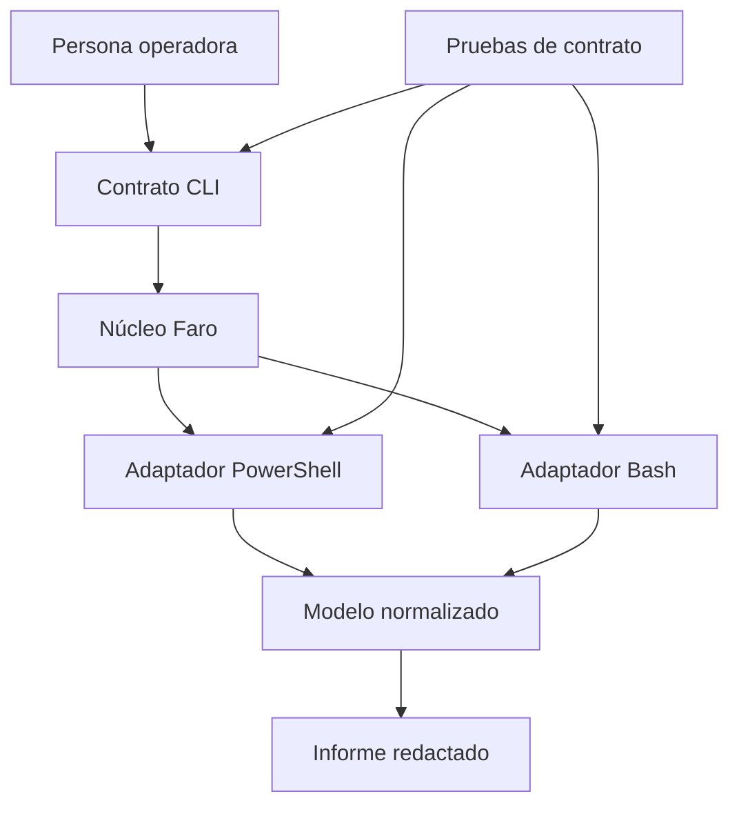
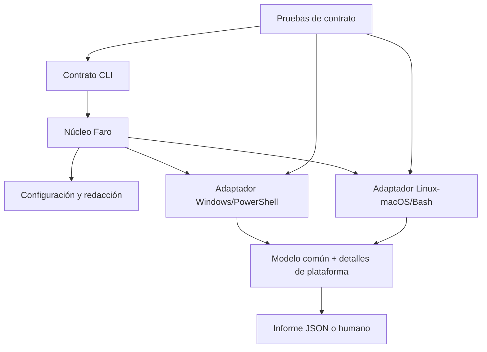

# SE-036 — Proyecto: kit de diagnóstico multiplataforma

[← SE-035](https://github.com/vladimiracunadev-create/software-engineering-learning-suite/blob/main/classes/part-02-sistemas-operativos-terminal-y-automatizacion-base/se-035-taller-preparar-y-reparar-un-entorno-reproducible/README.md) · [↑ Parte 02](https://github.com/vladimiracunadev-create/software-engineering-learning-suite/blob/main/classes/part-02-sistemas-operativos-terminal-y-automatizacion-base/README.md) · [📚 Índice completo](https://github.com/vladimiracunadev-create/software-engineering-learning-suite/blob/main/classes/README.md) · [SE-037 →](https://github.com/vladimiracunadev-create/software-engineering-learning-suite/blob/main/classes/part-03-redes-internet-y-protocolos/se-037-modelos-osi-y-tcp-ip-como-herramientas-de-diagnostico/README.md)

> Estado: **GUIDED**. Proyecto educativo local de solo lectura; no es soporte remoto, herramienta forense ni producto de seguridad certificado.

## Antes de empezar

La Parte 2 concluye con una entrega, no con un cuestionario. Construirás **Faro**, un kit local que describe el entorno de Pulso, valida precondiciones, explica hallazgos y exporta evidencia segura. El valor no reside en acumular comandos: reside en convertir los mecanismos estudiados en un sistema pequeño que otra persona pueda operar y auditar.

### Resultado de aprendizaje

Al terminar podrás entregar una herramienta multiplataforma con contrato explícito, adaptadores probados, diagnóstico causal, documentación operativa y límites honestos.

## Prerrequisitos

Parte 2 completa y evidencias de `SE-035`. Debes contar con una plataforma ejecutable; las demás pueden permanecer diseñadas si no existe acceso, siempre que la matriz lo diga.

## Problema auténtico

Los diagnósticos anteriores viven en comandos y notas personales. Otra persona no sabe qué ejecutar, qué datos comparte, cómo interpretar un código ni si la herramienta modifica el equipo. El conocimiento existe, pero aún no es un producto operable.

## Objetivos observables

Podrás definir un contrato versionado; separar núcleo y adaptadores; construir modo de solo lectura; probar degradación y redacción; publicar matriz real; y conducir una demostración reproducible por terceros.

## Temas y por qué importan

| Tema | Mecanismo | Decisión habilitada |
| --- | --- | --- |
| Contrato versionado | estabiliza entradas, salidas y estados | permitir consumidores y evolución |
| Núcleo/adaptador | aísla intención de detalles locales | portar sin copiar errores |
| Solo lectura | limita efectos predeterminados | ejecutar diagnóstico con menor riesgo |
| Matriz y evidencia | separa diseño de ejecución | declarar soporte honesto |

## Mapa conceptual



La persona interactúa con un contrato estable. Los adaptadores observan plataformas, el núcleo interpreta y el informe separa evidencia, inferencia y recomendación.

## Conceptos y decisiones

### Un núcleo común expresa intención

El núcleo define operaciones independientes de shell: describir plataforma, resolver una ruta, validar configuración, comprobar una dependencia, observar un proceso propio y construir informe. También define esquema de salida, códigos y política de redacción.

No contiene comandos concatenados ni rutas globales. Recibe resultados de adaptadores y decide qué significan bajo el contrato.

### Los adaptadores contienen diferencias de plataforma

PowerShell y Bash implementan capacidades con herramientas documentadas. Cada adaptador informa `supported`, `unavailable` o `failed`, junto con evidencia segura. Una capacidad ausente no se convierte en dato inventado.



El diagrama obliga a distinguir modelo común y detalle específico. Es aceptable que una plataforma aporte menos datos; no lo es ocultarlo.

### El modo predeterminado es de solo lectura

Faro observa y propone. Cualquier reparación opcional exige una orden separada, vista previa, confirmación apropiada y reversión documentada. Para este proyecto basta con generar un plan; no se requiere modificar permisos, instalar paquetes ni terminar procesos.

Esto reduce riesgo y vuelve las pruebas repetibles.

### El informe separa evidencia, inferencia y recomendación

Cada hallazgo contiene:

```json
{
  "code": "config.path.missing",
  "severity": "error",
  "evidence": {"source": "environment", "exists": false},
  "interpretation": "La ruta efectiva no existe",
  "next_test": "Ejecutar con un entorno mínimo",
  "remediation": "Corregir la fuente de configuración en su ámbito"
}
```

Los campos sensibles se omiten o redactan antes de serializar. El informe incluye versión del esquema y de Faro para interpretación futura.

### Las pruebas demuestran contratos y degradación

El conjunto mínimo cubre:

- ruta existente, ausente, con espacios y tipo incorrecto;
- precedencia de configuración y valores inválidos;
- dependencia compatible, incompatible y opcional ausente;
- códigos de salida y separación stdout/stderr;
- secreto centinela ausente de todas las salidas;
- capacidad no disponible reportada como diagnóstico parcial;
- ejecución desde un directorio distinto al proyecto.

Las pruebas específicas de plataforma se etiquetan. Un workflow que no ejecuta macOS no prueba macOS; el README muestra matriz real.

### La entrega incluye operación y mantenimiento

El repositorio del proyecto contiene inicio rápido, requisitos, arquitectura, esquema, códigos de salida, matriz, amenazas básicas, procedimiento de diagnóstico y limpieza. Las dependencias están fijadas dentro de límites razonados y su actualización tiene un procedimiento.

Un ejemplo reproducible usa datos ficticios y genera un informe esperado. La documentación enlaza a fuentes oficiales cerca de las decisiones sensibles.

## Definiciones de trabajo

- **contrato versionado:** interfaz observable cuya evolución se declara;
- **núcleo:** reglas de interpretación independientes de comandos locales;
- **adaptador:** implementación de capacidades para una plataforma;
- **hallazgo:** relación estructurada entre evidencia, interpretación y siguiente prueba;
- **matriz real:** registro que diferencia diseñado, ejecutado, aprobado y no soportado.

## Caso conductor: demostración final de Faro

La demostración parte de un entorno con dos defectos: variable obsoleta y dependencia incompatible. La persona evaluadora ejecuta Faro sin conocerlos. El kit:

1. identifica plataforma y capacidades;
2. muestra configuración efectiva con secreto redactado;
3. resuelve la ruta y explica que no existe;
4. comprueba la versión de dependencia;
5. emite dos hallazgos independientes;
6. propone pruebas, no cambios automáticos;
7. sale con estado de precondición fallida;
8. tras corregir cada causa, genera un informe limpio.

La demostración se repite desde otro directorio para probar que las rutas no dependen de la sesión accidental.

## Ejemplo mínimo

`faro inspect --path laboratorio` produce JSON válido en stdout, progreso en stderr y código cero. Con ruta ausente produce un hallazgo estructurado y código de precondición, sin traza interna ni modificación.

## Ejemplo profesional

Un equipo de soporte recibe un paquete diagnóstico de otra plataforma. La versión del esquema, procedencia de campos y límites le permiten revisar sin pedir el entorno completo. La matriz indica que macOS fue diseñado pero no ejecutado, evitando una promesa falsa.

## Práctica guiada

1. Revisa el contrato antes de implementar y congela fixtures.
2. Completa una ruta vertical en la plataforma disponible.
3. Añade el segundo adaptador o un doble claramente marcado.
4. Ejecuta fallos de ruta, configuración, dependencia y capacidad ausente.
5. Busca el secreto centinela en todos los artefactos.
6. Entrega a otra persona y corrige fricciones observadas.

## Ejercicios

1. Diseña una migración de esquema compatible o una ruptura explícita.
2. Explica qué queda en el núcleo y qué pertenece a `platform_details`.
3. Define cuándo un diagnóstico parcial debe terminar con código distinto de cero.

## Reto verificable

Una persona sin contexto debe ejecutar la demo, identificar dos fallos, aplicar correcciones manuales y generar un informe limpio usando solo el README. Registra tiempo, dudas y cambios de documentación.

## Preguntas frecuentes

### ¿Dos scripts separados ya son un diseño multiplataforma?

No. Necesitan contrato común, pruebas comparables y diferencias declaradas.

### ¿Solo lectura significa riesgo cero?

No. Observar puede revelar información o consumir recursos; minimización y autorización siguen siendo necesarias.

## Fallo controlado y diagnóstico

Retira una capacidad opcional del fixture. Faro debe emitir diagnóstico parcial, mantener esquema válido y explicar degradación. Corrige cualquier éxito silencioso o excepción no estructurada.

## Plan de trabajo y entregables

### Hito 1 — Contrato antes del código

Entrega esquema de entrada/salida, códigos, matriz objetivo y modelo de amenazas básico. Revisión: otra persona puede anticipar qué hará Faro y qué nunca hará.

### Hito 2 — Núcleo y un adaptador

Implementa la ruta vertical completa en una plataforma: invocación, observación, normalización, hallazgo e informe. Revisión: casos felices y adversos automatizados.

### Hito 3 — Segundo adaptador

Implementa el otro shell conservando semántica. Revisión: mismas pruebas de contrato, más divergencias documentadas. Si no hay acceso a otra plataforma, la entrega se marca “diseñada, no ejecutada” y se aporta un plan verificable.

### Hito 4 — Seguridad y recuperación

Prueba redacción, límites de tamaño, temporales, interrupción y limpieza. Revisión: ninguna prueba deja estado global y el secreto centinela no aparece.

### Hito 5 — Entrega reproducible

Una segunda persona sigue el README desde cero, ejecuta la demostración y registra fricciones. Se corrige la documentación y se publica la evidencia final.

## Rúbrica de evaluación

| Dimensión | Insuficiente | Competente | Profesional |
|---|---|---|---|
| Modelo causal | Lista comandos | Relaciona hallazgos con mecanismos | Distingue alternativas y límites |
| Portabilidad | Afirma compatibilidad | Define adaptadores y matriz | Aporta pruebas cruzadas y degradación explícita |
| Seguridad | Imprime entorno/datos | Redacta campos conocidos | Minimiza desde el diseño y prueba filtraciones |
| Operación | Solo caso feliz | Códigos y errores útiles | Recuperación, limpieza y evidencia reproducible |
| Documentación | Pasos sin contexto | Contrato y requisitos claros | Una tercera persona reproduce y audita |

No se compensa una filtración de secreto o una modificación no declarada con más funcionalidades.

## Errores comunes y cómo corregirlos

| Síntoma | Causa conceptual | Corrección |
|---|---|---|
| Faro se convierte en un script de cien comandos | No existe modelo ni contrato | Separar capacidades, adaptadores y decisiones |
| El JSON cambia entre plataformas sin versión | Se mezcló detalle con esquema común | Versionar esquema y aislar `platform_details` |
| La demo necesita editar el código | Configuración y entrega no están resueltas | Definir interfaz, ejemplos y precedencia |
| La matriz marca sistemas no ejecutados | Se confundió intención con evidencia | Publicar estado diseñado/probado por celda |
| La herramienta “repara” por defecto | Se amplió el riesgo sin necesidad | Mantener solo lectura y plan explícito |

## Entorno y archivos clave

Repositorio del proyecto con `src/`, `adapters/`, `tests/`, `fixtures/`, `schema/`, `README.md`, `SECURITY.md` y `support-matrix.md`. Los artefactos se generan bajo `work/SE-036/`.

## Seguridad, ética y accesibilidad

Solo datos ficticios en ejemplos, redacción previa a salida, límites de tamaño y ningún cambio privilegiado. La CLI y documentación deben ser navegables, legibles y no depender de color.

## Transferencia

Extiende el contrato para diagnosticar una llamada de red en la Parte 3. Identifica qué nuevos datos requieren consentimiento y qué adaptadores deben cambiar.

## Evaluación y evidencia

Se evalúan contrato, modelo causal, portabilidad demostrada, seguridad, recuperación y documentación. Una funcionalidad sin prueba o un soporte no ejecutado se registra como deuda, no como completado.

## Criterio de cierre

La Parte 2 queda completada cuando Faro puede ser ejecutado por otra persona, explica al menos dos fallos independientes, conserva contratos en PowerShell y Bash, no expone el secreto centinela, deja el entorno limpio y publica exactamente qué plataformas y escenarios fueron probados.

## Límites y siguiente paso

Faro es un kit educativo local, no un agente de soporte remoto, herramienta forense ni producto de seguridad certificado. No ejecuta reparaciones privilegiadas. La siguiente parte del programa utilizará este entorno reproducible para estudiar redes: nombres, direcciones, transporte y fallos entre procesos que ya no comparten una sola máquina.

## Fuentes

- [The Open Group Base Specifications, Issue 8](https://pubs.opengroup.org/onlinepubs/9799919799/)
- [Microsoft Learn — PowerShell documentation](https://learn.microsoft.com/powershell/)
- [GNU Bash Reference Manual](https://www.gnu.org/software/bash/manual/)
- [Microsoft Learn — WSL documentation](https://learn.microsoft.com/windows/wsl/)
- [OWASP — Logging Cheat Sheet](https://cheatsheetseries.owasp.org/cheatsheets/Logging_Cheat_Sheet.html)

## Glosario

- **Capacidad:** operación comprobable que una plataforma ofrece al adaptador.
- **Degradación explícita:** reducción funcional informada en datos, mensajes y estado.
- **Matriz de soporte:** tabla que separa plataformas objetivo de escenarios efectivamente probados.
- **Solo lectura:** modo que observa sin cambiar deliberadamente el estado inspeccionado.
- **Versión de esquema:** identificador que permite interpretar la estructura de un informe.

---
[← SE-035](https://github.com/vladimiracunadev-create/software-engineering-learning-suite/blob/main/classes/part-02-sistemas-operativos-terminal-y-automatizacion-base/se-035-taller-preparar-y-reparar-un-entorno-reproducible/README.md) · [↑ Parte 02](https://github.com/vladimiracunadev-create/software-engineering-learning-suite/blob/main/classes/part-02-sistemas-operativos-terminal-y-automatizacion-base/README.md) · [📚 Índice completo](https://github.com/vladimiracunadev-create/software-engineering-learning-suite/blob/main/classes/README.md) · [SE-037 →](https://github.com/vladimiracunadev-create/software-engineering-learning-suite/blob/main/classes/part-03-redes-internet-y-protocolos/se-037-modelos-osi-y-tcp-ip-como-herramientas-de-diagnostico/README.md)
