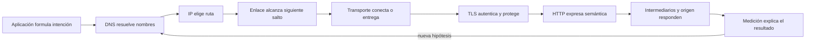

# Parte 3 — Redes, Internet y protocolos

Una aplicación distribuida no «usa Internet» como una caja única. Antes de recibir una respuesta, el cliente obtiene configuración local, resuelve un nombre, elige dirección y ruta, alcanza un siguiente salto, establece transporte, negocia confianza, atraviesa intermediarios y expresa una intención de aplicación. Cada fase conserva estado, garantías y modos de fallo diferentes. Esta parte enseña a recorrer esa cadena sin convertir una coincidencia temporal en causa.

El caso conductor es una **petición observable de extremo a extremo** que amplía el kit de diagnóstico multiplataforma de la Parte 2. El kit ya podía describir plataforma, procesos y configuración; ahora se añade el exterior para explicar por qué una petición llegó, por qué no llegó o por qué respondió algo distinto. En cada clase se incorpora una capa de evidencia hasta entregar un servicio local que mide, degrada y se recupera de fallos controlados.

## Pregunta rectora

> ¿Dónde se define una garantía de comunicación, dónde aparece el síntoma y qué evidencia permite localizar la primera divergencia?

## Antes del recorrido clase por clase

La pedagogía de esta parte sigue cuatro movimientos conectados:

1. **Localizar:** identificar host, interfaz, enlace, dirección, nombre, endpoint e intermediario sin mezclarlos.
2. **Explicar:** describir la transición que realiza cada protocolo y el alcance de su garantía.
3. **Contrastar:** formular al menos una hipótesis rival y elegir una prueba que produzca resultados distintos.
4. **Recuperar:** restaurar el laboratorio y demostrar que el sistema vuelve a un estado coherente.

El orden del diagrama es causal, no una promesa de implementación literal. Una conexión reutilizada puede omitir handshakes; una caché puede responder antes del origen; QUIC integra transporte y seguridad; una aplicación puede usar su propio resolver. Precisamente por eso cada evidencia debe indicar desde qué punto y en qué instante fue obtenida.

## Lo que cambia al completar esta parte

Podrás leer una petición como un sistema de estados y contratos. Dejarás de usar «la red está caída» como explicación suficiente: distinguirás fallo de resolución, ruta, transporte, confianza, semántica, caché o capacidad; diseñarás timeouts y reintentos con límites; y producirás trazas que otra persona pueda revisar sin acceder a secretos ni tráfico ajeno.

## Guía razonada clase por clase

La guía sigue una sola petición observable de extremo a extremo y cambia el punto de observación en cada clase.
No presenta protocolos como vocabulario aislado: explica qué transición realiza cada
capa, qué garantía ofrece, qué síntoma deja al fallar y qué evidencia alimenta el paso
siguiente.

### Bloque 1 — Localizar la petición desde el enlace hasta el transporte

#### SE-037 — Modelos OSI y TCP/IP como herramientas de diagnóstico

Las capas son modelos para separar responsabilidades, no una fotografía exacta de todo
sistema. La clase ubica unidades, identificadores, garantías y puntos de observación de
la petición observable de extremo a extremo; además muestra cómo encapsulación y desencapsulación permiten que un síntoma de
aplicación tenga una causa en otra frontera sin que todas las capas estén «caídas».

El estudiante construye una matriz síntoma → capa candidata → observación → hipótesis
rival. No diagnostica por el nombre de una herramienta. La matriz define dónde mirar el
primer salto físico y lógico en `SE-038` y permanecerá como índice causal del resto de
la parte.

#### SE-038 — Ethernet, Wi-Fi, direccionamiento y redes locales

Antes de llegar a Internet, una trama debe alcanzar el siguiente salto dentro de una
red local. La clase diferencia interfaz, dirección MAC, dirección IP, medio, asociación,
switching y resolución de vecinos. Señal Wi-Fi alta no implica baja pérdida, y conocer
una MAC no demuestra que el destino esté en el mismo enlace.

La petición observable de extremo a extremo registra interfaces, estado, MTU y vecino relevante en un laboratorio autorizado,
comparando un caso sano con uno donde falla el primer salto. El resultado explica el
alcance local sin capturar tráfico ajeno. `SE-039` extiende el recorrido a prefijos,
rutas y traducciones entre redes.

#### SE-039 — IPv4, IPv6, subredes, rutas y NAT

Una dirección no determina por sí sola el camino. Prefijo, tabla de rutas, métrica,
política y siguiente salto intervienen antes de transmitir; NAT puede reescribir campos
sin convertirse en firewall ni garantía de conectividad. La clase compara IPv4 e IPv6
sin tratar el segundo como una versión con direcciones más largas.

El estudiante predice una ruta antes de observarla, identifica coincidencia de prefijo
más específica y registra traducciones solo donde puede verificarlas. La petición observable de extremo a extremo produce un
mapa de origen, saltos conocidos y fronteras inferidas. Con el camino disponible,
`SE-040` decide qué garantías deben pertenecer al transporte.

#### SE-040 — TCP, UDP, QUIC y decisiones de transporte

TCP ofrece un flujo ordenado y fiable, no mensajes ni ausencia de latencia; UDP entrega
datagramas sin esas garantías; QUIC integra seguridad y múltiples flujos sobre UDP. La
clase relaciona handshake, pérdida, retransmisión, control de congestión y cierre con la
necesidad de la petición observable de extremo a extremo, evitando elegir por velocidad nominal.

La práctica compara una interacción normal, una pérdida controlada y un timeout. El
estudiante declara quién reintenta, qué operación puede repetirse y dónde termina el
deadline. El transporte alcanza direcciones; `SE-041` explica cómo un nombre se convierte
en candidatos y por qué ese paso puede divergir antes de abrir conexión.

### Bloque 2 — Expresar identidad e intención de aplicación

#### SE-041 — DNS, nombres, resolución y fallos

DNS es un sistema distribuido de datos con autoridad, delegación, caché y vigencia; no
es una libreta global instantánea. La clase recorre stub resolver, recursión, respuestas
autoritativas, CNAME, registros A/AAAA, TTL y respuestas negativas. Distingue nombre
inexistente, ausencia de tipo y fallo temporal.

La petición observable de extremo a extremo conserva consulta, servidor observado, respuesta, TTL y momento, y compara caché
fría con caliente sin asumir que todos los resolvers siguen la misma ruta. La salida es
un conjunto de endpoints candidatos y límites de vigencia. `SE-042` usa uno de ellos
para estudiar la semántica que viaja sobre la conexión.

#### SE-042 — HTTP, semántica, caché y negociación

HTTP define método, destino, representación, estado y metadatos; un `200` no demuestra
que el resultado sea correcto para el dominio. La clase relaciona seguridad e
idempotencia de métodos con reintentos, separa autenticación de caché y explica
validadores, negociación y cuerpos de error.

El estudiante diseña una solicitud de la petición observable de extremo a extremo y predice respuestas para éxito, validación,
conflicto y dependencia no disponible. Luego compara respuesta fresca, validada y
servida por caché. Ese contrato necesita saber con quién habla y quién puede observarlo;
`SE-043` añade autenticación del servidor y protección en tránsito.

#### SE-043 — TLS, certificados y confianza en tránsito

TLS protege un canal bajo parámetros negociados; no garantiza que la aplicación sea
honesta ni que el endpoint esté autorizado por el negocio. La clase conecta nombre,
cadena de certificados, almacén de confianza, vigencia, handshake y claves de sesión,
y explica por qué desactivar verificación transforma un diagnóstico en otro sistema.

La petición observable de extremo a extremo registra versión, nombre verificado, emisor y error sin exponer secretos. La
práctica contrasta certificado válido, nombre incorrecto y confianza ausente con un
laboratorio controlado. Como el canal puede terminar antes del origen, `SE-044` ubica
proxies, balanceadores, gateways y CDN en la cadena de responsabilidad.

#### SE-044 — Proxies, balanceadores, gateways y CDN

Un intermediario puede terminar TLS, reescribir encabezados, seleccionar backend,
almacenar respuestas o aplicar políticas. La clase distingue proxy directo e inverso,
balanceo, gateway y CDN por función y punto de control, no por nombres comerciales. Una
misma respuesta puede provenir de caché, borde u origen.

El estudiante dibuja terminaciones y autoridades de la petición observable de extremo a extremo, sigue un identificador de
correlación y localiza dónde cambia la respuesta. También declara qué cabeceras son
confiables solo después de una frontera administrada. `SE-045` estudia qué ocurre cuando
la conversación persiste y productor y consumidor dejan de avanzar al mismo ritmo.

#### SE-045 — Sockets, conexiones persistentes y tiempo real

Un socket es un endpoint del sistema operativo, no una promesa de mensaje completo. La
clase diferencia conexión, flujo, framing, half-close, keepalive y liveness de
aplicación; analiza conexiones HTTP reutilizadas y WebSocket sin llamar «tiempo real» a
cualquier canal abierto.

La petición observable de extremo a extremo implementa lectura delimitada, cancelación y presupuesto, y reproduce un consumidor
lento. El estudiante observa colas y cierre sin bucles infinitos ni recursos huérfanos.
Las señales reunidas aún pueden inducir conclusiones falsas si se miden mal; `SE-046`
define captura, alcance, reloj y privacidad.

### Bloque 3 — Medir, integrar y recuperar

#### SE-046 — Captura, medición y diagnóstico de tráfico

Capturar paquetes, medir DNS o cronometrar una solicitud son observaciones distintas.
La clase define punto de captura, dirección, filtros, relojes, pérdida instrumental y
sesgo; recuerda que cifrado limita el contenido visible y que una captura autorizada
puede contener identificadores, nombres y cargas sensibles.

El estudiante diseña primero la pregunta y captura después la señal mínima. Alinea
marcas de aplicación, resolución, transporte y HTTP, separando observado de inferido.
El resultado es una línea temporal disputable que `SE-047` deberá usar para explicar
una petición completa y no una colección de pantallazos.

#### SE-047 — Taller: seguir una petición de extremo a extremo

El taller introduce una degradación desconocida entre cliente y servicio local. La
investigación debe comenzar con predicciones rivales y recorrer configuración, DNS,
ruta, transporte, TLS, intermediarios y HTTP solo hasta encontrar la primera
divergencia. Saltar capas por intuición puede corregir el síntoma y perder la causa.

El estudiante entrega dos líneas temporales alineadas —sana y degradada— con evidencia,
incertidumbre y recuperación. Otra persona debe reconstruir la conclusión. `SE-048`
convierte ese procedimiento en comportamiento permanente del servicio mediante
timeouts, resultados tipados, observabilidad y runbook.

#### SE-048 — Proyecto: servicio observable y tolerante a fallos de red

La petición observable de extremo a extremo se cierra como servicio local que comunica éxito, degradación y fallo sin bloquear
indefinidamente. La clase integra deadlines, reintentos limitados, idempotencia,
correlación, métricas por fase y redacción. Tolerar un fallo no significa ocultarlo: el
consumidor debe conocer qué resultado obtuvo y qué parte quedó incompleta.

La aceptación inyecta fallos deterministas de resolución, conexión, confianza, respuesta
y consumidor lento; luego demuestra recuperación y limpieza. El proyecto declara redes
y versiones probadas, además de lo no observado. Sus trazas se convierten en la materia
prima que la Parte 4 transformará en modelos y estrategias contrastables.

## Resumen operativo del recorrido

| Clase | Núcleo profesional | Aporte acumulativo a la petición observable de extremo a extremo |
|---|---|---|
| [SE-037](https://github.com/vladimiracunadev-create/software-engineering-learning-suite/blob/main/classes/part-03-redes-internet-y-protocolos/se-037-modelos-osi-y-tcp-ip-como-herramientas-de-diagnostico/) | Modelos OSI y TCP/IP como herramientas de diagnóstico | Convierte las capas en una matriz de diagnóstico |
| [SE-038](https://github.com/vladimiracunadev-create/software-engineering-learning-suite/blob/main/classes/part-03-redes-internet-y-protocolos/se-038-ethernet-wi-fi-direccionamiento-y-redes-locales/) | Ethernet, Wi-Fi, direccionamiento y redes locales | Explica el primer salto y la red local |
| [SE-039](https://github.com/vladimiracunadev-create/software-engineering-learning-suite/blob/main/classes/part-03-redes-internet-y-protocolos/se-039-ipv4-ipv6-subredes-rutas-y-nat/) | IPv4, IPv6, subredes, rutas y NAT | Hace visibles prefijos, rutas y traducciones |
| [SE-040](https://github.com/vladimiracunadev-create/software-engineering-learning-suite/blob/main/classes/part-03-redes-internet-y-protocolos/se-040-tcp-udp-quic-y-decisiones-de-transporte/) | TCP, UDP, QUIC y decisiones de transporte | Selecciona transporte por garantías |
| [SE-041](https://github.com/vladimiracunadev-create/software-engineering-learning-suite/blob/main/classes/part-03-redes-internet-y-protocolos/se-041-dns-nombres-resolucion-y-fallos/) | DNS, nombres, resolución y fallos | Reconstruye resolución, autoridad y caché |
| [SE-042](https://github.com/vladimiracunadev-create/software-engineering-learning-suite/blob/main/classes/part-03-redes-internet-y-protocolos/se-042-http-semantica-cache-y-negociacion/) | HTTP, semántica, caché y negociación | Diseña mensajes, estados y reutilización HTTP |
| [SE-043](https://github.com/vladimiracunadev-create/software-engineering-learning-suite/blob/main/classes/part-03-redes-internet-y-protocolos/se-043-tls-certificados-y-confianza-en-transito/) | TLS, certificados y confianza en tránsito | Valida identidad y confianza en tránsito |
| [SE-044](https://github.com/vladimiracunadev-create/software-engineering-learning-suite/blob/main/classes/part-03-redes-internet-y-protocolos/se-044-proxies-balanceadores-gateways-y-cdn/) | Proxies, balanceadores, gateways y CDN | Ubica decisiones de intermediarios |
| [SE-045](https://github.com/vladimiracunadev-create/software-engineering-learning-suite/blob/main/classes/part-03-redes-internet-y-protocolos/se-045-sockets-conexiones-persistentes-y-tiempo-real/) | Sockets, conexiones persistentes y tiempo real | Gestiona vida útil y presión de conexiones |
| [SE-046](https://github.com/vladimiracunadev-create/software-engineering-learning-suite/blob/main/classes/part-03-redes-internet-y-protocolos/se-046-captura-medicion-y-diagnostico-de-trafico/) | Captura, medición y diagnóstico de tráfico | Mide fases con alcance y privacidad |
| [SE-047](https://github.com/vladimiracunadev-create/software-engineering-learning-suite/blob/main/classes/part-03-redes-internet-y-protocolos/se-047-taller-seguir-una-peticion-de-extremo-a-extremo/) | Taller: seguir una petición de extremo a extremo | Integra una petición extremo a extremo |
| [SE-048](https://github.com/vladimiracunadev-create/software-engineering-learning-suite/blob/main/classes/part-03-redes-internet-y-protocolos/se-048-proyecto-servicio-observable-y-tolerante-a-fallos-de-red/) | Proyecto: servicio observable y tolerante a fallos de red | Entrega la petición observable de extremo a extremo observable y recuperable |

## Hilo pedagógico

Las clases 37 a 40 construyen el sustrato: modelo, enlace, IP y transporte. Las clases 41 a 45 recorren la conversación visible por una aplicación: nombre, HTTP, confianza, intermediarios y persistencia. La clase 46 convierte señales en mediciones responsables. El taller 47 integra la línea temporal y el proyecto 48 transforma el aprendizaje en un servicio con contratos de fallo.

No se adelanta la solución con una herramienta. Primero se formula la pregunta; después se elige `curl`, la tabla de rutas, un resolver o una captura porque hace visible una transición concreta. Cada práctica conserva caso sano, degradado y recuperado. Cada diagrama debe tener explicación textual y cada traza debe minimizar datos.

## Evidencias acumulativas

1. **Mapa de fronteras:** unidades, identidades, terminaciones y alcance de cada protocolo.
2. **Bitácora de hipótesis:** hecho, interpretación, alternativa, prueba y decisión.
3. **Trazas comparadas:** una petición sana y una degradada, alineadas por primera divergencia.
4. **Matriz de fallos:** DNS, transporte, TLS, HTTP, caché y consumidor lento con recuperación.
5. **Servicio la petición observable de extremo a extremo:** resultado tipado, deadlines, redacción, correlación, métricas y runbook.

## Criterios de aprobación del proyecto

- el destino está autorizado y validado; no permite usar el servicio contra redes internas arbitrarias;
- cada fase tiene timeout y cabe dentro de un deadline total;
- los reintentos se limitan a condiciones temporales y operaciones seguras o idempotentes;
- logs y métricas distinguen fase y resultado sin filtrar credenciales;
- los fallos son deterministas, reproducibles y restaurables;
- una segunda persona puede diagnosticar un caso con los artefactos, sin explicación oral;
- los límites del laboratorio y de las RFC se declaran expresamente.

## Preguntas de control

Antes de cerrar una clase, responde: ¿qué identificador observé?, ¿en qué alcance es válido?, ¿qué garantía estoy usando?, ¿qué hipótesis rival explica el mismo síntoma?, ¿qué prueba las separa?, ¿qué dato sensible podría haber capturado?, ¿cómo demuestro recuperación?

## Fuentes base

- [RFC 1122 — Requirements for Internet Hosts](https://www.rfc-editor.org/rfc/rfc1122)
- [RFC 8200 — IPv6](https://www.rfc-editor.org/rfc/rfc8200)
- [RFC 9293 — TCP](https://www.rfc-editor.org/rfc/rfc9293)
- [RFC 9000 — QUIC](https://www.rfc-editor.org/rfc/rfc9000)
- [RFC 1034 y RFC 1035 — DNS](https://www.rfc-editor.org/rfc/rfc1034)
- [RFC 8446 — TLS 1.3](https://www.rfc-editor.org/rfc/rfc8446)
- [RFC 9110 y RFC 9111 — HTTP y caché](https://www.rfc-editor.org/rfc/rfc9110)
- [RFC 6455 — WebSocket](https://www.rfc-editor.org/rfc/rfc6455)

Las fuentes normativas fijan vocabulario y comportamiento de protocolo. No prueban la configuración de una red concreta ni reemplazan políticas del sistema, documentación del proveedor o evidencia obtenida con autorización.
