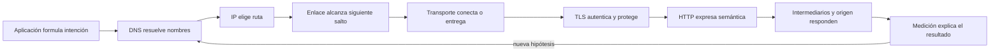

# Parte 3 — Redes, Internet y protocolos

Una aplicación distribuida no «usa Internet» como una caja única. Antes de recibir una respuesta, el cliente obtiene configuración local, resuelve un nombre, elige dirección y ruta, alcanza un siguiente salto, establece transporte, negocia confianza, atraviesa intermediarios y expresa una intención de aplicación. Cada fase conserva estado, garantías y modos de fallo diferentes. Esta parte enseña a recorrer esa cadena sin convertir una coincidencia temporal en causa.

El caso conductor es **Nexo**, una petición observable que nace como extensión del kit Faro de la Parte 2. Faro ya podía describir plataforma, procesos y configuración; Nexo añade el exterior: explica por qué una petición llegó, por qué no llegó o por qué respondió algo distinto. En cada clase se incorpora una capa de evidencia hasta entregar un servicio local que mide, degrada y se recupera de fallos controlados.

## Pregunta rectora

> ¿Dónde se define una garantía de comunicación, dónde aparece el síntoma y qué evidencia permite localizar la primera divergencia?

## Antes del recorrido clase por clase

La pedagogía de esta parte sigue cuatro movimientos conectados:

1. **Localizar:** identificar host, interfaz, enlace, dirección, nombre, endpoint e intermediario sin mezclarlos.
2. **Explicar:** describir la transición que realiza cada protocolo y el alcance de su garantía.
3. **Contrastar:** formular al menos una hipótesis rival y elegir una prueba que produzca resultados distintos.
4. **Recuperar:** restaurar el laboratorio y demostrar que el sistema vuelve a un estado coherente.

El orden del diagrama es causal, no una promesa de implementación literal. Una conexión reutilizada puede omitir handshakes; una caché puede responder antes del origen; QUIC integra transporte y seguridad; una aplicación puede usar su propio resolver. Precisamente por eso cada evidencia debe indicar desde qué punto y en qué instante fue obtenida.

## Lo que cambia al completar esta parte

Podrás leer una petición como un sistema de estados y contratos. Dejarás de usar «la red está caída» como explicación suficiente: distinguirás fallo de resolución, ruta, transporte, confianza, semántica, caché o capacidad; diseñarás timeouts y reintentos con límites; y producirás trazas que otra persona pueda revisar sin acceder a secretos ni tráfico ajeno.

## Recorrido clase por clase

| Clase | Núcleo profesional | Aporte acumulativo a Nexo |
|---|---|---|
| [SE-037](https://github.com/vladimiracunadev-create/software-engineering-learning-suite/blob/main/classes/part-03-redes-internet-y-protocolos/se-037-modelos-osi-y-tcp-ip-como-herramientas-de-diagnostico/) | Modelos OSI y TCP/IP como herramientas de diagnóstico | Convierte las capas en una matriz de diagnóstico |
| [SE-038](https://github.com/vladimiracunadev-create/software-engineering-learning-suite/blob/main/classes/part-03-redes-internet-y-protocolos/se-038-ethernet-wi-fi-direccionamiento-y-redes-locales/) | Ethernet, Wi-Fi, direccionamiento y redes locales | Explica el primer salto y la red local |
| [SE-039](https://github.com/vladimiracunadev-create/software-engineering-learning-suite/blob/main/classes/part-03-redes-internet-y-protocolos/se-039-ipv4-ipv6-subredes-rutas-y-nat/) | IPv4, IPv6, subredes, rutas y NAT | Hace visibles prefijos, rutas y traducciones |
| [SE-040](https://github.com/vladimiracunadev-create/software-engineering-learning-suite/blob/main/classes/part-03-redes-internet-y-protocolos/se-040-tcp-udp-quic-y-decisiones-de-transporte/) | TCP, UDP, QUIC y decisiones de transporte | Selecciona transporte por garantías |
| [SE-041](https://github.com/vladimiracunadev-create/software-engineering-learning-suite/blob/main/classes/part-03-redes-internet-y-protocolos/se-041-dns-nombres-resolucion-y-fallos/) | DNS, nombres, resolución y fallos | Reconstruye resolución, autoridad y caché |
| [SE-042](https://github.com/vladimiracunadev-create/software-engineering-learning-suite/blob/main/classes/part-03-redes-internet-y-protocolos/se-042-http-semantica-cache-y-negociacion/) | HTTP, semántica, caché y negociación | Diseña mensajes, estados y reutilización HTTP |
| [SE-043](https://github.com/vladimiracunadev-create/software-engineering-learning-suite/blob/main/classes/part-03-redes-internet-y-protocolos/se-043-tls-certificados-y-confianza-en-transito/) | TLS, certificados y confianza en tránsito | Valida identidad y confianza en tránsito |
| [SE-044](https://github.com/vladimiracunadev-create/software-engineering-learning-suite/blob/main/classes/part-03-redes-internet-y-protocolos/se-044-proxies-balanceadores-gateways-y-cdn/) | Proxies, balanceadores, gateways y CDN | Ubica decisiones de intermediarios |
| [SE-045](https://github.com/vladimiracunadev-create/software-engineering-learning-suite/blob/main/classes/part-03-redes-internet-y-protocolos/se-045-sockets-conexiones-persistentes-y-tiempo-real/) | Sockets, conexiones persistentes y tiempo real | Gestiona vida útil y presión de conexiones |
| [SE-046](https://github.com/vladimiracunadev-create/software-engineering-learning-suite/blob/main/classes/part-03-redes-internet-y-protocolos/se-046-captura-medicion-y-diagnostico-de-trafico/) | Captura, medición y diagnóstico de tráfico | Mide fases con alcance y privacidad |
| [SE-047](https://github.com/vladimiracunadev-create/software-engineering-learning-suite/blob/main/classes/part-03-redes-internet-y-protocolos/se-047-taller-seguir-una-peticion-de-extremo-a-extremo/) | Taller: seguir una petición de extremo a extremo | Integra una petición extremo a extremo |
| [SE-048](https://github.com/vladimiracunadev-create/software-engineering-learning-suite/blob/main/classes/part-03-redes-internet-y-protocolos/se-048-proyecto-servicio-observable-y-tolerante-a-fallos-de-red/) | Proyecto: servicio observable y tolerante a fallos de red | Entrega Nexo observable y recuperable |

## Hilo pedagógico

Las clases 37 a 40 construyen el sustrato: modelo, enlace, IP y transporte. Las clases 41 a 45 recorren la conversación visible por una aplicación: nombre, HTTP, confianza, intermediarios y persistencia. La clase 46 convierte señales en mediciones responsables. El taller 47 integra la línea temporal y el proyecto 48 transforma el aprendizaje en un servicio con contratos de fallo.

No se adelanta la solución con una herramienta. Primero se formula la pregunta; después se elige `curl`, la tabla de rutas, un resolver o una captura porque hace visible una transición concreta. Cada práctica conserva caso sano, degradado y recuperado. Cada diagrama debe tener explicación textual y cada traza debe minimizar datos.

## Evidencias acumulativas

1. **Mapa de fronteras:** unidades, identidades, terminaciones y alcance de cada protocolo.
2. **Bitácora de hipótesis:** hecho, interpretación, alternativa, prueba y decisión.
3. **Trazas comparadas:** una petición sana y una degradada, alineadas por primera divergencia.
4. **Matriz de fallos:** DNS, transporte, TLS, HTTP, caché y consumidor lento con recuperación.
5. **Servicio Nexo:** resultado tipado, deadlines, redacción, correlación, métricas y runbook.

## Criterios de aprobación del proyecto

- el destino está autorizado y validado; no permite usar el servicio contra redes internas arbitrarias;
- cada fase tiene timeout y cabe dentro de un deadline total;
- los reintentos se limitan a condiciones temporales y operaciones seguras o idempotentes;
- logs y métricas distinguen fase y resultado sin filtrar credenciales;
- los fallos son deterministas, reproducibles y restaurables;
- una segunda persona puede diagnosticar un caso con los artefactos, sin explicación oral;
- los límites del laboratorio y de las RFC se declaran expresamente.

## Preguntas de control

Antes de cerrar una clase, responde: ¿qué identificador observé?, ¿en qué alcance es válido?, ¿qué garantía estoy usando?, ¿qué hipótesis rival explica el mismo síntoma?, ¿qué prueba las separa?, ¿qué dato sensible podría haber capturado?, ¿cómo demuestro recuperación?

## Fuentes base

- [RFC 1122 — Requirements for Internet Hosts](https://www.rfc-editor.org/rfc/rfc1122)
- [RFC 8200 — IPv6](https://www.rfc-editor.org/rfc/rfc8200)
- [RFC 9293 — TCP](https://www.rfc-editor.org/rfc/rfc9293)
- [RFC 9000 — QUIC](https://www.rfc-editor.org/rfc/rfc9000)
- [RFC 1034 y RFC 1035 — DNS](https://www.rfc-editor.org/rfc/rfc1034)
- [RFC 8446 — TLS 1.3](https://www.rfc-editor.org/rfc/rfc8446)
- [RFC 9110 y RFC 9111 — HTTP y caché](https://www.rfc-editor.org/rfc/rfc9110)
- [RFC 6455 — WebSocket](https://www.rfc-editor.org/rfc/rfc6455)

Las fuentes normativas fijan vocabulario y comportamiento de protocolo. No prueban la configuración de una red concreta ni reemplazan políticas del sistema, documentación del proveedor o evidencia obtenida con autorización.
