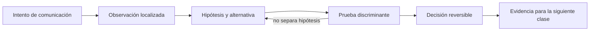

# SE-037 — Modelos OSI y TCP/IP como herramientas de diagnóstico

[← SE-036 — Proyecto: kit de diagnóstico multiplataforma](https://github.com/vladimiracunadev-create/software-engineering-learning-suite/blob/main/classes/part-02-sistemas-operativos-terminal-y-automatizacion-base/se-036-proyecto-kit-de-diagnostico-multiplataforma/README.md) · [↑ Parte 03](https://github.com/vladimiracunadev-create/software-engineering-learning-suite/blob/main/classes/part-03-redes-internet-y-protocolos/README.md) · [📚 Índice completo](https://github.com/vladimiracunadev-create/software-engineering-learning-suite/blob/main/classes/README.md) · [🌐 Portal](https://vladimiracunadev-create.github.io/software-engineering-learning-suite/classes/SE-037.html) · [SE-038 — Ethernet, Wi-Fi, direccionamiento y redes locales →](https://github.com/vladimiracunadev-create/software-engineering-learning-suite/blob/main/classes/part-03-redes-internet-y-protocolos/se-038-ethernet-wi-fi-direccionamiento-y-redes-locales/README.md)

> Estado: **GUIDED** · Clase desarrollada y revisada cualitativamente.

## Antes de empezar

Esta clase continúa **Nexo**, la petición observable de la Parte 3. No estudia redes como una lista de siglas: añade una decisión concreta al mismo recorrido y obliga a explicar dónde nace cada señal. Conserva una bitácora con cuatro columnas —hecho, interpretación, hipótesis rival y próxima prueba—; si una conclusión no apunta a evidencia, todavía no es diagnóstico.

## Prerrequisitos

- Haber completado `SE-036` o poder explicar su evidencia principal.
- Trabajar solo contra `localhost`, una red propia o un destino con autorización expresa.
- Disponer de navegador, `curl` y herramientas equivalentes del sistema; registra versiones y plataforma.

## Problema auténtico

Una persona informa que Nexo «no abre». El navegador muestra un error, pero ese síntoma puede proceder del enlace local, la configuración IP, la resolución de nombres, el transporte, TLS o HTTP. Reiniciar el servidor sin distinguir esas fronteras mezcla causas incompatibles y borra evidencia.

## Objetivos observables

Al terminar podrás:

1. usar OSI y la suite TCP/IP como mapas de preguntas, no como una secuencia física literal;
2. asociar cada unidad observable —trama, paquete, segmento o mensaje— con su alcance;
3. separar encapsulación lógica de la implementación real del sistema operativo;
4. construir una matriz síntoma–capa–prueba que descarte hipótesis;
5. comunicar límites y una siguiente prueba sin presentar inferencias como hechos.

## Mapa conceptual



El ciclo evita el diagnóstico por intuición. La observación se ubica antes de interpretarse; la prueba debe producir resultados diferentes bajo hipótesis rivales; la decisión conserva una salida de recuperación. En esta clase la pregunta rectora es: **¿Cómo localizar la frontera responsable sin convertir las capas en una explicación ficticia?**

## Temas y por qué importan

| Núcleo | Pregunta de trabajo | Evidencia esperada |
|---|---|---|
| alcance | ¿dónde es válido este identificador o estado? | mapa de fronteras |
| mecanismo | ¿qué entrada produce qué transición? | secuencia comentada |
| garantía | ¿qué promete el protocolo y qué no? | ejemplo y contraejemplo |
| diagnóstico | ¿qué prueba separa causas plausibles? | comparación reproducible |
| operación | ¿cómo falla, se limita y se recupera? | caso sano, degradado y restaurado |

## Conceptos y decisiones

### 1. Dos modelos, dos propósitos

OSI ofrece vocabulario fino para razonar sobre funciones; TCP/IP describe mejor la familia desplegada en Internet. No existe una correspondencia uno a uno: sesión y presentación suelen vivir dentro de protocolos o bibliotecas de aplicación. El modelo sirve si reduce el espacio de búsqueda; falla si se usa para afirmar que el software atraviesa siete cajas independientes.

### 2. Encapsulación y alcance

Una aplicación entrega bytes a transporte; transporte añade su información de control; IP permite avanzar entre redes; el enlace mueve la unidad sobre un tramo concreto. Cada salto puede reemplazar la cabecera de enlace mientras el datagrama mantiene su propósito extremo a extremo. Nombrar la unidad evita pedir una dirección MAC a un servidor remoto como si fuera global.

### 3. Plano de datos y plano de control

Los paquetes de una petición pertenecen al plano de datos. DNS, descubrimiento de vecinos, tablas de ruta y negociación producen o consultan estado de control. Que el plano de control funcione una vez no demuestra que el flujo posterior esté permitido ni que la ruta de retorno sea simétrica.

### 4. Síntoma, observación e inferencia

«Timeout» es una observación temporal; «el servidor está caído» es una inferencia. La prueba siguiente debe poder refutarla: resolver el nombre, abrir el puerto, completar TLS o recibir un estado HTTP. Una herramienta que salta capas puede confirmar disponibilidad global, pero no identifica por sí sola dónde apareció el retraso.

### 5. Las capas tienen fugas

MTU, proxies, NAT, aceleración de hardware y QUIC muestran que las fronteras interactúan. RFC 1122 advierte que la estratificación estricta es un modelo imperfecto. El diagnóstico profesional conserva el mapa, pero acepta evidencia cruzada y documenta en qué host y momento se observó.

## Definiciones de trabajo

- **capa:** agrupación conceptual de responsabilidades y servicios.
- **encapsulación:** adición de información de control alrededor de datos de una capa superior.
- **PDU:** unidad de datos nombrada según el protocolo observado.
- **extremo:** participante que origina o consume la comunicación.
- **intermediario:** componente que reenvía, transforma o almacena tráfico entre extremos.

Estas definiciones son operativas: precisan el uso dentro de Nexo y deben leerse junto a las fuentes. No convierten un término histórico o dependiente de implementación en una garantía universal.

## Ejemplo mínimo

Clasifica estas observaciones: `DNS_PROBE_FINISHED_NXDOMAIN`, `Connection refused`, certificado no válido y `HTTP 503`. Para cada una escribe la frontera más cercana, una prueba que la antecede y otra que la sigue. No afirmes causa todavía.

El ejemplo se acepta cuando incluye predicción previa, salida relevante y explicación de qué hipótesis descarta. Copiar una salida sin interpretación no demuestra comprensión.

## Ejemplo profesional

Nexo registra cuatro tiempos: resolución, conexión, negociación segura y primer byte. Si la resolución tarda 900 ms y las demás fases 20 ms, el equipo investiga el resolver antes de escalar al servicio. Si `curl --resolve` funciona, no «demuestra que Internet funciona»: aísla DNS conservando destino, TLS y HTTP.

La diferencia profesional es la trazabilidad: la decisión conecta requisito, mecanismo, señal, riesgo y recuperación. El equipo puede cambiar de herramienta sin perder el razonamiento.

## Práctica guiada

1. dibuja host cliente, red local, router, intermediario y origen.
2. anota en cada frontera la unidad y el identificador observable.
3. ejecuta una petición autorizada con `curl -v` y conserva solo cabeceras no sensibles.
4. construye una tabla con observación, capa probable, hipótesis rival y prueba discriminante.
5. explica qué parte del modelo no puede observarse con esa única herramienta.
6. entrega `trace.md` con comandos redactados, marcas de tiempo y condiciones de repetición.

## Ejercicios

1. **Reconstrucción:** explica el mecanismo a una persona que solo conoce la clase anterior; incluye un dibujo y un contraejemplo.
2. **Variación:** repite el caso cambiando una sola variable —familia IP, interfaz, caché o intermediario— y justifica la diferencia.
3. **Revisión adversarial:** escribe una hipótesis rival que también explique el síntoma y diseña la observación mínima que las separe.
4. **Transferencia:** aplica el modelo a una actualización de software o videollamada y marca qué supuestos dejan de ser válidos.

## Reto verificable

Entrega una traza comentada que permita a otra persona responder: qué se intentó, qué frontera se observó, qué garantía aplicaba, qué falló, qué alternativa fue descartada y cómo se restauró el estado. La persona revisora debe poder repetir al menos una prueba sin instrucciones orales.

## Demostración guiada

1. Predice el primer evento observable y el resultado sano.
2. Ejecuta una sola petición de Nexo y asigna cada marca a una frontera.
3. Introduce el fallo controlado descrito abajo.
4. Compara por **primera divergencia**, no por cantidad de errores posteriores.
5. Restaura, repite y conserva evidencia de recuperación.

Una demostración que no incluye restauración solo prueba cómo romper el laboratorio.

## Preguntas frecuentes

### ¿Una respuesta a `ping` demuestra que el servicio funciona?

No. Puede demostrar una respuesta ICMP bajo una ruta y política concretas. No valida DNS, puerto, TLS, HTTP ni la operación de negocio.

### ¿Puedo concluir desde una única captura?

Solo afirmaciones limitadas al punto, instante y tráfico observados. Para causalidad necesitas una predicción, una intervención controlada o evidencia correlacionada adicional.

### ¿Debo usar exactamente las mismas herramientas?

No. Debes conservar preguntas, unidades, alcance y evidencia. Documenta equivalencias y diferencias de plataforma.

## Fallo controlado y diagnóstico

Cambia temporalmente el nombre de destino por uno reservado e inexistente. Registra que no hubo conexión TCP ni petición HTTP; luego restaura el nombre y demuestra la transición. El aprendizaje es causal: una falla temprana impide observar capas posteriores.

Registra estado previo, acción, síntoma, primera divergencia, causa, corrección y estado posterior. Si la acción afecta red compartida, requiere privilegios amplios o no tiene rollback probado, reemplázala por una simulación local.

## Errores comunes y cómo corregirlos

| Error | Por qué falla | Corrección |
|---|---|---|
| culpar al último componente nombrado | el síntoma puede aparecer lejos de la causa | localizar la primera divergencia |
| usar éxito parcial como prueba total | cada protocolo ofrece un alcance distinto | enumerar qué capas aún no se probaron |
| cambiar varias variables | impide atribuir el resultado | una intervención y una predicción por vez |
| capturar todo | aumenta riesgo y ruido | limitar interfaz, destino, tiempo y campos |
| ocultar el error con un bypass | elimina una protección sin explicar causa | aislar solo en laboratorio y restaurar |

## Entorno y archivos clave

```text
work/SE-037/
├── README.md          # alcance, autorización y reproducción
├── request.txt        # petición sin credenciales
├── trace.md           # línea temporal y evidencias
├── failure-report.md  # hipótesis, prueba y recuperación
└── diagram.mmd        # mapa accesible acompañado de texto
```

Los archivos son contenedores, no evidencia automática. `README.md` declara sistema operativo, versiones, red utilizada y limpieza. Nunca confirmes cambios de red destructivos sin una ruta de recuperación.

## Seguridad, ética y accesibilidad

- captura únicamente tráfico propio o autorizado y durante la ventana mínima;
- redacta cookies, tokens, query strings, IP privadas y nombres de personas;
- no desactives TLS, firewall o aislamiento como solución permanente;
- acompaña color y diagramas con orden, etiquetas y una explicación textual;
- ofrece comandos equivalentes o resultados esperados para quien no pueda modificar una red;
- considera que telemetría e IP pueden identificar o perfilar personas.

## Transferencia

Traslada el mecanismo a una segunda red o protocolo sin repetir comandos mecánicamente. Conserva la pregunta y el criterio de evidencia; cambia los supuestos de dirección, intermediación y política. Escribe qué observación seguiría siendo válida y cuál depende de la topología original.

## Evaluación y evidencia

| Criterio | Evidencia mínima | Señal de dominio |
|---|---|---|
| modelo causal | mapa con fronteras y unidades correctas | explica interacción y fugas del modelo |
| protocolo | garantía y límite apoyados en fuente | distingue semántica de implementación |
| diagnóstico | hipótesis rival y prueba discriminante | encuentra primera divergencia |
| reproducibilidad | contexto, comandos y salida redactada | otra persona repite el resultado |
| responsabilidad | autorización, minimización y rollback | reduce riesgo sin borrar evidencia |

La clase no se aprueba por ejecutar comandos. Se aprueba cuando la evidencia sostiene las conclusiones y declara lo que todavía no puede saberse.

## Fuentes

- [RFC 1122 — Requirements for Internet Hosts: Communication Layers](https://www.rfc-editor.org/rfc/rfc1122): sustenta los mecanismos y límites usados en esta clase.
- [RFC 9110 — HTTP Semantics](https://www.rfc-editor.org/rfc/rfc9110): sustenta los mecanismos y límites usados en esta clase.
- [RFC 8200 — Internet Protocol, Version 6](https://www.rfc-editor.org/rfc/rfc8200): sustenta los mecanismos y límites usados en esta clase.

Las RFC describen contratos de protocolo, no certifican una red, proveedor o herramienta. Cada afirmación de comportamiento local debe contrastarse con evidencia de ese entorno.

## Límites y siguiente paso

Los modelos no sustituyen la especificación de cada protocolo ni describen toda optimización del kernel o del hardware. La clase siguiente baja al primer alcance concreto: la red local.

## Glosario

- **capa:** agrupación conceptual de responsabilidades y servicios.
- **encapsulación:** adición de información de control alrededor de datos de una capa superior.
- **PDU:** unidad de datos nombrada según el protocolo observado.
- **extremo:** participante que origina o consume la comunicación.
- **intermediario:** componente que reenvía, transforma o almacena tráfico entre extremos.

---

[← SE-036 — Proyecto: kit de diagnóstico multiplataforma](https://github.com/vladimiracunadev-create/software-engineering-learning-suite/blob/main/classes/part-02-sistemas-operativos-terminal-y-automatizacion-base/se-036-proyecto-kit-de-diagnostico-multiplataforma/README.md) · [↑ Parte 03](https://github.com/vladimiracunadev-create/software-engineering-learning-suite/blob/main/classes/part-03-redes-internet-y-protocolos/README.md) · [📚 Índice completo](https://github.com/vladimiracunadev-create/software-engineering-learning-suite/blob/main/classes/README.md) · [🌐 Portal](https://vladimiracunadev-create.github.io/software-engineering-learning-suite/classes/SE-037.html) · [SE-038 — Ethernet, Wi-Fi, direccionamiento y redes locales →](https://github.com/vladimiracunadev-create/software-engineering-learning-suite/blob/main/classes/part-03-redes-internet-y-protocolos/se-038-ethernet-wi-fi-direccionamiento-y-redes-locales/README.md)
