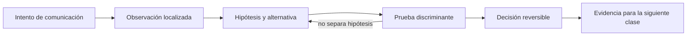

# SE-042 — HTTP, semántica, caché y negociación

[← SE-041 — DNS, nombres, resolución y fallos](https://github.com/vladimiracunadev-create/modern-software-engineering-program/blob/main/classes/part-03-redes-internet-y-protocolos/se-041-dns-nombres-resolucion-y-fallos/README.md) · [↑ Parte 03](https://github.com/vladimiracunadev-create/modern-software-engineering-program/blob/main/classes/part-03-redes-internet-y-protocolos/README.md) · [📚 Índice completo](https://github.com/vladimiracunadev-create/modern-software-engineering-program/blob/main/classes/README.md) · [🌐 Portal](https://vladimiracunadev-create.github.io/modern-software-engineering-program/classes/SE-042.html) · [SE-043 — TLS, certificados y confianza en tránsito →](https://github.com/vladimiracunadev-create/modern-software-engineering-program/blob/main/classes/part-03-redes-internet-y-protocolos/se-043-tls-certificados-y-confianza-en-transito/README.md)

> Estado: **PLANNED** · Borrador público conservado íntegramente y sometido a auditoría técnica y pedagógica.

## Punto profesional y fundamento pedagógico

**Punto profesional.** La clase existe para razonar sobre HTTP por semántica de método, representación, validación, caché y negociación.

**Por qué aparece aquí.** Se sitúa después de **DNS, nombres, resolución y fallos** y antes de **TLS, certificados y confianza en tránsito**: convierte el conocimiento anterior en una decisión observable que la clase siguiente podrá reutilizar. La continuidad se comprueba en el artefacto, no por compartir vocabulario.

**Error conceptual que debe corregir.** Equiparar GET con ausencia de efectos o 200 con respuesta no cacheada.

**Secuencia de aprendizaje.** Antes de leer la solución, el estudiante predice el resultado del caso normal y del error conceptual anterior. Luego explica un caso resuelto paso a paso, construye un contraejemplo que cambie la decisión y, sin consultar el texto, reconstruye el mecanismo y lo aplica a una entrada nueva. La secuencia usa predicción, explicación propia, contraste y recuperación. [ICAP](https://icap.education.asu.edu/research) distingue participación de construcción de conocimiento; [How People Learn II](https://nap.nationalacademies.org/catalog/24783/how-people-learn-ii-learners-contexts-and-cultures) exige conectar conocimiento previo, contexto y transferencia; la [práctica de recuperación](https://pubmed.ncbi.nlm.nih.gov/16507066/) respalda producir de nuevo la explicación tras una demora; y [Education for Life and Work](https://nap.nationalacademies.org/resource/13398/dbasse_084153.pdf) exige devolución que explique la causa del error.

**Evidencia de aprendizaje.** Http-exchange.md con mensajes crudos, validators y decisión de caché. Debe contener predicción previa, observación, explicación causal, contraejemplo, criterio de aceptación y una nota de qué dato haría cambiar la conclusión.

**Límite de la conclusión.** HTTP define semántica; no garantiza conducta correcta de la aplicación.

### Trazabilidad fuente → afirmación

| Fuente primaria u oficial | Afirmación que respalda | Lo que no prueba |
|---|---|---|
| [RFC 9110 — HTTP Semantics](https://www.rfc-editor.org/rfc/rfc9110) | define la semántica normativa del protocolo nombrado en el título y sus límites interoperables | No demuestra por sí sola que el artefacto del estudiante sea correcto. |
| [RFC 9111 — HTTP Caching](https://www.rfc-editor.org/rfc/rfc9111) | define la semántica normativa del protocolo nombrado en el título y sus límites interoperables | No demuestra por sí sola que el artefacto del estudiante sea correcto. |

## Antes de empezar

Esta clase continúa la **petición observable de extremo a extremo de la Parte 3**. No estudia redes como una lista de siglas: añade una decisión concreta al mismo recorrido y obliga a explicar dónde nace cada señal. Conserva una bitácora con cuatro columnas —hecho, interpretación, hipótesis rival y próxima prueba—; si una conclusión no apunta a evidencia, todavía no es diagnóstico.

## Prerrequisitos

- Haber completado `SE-041` o poder explicar su evidencia principal.
- Trabajar solo contra `localhost`, una red propia o un destino con autorización expresa.
- Disponer de navegador, `curl` y herramientas equivalentes del sistema; registra versiones y plataforma.

## Problema auténtico

La petición observable de extremo a extremo actualiza una configuración, pero un reintento duplica el cambio y otra persona sigue viendo una representación antigua. El equipo debe separar método, recurso, representación, estado de respuesta, validación y caché.

## Objetivos observables

Al terminar podrás:

1. interpretar métodos por semántica, seguridad e idempotencia;
2. distinguir recurso de representación;
3. usar estados y cabeceras como contrato observable;
4. diseñar revalidación y variación de caché;
5. comunicar límites y una siguiente prueba sin presentar inferencias como hechos.

## Mapa conceptual



El ciclo evita el diagnóstico por intuición. La observación se ubica antes de interpretarse; la prueba debe producir resultados diferentes bajo hipótesis rivales; la decisión conserva una salida de recuperación. En esta clase la pregunta rectora es: **¿Qué intención expresa el mensaje HTTP y qué puede reutilizar un intermediario?**

## Temas y por qué importan

| Núcleo | Pregunta de trabajo | Evidencia esperada |
|---|---|---|
| alcance | ¿dónde es válido este identificador o estado? | mapa de fronteras |
| mecanismo | ¿qué entrada produce qué transición? | secuencia comentada |
| garantía | ¿qué promete el protocolo y qué no? | ejemplo y contraejemplo |
| diagnóstico | ¿qué prueba separa causas plausibles? | comparación reproducible |
| operación | ¿cómo falla, se limita y se recupera? | caso sano, degradado y restaurado |
## Conceptos y decisiones

### 1. Recurso, URI y representación

La URI identifica el objetivo; la respuesta lleva una representación de su estado, no el recurso mismo. Dos formatos pueden representar el mismo recurso. Cambiar de JSON a HTML no debería cambiar la identidad, pero sí metadatos y negociación.

### 2. Métodos y propiedades

GET solicita transferencia de una representación y se define como seguro; PUT y DELETE son idempotentes en su efecto previsto; POST no lo es por defecto. Seguro no significa libre de logs o costo. La semántica permite a clientes e intermediarios decidir reintentos y caché.

### 3. Estados como resultado, no decoración

2xx comunica éxito bajo condiciones específicas; 3xx redirige; 4xx señala que la petición no puede satisfacerse tal como está; 5xx indica incapacidad del servidor. Devolver 200 con un error opaco impide automatizar recuperación y falsea observabilidad.

### 4. Caché, frescura y validación

Una caché reutiliza respuestas si las reglas lo permiten. `Cache-Control` gobierna frescura; ETag y `If-None-Match` permiten validar sin transferir todo. `no-cache` exige revalidación; no equivale a prohibir almacenamiento. Datos personalizados requieren especial cuidado en cachés compartidas.

### 5. Negociación y Vary

Cabeceras como `Accept` describen formatos aceptables. Si la respuesta cambia por una cabecera, `Vary` incorpora esa dimensión a la clave de caché. Variar por demasiados campos destruye reutilización; omitir uno puede entregar idioma o codificación incorrectos.

## Definiciones de trabajo

- **recurso:** objetivo conceptual identificado por una URI.
- **representación:** estado transferible de un recurso en un formato.
- **método seguro:** método cuya semántica solicitada es de solo lectura.
- **ETag:** validador opaco de una representación.
- **Vary:** cabecera que declara dimensiones adicionales de selección de respuesta.

Estas definiciones son operativas: precisan el uso dentro de la petición observable de extremo a extremo y deben leerse junto a las fuentes. No convierten un término histórico o dependiente de implementación en una garantía universal.

## Ejemplo mínimo

Compara `GET /reports/7`, `PUT /reports/7` y `POST /reports`. Para cada uno define intención, respuesta exitosa, repetición tras timeout y si requiere clave idempotente.

El ejemplo se acepta cuando incluye predicción previa, salida relevante y explicación de qué hipótesis descarta. Copiar una salida sin interpretación no demuestra comprensión.

## Ejemplo profesional

La petición observable de extremo a extremo expone `GET /health` sin datos sensibles y `POST /diagnoses` con una clave idempotente. Las respuestas de catálogo usan ETag; las del usuario son privadas. Una traza registra método, target, estado, `Age`, `Cache-Control`, `Vary` y tiempo, evitando cuerpos con secretos.

La diferencia profesional es la trazabilidad: la decisión conecta requisito, mecanismo, señal, riesgo y recuperación. El equipo puede cambiar de herramienta sin perder el razonamiento.

## Práctica guiada

1. envía HEAD y GET al mismo recurso autorizado.
2. observa redirecciones sin seguirlas y luego con seguimiento.
3. prueba una revalidación condicional.
4. cambia `Accept` y comprueba `Content-Type` y `Vary`.
5. diseña una tabla de estados para éxito, entrada inválida, conflicto y fallo temporal.
6. entrega `trace.md` con comandos redactados, marcas de tiempo y condiciones de repetición.

## Ejercicios

1. **Reconstrucción:** explica el mecanismo a una persona que solo conoce la clase anterior; incluye un dibujo y un contraejemplo.
2. **Variación:** repite el caso cambiando una sola variable —familia IP, interfaz, caché o intermediario— y justifica la diferencia.
3. **Revisión adversarial:** escribe una hipótesis rival que también explique el síntoma y diseña la observación mínima que las separe.
4. **Transferencia:** aplica el modelo a una actualización de software o videollamada y marca qué supuestos dejan de ser válidos.

## Reto verificable

Entrega una traza comentada que permita a otra persona responder: qué se intentó, qué frontera se observó, qué garantía aplicaba, qué falló, qué alternativa fue descartada y cómo se restauró el estado. La persona revisora debe poder repetir al menos una prueba sin instrucciones orales.

## Demostración guiada

1. Predice el primer evento observable y el resultado sano.
2. Ejecuta una sola petición de la petición observable de extremo a extremo y asigna cada marca a una frontera.
3. Introduce el fallo controlado descrito abajo.
4. Compara por **primera divergencia**, no por cantidad de errores posteriores.
5. Restaura, repite y conserva evidencia de recuperación.

Una demostración que no incluye restauración solo prueba cómo romper el laboratorio.

## Preguntas frecuentes

### ¿Una respuesta a `ping` demuestra que el servicio funciona?

No. Puede demostrar una respuesta ICMP bajo una ruta y política concretas. No valida DNS, puerto, TLS, HTTP ni la operación de negocio.

### ¿Puedo concluir desde una única captura?

Solo afirmaciones limitadas al punto, instante y tráfico observados. Para causalidad necesitas una predicción, una intervención controlada o evidencia correlacionada adicional.

### ¿Debo usar exactamente las mismas herramientas?

No. Debes conservar preguntas, unidades, alcance y evidencia. Documenta equivalencias y diferencias de plataforma.

## Fallo controlado y diagnóstico

Sirve una respuesta local con `max-age` y cambia el origen antes de que expire. Observa reutilización legítima; después usa validación condicional. No corrijas agregando parámetros aleatorios: explica la política y su costo.

Registra estado previo, acción, síntoma, primera divergencia, causa, corrección y estado posterior. Si la acción afecta red compartida, requiere privilegios amplios o no tiene rollback probado, reemplázala por una simulación local.

## Errores comunes y cómo corregirlos

| Error | Por qué falla | Corrección |
|---|---|---|
| culpar al último componente nombrado | el síntoma puede aparecer lejos de la causa | localizar la primera divergencia |
| usar éxito parcial como prueba total | cada protocolo ofrece un alcance distinto | enumerar qué capas aún no se probaron |
| cambiar varias variables | impide atribuir el resultado | una intervención y una predicción por vez |
| capturar todo | aumenta riesgo y ruido | limitar interfaz, destino, tiempo y campos |
| ocultar el error con un bypass | elimina una protección sin explicar causa | aislar solo en laboratorio y restaurar |

## Entorno y archivos clave

```text
work/SE-042/
├── README.md          # alcance, autorización y reproducción
├── request.txt        # petición sin credenciales
├── trace.md           # línea temporal y evidencias
├── failure-report.md  # hipótesis, prueba y recuperación
└── diagram.mmd        # mapa accesible acompañado de texto
```

Los archivos son contenedores, no evidencia automática. `README.md` declara sistema operativo, versiones, red utilizada y limpieza. Nunca confirmes cambios de red destructivos sin una ruta de recuperación.

## Seguridad, ética y accesibilidad

- captura únicamente tráfico propio o autorizado y durante la ventana mínima;
- redacta cookies, tokens, query strings, IP privadas y nombres de personas;
- no desactives TLS, firewall o aislamiento como solución permanente;
- acompaña color y diagramas con orden, etiquetas y una explicación textual;
- ofrece comandos equivalentes o resultados esperados para quien no pueda modificar una red;
- considera que telemetría e IP pueden identificar o perfilar personas.

## Transferencia

Traslada el mecanismo a una segunda red o protocolo sin repetir comandos mecánicamente. Conserva la pregunta y el criterio de evidencia; cambia los supuestos de dirección, intermediación y política. Escribe qué observación seguiría siendo válida y cuál depende de la topología original.

## Evaluación y evidencia

| Criterio | Evidencia mínima | Señal de dominio |
|---|---|---|
| modelo causal | mapa con fronteras y unidades correctas | explica interacción y fugas del modelo |
| protocolo | garantía y límite apoyados en fuente | distingue semántica de implementación |
| diagnóstico | hipótesis rival y prueba discriminante | encuentra primera divergencia |
| reproducibilidad | contexto, comandos y salida redactada | otra persona repite el resultado |
| responsabilidad | autorización, minimización y rollback | reduce riesgo sin borrar evidencia |

La clase no se aprueba por ejecutar comandos. Se aprueba cuando la evidencia sostiene las conclusiones y declara lo que todavía no puede saberse.

## Fuentes


- [RFC 9110 — HTTP Semantics](https://www.rfc-editor.org/rfc/rfc9110) — define la semántica normativa del protocolo nombrado en el título y sus límites interoperables.
- [RFC 9111 — HTTP Caching](https://www.rfc-editor.org/rfc/rfc9111) — define la semántica normativa del protocolo nombrado en el título y sus límites interoperables.

Las RFC describen contratos de protocolo, no certifican una red, proveedor o herramienta. Cada afirmación de comportamiento local debe contrastarse con evidencia de ese entorno.

## Límites y siguiente paso

HTTP define semántica común, no la lógica de autorización de la petición observable de extremo a extremo. HTTP/1.1, HTTP/2 y HTTP/3 pueden transportar la misma intención de forma distinta. La siguiente clase protege autenticidad, integridad y confidencialidad en tránsito.

## Glosario

- **recurso:** objetivo conceptual identificado por una URI.
- **representación:** estado transferible de un recurso en un formato.
- **método seguro:** método cuya semántica solicitada es de solo lectura.
- **ETag:** validador opaco de una representación.
- **Vary:** cabecera que declara dimensiones adicionales de selección de respuesta.

---

[← SE-041 — DNS, nombres, resolución y fallos](https://github.com/vladimiracunadev-create/modern-software-engineering-program/blob/main/classes/part-03-redes-internet-y-protocolos/se-041-dns-nombres-resolucion-y-fallos/README.md) · [↑ Parte 03](https://github.com/vladimiracunadev-create/modern-software-engineering-program/blob/main/classes/part-03-redes-internet-y-protocolos/README.md) · [📚 Índice completo](https://github.com/vladimiracunadev-create/modern-software-engineering-program/blob/main/classes/README.md) · [🌐 Portal](https://vladimiracunadev-create.github.io/modern-software-engineering-program/classes/SE-042.html) · [SE-043 — TLS, certificados y confianza en tránsito →](https://github.com/vladimiracunadev-create/modern-software-engineering-program/blob/main/classes/part-03-redes-internet-y-protocolos/se-043-tls-certificados-y-confianza-en-transito/README.md)
