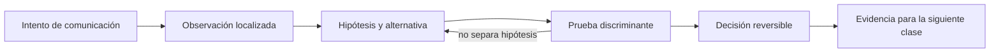

# SE-045 — Sockets, conexiones persistentes y tiempo real

[← SE-044 — Proxies, balanceadores, gateways y CDN](https://github.com/vladimiracunadev-create/modern-software-engineering-program/blob/main/classes/part-03-redes-internet-y-protocolos/se-044-proxies-balanceadores-gateways-y-cdn/README.md) · [↑ Parte 03](https://github.com/vladimiracunadev-create/modern-software-engineering-program/blob/main/classes/part-03-redes-internet-y-protocolos/README.md) · [📚 Índice completo](https://github.com/vladimiracunadev-create/modern-software-engineering-program/blob/main/classes/README.md) · [🌐 Portal](https://vladimiracunadev-create.github.io/modern-software-engineering-program/classes/SE-045.html) · [SE-046 — Captura, medición y diagnóstico de tráfico →](https://github.com/vladimiracunadev-create/modern-software-engineering-program/blob/main/classes/part-03-redes-internet-y-protocolos/se-046-captura-medicion-y-diagnostico-de-trafico/README.md)


## Punto profesional y fundamento pedagógico

**Punto profesional.** La clase existe para modelar conexiones persistentes y tiempo real por estados, framing, heartbeat y backpressure.

**Por qué aparece aquí.** Se sitúa después de **Proxies, balanceadores, gateways y CDN** y antes de **Captura, medición y diagnóstico de tráfico**: convierte el conocimiento anterior en una decisión observable que la clase siguiente podrá reutilizar. La continuidad se comprueba en el artefacto, no por compartir vocabulario.

**Error conceptual que debe corregir.** Confundir conexión abierta con entrega garantizada o ignorar consumidores lentos.

**Secuencia de aprendizaje.** Antes de leer la solución, el estudiante predice el resultado del caso normal y del error conceptual anterior. Luego explica un caso resuelto paso a paso, construye un contraejemplo que cambie la decisión y, sin consultar el texto, reconstruye el mecanismo y lo aplica a una entrada nueva. La secuencia usa predicción, explicación propia, contraste y recuperación. [ICAP](https://icap.education.asu.edu/research) distingue participación de construcción de conocimiento; [How People Learn II](https://nap.nationalacademies.org/catalog/24783/how-people-learn-ii-learners-contexts-and-cultures) exige conectar conocimiento previo, contexto y transferencia; la [práctica de recuperación](https://pubmed.ncbi.nlm.nih.gov/16507066/) respalda producir de nuevo la explicación tras una demora; y [Education for Life and Work](https://nap.nationalacademies.org/resource/13398/dbasse_084153.pdf) exige devolución que explique la causa del error.

**Evidencia de aprendizaje.** Connection-state.md con apertura, mensajes, cierre, timeout y cola acotada. Debe contener predicción previa, observación, explicación causal, contraejemplo, criterio de aceptación y una nota de qué dato haría cambiar la conclusión.

**Límite de la conclusión.** WebSocket no define semántica de negocio ni recuperación por sí solo.

### Trazabilidad fuente → afirmación

| Fuente primaria u oficial | Afirmación que respalda | Lo que no prueba |
|---|---|---|
| [RFC 9293 — Transmission Control Protocol](https://www.rfc-editor.org/rfc/rfc9293) | define la semántica normativa del protocolo nombrado en el título y sus límites interoperables | No demuestra por sí sola que el artefacto del estudiante sea correcto. |
| [RFC 6455 — The WebSocket Protocol](https://www.rfc-editor.org/rfc/rfc6455) | define la semántica normativa del protocolo nombrado en el título y sus límites interoperables | No demuestra por sí sola que el artefacto del estudiante sea correcto. |
| [RFC 9110 — HTTP Semantics](https://www.rfc-editor.org/rfc/rfc9110) | define la semántica normativa del protocolo nombrado en el título y sus límites interoperables | No demuestra por sí sola que el artefacto del estudiante sea correcto. |

## Antes de empezar

Esta clase continúa la **petición observable de extremo a extremo de la Parte 3**. No estudia redes como una lista de siglas: añade una decisión concreta al mismo recorrido y obliga a explicar dónde nace cada señal. Conserva una bitácora con cuatro columnas —hecho, interpretación, hipótesis rival y próxima prueba—; si una conclusión no apunta a evidencia, todavía no es diagnóstico.

## Prerrequisitos

- Haber completado `SE-044` o poder explicar su evidencia principal.
- Trabajar solo contra `localhost`, una red propia o un destino con autorización expresa.
- Disponer de navegador, `curl` y herramientas equivalentes del sistema; registra versiones y plataforma.

## Problema auténtico

La petición observable de extremo a extremo necesita mostrar eventos en vivo. Mantener conexiones para siempre agota recursos; reconectar sin cursor pierde o duplica eventos. El equipo debe diseñar socket, framing, heartbeat, backpressure y reanudación.

## Objetivos observables

Al terminar podrás:

1. explicar socket, conexión y framing como conceptos distintos;
2. comparar polling, SSE y WebSocket por dirección y operación;
3. diseñar heartbeat, cierre y reconexión;
4. manejar backpressure y continuidad de eventos;
5. comunicar límites y una siguiente prueba sin presentar inferencias como hechos.

## Mapa conceptual



El ciclo evita el diagnóstico por intuición. La observación se ubica antes de interpretarse; la prueba debe producir resultados diferentes bajo hipótesis rivales; la decisión conserva una salida de recuperación. En esta clase la pregunta rectora es: **¿Cómo se conserva una conversación larga sin perder límites, vida útil ni recuperación?**

## Temas y por qué importan

| Núcleo | Pregunta de trabajo | Evidencia esperada |
|---|---|---|
| alcance | ¿dónde es válido este identificador o estado? | mapa de fronteras |
| mecanismo | ¿qué entrada produce qué transición? | secuencia comentada |
| garantía | ¿qué promete el protocolo y qué no? | ejemplo y contraejemplo |
| diagnóstico | ¿qué prueba separa causas plausibles? | comparación reproducible |
| operación | ¿cómo falla, se limita y se recupera? | caso sano, degradado y restaurado |
## Conceptos y decisiones

### 1. Socket y ciclo de vida

Un socket es una abstracción del sistema operativo asociada a un endpoint. En TCP, escuchar, aceptar, leer, escribir y cerrar cambian estados y consumen descriptores, buffers y memoria. Que el cliente desaparezca no siempre se detecta hasta leer, escribir o vencer un temporizador.

### 2. Framing sobre flujo

TCP no conserva mensajes. Protocolos de longitud prefijada, delimitadores o formatos autocontenidos permiten reconstruirlos. El parser debe limitar tamaño antes de reservar memoria y manejar un mensaje incompleto sin bloquear todos los clientes.

### 3. Polling, SSE y WebSocket

Polling repite HTTP y es simple pero añade demora y carga. SSE mantiene un flujo servidor→cliente con semántica textual y reconexión del navegador. WebSocket realiza un handshake HTTP y luego intercambia frames bidireccionales. La opción correcta depende de dirección, frecuencia, intermediarios y soporte.

### 4. Heartbeat y estado medio abierto

Ping/pong o mensajes de aplicación detectan peers silenciosos, pero demasiado frecuentes consumen batería y ancho de banda. TCP keepalive puede tener intervalos largos y no reemplaza deadlines de negocio. El cierre debe distinguir mantenimiento, error, expiración y decisión del usuario.

### 5. Backpressure y reanudación

Si el productor supera al consumidor, una cola infinita solo aplaza el fallo. Se puede bloquear, muestrear, descartar con política o desconectar con cursor. Un ID monotónico o token de reanudación permite solicitar eventos posteriores, pero necesita retención y semántica de duplicados.

## Definiciones de trabajo

- **socket:** endpoint de comunicación administrado por el sistema operativo.
- **framing:** regla para delimitar mensajes sobre un transporte.
- **heartbeat:** mensaje periódico para comprobar continuidad.
- **backpressure:** mecanismo que limita al productor cuando el consumidor no alcanza.
- **cursor:** posición reanudable dentro de una secuencia de eventos.

Estas definiciones son operativas: precisan el uso dentro de la petición observable de extremo a extremo y deben leerse junto a las fuentes. No convierten un término histórico o dependiente de implementación en una garantía universal.

## Ejemplo mínimo

Implementa o representa un protocolo local de longitud prefijada. Divide deliberadamente el encabezado entre dos lecturas y demuestra que el parser espera sin confundir datos parciales con EOF.

El ejemplo se acepta cuando incluye predicción previa, salida relevante y explicación de qué hipótesis descarta. Copiar una salida sin interpretación no demuestra comprensión.

## Ejemplo profesional

La petición observable de extremo a extremo usa SSE para estados unidireccionales y entrega `id` por evento. El cliente reanuda con el último ID; el servidor conserva una ventana finita y responde explícitamente cuando el cursor expiró. Métricas separan conexiones abiertas, clientes lentos, bytes pendientes y reconexiones.

La diferencia profesional es la trazabilidad: la decisión conecta requisito, mecanismo, señal, riesgo y recuperación. El equipo puede cambiar de herramienta sin perder el razonamiento.

## Práctica guiada

1. modela estados desde conexión hasta cierre.
2. mide recursos con 1, 10 y 100 conexiones locales.
3. introduce un consumidor lento.
4. define límite de cola y política de descarte.
5. corta la red o proceso y prueba reanudación con eventos duplicados.
6. entrega `trace.md` con comandos redactados, marcas de tiempo y condiciones de repetición.

## Ejercicios

1. **Reconstrucción:** explica el mecanismo a una persona que solo conoce la clase anterior; incluye un dibujo y un contraejemplo.
2. **Variación:** repite el caso cambiando una sola variable —familia IP, interfaz, caché o intermediario— y justifica la diferencia.
3. **Revisión adversarial:** escribe una hipótesis rival que también explique el síntoma y diseña la observación mínima que las separe.
4. **Transferencia:** aplica el modelo a una actualización de software o videollamada y marca qué supuestos dejan de ser válidos.

## Reto verificable

Entrega una traza comentada que permita a otra persona responder: qué se intentó, qué frontera se observó, qué garantía aplicaba, qué falló, qué alternativa fue descartada y cómo se restauró el estado. La persona revisora debe poder repetir al menos una prueba sin instrucciones orales.

## Demostración guiada

1. Predice el primer evento observable y el resultado sano.
2. Ejecuta una sola petición de la petición observable de extremo a extremo y asigna cada marca a una frontera.
3. Introduce el fallo controlado descrito abajo.
4. Compara por **primera divergencia**, no por cantidad de errores posteriores.
5. Restaura, repite y conserva evidencia de recuperación.

Una demostración que no incluye restauración solo prueba cómo romper el laboratorio.

## Preguntas frecuentes

### ¿Una respuesta a `ping` demuestra que el servicio funciona?

No. Puede demostrar una respuesta ICMP bajo una ruta y política concretas. No valida DNS, puerto, TLS, HTTP ni la operación de negocio.

### ¿Puedo concluir desde una única captura?

Solo afirmaciones limitadas al punto, instante y tráfico observados. Para causalidad necesitas una predicción, una intervención controlada o evidencia correlacionada adicional.

### ¿Debo usar exactamente las mismas herramientas?

No. Debes conservar preguntas, unidades, alcance y evidencia. Documenta equivalencias y diferencias de plataforma.

## Fallo controlado y diagnóstico

Detén el consumo mientras el productor continúa. Observa crecimiento hasta un límite bajo y seguro; implementa backpressure o desconexión explícita. La corrección no es aumentar memoria sin límite.

Registra estado previo, acción, síntoma, primera divergencia, causa, corrección y estado posterior. Si la acción afecta red compartida, requiere privilegios amplios o no tiene rollback probado, reemplázala por una simulación local.

## Errores comunes y cómo corregirlos

| Error | Por qué falla | Corrección |
|---|---|---|
| culpar al último componente nombrado | el síntoma puede aparecer lejos de la causa | localizar la primera divergencia |
| usar éxito parcial como prueba total | cada protocolo ofrece un alcance distinto | enumerar qué capas aún no se probaron |
| cambiar varias variables | impide atribuir el resultado | una intervención y una predicción por vez |
| capturar todo | aumenta riesgo y ruido | limitar interfaz, destino, tiempo y campos |
| ocultar el error con un bypass | elimina una protección sin explicar causa | aislar solo en laboratorio y restaurar |

## Entorno y archivos clave

```text
work/SE-045/
├── README.md          # alcance, autorización y reproducción
├── request.txt        # petición sin credenciales
├── trace.md           # línea temporal y evidencias
├── failure-report.md  # hipótesis, prueba y recuperación
└── diagram.mmd        # mapa accesible acompañado de texto
```

Los archivos son contenedores, no evidencia automática. `README.md` declara sistema operativo, versiones, red utilizada y limpieza. Nunca confirmes cambios de red destructivos sin una ruta de recuperación.

### Laboratorio integrado de la Parte 03

Verifica con las pruebas de la [petición observable](https://github.com/vladimiracunadev-create/modern-software-engineering-program/tree/main/labs/part-03-observable-request) que el servidor termina y el hilo se une incluso después de un timeout. Luego diseña en `connection-state.md` la transición equivalente para polling, SSE y WebSocket: apertura, heartbeat, consumidor lento, cursor, cierre y reconexión. La ejecución HTTP local no demuestra framing ni backpressure de WebSocket.

## Seguridad, ética y accesibilidad

- captura únicamente tráfico propio o autorizado y durante la ventana mínima;
- redacta cookies, tokens, query strings, IP privadas y nombres de personas;
- no desactives TLS, firewall o aislamiento como solución permanente;
- acompaña color y diagramas con orden, etiquetas y una explicación textual;
- ofrece comandos equivalentes o resultados esperados para quien no pueda modificar una red;
- considera que telemetría e IP pueden identificar o perfilar personas.

## Transferencia

Traslada el mecanismo a una segunda red o protocolo sin repetir comandos mecánicamente. Conserva la pregunta y el criterio de evidencia; cambia los supuestos de dirección, intermediación y política. Escribe qué observación seguiría siendo válida y cuál depende de la topología original.

## Evaluación y evidencia

| Criterio | Evidencia mínima | Señal de dominio |
|---|---|---|
| modelo causal | mapa con fronteras y unidades correctas | explica interacción y fugas del modelo |
| protocolo | garantía y límite apoyados en fuente | distingue semántica de implementación |
| diagnóstico | hipótesis rival y prueba discriminante | encuentra primera divergencia |
| reproducibilidad | contexto, comandos y salida redactada | otra persona repite el resultado |
| responsabilidad | autorización, minimización y rollback | reduce riesgo sin borrar evidencia |

La clase no se aprueba por ejecutar comandos. Se aprueba cuando la evidencia sostiene las conclusiones y declara lo que todavía no puede saberse.

## Fuentes


- [RFC 9293 — Transmission Control Protocol](https://www.rfc-editor.org/rfc/rfc9293) — define la semántica normativa del protocolo nombrado en el título y sus límites interoperables.
- [RFC 6455 — The WebSocket Protocol](https://www.rfc-editor.org/rfc/rfc6455) — define la semántica normativa del protocolo nombrado en el título y sus límites interoperables.
- [RFC 9110 — HTTP Semantics](https://www.rfc-editor.org/rfc/rfc9110) — define la semántica normativa del protocolo nombrado en el título y sus límites interoperables.

Las RFC describen contratos de protocolo, no certifican una red, proveedor o herramienta. Cada afirmación de comportamiento local debe contrastarse con evidencia de ese entorno.

## Límites y siguiente paso

Tiempo real aquí significa baja latencia percibida, no garantía hard real-time. Proxies pueden imponer timeouts. La siguiente clase enseña a capturar y medir sin violar privacidad.

## Glosario

- **socket:** endpoint de comunicación administrado por el sistema operativo.
- **framing:** regla para delimitar mensajes sobre un transporte.
- **heartbeat:** mensaje periódico para comprobar continuidad.
- **backpressure:** mecanismo que limita al productor cuando el consumidor no alcanza.
- **cursor:** posición reanudable dentro de una secuencia de eventos.

---

[← SE-044 — Proxies, balanceadores, gateways y CDN](https://github.com/vladimiracunadev-create/modern-software-engineering-program/blob/main/classes/part-03-redes-internet-y-protocolos/se-044-proxies-balanceadores-gateways-y-cdn/README.md) · [↑ Parte 03](https://github.com/vladimiracunadev-create/modern-software-engineering-program/blob/main/classes/part-03-redes-internet-y-protocolos/README.md) · [📚 Índice completo](https://github.com/vladimiracunadev-create/modern-software-engineering-program/blob/main/classes/README.md) · [🌐 Portal](https://vladimiracunadev-create.github.io/modern-software-engineering-program/classes/SE-045.html) · [SE-046 — Captura, medición y diagnóstico de tráfico →](https://github.com/vladimiracunadev-create/modern-software-engineering-program/blob/main/classes/part-03-redes-internet-y-protocolos/se-046-captura-medicion-y-diagnostico-de-trafico/README.md)
