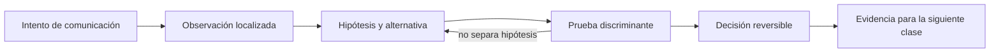

# SE-048 — Proyecto: servicio observable y tolerante a fallos de red

[← SE-047 — Taller: seguir una petición de extremo a extremo](https://github.com/vladimiracunadev-create/software-engineering-learning-suite/blob/main/classes/part-03-redes-internet-y-protocolos/se-047-taller-seguir-una-peticion-de-extremo-a-extremo/README.md) · [↑ Parte 03](https://github.com/vladimiracunadev-create/software-engineering-learning-suite/blob/main/classes/part-03-redes-internet-y-protocolos/README.md) · [📚 Índice completo](https://github.com/vladimiracunadev-create/software-engineering-learning-suite/blob/main/classes/README.md) · [🌐 Portal](https://vladimiracunadev-create.github.io/software-engineering-learning-suite/classes/SE-048.html) · [SE-049 — Descomposición, abstracción y reconocimiento de patrones →](https://github.com/vladimiracunadev-create/software-engineering-learning-suite/blob/main/classes/part-04-pensamiento-computacional-y-resolucion-de-problemas/se-049-descomposicion-abstraccion-y-reconocimiento-de-patrones/README.md)

> Estado: **GUIDED** · Clase desarrollada y revisada cualitativamente.

## Antes de empezar

Esta clase continúa **Nexo**, la petición observable de la Parte 3. No estudia redes como una lista de siglas: añade una decisión concreta al mismo recorrido y obliga a explicar dónde nace cada señal. Conserva una bitácora con cuatro columnas —hecho, interpretación, hipótesis rival y próxima prueba—; si una conclusión no apunta a evidencia, todavía no es diagnóstico.

## Prerrequisitos

- Haber completado `SE-047` o poder explicar su evidencia principal.
- Trabajar solo contra `localhost`, una red propia o un destino con autorización expresa.
- Disponer de navegador, `curl` y herramientas equivalentes del sistema; registra versiones y plataforma.

## Problema auténtico

El proyecto integra Nexo como servicio local: recibe una URL autorizada, ejecuta comprobaciones acotadas y genera una traza comentada. Debe sobrevivir DNS lento, puerto cerrado, certificado inválido, 503, respuesta obsoleta y cliente lento sin filtrar secretos ni quedar bloqueado.

## Objetivos observables

Al terminar podrás:

1. definir SLI y presupuesto por fase;
2. implementar timeouts, cancelación y reintentos seguros;
3. exponer estados degradados y evidencia correlacionada;
4. demostrar recuperación con una matriz de fallos;
5. comunicar límites y una siguiente prueba sin presentar inferencias como hechos.

## Mapa conceptual



El ciclo evita el diagnóstico por intuición. La observación se ubica antes de interpretarse; la prueba debe producir resultados diferentes bajo hipótesis rivales; la decisión conserva una salida de recuperación. En esta clase la pregunta rectora es: **¿Cómo debe degradarse y recuperarse un servicio cuando la red incumple sus supuestos?**

## Temas y por qué importan

| Núcleo | Pregunta de trabajo | Evidencia esperada |
|---|---|---|
| alcance | ¿dónde es válido este identificador o estado? | mapa de fronteras |
| mecanismo | ¿qué entrada produce qué transición? | secuencia comentada |
| garantía | ¿qué promete el protocolo y qué no? | ejemplo y contraejemplo |
| diagnóstico | ¿qué prueba separa causas plausibles? | comparación reproducible |
| operación | ¿cómo falla, se limita y se recupera? | caso sano, degradado y restaurado |

## Conceptos y decisiones

### 1. Contrato y frontera de seguridad

Nexo acepta solo esquemas y destinos permitidos, rechaza direcciones locales o metadatos cuando opera como servicio compartido y limita redirecciones. La validación evita convertir la herramienta en SSRF. El informe redacta credenciales, query sensible y direcciones privadas.

### 2. Presupuesto y deadline

Cada fase recibe un límite subordinado a un deadline total. Si DNS consume el presupuesto, no se inicia una operación que ya no puede completar. Los timeouts son resultados tipados por fase; `network error` no es suficientemente accionable.

### 3. Reintento, backoff y circuito

Solo fallos temporales y operaciones seguras/idempotentes se reintentan. Backoff con jitter evita sincronizar clientes. Un circuito abierto limita presión sobre una dependencia y ofrece una respuesta degradada; debe tener prueba de recuperación y no quedarse abierto para siempre.

### 4. Observabilidad útil

Logs estructurados incluyen timestamp, request ID, fase, duración, outcome y causa categorizada; métricas agregan tasa, latencia y saturación; una traza conecta saltos. Ninguna señal debe copiar secretos ni usar cardinalidad ilimitada como URL completa.

### 5. Degradación y recuperación

Un servicio tolerante a fallos no promete éxito universal. Puede servir último resultado marcado con edad, omitir una dependencia opcional o devolver error claro. La recuperación se prueba restaurando la red y verificando que colas, circuitos y caches regresen a estado coherente.

## Definiciones de trabajo

- **SLI:** medida cuantitativa de comportamiento del servicio.
- **deadline:** instante límite para completar una operación.
- **backoff:** espera creciente entre intentos.
- **circuit breaker:** control que limita llamadas a una dependencia degradada.
- **SSRF:** abuso que induce a un servidor a solicitar destinos no autorizados.

Estas definiciones son operativas: precisan el uso dentro de Nexo y deben leerse junto a las fuentes. No convierten un término histórico o dependiente de implementación en una garantía universal.

## Ejemplo mínimo

Define un resultado JSON con `phase`, `outcome`, `duration_ms`, `attempts` y `evidence`. Representa éxito, timeout DNS y error TLS sin usar texto libre como única señal.

El ejemplo se acepta cuando incluye predicción previa, salida relevante y explicación de qué hipótesis descarta. Copiar una salida sin interpretación no demuestra comprensión.

## Ejemplo profesional

El proyecto entrega un servidor local y CLI de consulta. Un entorno simulado ofrece DNS demorado, puerto cerrado, TLS autofirmado, 503 transitorio y caché. El tablero muestra tasa de éxito y p95 por fase; el runbook explica detección, mitigación, recuperación y límite de cada automatismo.

La diferencia profesional es la trazabilidad: la decisión conecta requisito, mecanismo, señal, riesgo y recuperación. El equipo puede cambiar de herramienta sin perder el razonamiento.

## Práctica guiada

1. especifica amenazas, destinos permitidos y presupuesto.
2. implementa fases con resultados tipados.
3. agrega request ID y redacción.
4. crea cinco fallos deterministas en laboratorio.
5. ejecuta matriz sana/degradada/recuperada.
6. entrega a otra persona para operación con el runbook.
7. entrega `trace.md` con comandos redactados, marcas de tiempo y condiciones de repetición.

## Ejercicios

1. **Reconstrucción:** explica el mecanismo a una persona que solo conoce la clase anterior; incluye un dibujo y un contraejemplo.
2. **Variación:** repite el caso cambiando una sola variable —familia IP, interfaz, caché o intermediario— y justifica la diferencia.
3. **Revisión adversarial:** escribe una hipótesis rival que también explique el síntoma y diseña la observación mínima que las separe.
4. **Transferencia:** aplica el modelo a una actualización de software o videollamada y marca qué supuestos dejan de ser válidos.

## Reto verificable

Entrega una traza comentada que permita a otra persona responder: qué se intentó, qué frontera se observó, qué garantía aplicaba, qué falló, qué alternativa fue descartada y cómo se restauró el estado. La persona revisora debe poder repetir al menos una prueba sin instrucciones orales.

## Demostración guiada

1. Predice el primer evento observable y el resultado sano.
2. Ejecuta una sola petición de Nexo y asigna cada marca a una frontera.
3. Introduce el fallo controlado descrito abajo.
4. Compara por **primera divergencia**, no por cantidad de errores posteriores.
5. Restaura, repite y conserva evidencia de recuperación.

Una demostración que no incluye restauración solo prueba cómo romper el laboratorio.

## Preguntas frecuentes

### ¿Una respuesta a `ping` demuestra que el servicio funciona?

No. Puede demostrar una respuesta ICMP bajo una ruta y política concretas. No valida DNS, puerto, TLS, HTTP ni la operación de negocio.

### ¿Puedo concluir desde una única captura?

Solo afirmaciones limitadas al punto, instante y tráfico observados. Para causalidad necesitas una predicción, una intervención controlada o evidencia correlacionada adicional.

### ¿Debo usar exactamente las mismas herramientas?

No. Debes conservar preguntas, unidades, alcance y evidencia. Documenta equivalencias y diferencias de plataforma.

## Fallo controlado y diagnóstico

Encadena DNS lento y 503 para comprobar que el deadline total impide una tormenta de reintentos. Luego restaura ambos componentes y verifica cierre del circuito, vaciado controlado y ausencia de tareas huérfanas.

Registra estado previo, acción, síntoma, primera divergencia, causa, corrección y estado posterior. Si la acción afecta red compartida, requiere privilegios amplios o no tiene rollback probado, reemplázala por una simulación local.

## Errores comunes y cómo corregirlos

| Error | Por qué falla | Corrección |
|---|---|---|
| culpar al último componente nombrado | el síntoma puede aparecer lejos de la causa | localizar la primera divergencia |
| usar éxito parcial como prueba total | cada protocolo ofrece un alcance distinto | enumerar qué capas aún no se probaron |
| cambiar varias variables | impide atribuir el resultado | una intervención y una predicción por vez |
| capturar todo | aumenta riesgo y ruido | limitar interfaz, destino, tiempo y campos |
| ocultar el error con un bypass | elimina una protección sin explicar causa | aislar solo en laboratorio y restaurar |

## Entorno y archivos clave

```text
work/SE-048/
├── README.md          # alcance, autorización y reproducción
├── request.txt        # petición sin credenciales
├── trace.md           # línea temporal y evidencias
├── failure-report.md  # hipótesis, prueba y recuperación
└── diagram.mmd        # mapa accesible acompañado de texto
```

Los archivos son contenedores, no evidencia automática. `README.md` declara sistema operativo, versiones, red utilizada y limpieza. Nunca confirmes cambios de red destructivos sin una ruta de recuperación.

## Seguridad, ética y accesibilidad

- captura únicamente tráfico propio o autorizado y durante la ventana mínima;
- redacta cookies, tokens, query strings, IP privadas y nombres de personas;
- no desactives TLS, firewall o aislamiento como solución permanente;
- acompaña color y diagramas con orden, etiquetas y una explicación textual;
- ofrece comandos equivalentes o resultados esperados para quien no pueda modificar una red;
- considera que telemetría e IP pueden identificar o perfilar personas.

## Transferencia

Traslada el mecanismo a una segunda red o protocolo sin repetir comandos mecánicamente. Conserva la pregunta y el criterio de evidencia; cambia los supuestos de dirección, intermediación y política. Escribe qué observación seguiría siendo válida y cuál depende de la topología original.

## Evaluación y evidencia

| Criterio | Evidencia mínima | Señal de dominio |
|---|---|---|
| modelo causal | mapa con fronteras y unidades correctas | explica interacción y fugas del modelo |
| protocolo | garantía y límite apoyados en fuente | distingue semántica de implementación |
| diagnóstico | hipótesis rival y prueba discriminante | encuentra primera divergencia |
| reproducibilidad | contexto, comandos y salida redactada | otra persona repite el resultado |
| responsabilidad | autorización, minimización y rollback | reduce riesgo sin borrar evidencia |

La clase no se aprueba por ejecutar comandos. Se aprueba cuando la evidencia sostiene las conclusiones y declara lo que todavía no puede saberse.

## Fuentes

- [RFC 9110 — HTTP Semantics](https://www.rfc-editor.org/rfc/rfc9110): sustenta los mecanismos y límites usados en esta clase.
- [RFC 9111 — HTTP Caching](https://www.rfc-editor.org/rfc/rfc9111): sustenta los mecanismos y límites usados en esta clase.
- [RFC 8446 — TLS 1.3](https://www.rfc-editor.org/rfc/rfc8446): sustenta los mecanismos y límites usados en esta clase.
- [RFC 9000 — QUIC](https://www.rfc-editor.org/rfc/rfc9000): sustenta los mecanismos y límites usados en esta clase.
- [RFC 1034 — Domain Names: Concepts and Facilities](https://www.rfc-editor.org/rfc/rfc1034): sustenta los mecanismos y límites usados en esta clase.

Las RFC describen contratos de protocolo, no certifican una red, proveedor o herramienta. Cada afirmación de comportamiento local debe contrastarse con evidencia de ese entorno.

## Límites y siguiente paso

El proyecto demuestra diseño y diagnóstico en laboratorio; no certifica disponibilidad productiva ni sustituye monitoreo externo. Sus resultados alimentan la Parte 4, donde el mismo incidente se formaliza como problema, invariantes y algoritmo.

## Glosario

- **SLI:** medida cuantitativa de comportamiento del servicio.
- **deadline:** instante límite para completar una operación.
- **backoff:** espera creciente entre intentos.
- **circuit breaker:** control que limita llamadas a una dependencia degradada.
- **SSRF:** abuso que induce a un servidor a solicitar destinos no autorizados.

---

[← SE-047 — Taller: seguir una petición de extremo a extremo](https://github.com/vladimiracunadev-create/software-engineering-learning-suite/blob/main/classes/part-03-redes-internet-y-protocolos/se-047-taller-seguir-una-peticion-de-extremo-a-extremo/README.md) · [↑ Parte 03](https://github.com/vladimiracunadev-create/software-engineering-learning-suite/blob/main/classes/part-03-redes-internet-y-protocolos/README.md) · [📚 Índice completo](https://github.com/vladimiracunadev-create/software-engineering-learning-suite/blob/main/classes/README.md) · [🌐 Portal](https://vladimiracunadev-create.github.io/software-engineering-learning-suite/classes/SE-048.html) · [SE-049 — Descomposición, abstracción y reconocimiento de patrones →](https://github.com/vladimiracunadev-create/software-engineering-learning-suite/blob/main/classes/part-04-pensamiento-computacional-y-resolucion-de-problemas/se-049-descomposicion-abstraccion-y-reconocimiento-de-patrones/README.md)
