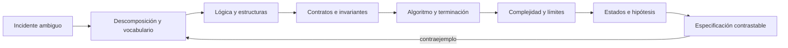

# Parte 4 — Pensamiento computacional y resolución de problemas

Pensar computacionalmente no consiste en «pensar como una máquina» ni en saltar a código. Consiste en elegir una representación que preserve lo importante, formular reglas que puedan discutirse, diseñar una estrategia finita y contrastar sus resultados y costos. Esta parte toma las trazas de Nexo y las convierte en **Atlas**, un planificador de diagnóstico que debe explicar por qué recomienda una prueba y cuándo su modelo no alcanza.

## Pregunta rectora

> ¿Cómo transformar un problema ambiguo en una solución cuya corrección, costo y límites puedan ser revisados?

## Antes del recorrido clase por clase

La parte alterna cuatro planos que deben permanecer conectados:

- **semántico:** qué significan las entradas, estados y resultados para las personas;
- **estructural:** conjuntos, relaciones, grafos y estados que representan el dominio;
- **procedimental:** algoritmo, invariante, variante, heurística y presupuesto;
- **empírico:** ejemplos, contraejemplos, mediciones y revisión adversarial.

El ciclo vuelve al problema cuando aparece un contraejemplo. No se «arregla» una prueba cambiando el resultado esperado: se revisa qué abstracción, regla o supuesto era insuficiente.

## Lo que cambia al completar esta parte

Podrás distinguir ejemplo de argumento, función de relación, estado de evento, corrección parcial de terminación y heurística de aproximación garantizada. Podrás estimar cómo crece una estrategia, decir honestamente cuándo no conoces el óptimo y entregar una especificación que una segunda persona pueda implementar y verificar.

## Recorrido clase por clase

| Clase | Núcleo | Aporte acumulativo a Atlas |
|---|---|---|
| [SE-049](https://github.com/vladimiracunadev-create/software-engineering-learning-suite/blob/main/classes/part-04-pensamiento-computacional-y-resolucion-de-problemas/se-049-descomposicion-abstraccion-y-reconocimiento-de-patrones/) | Descomposición, abstracción y reconocimiento de patrones | Separa el problema en resultados y contratos |
| [SE-050](https://github.com/vladimiracunadev-create/software-engineering-learning-suite/blob/main/classes/part-04-pensamiento-computacional-y-resolucion-de-problemas/se-050-logica-proposicional-predicados-e-inferencia/) | Lógica proposicional, predicados e inferencia | Hace explícitas premisas e inferencias |
| [SE-051](https://github.com/vladimiracunadev-create/software-engineering-learning-suite/blob/main/classes/part-04-pensamiento-computacional-y-resolucion-de-problemas/se-051-conjuntos-relaciones-funciones-y-grafos/) | Conjuntos, relaciones, funciones y grafos | Elige estructuras para pertenencia, relación y camino |
| [SE-052](https://github.com/vladimiracunadev-create/software-engineering-learning-suite/blob/main/classes/part-04-pensamiento-computacional-y-resolucion-de-problemas/se-052-invariantes-precondiciones-y-poscondiciones/) | Invariantes, precondiciones y poscondiciones | Protege propiedades antes, durante y después |
| [SE-053](https://github.com/vladimiracunadev-create/software-engineering-learning-suite/blob/main/classes/part-04-pensamiento-computacional-y-resolucion-de-problemas/se-053-recursion-induccion-y-razonamiento-estructural/) | Recursión, inducción y razonamiento estructural | Razona sobre repetición estructural |
| [SE-054](https://github.com/vladimiracunadev-create/software-engineering-learning-suite/blob/main/classes/part-04-pensamiento-computacional-y-resolucion-de-problemas/se-054-algoritmos-correccion-y-terminacion/) | Algoritmos, corrección y terminación | Demuestra resultado y terminación |
| [SE-055](https://github.com/vladimiracunadev-create/software-engineering-learning-suite/blob/main/classes/part-04-pensamiento-computacional-y-resolucion-de-problemas/se-055-complejidad-temporal-y-espacial/) | Complejidad temporal y espacial | Predice crecimiento de recursos |
| [SE-056](https://github.com/vladimiracunadev-create/software-engineering-learning-suite/blob/main/classes/part-04-pensamiento-computacional-y-resolucion-de-problemas/se-056-heuristicas-aproximacion-y-limites-computacionales/) | Heurísticas, aproximación y límites computacionales | Declara calidad cuando no puede optimizar |
| [SE-057](https://github.com/vladimiracunadev-create/software-engineering-learning-suite/blob/main/classes/part-04-pensamiento-computacional-y-resolucion-de-problemas/se-057-modelado-de-estado-transiciones-y-eventos/) | Modelado de estado, transiciones y eventos | Modela eventos, guardas y progreso |
| [SE-058](https://github.com/vladimiracunadev-create/software-engineering-learning-suite/blob/main/classes/part-04-pensamiento-computacional-y-resolucion-de-problemas/se-058-resolucion-sistematica-y-registro-de-hipotesis/) | Resolución sistemática y registro de hipótesis | Ordena hipótesis y pruebas |
| [SE-059](https://github.com/vladimiracunadev-create/software-engineering-learning-suite/blob/main/classes/part-04-pensamiento-computacional-y-resolucion-de-problemas/se-059-taller-descomponer-un-problema-ambiguo/) | Taller: descomponer un problema ambiguo | Reduce una petición ambigua |
| [SE-060](https://github.com/vladimiracunadev-create/software-engineering-learning-suite/blob/main/classes/part-04-pensamiento-computacional-y-resolucion-de-problemas/se-060-proyecto-especificacion-y-solucion-contrastable/) | Proyecto: especificación y solución contrastable | Entrega una especificación contrastable |

## Hilo pedagógico

Las clases 49 a 51 enseñan a recortar y representar; 52 a 54 establecen contratos y argumentos; 55 y 56 introducen recursos y límites; 57 y 58 convierten la solución en un proceso observable. El taller 59 reabre el problema frente a ambigüedad humana. El proyecto 60 integra todo en una especificación que alimentará la implementación de la Parte 5.

## Evidencias acumulativas

1. mapa de problema, actores, alcance y exclusiones;
2. glosario, proposiciones y estructuras del dominio;
3. precondiciones, poscondiciones, invariantes y variante;
4. algoritmo con argumento de corrección y análisis de costo;
5. máquina de estados y registro de hipótesis;
6. matriz requisito–regla–caso–evidencia;
7. paquete `problem.md`, `model.md` y `checks.md` revisado por otra persona.

## Criterios de aprobación del proyecto

- el problema incluye decisión, actor, resultado y restricciones;
- toda notación tiene interpretación y cambia una comprobación;
- la solución conserva autorización, trazabilidad y presupuesto;
- corrección, terminación y complejidad declaran dominio y supuestos;
- heurísticas no se presentan como óptimas sin garantía;
- casos cubren normal, límite, inválido, contradicción y recuperación;
- preguntas abiertas y efectos sobre personas permanecen visibles.

## Preguntas de control

¿Qué detalle se omitió al abstraer?, ¿la conclusión se sigue?, ¿la estructura representa uno-a-muchos?, ¿qué se mantiene verdadero?, ¿qué disminuye?, ¿qué tamaño domina?, ¿qué garantía real tiene la heurística?, ¿qué evento tardío falta?, ¿qué evidencia cambiaría la hipótesis?

## Fuentes base

- [MIT Mathematics for Computer Science](https://ocw.mit.edu/courses/6-042j-mathematics-for-computer-science-spring-2015/)
- [MIT Introduction to Algorithms](https://ocw.mit.edu/courses/6-006-introduction-to-algorithms-spring-2020/)
- [MIT Theory of Computation](https://ocw.mit.edu/courses/18-404j-theory-of-computation-fall-2020/)
- [SWEBOK Guide v4.0a](https://www.computer.org/education/bodies-of-knowledge/software-engineering)

Estas fuentes sostienen los conceptos, no certifican una especificación concreta. Atlas se aprueba por la coherencia entre problema, modelo, solución y evidencia.
