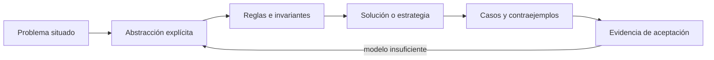

# SE-049 — Descomposición, abstracción y reconocimiento de patrones

[← SE-048 — Proyecto: servicio observable y tolerante a fallos de red](https://github.com/vladimiracunadev-create/software-engineering-learning-suite/blob/main/classes/part-03-redes-internet-y-protocolos/se-048-proyecto-servicio-observable-y-tolerante-a-fallos-de-red/README.md) · [↑ Parte 04](https://github.com/vladimiracunadev-create/software-engineering-learning-suite/blob/main/classes/part-04-pensamiento-computacional-y-resolucion-de-problemas/README.md) · [📚 Índice completo](https://github.com/vladimiracunadev-create/software-engineering-learning-suite/blob/main/classes/README.md) · [🌐 Portal](https://vladimiracunadev-create.github.io/software-engineering-learning-suite/classes/SE-049.html) · [SE-050 — Lógica proposicional, predicados e inferencia →](https://github.com/vladimiracunadev-create/software-engineering-learning-suite/blob/main/classes/part-04-pensamiento-computacional-y-resolucion-de-problemas/se-050-logica-proposicional-predicados-e-inferencia/README.md)

> Estado: **PLANNED** · Borrador público conservado íntegramente y sometido a auditoría técnica y pedagógica.

## Punto profesional y fundamento pedagógico

**Punto profesional.** La clase existe para descomponer un problema por responsabilidades y contratos sin perder restricciones transversales.

**Por qué aparece aquí.** Se sitúa después de **Proyecto: servicio observable y tolerante a fallos de red** y antes de **Lógica proposicional, predicados e inferencia**: convierte el conocimiento anterior en una decisión observable que la clase siguiente podrá reutilizar. La continuidad se comprueba en el artefacto, no por compartir vocabulario.

**Error conceptual que debe corregir.** Convertir descomposición en una lista arbitraria de tareas.

**Secuencia de aprendizaje.** Antes de leer la solución, el estudiante predice el resultado del caso normal y del error conceptual anterior. Luego explica un caso resuelto paso a paso, construye un contraejemplo que cambie la decisión y, sin consultar el texto, reconstruye el mecanismo y lo aplica a una entrada nueva. La secuencia usa predicción, explicación propia, contraste y recuperación. [ICAP](https://icap.education.asu.edu/research) distingue participación de construcción de conocimiento; [How People Learn II](https://nap.nationalacademies.org/catalog/24783/how-people-learn-ii-learners-contexts-and-cultures) exige conectar conocimiento previo, contexto y transferencia; la [práctica de recuperación](https://pubmed.ncbi.nlm.nih.gov/16507066/) respalda producir de nuevo la explicación tras una demora; y [Education for Life and Work](https://nap.nationalacademies.org/resource/13398/dbasse_084153.pdf) exige devolución que explique la causa del error.

**Evidencia de aprendizaje.** Problem-tree.md con fronteras, dependencias, invariantes y una descomposición alternativa. Debe contener predicción previa, observación, explicación causal, contraejemplo, criterio de aceptación y una nota de qué dato haría cambiar la conclusión.

**Límite de la conclusión.** Ninguna partición elimina coordinación; solo cambia dónde ocurre.

### Trazabilidad fuente → afirmación

| Fuente primaria u oficial | Afirmación que respalda | Lo que no prueba |
|---|---|---|
| [SWEBOK Guide v4.0a](https://www.computer.org/education/bodies-of-knowledge/software-engineering) | sitúa la decisión dentro de construcción, diseño, pruebas y práctica profesional de ingeniería de software | No demuestra por sí sola que el artefacto del estudiante sea correcto. |
| [MIT 6.042J — Mathematics for Computer Science](https://ocw.mit.edu/courses/6-042j-mathematics-for-computer-science-spring-2015/) | aporta lógica, inducción, relaciones, grafos y técnicas de demostración aplicadas | No demuestra por sí sola que el artefacto del estudiante sea correcto. |

## Antes de empezar

Esta clase continúa el **modelo de decisión diagnóstica**, que convierte la evidencia de la petición observable de extremo a extremo en una siguiente decisión explicable. Recupera `SE-048`: escribe qué artefacto dejó, qué supuesto permanece abierto y qué propiedad debe sobrevivir al nuevo modelo. La matemática se usa para restringir interpretaciones y encontrar errores; no como ornamentación.

## Prerrequisitos

- Poder separar hecho, interpretación, hipótesis y decisión.
- Manejar tablas, diagramas y pseudocódigo legible; Python es opcional.
- Trabajar con datos sintéticos del caso del modelo de decisión diagnóstica y conservar cada versión en Git.

## Problema auténtico

La petición observable de extremo a extremo entrega cientos de señales de un incidente. El modelo de decisión diagnóstica debe convertir «la conexión falla a veces» en subproblemas comprobables sin asumir de antemano que DNS, red o servidor son culpables. Una descomposición mala divide por equipos o herramientas, pero no por decisiones ni dependencias.

## Objetivos observables

Al finalizar podrás explicar el mecanismo con ejemplo y contraejemplo; construir un modelo con dominio y límites; derivar una prueba que pueda refutarlo; comparar al menos dos representaciones; y entregar una decisión cuya evidencia pueda revisar otra persona.

## Mapa conceptual



El mapa separa el problema de su representación. Los casos no reemplazan reglas; las reglas no prueban que el problema esté bien encuadrado. La pregunta de esta clase es: **¿Qué se conserva al reducir un problema y qué detalle sería peligroso eliminar?**

## Temas y por qué importan

| Lente | Pregunta | Evidencia |
|---|---|---|
| dominio | ¿qué entradas y estados existen? | vocabulario y particiones |
| estructura | ¿qué relaciones se conservan? | modelo interpretado |
| regla | ¿qué debe ser cierto? | contrato o invariante |
| estrategia | ¿qué pasos producen el resultado? | pseudocódigo y traza |
| límite | ¿dónde falla el argumento? | contraejemplo y caso límite |
## Conceptos y decisiones

### 1. Descomponer por resultados

Un subproblema debe producir un resultado que pueda combinarse: clasificar la primera divergencia, reunir evidencia autorizada o elegir la siguiente prueba. Dividir «frontend/backend/red» replica el organigrama y puede dejar huecos entre responsabilidades. La frontera útil minimiza coordinación y expone entradas y salidas.

### 2. Abstraer con propósito

Abstraer es conservar propiedades relevantes para una pregunta y omitir las demás. Para ordenar diagnósticos basta una categoría de costo y poder discriminante; la marca del comando puede omitirse. Si el modelo decide permisos, omitir quién ejecuta sería una pérdida crítica. Toda abstracción declara propósito y exclusiones.

### 3. Reconocer patrones sin forzar analogías

Un patrón conecta estructura y consecuencia repetidas: resolver–conectar–negociar aparece en muchos protocolos. Que dos incidentes compartan timeout no los hace equivalentes. Se valida el patrón buscando correspondencia entre estados, transiciones y fallos, y se registra el contraejemplo que rompería la analogía.

### 4. Interfaces entre subproblemas

Cada bloque especifica precondición, entrada, salida, error y owner. Si una etapa produce «red OK» sin definición, la siguiente recibe una opinión. El modelo de decisión diagnóstica usa resultados tipados como `DNS_TIMEOUT` o `TLS_NAME_MISMATCH`, acompañados de evidencia y confianza.

### 5. Recomposición y criterio de completitud

Resolver partes no garantiza resolver el todo. La recomposición revisa dependencias, conflictos y propiedades globales: privacidad, deadline y capacidad. Un árbol es completo para el alcance cuando cada resultado final puede rastrearse a una entrada y cada riesgo relevante tiene tratamiento o exclusión explícita.

## Definiciones de trabajo

- **descomposición:** separación de un problema en resultados coordinables.
- **abstracción:** modelo que conserva solo propiedades relevantes.
- **patrón:** estructura repetida con consecuencias conocidas.
- **interfaz:** contrato entre subproblemas.
- **recomposición:** integración y revisión de propiedades del conjunto.

Las definiciones fijan el uso en el modelo de decisión diagnóstica. Si una fuente usa otra convención, documenta la traducción. Una palabra definida no equivale a una propiedad demostrada.

## Ejemplo mínimo

Descompón «la petición tarda demasiado» en resultado esperado, entradas, cuatro fronteras y criterio de salida. Para cada frontera escribe qué dato consume y qué evidencia produce.

Antes de resolver, predice el resultado y la propiedad que debería conservarse. Después marca qué parte del resultado procede de la regla y cuál depende del ejemplo.

## Ejemplo profesional

El modelo de decisión diagnóstica representa el diagnóstico como un grafo: nodos de observación, hipótesis y prueba; aristas de dependencia. Una política impide ejecutar una prueba si falta autorización o si otra prueba barata ya descarta su rama. El grafo puede cambiar sin alterar el contrato del informe.

La entrega profesional hace visible el costo de simplificar. Incluye al menos una alternativa descartada y la condición que obligaría a revisar la decisión.

## Práctica guiada

1. reescribe el problema con actor, contexto y consecuencia.
2. crea una descomposición funcional y otra por datos.
3. marca dependencias y puntos de integración.
4. elimina un detalle y explica por qué sigue siendo seguro.
5. busca un contraejemplo que obligue a recuperar ese detalle.
6. solicita una revisión adversarial y corrige el modelo sin borrar la versión que falló.

## Ejercicios

1. **Comprensión:** define dos conceptos con ejemplo, no-ejemplo y límite.
2. **Construcción:** aplica el mecanismo a un caso del modelo de decisión diagnóstica no usado en la explicación.
3. **Refutación:** fabrica la entrada mínima que rompa una solución ingenua.
4. **Transferencia:** usa el mismo razonamiento en planificación de entregas o validación de datos.

## Reto verificable

Entrega `problem.md`, `model.md` y `checks.md`. Una persona revisora debe poder reconstruir dominio, supuestos, regla, resultado y límite; además debe encontrar qué caso refutaría la solución sin preguntarte oralmente.

## Demostración guiada

1. Declara el dominio y selecciona un caso pequeño calculable a mano.
2. Ejecuta la estrategia paso a paso y conserva estados intermedios.
3. Comprueba el resultado contra la definición, no contra intuición.
4. Introduce el fallo controlado y localiza la primera regla violada.
5. Repara el modelo y repite el caso original y el contraejemplo.

## Preguntas frecuentes

### ¿Formal significa usar símbolos difíciles?

No. Significa que dominio, reglas y criterio permiten decidir si una afirmación se sostiene. Una tabla precisa puede ser más formal que una fórmula ambigua.

### ¿Un conjunto grande de pruebas demuestra corrección?

No para un dominio ilimitado. Las pruebas aportan evidencia y detectan defectos; un argumento cubre clases de entradas, siempre bajo supuestos declarados.

### ¿Puedo implementar antes de especificar todo?

Puedes explorar, pero el prototipo no redefine silenciosamente el problema. Registra qué aprendiste y actualiza contrato y casos antes de aprobar.

## Fallo controlado y diagnóstico

Divide el incidente únicamente por herramientas —`dig`, `curl`, capturador— y trata de recomponer una conclusión. Registra los huecos de responsabilidad; reorganiza por preguntas y resultados.

Conserva el modelo fallido, la entrada que lo expone, la regla violada y la corrección. No ajustes solo el resultado esperado para hacer pasar el caso.

## Errores comunes y cómo corregirlos

| Síntoma | Causa | Corrección |
|---|---|---|
| el ejemplo funciona pero otro caso no | generalización desde una muestra | definir dominio y buscar frontera |
| dos personas leen reglas distintas | términos o cuantificadores implícitos | glosario y contrato observable |
| el diagrama no cambia decisiones | notación decorativa | interpretar relaciones y límites |
| el proceso no termina | falta medida decreciente o presupuesto | variante y condición de salida |
| se declara «óptimo» sin prueba | confusión entre hallado y garantizado | declarar cota y calidad real |

## Entorno y archivos clave

```text
work/SE-049/
├── problem.md     # contexto, dominio, supuestos y exclusiones
├── model.md       # definiciones, reglas, diagrama y estrategia
├── checks.md      # ejemplos, contraejemplos y aceptación
└── review.md      # objeciones y revisión del modelo
```

El pseudocódigo debe ser independiente de lenguaje y cada diagrama necesita explicación textual. Si usas código para explorar, registra versión, entrada y salida; no lo presentes automáticamente como producto de la clase.

## Seguridad, ética y accesibilidad

- usa incidentes sintéticos y evita convertir direcciones o usuarios en datos de práctica;
- trata autorización y privacidad como invariantes, no como pasos opcionales;
- registra a quién perjudica un falso positivo, falso negativo o prioridad automática;
- ofrece tablas y texto alternativo para diagramas y símbolos;
- define mecanismo de revisión humana y apelación para recomendaciones;
- no uses un modelo parcial para justificar una decisión irreversible.

## Transferencia

Aplica el mecanismo a otro dominio y conserva la estructura del argumento, no los nombres del modelo de decisión diagnóstica. Explica qué dominio, invariante o medida cambia. Si el razonamiento deja de funcionar, identifica el supuesto que pertenecía al caso original.

## Evaluación y evidencia

| Criterio | Para aprobar |
|---|---|
| precisión | dominio, términos y cuantificadores explícitos |
| mecanismo | pasos y relaciones explican el resultado |
| corrección | invariantes, casos o argumento adecuados a la afirmación |
| límites | contraejemplo, costo y supuestos visibles |
| revisión | trazabilidad y objeciones preservadas |

Completar archivos no concede aprobación. La evidencia debe sostener la afirmación exacta, y la revisión de otra persona debe poder contradecirla.

## Fuentes


- [SWEBOK Guide v4.0a](https://www.computer.org/education/bodies-of-knowledge/software-engineering) — sitúa la decisión dentro de construcción, diseño, pruebas y práctica profesional de ingeniería de software.
- [MIT 6.042J — Mathematics for Computer Science](https://ocw.mit.edu/courses/6-042j-mathematics-for-computer-science-spring-2015/) — aporta lógica, inducción, relaciones, grafos y técnicas de demostración aplicadas.

Los cursos y SWEBOK aportan definiciones y métodos; no validan automáticamente el modelo del modelo de decisión diagnóstica. Cada aplicación se sostiene con el artefacto y sus casos.

## Límites y siguiente paso

La descomposición no demuestra corrección ni prioriza por sí sola. La próxima clase formaliza afirmaciones y condiciones con lógica.

## Glosario

- **descomposición:** separación de un problema en resultados coordinables.
- **abstracción:** modelo que conserva solo propiedades relevantes.
- **patrón:** estructura repetida con consecuencias conocidas.
- **interfaz:** contrato entre subproblemas.
- **recomposición:** integración y revisión de propiedades del conjunto.

---

[← SE-048 — Proyecto: servicio observable y tolerante a fallos de red](https://github.com/vladimiracunadev-create/software-engineering-learning-suite/blob/main/classes/part-03-redes-internet-y-protocolos/se-048-proyecto-servicio-observable-y-tolerante-a-fallos-de-red/README.md) · [↑ Parte 04](https://github.com/vladimiracunadev-create/software-engineering-learning-suite/blob/main/classes/part-04-pensamiento-computacional-y-resolucion-de-problemas/README.md) · [📚 Índice completo](https://github.com/vladimiracunadev-create/software-engineering-learning-suite/blob/main/classes/README.md) · [🌐 Portal](https://vladimiracunadev-create.github.io/software-engineering-learning-suite/classes/SE-049.html) · [SE-050 — Lógica proposicional, predicados e inferencia →](https://github.com/vladimiracunadev-create/software-engineering-learning-suite/blob/main/classes/part-04-pensamiento-computacional-y-resolucion-de-problemas/se-050-logica-proposicional-predicados-e-inferencia/README.md)
