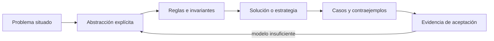

# SE-052 — Invariantes, precondiciones y poscondiciones

[← SE-051 — Conjuntos, relaciones, funciones y grafos](https://github.com/vladimiracunadev-create/software-engineering-learning-suite/blob/main/classes/part-04-pensamiento-computacional-y-resolucion-de-problemas/se-051-conjuntos-relaciones-funciones-y-grafos/README.md) · [↑ Parte 04](https://github.com/vladimiracunadev-create/software-engineering-learning-suite/blob/main/classes/part-04-pensamiento-computacional-y-resolucion-de-problemas/README.md) · [📚 Índice completo](https://github.com/vladimiracunadev-create/software-engineering-learning-suite/blob/main/classes/README.md) · [🌐 Portal](https://vladimiracunadev-create.github.io/software-engineering-learning-suite/classes/SE-052.html) · [SE-053 — Recursión, inducción y razonamiento estructural →](https://github.com/vladimiracunadev-create/software-engineering-learning-suite/blob/main/classes/part-04-pensamiento-computacional-y-resolucion-de-problemas/se-053-recursion-induccion-y-razonamiento-estructural/README.md)

> Estado: **PLANNED** · Borrador público conservado íntegramente y sometido a auditoría técnica y pedagógica.

## Punto profesional y fundamento pedagógico

**Punto profesional.** La clase existe para formular precondiciones, poscondiciones e invariantes que hagan verificable una transición.

**Por qué aparece aquí.** Se sitúa después de **Conjuntos, relaciones, funciones y grafos** y antes de **Recursión, inducción y razonamiento estructural**: convierte el conocimiento anterior en una decisión observable que la clase siguiente podrá reutilizar. La continuidad se comprueba en el artefacto, no por compartir vocabulario.

**Error conceptual que debe corregir.** Escribir validaciones aisladas sin una propiedad que deba preservarse.

**Secuencia de aprendizaje.** Antes de leer la solución, el estudiante predice el resultado del caso normal y del error conceptual anterior. Luego explica un caso resuelto paso a paso, construye un contraejemplo que cambie la decisión y, sin consultar el texto, reconstruye el mecanismo y lo aplica a una entrada nueva. La secuencia usa predicción, explicación propia, contraste y recuperación. [ICAP](https://icap.education.asu.edu/research) distingue participación de construcción de conocimiento; [How People Learn II](https://nap.nationalacademies.org/catalog/24783/how-people-learn-ii-learners-contexts-and-cultures) exige conectar conocimiento previo, contexto y transferencia; la [práctica de recuperación](https://pubmed.ncbi.nlm.nih.gov/16507066/) respalda producir de nuevo la explicación tras una demora; y [Education for Life and Work](https://nap.nationalacademies.org/resource/13398/dbasse_084153.pdf) exige devolución que explique la causa del error.

**Evidencia de aprendizaje.** Contract-proof.md con estados válidos, transición, invariante y contraejemplo mínimo. Debe contener predicción previa, observación, explicación causal, contraejemplo, criterio de aceptación y una nota de qué dato haría cambiar la conclusión.

**Límite de la conclusión.** Probar casos no constituye demostración exhaustiva.

### Trazabilidad fuente → afirmación

| Fuente primaria u oficial | Afirmación que respalda | Lo que no prueba |
|---|---|---|
| [MIT 6.042J — Mathematics for Computer Science](https://ocw.mit.edu/courses/6-042j-mathematics-for-computer-science-spring-2015/) | aporta lógica, inducción, relaciones, grafos y técnicas de demostración aplicadas | No demuestra por sí sola que el artefacto del estudiante sea correcto. |
| [MIT 6.006 — Introduction to Algorithms](https://ocw.mit.edu/courses/6-006-introduction-to-algorithms-spring-2020/) | aporta definiciones, invariantes y análisis de estructuras y algoritmos usados en la clase | No demuestra por sí sola que el artefacto del estudiante sea correcto. |
| [SWEBOK Guide v4.0a](https://www.computer.org/education/bodies-of-knowledge/software-engineering) | sitúa la decisión dentro de construcción, diseño, pruebas y práctica profesional de ingeniería de software | No demuestra por sí sola que el artefacto del estudiante sea correcto. |

## Antes de empezar

Esta clase continúa el **modelo de decisión diagnóstica**, que convierte la evidencia de la petición observable de extremo a extremo en una siguiente decisión explicable. Recupera `SE-051`: escribe qué artefacto dejó, qué supuesto permanece abierto y qué propiedad debe sobrevivir al nuevo modelo. La matemática se usa para restringir interpretaciones y encontrar errores; no como ornamentación.

## Prerrequisitos

- Poder separar hecho, interpretación, hipótesis y decisión.
- Manejar tablas, diagramas y pseudocódigo legible; Python es opcional.
- Trabajar con datos sintéticos del caso del modelo de decisión diagnóstica y conservar cada versión en Git.

## Problema auténtico

El modelo de decisión diagnóstica reordena pruebas para ahorrar tiempo, pero a veces recomienda una prueba no autorizada o pierde una hipótesis todavía viable. Los ejemplos felices no detectan la violación. Se necesitan contratos e invariantes que restrinjan todas las transiciones.

## Objetivos observables

Al finalizar podrás explicar el mecanismo con ejemplo y contraejemplo; construir un modelo con dominio y límites; derivar una prueba que pueda refutarlo; comparar al menos dos representaciones; y entregar una decisión cuya evidencia pueda revisar otra persona.

## Mapa conceptual



El mapa separa el problema de su representación. Los casos no reemplazan reglas; las reglas no prueban que el problema esté bien encuadrado. La pregunta de esta clase es: **¿Qué debe ser cierto antes, después y durante cada paso?**

## Temas y por qué importan

| Lente | Pregunta | Evidencia |
|---|---|---|
| dominio | ¿qué entradas y estados existen? | vocabulario y particiones |
| estructura | ¿qué relaciones se conservan? | modelo interpretado |
| regla | ¿qué debe ser cierto? | contrato o invariante |
| estrategia | ¿qué pasos producen el resultado? | pseudocódigo y traza |
| límite | ¿dónde falla el argumento? | contraejemplo y caso límite |
## Conceptos y decisiones

### 1. Precondición

La precondición describe estados de entrada que una operación acepta. No es una esperanza escondida. `destino autorizado` y `presupuesto > costo_estimado` permiten decidir antes de ejecutar. Si el consumidor puede violarla, la interfaz debe validar y producir un error observable.

### 2. Poscondición

La poscondición relaciona estado previo, entrada y salida. «devuelve una lista» es débil; «devuelve solo pruebas autorizadas y toda hipótesis descartada cita evidencia» es contrastable. Una operación puede garantizar distintas poscondiciones para éxito y error.

### 3. Invariante

Un invariante permanece verdadero en puntos definidos de un proceso. En el modelo de decisión diagnóstica: ninguna acción ejecutada queda sin autorización y cada hipótesis activa conserva una prueba posible. Para sostenerlo se demuestra inicialización, preservación por paso y utilidad al terminar.

### 4. Fortaleza y composición

Una precondición más fuerte acepta menos entradas; una poscondición más fuerte promete más. Al componer A→B, la salida de A debe satisfacer la entrada de B. Reforzar precondiciones o debilitar poscondiciones puede romper consumidores aunque la implementación local parezca correcta.

### 5. Invariantes como diseño

El invariante guía la representación y el algoritmo. Si se necesita unicidad de IDs, un mapa y una validación de inserción hacen visible la regla. Comprobar solo al final detecta tarde el daño y dificulta localizar la transición responsable.

## Definiciones de trabajo

- **precondición:** propiedad requerida al iniciar una operación.
- **poscondición:** propiedad garantizada al terminar bajo el contrato.
- **invariante:** propiedad preservada en puntos definidos.
- **estado válido:** estado que satisface restricciones del modelo.
- **composición:** encadenamiento donde garantías alimentan requisitos.

Las definiciones fijan el uso en el modelo de decisión diagnóstica. Si una fuente usa otra convención, documenta la traducción. Una palabra definida no equivale a una propiedad demostrada.

## Ejemplo mínimo

Especifica `seleccionar_prueba(hipótesis, pruebas, presupuesto)` con tres precondiciones, cuatro poscondiciones y dos errores. Define un invariante que impida ejecutar una prueba no autorizada.

Antes de resolver, predice el resultado y la propiedad que debería conservarse. Después marca qué parte del resultado procede de la regla y cuál depende del ejemplo.

## Ejemplo profesional

Cada transición del modelo de decisión diagnóstica valida autorización, consume presupuesto y conserva trazabilidad. Las comprobaciones se ejecutan en bordes y en pruebas; una violación interna se trata como defecto, no como entrada inválida del usuario.

La entrega profesional hace visible el costo de simplificar. Incluye al menos una alternativa descartada y la condición que obligaría a revisar la decisión.

## Práctica guiada

1. escribe estado válido inicial.
2. declara pre y poscondiciones.
3. elige un invariante útil para el resultado.
4. simula dos transiciones y prueba preservación.
5. crea un caso que viole el contrato y diseña el error.
6. solicita una revisión adversarial y corrige el modelo sin borrar la versión que falló.

## Ejercicios

1. **Comprensión:** define dos conceptos con ejemplo, no-ejemplo y límite.
2. **Construcción:** aplica el mecanismo a un caso del modelo de decisión diagnóstica no usado en la explicación.
3. **Refutación:** fabrica la entrada mínima que rompa una solución ingenua.
4. **Transferencia:** usa el mismo razonamiento en planificación de entregas o validación de datos.

## Reto verificable

Entrega `problem.md`, `model.md` y `checks.md`. Una persona revisora debe poder reconstruir dominio, supuestos, regla, resultado y límite; además debe encontrar qué caso refutaría la solución sin preguntarte oralmente.

## Demostración guiada

1. Declara el dominio y selecciona un caso pequeño calculable a mano.
2. Ejecuta la estrategia paso a paso y conserva estados intermedios.
3. Comprueba el resultado contra la definición, no contra intuición.
4. Introduce el fallo controlado y localiza la primera regla violada.
5. Repara el modelo y repite el caso original y el contraejemplo.

## Preguntas frecuentes

### ¿Formal significa usar símbolos difíciles?

No. Significa que dominio, reglas y criterio permiten decidir si una afirmación se sostiene. Una tabla precisa puede ser más formal que una fórmula ambigua.

### ¿Un conjunto grande de pruebas demuestra corrección?

No para un dominio ilimitado. Las pruebas aportan evidencia y detectan defectos; un argumento cubre clases de entradas, siempre bajo supuestos declarados.

### ¿Puedo implementar antes de especificar todo?

Puedes explorar, pero el prototipo no redefine silenciosamente el problema. Registra qué aprendiste y actualiza contrato y casos antes de aprobar.

## Fallo controlado y diagnóstico

Ordena una lista de pruebas y borra duplicados por nombre, aunque dos tengan distinto alcance. La invariancia de trazabilidad se rompe. Introduce identidad estable y separa presentación de igualdad.

Conserva el modelo fallido, la entrada que lo expone, la regla violada y la corrección. No ajustes solo el resultado esperado para hacer pasar el caso.

## Errores comunes y cómo corregirlos

| Síntoma | Causa | Corrección |
|---|---|---|
| el ejemplo funciona pero otro caso no | generalización desde una muestra | definir dominio y buscar frontera |
| dos personas leen reglas distintas | términos o cuantificadores implícitos | glosario y contrato observable |
| el diagrama no cambia decisiones | notación decorativa | interpretar relaciones y límites |
| el proceso no termina | falta medida decreciente o presupuesto | variante y condición de salida |
| se declara «óptimo» sin prueba | confusión entre hallado y garantizado | declarar cota y calidad real |

## Entorno y archivos clave

```text
work/SE-052/
├── problem.md     # contexto, dominio, supuestos y exclusiones
├── model.md       # definiciones, reglas, diagrama y estrategia
├── checks.md      # ejemplos, contraejemplos y aceptación
└── review.md      # objeciones y revisión del modelo
```

El pseudocódigo debe ser independiente de lenguaje y cada diagrama necesita explicación textual. Si usas código para explorar, registra versión, entrada y salida; no lo presentes automáticamente como producto de la clase.

## Seguridad, ética y accesibilidad

- usa incidentes sintéticos y evita convertir direcciones o usuarios en datos de práctica;
- trata autorización y privacidad como invariantes, no como pasos opcionales;
- registra a quién perjudica un falso positivo, falso negativo o prioridad automática;
- ofrece tablas y texto alternativo para diagramas y símbolos;
- define mecanismo de revisión humana y apelación para recomendaciones;
- no uses un modelo parcial para justificar una decisión irreversible.

## Transferencia

Aplica el mecanismo a otro dominio y conserva la estructura del argumento, no los nombres del modelo de decisión diagnóstica. Explica qué dominio, invariante o medida cambia. Si el razonamiento deja de funcionar, identifica el supuesto que pertenecía al caso original.

## Evaluación y evidencia

| Criterio | Para aprobar |
|---|---|
| precisión | dominio, términos y cuantificadores explícitos |
| mecanismo | pasos y relaciones explican el resultado |
| corrección | invariantes, casos o argumento adecuados a la afirmación |
| límites | contraejemplo, costo y supuestos visibles |
| revisión | trazabilidad y objeciones preservadas |

Completar archivos no concede aprobación. La evidencia debe sostener la afirmación exacta, y la revisión de otra persona debe poder contradecirla.

## Fuentes


- [MIT 6.042J — Mathematics for Computer Science](https://ocw.mit.edu/courses/6-042j-mathematics-for-computer-science-spring-2015/) — aporta lógica, inducción, relaciones, grafos y técnicas de demostración aplicadas.
- [MIT 6.006 — Introduction to Algorithms](https://ocw.mit.edu/courses/6-006-introduction-to-algorithms-spring-2020/) — aporta definiciones, invariantes y análisis de estructuras y algoritmos usados en la clase.
- [SWEBOK Guide v4.0a](https://www.computer.org/education/bodies-of-knowledge/software-engineering) — sitúa la decisión dentro de construcción, diseño, pruebas y práctica profesional de ingeniería de software.

Los cursos y SWEBOK aportan definiciones y métodos; no validan automáticamente el modelo del modelo de decisión diagnóstica. Cada aplicación se sostiene con el artefacto y sus casos.

## Límites y siguiente paso

Los contratos no cubren por sí solos propiedades temporales, concurrencia o intención humana. La siguiente clase conecta repetición estructural con recursión e inducción.

## Glosario

- **precondición:** propiedad requerida al iniciar una operación.
- **poscondición:** propiedad garantizada al terminar bajo el contrato.
- **invariante:** propiedad preservada en puntos definidos.
- **estado válido:** estado que satisface restricciones del modelo.
- **composición:** encadenamiento donde garantías alimentan requisitos.

---

[← SE-051 — Conjuntos, relaciones, funciones y grafos](https://github.com/vladimiracunadev-create/software-engineering-learning-suite/blob/main/classes/part-04-pensamiento-computacional-y-resolucion-de-problemas/se-051-conjuntos-relaciones-funciones-y-grafos/README.md) · [↑ Parte 04](https://github.com/vladimiracunadev-create/software-engineering-learning-suite/blob/main/classes/part-04-pensamiento-computacional-y-resolucion-de-problemas/README.md) · [📚 Índice completo](https://github.com/vladimiracunadev-create/software-engineering-learning-suite/blob/main/classes/README.md) · [🌐 Portal](https://vladimiracunadev-create.github.io/software-engineering-learning-suite/classes/SE-052.html) · [SE-053 — Recursión, inducción y razonamiento estructural →](https://github.com/vladimiracunadev-create/software-engineering-learning-suite/blob/main/classes/part-04-pensamiento-computacional-y-resolucion-de-problemas/se-053-recursion-induccion-y-razonamiento-estructural/README.md)
