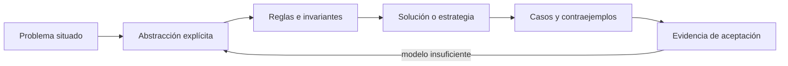

# SE-054 — Algoritmos, corrección y terminación

[← SE-053 — Recursión, inducción y razonamiento estructural](https://github.com/vladimiracunadev-create/modern-software-engineering-program/blob/main/classes/part-04-pensamiento-computacional-y-resolucion-de-problemas/se-053-recursion-induccion-y-razonamiento-estructural/README.md) · [↑ Parte 04](https://github.com/vladimiracunadev-create/modern-software-engineering-program/blob/main/classes/part-04-pensamiento-computacional-y-resolucion-de-problemas/README.md) · [📚 Índice completo](https://github.com/vladimiracunadev-create/modern-software-engineering-program/blob/main/classes/README.md) · [🌐 Portal](https://vladimiracunadev-create.github.io/modern-software-engineering-program/classes/SE-054.html) · [SE-055 — Complejidad temporal y espacial →](https://github.com/vladimiracunadev-create/modern-software-engineering-program/blob/main/classes/part-04-pensamiento-computacional-y-resolucion-de-problemas/se-055-complejidad-temporal-y-espacial/README.md)


## Punto profesional y fundamento pedagógico

**Punto profesional.** La clase existe para separar corrección parcial, terminación y adecuación del algoritmo al contrato.

**Por qué aparece aquí.** Se sitúa después de **Recursión, inducción y razonamiento estructural** y antes de **Complejidad temporal y espacial**: convierte el conocimiento anterior en una decisión observable que la clase siguiente podrá reutilizar. La continuidad se comprueba en el artefacto, no por compartir vocabulario.

**Error conceptual que debe corregir.** Declarar correcto un algoritmo porque produce una salida esperada.

**Secuencia de aprendizaje.** Antes de leer la solución, el estudiante predice el resultado del caso normal y del error conceptual anterior. Luego explica un caso resuelto paso a paso, construye un contraejemplo que cambie la decisión y, sin consultar el texto, reconstruye el mecanismo y lo aplica a una entrada nueva. La secuencia usa predicción, explicación propia, contraste y recuperación. [ICAP](https://icap.education.asu.edu/research) distingue participación de construcción de conocimiento; [How People Learn II](https://nap.nationalacademies.org/catalog/24783/how-people-learn-ii-learners-contexts-and-cultures) exige conectar conocimiento previo, contexto y transferencia; la [práctica de recuperación](https://pubmed.ncbi.nlm.nih.gov/16507066/) respalda producir de nuevo la explicación tras una demora; y [Education for Life and Work](https://nap.nationalacademies.org/resource/13398/dbasse_084153.pdf) exige devolución que explique la causa del error.

**Evidencia de aprendizaje.** Correctness.md con especificación, invariante de bucle, terminación y caso límite. Debe contener predicción previa, observación, explicación causal, contraejemplo, criterio de aceptación y una nota de qué dato haría cambiar la conclusión.

**Límite de la conclusión.** El argumento cubre el modelo de entrada declarado, no datos arbitrarios.

### Trazabilidad fuente → afirmación

| Fuente primaria u oficial | Afirmación que respalda | Lo que no prueba |
|---|---|---|
| [MIT 6.006 — Introduction to Algorithms](https://ocw.mit.edu/courses/6-006-introduction-to-algorithms-spring-2020/) | aporta definiciones, invariantes y análisis de estructuras y algoritmos usados en la clase | No demuestra por sí sola que el artefacto del estudiante sea correcto. |
| [MIT 6.042J — Mathematics for Computer Science](https://ocw.mit.edu/courses/6-042j-mathematics-for-computer-science-spring-2015/) | aporta lógica, inducción, relaciones, grafos y técnicas de demostración aplicadas | No demuestra por sí sola que el artefacto del estudiante sea correcto. |
| [SWEBOK Guide v4.0a](https://www.computer.org/education/bodies-of-knowledge/software-engineering) | sitúa la decisión dentro de construcción, diseño, pruebas y práctica profesional de ingeniería de software | No demuestra por sí sola que el artefacto del estudiante sea correcto. |

## Antes de empezar

Esta clase continúa el **modelo de decisión diagnóstica**, que convierte la evidencia de la petición observable de extremo a extremo en una siguiente decisión explicable. Recupera `SE-053`: escribe qué artefacto dejó, qué supuesto permanece abierto y qué propiedad debe sobrevivir al nuevo modelo. La matemática se usa para restringir interpretaciones y encontrar errores; no como ornamentación.

## Prerrequisitos

- Poder separar hecho, interpretación, hipótesis y decisión.
- Manejar tablas, diagramas y pseudocódigo legible; Python es opcional.
- Trabajar con datos sintéticos del caso del modelo de decisión diagnóstica y conservar cada versión en Git.

## Problema auténtico

El modelo de decisión diagnóstica encuentra una secuencia de pruebas en los ejemplos, pero eso no demuestra que siempre conserve hipótesis correctas ni que termine. El equipo debe separar especificación, corrección parcial, terminación y corrección total.

## Objetivos observables

Al finalizar podrás explicar el mecanismo con ejemplo y contraejemplo; construir un modelo con dominio y límites; derivar una prueba que pueda refutarlo; comparar al menos dos representaciones; y entregar una decisión cuya evidencia pueda revisar otra persona.

## Mapa conceptual



El mapa separa el problema de su representación. Los casos no reemplazan reglas; las reglas no prueban que el problema esté bien encuadrado. La pregunta de esta clase es: **¿Por qué el procedimiento termina y satisface el contrato para toda entrada válida?**

## Temas y por qué importan

| Lente | Pregunta | Evidencia |
|---|---|---|
| dominio | ¿qué entradas y estados existen? | vocabulario y particiones |
| estructura | ¿qué relaciones se conservan? | modelo interpretado |
| regla | ¿qué debe ser cierto? | contrato o invariante |
| estrategia | ¿qué pasos producen el resultado? | pseudocódigo y traza |
| límite | ¿dónde falla el argumento? | contraejemplo y caso límite |
## Conceptos y decisiones

### 1. Problema, instancia y algoritmo

El problema define entradas válidas y salidas aceptables; una instancia es un caso concreto; el algoritmo es un procedimiento finito y no ambiguo. Un programa incorpora representación, errores y recursos. Confundirlos hace que una limitación de implementación parezca imposibilidad del problema.

### 2. Corrección parcial

Si el algoritmo termina, la salida satisface la poscondición. Para un bucle se demuestra que el invariante inicia, se preserva y junto con la condición de salida implica el resultado. Probar cinco casos aporta evidencia, no universalidad.

### 3. Terminación

Una variante toma valores en un orden bien fundado y disminuye en cada iteración. `pendientes` puede servir si ningún paso vuelve a insertar indefinidamente. Un timeout detiene una ejecución, pero no demuestra que el algoritmo termine para cualquier entrada.

### 4. Corrección total

Combina corrección parcial y terminación. También requiere que operaciones primitivas cumplan sus contratos. Un argumento informal debe declarar dominio y supuestos; si el grafo es finito y acíclico, eso forma parte de la precondición.

### 5. Refinamiento y trazabilidad

Se parte de una especificación abstracta y se eligen pasos que la preservan. Cada optimización debe mantener invariantes y salida observable. El modelo de decisión diagnóstica vincula requisitos con lemas, casos límite y pruebas, de modo que cambiar una regla revele qué argumento revisar.

## Definiciones de trabajo

- **algoritmo:** procedimiento finito y no ambiguo para un problema.
- **corrección parcial:** si termina, satisface la especificación.
- **terminación:** propiedad de finalizar para toda entrada del dominio.
- **variante:** medida bien fundada que disminuye.
- **corrección total:** corrección parcial más terminación.

Las definiciones fijan el uso en el modelo de decisión diagnóstica. Si una fuente usa otra convención, documenta la traducción. Una palabra definida no equivale a una propiedad demostrada.

## Ejemplo mínimo

Especifica búsqueda lineal de una prueba con cierto tag. Declara invariante sobre el prefijo revisado y variante `n-i`; demuestra resultado encontrado o ausencia al terminar.

Antes de resolver, predice el resultado y la propiedad que debería conservarse. Después marca qué parte del resultado procede de la regla y cuál depende del ejemplo.

## Ejemplo profesional

El planificador del modelo de decisión diagnóstica selecciona el nodo autorizado de menor costo entre candidatos. El argumento prueba que nunca retorna fuera del conjunto elegible y que elimina un candidato por paso. Las pruebas cubren empate, vacío, costo límite y datos inválidos.

La entrega profesional hace visible el costo de simplificar. Incluye al menos una alternativa descartada y la condición que obligaría a revisar la decisión.

## Práctica guiada

1. separa problema de implementación.
2. declara pre y poscondición.
3. formula invariante.
4. elige variante bien fundada.
5. mapea cada parte del argumento a un caso de prueba.
6. solicita una revisión adversarial y corrige el modelo sin borrar la versión que falló.

## Ejercicios

1. **Comprensión:** define dos conceptos con ejemplo, no-ejemplo y límite.
2. **Construcción:** aplica el mecanismo a un caso del modelo de decisión diagnóstica no usado en la explicación.
3. **Refutación:** fabrica la entrada mínima que rompa una solución ingenua.
4. **Transferencia:** usa el mismo razonamiento en planificación de entregas o validación de datos.

## Reto verificable

Entrega `problem.md`, `model.md` y `checks.md`. Una persona revisora debe poder reconstruir dominio, supuestos, regla, resultado y límite; además debe encontrar qué caso refutaría la solución sin preguntarte oralmente.

## Demostración guiada

1. Declara el dominio y selecciona un caso pequeño calculable a mano.
2. Ejecuta la estrategia paso a paso y conserva estados intermedios.
3. Comprueba el resultado contra la definición, no contra intuición.
4. Introduce el fallo controlado y localiza la primera regla violada.
5. Repara el modelo y repite el caso original y el contraejemplo.

## Preguntas frecuentes

### ¿Formal significa usar símbolos difíciles?

No. Significa que dominio, reglas y criterio permiten decidir si una afirmación se sostiene. Una tabla precisa puede ser más formal que una fórmula ambigua.

### ¿Un conjunto grande de pruebas demuestra corrección?

No para un dominio ilimitado. Las pruebas aportan evidencia y detectan defectos; un argumento cubre clases de entradas, siempre bajo supuestos declarados.

### ¿Puedo implementar antes de especificar todo?

Puedes explorar, pero el prototipo no redefine silenciosamente el problema. Registra qué aprendiste y actualiza contrato y casos antes de aprobar.

## Fallo controlado y diagnóstico

Permite que una prueba fallida se reinserte sin reducir intentos. El invariante puede conservarse y aun así no terminar. Añade presupuesto decreciente y explica por qué llega a cero.

Conserva el modelo fallido, la entrada que lo expone, la regla violada y la corrección. No ajustes solo el resultado esperado para hacer pasar el caso.

## Errores comunes y cómo corregirlos

| Síntoma | Causa | Corrección |
|---|---|---|
| el ejemplo funciona pero otro caso no | generalización desde una muestra | definir dominio y buscar frontera |
| dos personas leen reglas distintas | términos o cuantificadores implícitos | glosario y contrato observable |
| el diagrama no cambia decisiones | notación decorativa | interpretar relaciones y límites |
| el proceso no termina | falta medida decreciente o presupuesto | variante y condición de salida |
| se declara «óptimo» sin prueba | confusión entre hallado y garantizado | declarar cota y calidad real |

## Entorno y archivos clave

```text
work/SE-054/
├── problem.md     # contexto, dominio, supuestos y exclusiones
├── model.md       # definiciones, reglas, diagrama y estrategia
├── checks.md      # ejemplos, contraejemplos y aceptación
└── review.md      # objeciones y revisión del modelo
```

El pseudocódigo debe ser independiente de lenguaje y cada diagrama necesita explicación textual. Si usas código para explorar, registra versión, entrada y salida; no lo presentes automáticamente como producto de la clase.

## Seguridad, ética y accesibilidad

- usa incidentes sintéticos y evita convertir direcciones o usuarios en datos de práctica;
- trata autorización y privacidad como invariantes, no como pasos opcionales;
- registra a quién perjudica un falso positivo, falso negativo o prioridad automática;
- ofrece tablas y texto alternativo para diagramas y símbolos;
- define mecanismo de revisión humana y apelación para recomendaciones;
- no uses un modelo parcial para justificar una decisión irreversible.

## Transferencia

Aplica el mecanismo a otro dominio y conserva la estructura del argumento, no los nombres del modelo de decisión diagnóstica. Explica qué dominio, invariante o medida cambia. Si el razonamiento deja de funcionar, identifica el supuesto que pertenecía al caso original.

## Evaluación y evidencia

| Criterio | Para aprobar |
|---|---|
| precisión | dominio, términos y cuantificadores explícitos |
| mecanismo | pasos y relaciones explican el resultado |
| corrección | invariantes, casos o argumento adecuados a la afirmación |
| límites | contraejemplo, costo y supuestos visibles |
| revisión | trazabilidad y objeciones preservadas |

Completar archivos no concede aprobación. La evidencia debe sostener la afirmación exacta, y la revisión de otra persona debe poder contradecirla.

## Fuentes


- [MIT 6.006 — Introduction to Algorithms](https://ocw.mit.edu/courses/6-006-introduction-to-algorithms-spring-2020/) — aporta definiciones, invariantes y análisis de estructuras y algoritmos usados en la clase.
- [MIT 6.042J — Mathematics for Computer Science](https://ocw.mit.edu/courses/6-042j-mathematics-for-computer-science-spring-2015/) — aporta lógica, inducción, relaciones, grafos y técnicas de demostración aplicadas.
- [SWEBOK Guide v4.0a](https://www.computer.org/education/bodies-of-knowledge/software-engineering) — sitúa la decisión dentro de construcción, diseño, pruebas y práctica profesional de ingeniería de software.

Los cursos y SWEBOK aportan definiciones y métodos; no validan automáticamente el modelo del modelo de decisión diagnóstica. Cada aplicación se sostiene con el artefacto y sus casos.

## Límites y siguiente paso

Una demostración depende de un modelo preciso y no garantiza rendimiento adecuado. La siguiente clase analiza recursos conforme crece la entrada.

## Glosario

- **algoritmo:** procedimiento finito y no ambiguo para un problema.
- **corrección parcial:** si termina, satisface la especificación.
- **terminación:** propiedad de finalizar para toda entrada del dominio.
- **variante:** medida bien fundada que disminuye.
- **corrección total:** corrección parcial más terminación.

---

[← SE-053 — Recursión, inducción y razonamiento estructural](https://github.com/vladimiracunadev-create/modern-software-engineering-program/blob/main/classes/part-04-pensamiento-computacional-y-resolucion-de-problemas/se-053-recursion-induccion-y-razonamiento-estructural/README.md) · [↑ Parte 04](https://github.com/vladimiracunadev-create/modern-software-engineering-program/blob/main/classes/part-04-pensamiento-computacional-y-resolucion-de-problemas/README.md) · [📚 Índice completo](https://github.com/vladimiracunadev-create/modern-software-engineering-program/blob/main/classes/README.md) · [🌐 Portal](https://vladimiracunadev-create.github.io/modern-software-engineering-program/classes/SE-054.html) · [SE-055 — Complejidad temporal y espacial →](https://github.com/vladimiracunadev-create/modern-software-engineering-program/blob/main/classes/part-04-pensamiento-computacional-y-resolucion-de-problemas/se-055-complejidad-temporal-y-espacial/README.md)
