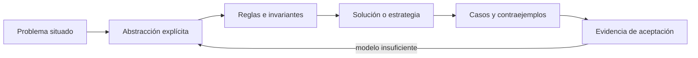

# SE-058 — Resolución sistemática y registro de hipótesis

[← SE-057 — Modelado de estado, transiciones y eventos](https://github.com/vladimiracunadev-create/modern-software-engineering-program/blob/main/classes/part-04-pensamiento-computacional-y-resolucion-de-problemas/se-057-modelado-de-estado-transiciones-y-eventos/README.md) · [↑ Parte 04](https://github.com/vladimiracunadev-create/modern-software-engineering-program/blob/main/classes/part-04-pensamiento-computacional-y-resolucion-de-problemas/README.md) · [📚 Índice completo](https://github.com/vladimiracunadev-create/modern-software-engineering-program/blob/main/classes/README.md) · [🌐 Portal](https://vladimiracunadev-create.github.io/modern-software-engineering-program/classes/SE-058.html) · [SE-059 — Taller: descomponer un problema ambiguo →](https://github.com/vladimiracunadev-create/modern-software-engineering-program/blob/main/classes/part-04-pensamiento-computacional-y-resolucion-de-problemas/se-059-taller-descomponer-un-problema-ambiguo/README.md)


## Punto profesional y fundamento pedagógico

**Punto profesional.** La clase existe para resolver problemas registrando hipótesis rivales y observaciones que realmente las discriminan.

**Por qué aparece aquí.** Se sitúa después de **Modelado de estado, transiciones y eventos** y antes de **Taller: descomponer un problema ambiguo**: convierte el conocimiento anterior en una decisión observable que la clase siguiente podrá reutilizar. La continuidad se comprueba en el artefacto, no por compartir vocabulario.

**Error conceptual que debe corregir.** Cambiar código antes de formular una explicación falsable.

**Secuencia de aprendizaje.** Antes de leer la solución, el estudiante predice el resultado del caso normal y del error conceptual anterior. Luego explica un caso resuelto paso a paso, construye un contraejemplo que cambie la decisión y, sin consultar el texto, reconstruye el mecanismo y lo aplica a una entrada nueva. La secuencia usa predicción, explicación propia, contraste y recuperación. [ICAP](https://icap.education.asu.edu/research) distingue participación de construcción de conocimiento; [How People Learn II](https://nap.nationalacademies.org/catalog/24783/how-people-learn-ii-learners-contexts-and-cultures) exige conectar conocimiento previo, contexto y transferencia; la [práctica de recuperación](https://pubmed.ncbi.nlm.nih.gov/16507066/) respalda producir de nuevo la explicación tras una demora; y [Education for Life and Work](https://nap.nationalacademies.org/resource/13398/dbasse_084153.pdf) exige devolución que explique la causa del error.

**Evidencia de aprendizaje.** Hypothesis-log.md con síntoma, predicción, experimento, resultado y descarte. Debe contener predicción previa, observación, explicación causal, contraejemplo, criterio de aceptación y una nota de qué dato haría cambiar la conclusión.

**Límite de la conclusión.** No encontrar causa en la ventana observada no valida la hipótesis restante.

### Trazabilidad fuente → afirmación

| Fuente primaria u oficial | Afirmación que respalda | Lo que no prueba |
|---|---|---|
| [SWEBOK Guide v4.0a](https://www.computer.org/education/bodies-of-knowledge/software-engineering) | sitúa la decisión dentro de construcción, diseño, pruebas y práctica profesional de ingeniería de software | No demuestra por sí sola que el artefacto del estudiante sea correcto. |
| [MIT 6.042J — Mathematics for Computer Science](https://ocw.mit.edu/courses/6-042j-mathematics-for-computer-science-spring-2015/) | aporta lógica, inducción, relaciones, grafos y técnicas de demostración aplicadas | No demuestra por sí sola que el artefacto del estudiante sea correcto. |

## Antes de empezar

Esta clase continúa el **modelo de decisión diagnóstica**, que convierte la evidencia de la petición observable de extremo a extremo en una siguiente decisión explicable. Recupera `SE-057`: escribe qué artefacto dejó, qué supuesto permanece abierto y qué propiedad debe sobrevivir al nuevo modelo. La matemática se usa para restringir interpretaciones y encontrar errores; no como ornamentación.

## Prerrequisitos

- Poder separar hecho, interpretación, hipótesis y decisión.
- Manejar tablas, diagramas y pseudocódigo legible; Python es opcional.
- Trabajar con datos sintéticos del caso del modelo de decisión diagnóstica y conservar cada versión en Git.

## Problema auténtico

Ante un incidente, el equipo del modelo de decisión diagnóstica prueba comandos conocidos y conserva solo la solución final. Sin registro no puede explicar por qué descartó alternativas ni detectar que cambió varias variables. Se necesita un método iterativo y auditable.

## Objetivos observables

Al finalizar podrás explicar el mecanismo con ejemplo y contraejemplo; construir un modelo con dominio y límites; derivar una prueba que pueda refutarlo; comparar al menos dos representaciones; y entregar una decisión cuya evidencia pueda revisar otra persona.

## Mapa conceptual



El mapa separa el problema de su representación. Los casos no reemplazan reglas; las reglas no prueban que el problema esté bien encuadrado. La pregunta de esta clase es: **¿Qué evidencia aumentaría o reduciría la confianza en cada hipótesis?**

## Temas y por qué importan

| Lente | Pregunta | Evidencia |
|---|---|---|
| dominio | ¿qué entradas y estados existen? | vocabulario y particiones |
| estructura | ¿qué relaciones se conservan? | modelo interpretado |
| regla | ¿qué debe ser cierto? | contrato o invariante |
| estrategia | ¿qué pasos producen el resultado? | pseudocódigo y traza |
| límite | ¿dónde falla el argumento? | contraejemplo y caso límite |
## Conceptos y decisiones

### 1. Encuadre y reproducción

Se define esperado versus observado, impacto, alcance, inicio y cambios recientes. Una reproducción mínima conserva el síntoma con menos componentes. Si no se reproduce, eso es evidencia sobre condiciones, no prueba de que el incidente desapareció.

### 2. Hipótesis contrastable

Una hipótesis propone un mecanismo que predice señales. Debe poder perder: «algo de red» no es falsable; «el resolver excede 500 ms y domina el total» predice tiempos y un resultado bajo override. Se mantienen alternativas para evitar anclaje.

### 3. Selección de prueba

La siguiente prueba maximiza información esperada respecto a costo y riesgo. Una prueba confirmatoria puede ser menos útil que una que separa dos causas. Se prefiere observación antes de intervención, y cambios reversibles antes de amplios.

### 4. Registro de hipótesis

Cada entrada conserva timestamp, observación, interpretación, hipótesis, predicción, prueba, resultado y decisión. La confianza no es un porcentaje inventado: se expresa por evidencia a favor, en contra y faltante. Las hipótesis descartadas permanecen para revisión.

### 5. Cierre y prevención

Resolver síntoma no cierra análisis. Se confirma causa reproduciendo y retirando la intervención, se restaura estado, se identifica condición habilitante y se añade detección o guardrail. La narrativa distingue causa técnica de factores de proceso.

## Definiciones de trabajo

- **reproducción:** procedimiento que vuelve a producir un síntoma bajo condiciones declaradas.
- **hipótesis:** explicación provisional con predicciones contrastables.
- **falsable:** capaz de resultar incompatible con una observación.
- **primera divergencia:** primer punto donde dos recorridos difieren.
- **guardrail:** control que previene o limita una condición de fallo.

Las definiciones fijan el uso en el modelo de decisión diagnóstica. Si una fuente usa otra convención, documenta la traducción. Una palabra definida no equivale a una propiedad demostrada.

## Ejemplo mínimo

A partir de un timeout, escribe tres hipótesis que predigan fases distintas. Para cada una elige una señal que la apoye y otra que la refute; ordena pruebas por información/costo.

Antes de resolver, predice el resultado y la propiedad que debería conservarse. Después marca qué parte del resultado procede de la regla y cuál depende del ejemplo.

## Ejemplo profesional

El modelo de decisión diagnóstica genera un registro append-only y no sobreescribe la primera interpretación. Cuando cambia una hipótesis, enlaza la evidencia. El informe final muestra la primera divergencia y alternativas descartadas, evitando una historia retrospectiva perfecta.

La entrega profesional hace visible el costo de simplificar. Incluye al menos una alternativa descartada y la condición que obligaría a revisar la decisión.

## Práctica guiada

1. define esperado, observado y alcance.
2. produce tres hipótesis mecanísticas.
3. predice señales opuestas.
4. ejecuta una prueba reversible.
5. actualiza el registro y confirma recuperación.
6. solicita una revisión adversarial y corrige el modelo sin borrar la versión que falló.

## Ejercicios

1. **Comprensión:** define dos conceptos con ejemplo, no-ejemplo y límite.
2. **Construcción:** aplica el mecanismo a un caso del modelo de decisión diagnóstica no usado en la explicación.
3. **Refutación:** fabrica la entrada mínima que rompa una solución ingenua.
4. **Transferencia:** usa el mismo razonamiento en planificación de entregas o validación de datos.

## Reto verificable

Entrega `problem.md`, `model.md` y `checks.md`. Una persona revisora debe poder reconstruir dominio, supuestos, regla, resultado y límite; además debe encontrar qué caso refutaría la solución sin preguntarte oralmente.

## Demostración guiada

1. Declara el dominio y selecciona un caso pequeño calculable a mano.
2. Ejecuta la estrategia paso a paso y conserva estados intermedios.
3. Comprueba el resultado contra la definición, no contra intuición.
4. Introduce el fallo controlado y localiza la primera regla violada.
5. Repara el modelo y repite el caso original y el contraejemplo.

## Preguntas frecuentes

### ¿Formal significa usar símbolos difíciles?

No. Significa que dominio, reglas y criterio permiten decidir si una afirmación se sostiene. Una tabla precisa puede ser más formal que una fórmula ambigua.

### ¿Un conjunto grande de pruebas demuestra corrección?

No para un dominio ilimitado. Las pruebas aportan evidencia y detectan defectos; un argumento cubre clases de entradas, siempre bajo supuestos declarados.

### ¿Puedo implementar antes de especificar todo?

Puedes explorar, pero el prototipo no redefine silenciosamente el problema. Registra qué aprendiste y actualiza contrato y casos antes de aprobar.

## Fallo controlado y diagnóstico

Cambia DNS, reinicia servicio y limpia caché al mismo tiempo. Aunque mejore, no puedes atribuir causa. Restaura, establece línea base y repite una variable por iteración.

Conserva el modelo fallido, la entrada que lo expone, la regla violada y la corrección. No ajustes solo el resultado esperado para hacer pasar el caso.

## Errores comunes y cómo corregirlos

| Síntoma | Causa | Corrección |
|---|---|---|
| el ejemplo funciona pero otro caso no | generalización desde una muestra | definir dominio y buscar frontera |
| dos personas leen reglas distintas | términos o cuantificadores implícitos | glosario y contrato observable |
| el diagrama no cambia decisiones | notación decorativa | interpretar relaciones y límites |
| el proceso no termina | falta medida decreciente o presupuesto | variante y condición de salida |
| se declara «óptimo» sin prueba | confusión entre hallado y garantizado | declarar cota y calidad real |

## Entorno y archivos clave

```text
work/SE-058/
├── problem.md     # contexto, dominio, supuestos y exclusiones
├── model.md       # definiciones, reglas, diagrama y estrategia
├── checks.md      # ejemplos, contraejemplos y aceptación
└── review.md      # objeciones y revisión del modelo
```

El pseudocódigo debe ser independiente de lenguaje y cada diagrama necesita explicación textual. Si usas código para explorar, registra versión, entrada y salida; no lo presentes automáticamente como producto de la clase.

### Laboratorio integrado de la Parte 04

Convierte la `timeline` de la [especificación contrastable](https://github.com/vladimiracunadev-create/modern-software-engineering-program/tree/main/labs/part-04-contrastable-spec) en registro de hecho, interpretación, hipótesis rival, predicción y próxima prueba. Una observación contradictoria debe detener el modelo y abrir la revisión de premisas; no se elimina el dato adverso para conservar una narrativa limpia.

## Seguridad, ética y accesibilidad

- usa incidentes sintéticos y evita convertir direcciones o usuarios en datos de práctica;
- trata autorización y privacidad como invariantes, no como pasos opcionales;
- registra a quién perjudica un falso positivo, falso negativo o prioridad automática;
- ofrece tablas y texto alternativo para diagramas y símbolos;
- define mecanismo de revisión humana y apelación para recomendaciones;
- no uses un modelo parcial para justificar una decisión irreversible.

## Transferencia

Aplica el mecanismo a otro dominio y conserva la estructura del argumento, no los nombres del modelo de decisión diagnóstica. Explica qué dominio, invariante o medida cambia. Si el razonamiento deja de funcionar, identifica el supuesto que pertenecía al caso original.

## Evaluación y evidencia

| Criterio | Para aprobar |
|---|---|
| precisión | dominio, términos y cuantificadores explícitos |
| mecanismo | pasos y relaciones explican el resultado |
| corrección | invariantes, casos o argumento adecuados a la afirmación |
| límites | contraejemplo, costo y supuestos visibles |
| revisión | trazabilidad y objeciones preservadas |

Completar archivos no concede aprobación. La evidencia debe sostener la afirmación exacta, y la revisión de otra persona debe poder contradecirla.

## Fuentes


- [SWEBOK Guide v4.0a](https://www.computer.org/education/bodies-of-knowledge/software-engineering) — sitúa la decisión dentro de construcción, diseño, pruebas y práctica profesional de ingeniería de software.
- [MIT 6.042J — Mathematics for Computer Science](https://ocw.mit.edu/courses/6-042j-mathematics-for-computer-science-spring-2015/) — aporta lógica, inducción, relaciones, grafos y técnicas de demostración aplicadas.

Los cursos y SWEBOK aportan definiciones y métodos; no validan automáticamente el modelo del modelo de decisión diagnóstica. Cada aplicación se sostiene con el artefacto y sus casos.

## Límites y siguiente paso

El método reduce sesgos, no garantiza acceso a toda evidencia ni elimina incertidumbre. El taller siguiente lo aplica a un problema deliberadamente ambiguo.

## Glosario

- **reproducción:** procedimiento que vuelve a producir un síntoma bajo condiciones declaradas.
- **hipótesis:** explicación provisional con predicciones contrastables.
- **falsable:** capaz de resultar incompatible con una observación.
- **primera divergencia:** primer punto donde dos recorridos difieren.
- **guardrail:** control que previene o limita una condición de fallo.

---

[← SE-057 — Modelado de estado, transiciones y eventos](https://github.com/vladimiracunadev-create/modern-software-engineering-program/blob/main/classes/part-04-pensamiento-computacional-y-resolucion-de-problemas/se-057-modelado-de-estado-transiciones-y-eventos/README.md) · [↑ Parte 04](https://github.com/vladimiracunadev-create/modern-software-engineering-program/blob/main/classes/part-04-pensamiento-computacional-y-resolucion-de-problemas/README.md) · [📚 Índice completo](https://github.com/vladimiracunadev-create/modern-software-engineering-program/blob/main/classes/README.md) · [🌐 Portal](https://vladimiracunadev-create.github.io/modern-software-engineering-program/classes/SE-058.html) · [SE-059 — Taller: descomponer un problema ambiguo →](https://github.com/vladimiracunadev-create/modern-software-engineering-program/blob/main/classes/part-04-pensamiento-computacional-y-resolucion-de-problemas/se-059-taller-descomponer-un-problema-ambiguo/README.md)
