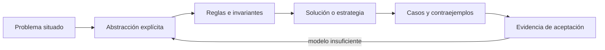

# SE-060 — Proyecto: especificación y solución contrastable

[← SE-059 — Taller: descomponer un problema ambiguo](https://github.com/vladimiracunadev-create/software-engineering-learning-suite/blob/main/classes/part-04-pensamiento-computacional-y-resolucion-de-problemas/se-059-taller-descomponer-un-problema-ambiguo/README.md) · [↑ Parte 04](https://github.com/vladimiracunadev-create/software-engineering-learning-suite/blob/main/classes/part-04-pensamiento-computacional-y-resolucion-de-problemas/README.md) · [📚 Índice completo](https://github.com/vladimiracunadev-create/software-engineering-learning-suite/blob/main/classes/README.md) · [🌐 Portal](https://vladimiracunadev-create.github.io/software-engineering-learning-suite/classes/SE-060.html) · [SE-061 — Valores, expresiones, tipos y variables →](https://github.com/vladimiracunadev-create/software-engineering-learning-suite/blob/main/classes/part-05-fundamentos-de-programacion/se-061-valores-expresiones-tipos-y-variables/README.md)

> Estado: **PLANNED** · Borrador público conservado íntegramente y sometido a auditoría técnica y pedagógica.

## Punto profesional y fundamento pedagógico

**Punto profesional.** La clase existe para entregar una especificación y solución contrastable mediante propiedades y evidencia.

**Por qué aparece aquí.** Se sitúa después de **Taller: descomponer un problema ambiguo** y antes de **Valores, expresiones, tipos y variables**: convierte el conocimiento anterior en una decisión observable que la clase siguiente podrá reutilizar. La continuidad se comprueba en el artefacto, no por compartir vocabulario.

**Error conceptual que debe corregir.** Hacer que la prueba copie la implementación en vez de verificar el contrato.

**Secuencia de aprendizaje.** Antes de leer la solución, el estudiante predice el resultado del caso normal y del error conceptual anterior. Luego explica un caso resuelto paso a paso, construye un contraejemplo que cambie la decisión y, sin consultar el texto, reconstruye el mecanismo y lo aplica a una entrada nueva. La secuencia usa predicción, explicación propia, contraste y recuperación. [ICAP](https://icap.education.asu.edu/research) distingue participación de construcción de conocimiento; [How People Learn II](https://nap.nationalacademies.org/catalog/24783/how-people-learn-ii-learners-contexts-and-cultures) exige conectar conocimiento previo, contexto y transferencia; la [práctica de recuperación](https://pubmed.ncbi.nlm.nih.gov/16507066/) respalda producir de nuevo la explicación tras una demora; y [Education for Life and Work](https://nap.nationalacademies.org/resource/13398/dbasse_084153.pdf) exige devolución que explique la causa del error.

**Evidencia de aprendizaje.** Specification.md, solución, oráculo independiente, casos y límites. Debe contener predicción previa, observación, explicación causal, contraejemplo, criterio de aceptación y una nota de qué dato haría cambiar la conclusión.

**Límite de la conclusión.** Pasar el conjunto acordado no demuestra corrección universal.

### Trazabilidad fuente → afirmación

| Fuente primaria u oficial | Afirmación que respalda | Lo que no prueba |
|---|---|---|
| [SWEBOK Guide v4.0a](https://www.computer.org/education/bodies-of-knowledge/software-engineering) | sitúa la decisión dentro de construcción, diseño, pruebas y práctica profesional de ingeniería de software | No demuestra por sí sola que el artefacto del estudiante sea correcto. |
| [MIT 6.042J — Mathematics for Computer Science](https://ocw.mit.edu/courses/6-042j-mathematics-for-computer-science-spring-2015/) | aporta lógica, inducción, relaciones, grafos y técnicas de demostración aplicadas | No demuestra por sí sola que el artefacto del estudiante sea correcto. |
| [MIT 6.006 — Introduction to Algorithms](https://ocw.mit.edu/courses/6-006-introduction-to-algorithms-spring-2020/) | aporta definiciones, invariantes y análisis de estructuras y algoritmos usados en la clase | No demuestra por sí sola que el artefacto del estudiante sea correcto. |

## Antes de empezar

Esta clase continúa el **modelo de decisión diagnóstica**, que convierte la evidencia de la petición observable de extremo a extremo en una siguiente decisión explicable. Recupera `SE-059`: escribe qué artefacto dejó, qué supuesto permanece abierto y qué propiedad debe sobrevivir al nuevo modelo. La matemática se usa para restringir interpretaciones y encontrar errores; no como ornamentación.

## Prerrequisitos

- Poder separar hecho, interpretación, hipótesis y decisión.
- Manejar tablas, diagramas y pseudocódigo legible; Python es opcional.
- Trabajar con datos sintéticos del caso del modelo de decisión diagnóstica y conservar cada versión en Git.

## Problema auténtico

El proyecto entrega la especificación del modelo de decisión diagnóstica, no solo una idea. Debe tomar señales de la petición observable de extremo a extremo, mantener hipótesis y recomendar pruebas bajo presupuesto y autorización. Una solución contrastable conecta problema, modelo, algoritmo, corrección, costo, fallos y criterios de aceptación.

## Objetivos observables

Al finalizar podrás explicar el mecanismo con ejemplo y contraejemplo; construir un modelo con dominio y límites; derivar una prueba que pueda refutarlo; comparar al menos dos representaciones; y entregar una decisión cuya evidencia pueda revisar otra persona.

## Mapa conceptual



El mapa separa el problema de su representación. Los casos no reemplazan reglas; las reglas no prueban que el problema esté bien encuadrado. La pregunta de esta clase es: **¿Puede una persona independiente decidir si la solución satisface el problema?**

## Temas y por qué importan

| Lente | Pregunta | Evidencia |
|---|---|---|
| dominio | ¿qué entradas y estados existen? | vocabulario y particiones |
| estructura | ¿qué relaciones se conservan? | modelo interpretado |
| regla | ¿qué debe ser cierto? | contrato o invariante |
| estrategia | ¿qué pasos producen el resultado? | pseudocódigo y traza |
| límite | ¿dónde falla el argumento? | contraejemplo y caso límite |
## Conceptos y decisiones

### 1. Contrato del problema

Se declaran actores, decisión, entradas válidas, salida, errores, restricciones y exclusiones. Términos como evidencia, autorizado y costo viven en un glosario. Los ejemplos ilustran, pero el contrato cubre el dominio más allá de ellos.

### 2. Modelo formal mínimo

Conjuntos tipan hipótesis y pruebas; relaciones expresan cobertura; un grafo ordena dependencias; una máquina de estados gobierna ejecución. Cada formalismo responde una pregunta. No se añade notación que no cambie una decisión o una comprobación.

### 3. Solución y argumento

El algoritmo define selección y actualización. Precondiciones e invariantes protegen autorización y trazabilidad; una variante demuestra fin del ciclo. El análisis de complejidad usa H, P y E, y la heurística declara si la salida es óptima o mejor encontrada.

### 4. Oráculo y casos

Un oráculo decide el resultado esperado. Casos cubren normal, límite, inválido, empate, ciclo, presupuesto agotado, evento tardío y recuperación. Propiedades como «nunca recomienda fuera de autorizadas» complementan ejemplos concretos.

### 5. Paquete de revisión

`problem.md` explica intención; `model.md` define entidades, reglas y diagramas; `checks.md` enlaza criterios con casos y argumentos. Una matriz de trazabilidad permite localizar evidencia. Las preguntas abiertas no se ocultan detrás de estado aprobado.

## Definiciones de trabajo

- **especificación:** descripción verificable de comportamiento y restricciones.
- **oráculo:** mecanismo para determinar el resultado esperado.
- **trazabilidad:** vínculo entre necesidad, regla, solución y evidencia.
- **partición:** subdominio tratado de forma equivalente.
- **solución contrastable:** propuesta cuya adecuación puede decidirse con criterios explícitos.

Las definiciones fijan el uso en el modelo de decisión diagnóstica. Si una fuente usa otra convención, documenta la traducción. Una palabra definida no equivale a una propiedad demostrada.

## Ejemplo mínimo

Escribe una especificación de `next_test(active_hypotheses, evidence, authorized, budget)` con salida tipada. Incluye vacío, empate, presupuesto insuficiente y contradicción.

Antes de resolver, predice el resultado y la propiedad que debería conservarse. Después marca qué parte del resultado procede de la regla y cuál depende del ejemplo.

## Ejemplo profesional

El modelo de decisión diagnóstica ofrece un plan reproducible y una explicación: alternativas consideradas, prueba elegida, costo, hipótesis que separa y restricción aplicada. El proyecto incluye un simulador de papel o pseudocódigo, no requiere producto ejecutable; la Parte 5 implementará el contrato.

La entrega profesional hace visible el costo de simplificar. Incluye al menos una alternativa descartada y la condición que obligaría a revisar la decisión.

## Práctica guiada

1. congela pregunta y alcance.
2. define vocabulario y modelo.
3. especifica algoritmo y propiedades.
4. deriva casos desde particiones y límites.
5. traza requisito→regla→caso.
6. entrega a revisión sin explicación oral.
7. solicita una revisión adversarial y corrige el modelo sin borrar la versión que falló.

## Ejercicios

1. **Comprensión:** define dos conceptos con ejemplo, no-ejemplo y límite.
2. **Construcción:** aplica el mecanismo a un caso del modelo de decisión diagnóstica no usado en la explicación.
3. **Refutación:** fabrica la entrada mínima que rompa una solución ingenua.
4. **Transferencia:** usa el mismo razonamiento en planificación de entregas o validación de datos.

## Reto verificable

Entrega `problem.md`, `model.md` y `checks.md`. Una persona revisora debe poder reconstruir dominio, supuestos, regla, resultado y límite; además debe encontrar qué caso refutaría la solución sin preguntarte oralmente.

## Demostración guiada

1. Declara el dominio y selecciona un caso pequeño calculable a mano.
2. Ejecuta la estrategia paso a paso y conserva estados intermedios.
3. Comprueba el resultado contra la definición, no contra intuición.
4. Introduce el fallo controlado y localiza la primera regla violada.
5. Repara el modelo y repite el caso original y el contraejemplo.

## Preguntas frecuentes

### ¿Formal significa usar símbolos difíciles?

No. Significa que dominio, reglas y criterio permiten decidir si una afirmación se sostiene. Una tabla precisa puede ser más formal que una fórmula ambigua.

### ¿Un conjunto grande de pruebas demuestra corrección?

No para un dominio ilimitado. Las pruebas aportan evidencia y detectan defectos; un argumento cubre clases de entradas, siempre bajo supuestos declarados.

### ¿Puedo implementar antes de especificar todo?

Puedes explorar, pero el prototipo no redefine silenciosamente el problema. Registra qué aprendiste y actualiza contrato y casos antes de aprobar.

## Fallo controlado y diagnóstico

Añade una hipótesis sin prueba autorizada y un ciclo de dependencias. La validación debe rechazar el modelo con errores localizables, no construir un plan parcial presentado como completo.

Conserva el modelo fallido, la entrada que lo expone, la regla violada y la corrección. No ajustes solo el resultado esperado para hacer pasar el caso.

## Errores comunes y cómo corregirlos

| Síntoma | Causa | Corrección |
|---|---|---|
| el ejemplo funciona pero otro caso no | generalización desde una muestra | definir dominio y buscar frontera |
| dos personas leen reglas distintas | términos o cuantificadores implícitos | glosario y contrato observable |
| el diagrama no cambia decisiones | notación decorativa | interpretar relaciones y límites |
| el proceso no termina | falta medida decreciente o presupuesto | variante y condición de salida |
| se declara «óptimo» sin prueba | confusión entre hallado y garantizado | declarar cota y calidad real |

## Entorno y archivos clave

```text
work/SE-060/
├── problem.md     # contexto, dominio, supuestos y exclusiones
├── model.md       # definiciones, reglas, diagrama y estrategia
├── checks.md      # ejemplos, contraejemplos y aceptación
└── review.md      # objeciones y revisión del modelo
```

El pseudocódigo debe ser independiente de lenguaje y cada diagrama necesita explicación textual. Si usas código para explorar, registra versión, entrada y salida; no lo presentes automáticamente como producto de la clase.

## Seguridad, ética y accesibilidad

- usa incidentes sintéticos y evita convertir direcciones o usuarios en datos de práctica;
- trata autorización y privacidad como invariantes, no como pasos opcionales;
- registra a quién perjudica un falso positivo, falso negativo o prioridad automática;
- ofrece tablas y texto alternativo para diagramas y símbolos;
- define mecanismo de revisión humana y apelación para recomendaciones;
- no uses un modelo parcial para justificar una decisión irreversible.

## Transferencia

Aplica el mecanismo a otro dominio y conserva la estructura del argumento, no los nombres del modelo de decisión diagnóstica. Explica qué dominio, invariante o medida cambia. Si el razonamiento deja de funcionar, identifica el supuesto que pertenecía al caso original.

## Evaluación y evidencia

| Criterio | Para aprobar |
|---|---|
| precisión | dominio, términos y cuantificadores explícitos |
| mecanismo | pasos y relaciones explican el resultado |
| corrección | invariantes, casos o argumento adecuados a la afirmación |
| límites | contraejemplo, costo y supuestos visibles |
| revisión | trazabilidad y objeciones preservadas |

Completar archivos no concede aprobación. La evidencia debe sostener la afirmación exacta, y la revisión de otra persona debe poder contradecirla.

## Fuentes


- [SWEBOK Guide v4.0a](https://www.computer.org/education/bodies-of-knowledge/software-engineering) — sitúa la decisión dentro de construcción, diseño, pruebas y práctica profesional de ingeniería de software.
- [MIT 6.042J — Mathematics for Computer Science](https://ocw.mit.edu/courses/6-042j-mathematics-for-computer-science-spring-2015/) — aporta lógica, inducción, relaciones, grafos y técnicas de demostración aplicadas.
- [MIT 6.006 — Introduction to Algorithms](https://ocw.mit.edu/courses/6-006-introduction-to-algorithms-spring-2020/) — aporta definiciones, invariantes y análisis de estructuras y algoritmos usados en la clase.
- [MIT 18.404J — Theory of Computation](https://ocw.mit.edu/courses/18-404j-theory-of-computation-fall-2020/) — delimita computabilidad, complejidad y los límites de las soluciones algorítmicas.

Los cursos y SWEBOK aportan definiciones y métodos; no validan automáticamente el modelo del modelo de decisión diagnóstica. Cada aplicación se sostiene con el artefacto y sus casos.

## Límites y siguiente paso

La especificación reduce interpretaciones, pero no prueba que las necesidades sean correctas ni que una implementación concreta cumpla. La Parte 5 convierte el modelo de decisión diagnóstica en una herramienta CLI probada llamada la CLI diagnóstica.

## Glosario

- **especificación:** descripción verificable de comportamiento y restricciones.
- **oráculo:** mecanismo para determinar el resultado esperado.
- **trazabilidad:** vínculo entre necesidad, regla, solución y evidencia.
- **partición:** subdominio tratado de forma equivalente.
- **solución contrastable:** propuesta cuya adecuación puede decidirse con criterios explícitos.

---

[← SE-059 — Taller: descomponer un problema ambiguo](https://github.com/vladimiracunadev-create/software-engineering-learning-suite/blob/main/classes/part-04-pensamiento-computacional-y-resolucion-de-problemas/se-059-taller-descomponer-un-problema-ambiguo/README.md) · [↑ Parte 04](https://github.com/vladimiracunadev-create/software-engineering-learning-suite/blob/main/classes/part-04-pensamiento-computacional-y-resolucion-de-problemas/README.md) · [📚 Índice completo](https://github.com/vladimiracunadev-create/software-engineering-learning-suite/blob/main/classes/README.md) · [🌐 Portal](https://vladimiracunadev-create.github.io/software-engineering-learning-suite/classes/SE-060.html) · [SE-061 — Valores, expresiones, tipos y variables →](https://github.com/vladimiracunadev-create/software-engineering-learning-suite/blob/main/classes/part-05-fundamentos-de-programacion/se-061-valores-expresiones-tipos-y-variables/README.md)
