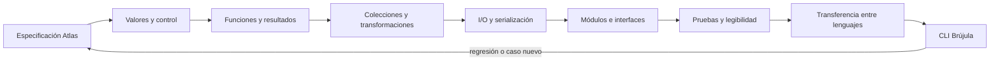

# Parte 5 — Fundamentos de programación

Programar no es traducir frases a sintaxis. Es construir un sistema de valores, decisiones y efectos que mantenga el contrato del problema ante entradas normales, límites y fallos. Esta parte implementa la especificación Atlas como **Brújula**, una herramienta de línea de comandos que recomienda la siguiente prueba autorizada y explica su decisión.

Python es el lenguaje principal porque permite observar rápidamente cada mecanismo con biblioteca estándar. No se presenta como lenguaje universal: la clase 71 traslada el núcleo a Rust para distinguir semántica del problema de facilidades accidentales del lenguaje.

## Pregunta rectora

> ¿Cómo convertir una especificación contrastable en comportamiento legible, probado y usable desde una terminal?

## Antes del recorrido clase por clase

Cada clase añade una capacidad al mismo programa y conserva cuatro capas:

1. **dominio:** valores y reglas que vienen de Atlas;
2. **núcleo:** funciones y transformaciones sin I/O;
3. **fronteras:** CLI, archivos, JSON, errores y códigos de salida;
4. **evidencia:** ejemplos, pruebas, fallos y comandos reproducibles.

El flujo no autoriza una gran implementación al final. Cada paso debe ejecutar un ejemplo, fallar de forma controlada y dejar una prueba o artefacto que proteja el siguiente cambio.

## Lo que cambia al completar esta parte

Podrás predecir cómo Python evalúa expresiones y control, diseñar funciones con dependencias visibles, tratar errores sin ocultar defectos, elegir colecciones por operaciones, validar JSON, separar módulos, escribir pruebas de consumidor y entregar una CLI con streams y códigos de salida coherentes.

## Recorrido clase por clase

| Clase | Núcleo profesional | Aporte acumulativo a Brújula |
|---|---|---|
| [SE-061](https://github.com/vladimiracunadev-create/software-engineering-learning-suite/blob/main/classes/part-05-fundamentos-de-programacion/se-061-valores-expresiones-tipos-y-variables/) | Valores, expresiones, tipos y variables | Fija significado de valores y tipos |
| [SE-062](https://github.com/vladimiracunadev-create/software-engineering-learning-suite/blob/main/classes/part-05-fundamentos-de-programacion/se-062-control-de-flujo-y-decisiones/) | Control de flujo y decisiones | Cubre decisiones y fronteras |
| [SE-063](https://github.com/vladimiracunadev-create/software-engineering-learning-suite/blob/main/classes/part-05-fundamentos-de-programacion/se-063-iteracion-recursion-y-recorridos/) | Iteración, recursión y recorridos | Recorre sin perder progreso |
| [SE-064](https://github.com/vladimiracunadev-create/software-engineering-learning-suite/blob/main/classes/part-05-fundamentos-de-programacion/se-064-funciones-parametros-retorno-y-alcance/) | Funciones, parámetros, retorno y alcance | Encapsula reglas y efectos |
| [SE-065](https://github.com/vladimiracunadev-create/software-engineering-learning-suite/blob/main/classes/part-05-fundamentos-de-programacion/se-065-errores-excepciones-y-resultados-explicitos/) | Errores, excepciones y resultados explícitos | Modela fallos recuperables |
| [SE-066](https://github.com/vladimiracunadev-create/software-engineering-learning-suite/blob/main/classes/part-05-fundamentos-de-programacion/se-066-colecciones-y-transformacion-de-datos/) | Colecciones y transformación de datos | Elige colecciones por operaciones |
| [SE-067](https://github.com/vladimiracunadev-create/software-engineering-learning-suite/blob/main/classes/part-05-fundamentos-de-programacion/se-067-entrada-salida-y-serializacion/) | Entrada, salida y serialización | Cruza archivos y JSON con límites |
| [SE-068](https://github.com/vladimiracunadev-create/software-engineering-learning-suite/blob/main/classes/part-05-fundamentos-de-programacion/se-068-modulos-interfaces-y-separacion-de-responsabilidades/) | Módulos, interfaces y separación de responsabilidades | Separa dominio, adaptadores y CLI |
| [SE-069](https://github.com/vladimiracunadev-create/software-engineering-learning-suite/blob/main/classes/part-05-fundamentos-de-programacion/se-069-pruebas-tempranas-y-diseno-por-ejemplos/) | Pruebas tempranas y diseño por ejemplos | Diseña por ejemplos y regresiones |
| [SE-070](https://github.com/vladimiracunadev-create/software-engineering-learning-suite/blob/main/classes/part-05-fundamentos-de-programacion/se-070-legibilidad-nombres-y-mantenimiento-basico/) | Legibilidad, nombres y mantenimiento básico | Refactoriza conservando intención |
| [SE-071](https://github.com/vladimiracunadev-create/software-engineering-learning-suite/blob/main/classes/part-05-fundamentos-de-programacion/se-071-taller-transferir-una-solucion-entre-lenguajes/) | Taller: transferir una solución entre lenguajes | Contrasta semántica Python/Rust |
| [SE-072](https://github.com/vladimiracunadev-create/software-engineering-learning-suite/blob/main/classes/part-05-fundamentos-de-programacion/se-072-proyecto-herramienta-de-linea-de-comandos-probada/) | Proyecto: herramienta de línea de comandos probada | Entrega una CLI probada y explicable |

## Hilo pedagógico

Las clases 61 a 64 construyen el núcleo del lenguaje: valores, decisiones, recorridos y funciones. Las clases 65 a 68 definen fronteras y estructura: errores, datos, I/O y módulos. Las clases 69 y 70 protegen cambio mediante pruebas y legibilidad. El taller 71 verifica transferencia; el proyecto 72 integra la CLI.

## Evidencias acumulativas

1. ejemplos ejecutables con predicción y salida;
2. núcleo `choose_next` separado de terminal y archivos;
3. validadores de entrada y resultados de error explícitos;
4. adaptador JSON con límites y escritura recuperable;
5. suite de dominio y CLI con regresiones;
6. comparación Python/Rust basada en fixtures comunes;
7. Brújula operable desde `python -m compass`, con README y matriz de códigos.

## Criterios de aprobación del proyecto

- la CLI implementa el contrato de Atlas y no inventa reglas;
- ayuda, stdout, stderr y códigos de salida son coherentes;
- el núcleo no realiza I/O y puede probarse en aislamiento;
- entrada externa se limita, parsea y valida antes del dominio;
- pruebas cubren normal, vacío, empate, inválido y fallo de frontera;
- el caso degradado se recupera sin archivos parciales;
- otra persona ejecuta la guía desde checkout limpio;
- la entrega declara plataformas realmente probadas y límites.

## Preguntas de control

¿Qué valor y tipo existe?, ¿qué rama falta?, ¿qué progresa?, ¿qué función posee la regla?, ¿quién recupera el error?, ¿qué colección expresa la invariante?, ¿qué bytes cruzan la frontera?, ¿qué módulo puede cambiar solo?, ¿qué prueba protege el contrato?, ¿qué nombre revela intención?, ¿qué cambia en otro lenguaje?

## Fuentes base

- [Python Tutorial](https://docs.python.org/3/tutorial/)
- [Python Language Reference](https://docs.python.org/3/reference/)
- [Python Standard Library](https://docs.python.org/3/library/)
- [The Rust Programming Language](https://doc.rust-lang.org/stable/book/)
- [SWEBOK Guide v4.0a](https://www.computer.org/education/bodies-of-knowledge/software-engineering)

La documentación define mecanismos y APIs. Los snippets de las clases siguen siendo material guiado; el proyecto solo adquiere estados superiores cuando sus artefactos y ejecuciones queden versionados y validados.
