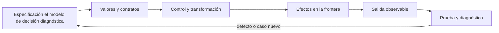

# SE-061 — Valores, expresiones, tipos y variables

[← SE-060 — Proyecto: especificación y solución contrastable](https://github.com/vladimiracunadev-create/software-engineering-learning-suite/blob/main/classes/part-04-pensamiento-computacional-y-resolucion-de-problemas/se-060-proyecto-especificacion-y-solucion-contrastable/README.md) · [↑ Parte 05](https://github.com/vladimiracunadev-create/software-engineering-learning-suite/blob/main/classes/part-05-fundamentos-de-programacion/README.md) · [📚 Índice completo](https://github.com/vladimiracunadev-create/software-engineering-learning-suite/blob/main/classes/README.md) · [🌐 Portal](https://vladimiracunadev-create.github.io/software-engineering-learning-suite/classes/SE-061.html) · [SE-062 — Control de flujo y decisiones →](https://github.com/vladimiracunadev-create/software-engineering-learning-suite/blob/main/classes/part-05-fundamentos-de-programacion/se-062-control-de-flujo-y-decisiones/README.md)

> Estado: **PLANNED** · Borrador público conservado íntegramente y sometido a auditoría técnica y pedagógica.

## Punto profesional y fundamento pedagógico

**Punto profesional.** La clase existe para explicar valores, tipos, expresiones y nombres por su semántica y ciclo de vida.

**Por qué aparece aquí.** Se sitúa después de **Proyecto: especificación y solución contrastable** y antes de **Control de flujo y decisiones**: convierte el conocimiento anterior en una decisión observable que la clase siguiente podrá reutilizar. La continuidad se comprueba en el artefacto, no por compartir vocabulario.

**Error conceptual que debe corregir.** Tratar variable como caja idéntica en todos los lenguajes.

**Secuencia de aprendizaje.** Antes de leer la solución, el estudiante predice el resultado del caso normal y del error conceptual anterior. Luego explica un caso resuelto paso a paso, construye un contraejemplo que cambie la decisión y, sin consultar el texto, reconstruye el mecanismo y lo aplica a una entrada nueva. La secuencia usa predicción, explicación propia, contraste y recuperación. [ICAP](https://icap.education.asu.edu/research) distingue participación de construcción de conocimiento; [How People Learn II](https://nap.nationalacademies.org/catalog/24783/how-people-learn-ii-learners-contexts-and-cultures) exige conectar conocimiento previo, contexto y transferencia; la [práctica de recuperación](https://pubmed.ncbi.nlm.nih.gov/16507066/) respalda producir de nuevo la explicación tras una demora; y [Education for Life and Work](https://nap.nationalacademies.org/resource/13398/dbasse_084153.pdf) exige devolución que explique la causa del error.

**Evidencia de aprendizaje.** Value-trace.md con tipo, identidad, enlace, mutación y liberación. Debe contener predicción previa, observación, explicación causal, contraejemplo, criterio de aceptación y una nota de qué dato haría cambiar la conclusión.

**Límite de la conclusión.** La traza de Python no define la semántica de otros lenguajes.

### Trazabilidad fuente → afirmación

| Fuente primaria u oficial | Afirmación que respalda | Lo que no prueba |
|---|---|---|
| [Python Tutorial](https://docs.python.org/3/tutorial/) | define la semántica y los límites de la API de Python utilizada en el experimento | No demuestra por sí sola que el artefacto del estudiante sea correcto. |
| [Python Language Reference](https://docs.python.org/3/reference/) | define la semántica y los límites de la API de Python utilizada en el experimento | No demuestra por sí sola que el artefacto del estudiante sea correcto. |

## Antes de empezar

Esta clase construye la **CLI diagnóstica**, implementación incremental de la especificación del modelo de decisión diagnóstica. Recupera `SE-060` y convierte una regla ya modelada en comportamiento ejecutable o comprobable. Trabaja en cambios pequeños: predicción, código, ejecución, evidencia y explicación. Ejecutar sin poder explicar el resultado no completa la práctica.

## Prerrequisitos

- Python 3.11 o posterior disponible como `python` o `python3`; registra la versión real.
- Terminal, editor de texto y Git; no se requieren paquetes externos.
- Comprender el contrato del modelo de decisión diagnóstica: entradas, resultados, errores e invariantes.

## Problema auténtico

La especificación del modelo de decisión diagnóstica llega a implementación como la CLI diagnóstica. El primer prototipo mezcla milisegundos con segundos, texto con números y `None` con una medición real. Python ejecuta varias combinaciones, pero ejecución no equivale a significado correcto.

## Objetivos observables

Al terminar podrás explicar el mecanismo del lenguaje, predecir una ejecución, implementar un caso normal y sus fronteras, diagnosticar un fallo controlado, proteger el comportamiento con evidencia y separar lo transferible de lo específico de Python.

## Mapa conceptual



El código no reemplaza la especificación: la materializa bajo reglas concretas del lenguaje y del entorno. La pregunta de esta clase es: **¿Qué valor existe, qué operaciones admite y qué nombre conserva su intención?**

## Temas y por qué importan

| Lente | Pregunta | Evidencia |
|---|---|---|
| valor | ¿qué representa y qué tipo tiene? | ejemplo inspeccionable |
| control | ¿qué camino o repetición ocurre? | traza de estados |
| contrato | ¿qué acepta, retorna y rechaza? | casos frontera |
| efecto | ¿qué cambia fuera del cálculo? | archivo o stream controlado |
| mantenimiento | ¿cómo se detecta una regresión? | prueba y diff enfocado |

## Conceptos y decisiones

### 1. Valores y representación

Un valor es información concreta interpretada según un tipo: `800`, `800.0` y `'800'` no son intercambiables. Enteros de Python tienen precisión arbitraria práctica limitada por memoria; `float` aproxima números binarios y no representa exactamente muchos decimales. Unidades y dominio no vienen incluidos en el tipo incorporado.

### 2. Expresiones y evaluación

Una expresión combina literales, nombres, operadores y llamadas para producir un valor. Precedencia decide agrupación, pero paréntesis comunican intención. Operadores pueden tener semántica distinta por tipo: `+` suma números y concatena secuencias. Se evita depender de coerciones imaginadas.

### 3. Tipos y operaciones válidas

El tipo determina representación y protocolo de operaciones. `bool` modela dos valores, pero no sirve para distinguir desconocido de falso. `None` expresa ausencia, no cero ni cadena vacía. El tipado dinámico comprueba muchas operaciones al ejecutar; anotaciones ayudan a herramientas, pero no validan datos externas por sí solas.

### 4. Nombres, enlace y mutabilidad

Una asignación enlaza un nombre a un objeto; no copia necesariamente el objeto. Reasignar un entero cambia el enlace; modificar una lista compartida cambia el objeto visto por todos sus alias. Llamar `timeout_seconds` al nombre hace visible una unidad que `t` oculta.

### 5. Conversión y validación

`int(texto)` convierte si el formato es válido y puede fallar; no debe dispersarse por la lógica. Primero se valida el dato en la frontera, después el núcleo trabaja con valores ya interpretados. Convertir `bool('false')` produce `True` porque la cadena no está vacía: un contraejemplo clásico de conversión semánticamente incorrecta.

## Definiciones de trabajo

- **valor:** dato concreto manipulable por el programa.
- **tipo:** conjunto de valores y operaciones asociadas.
- **expresión:** combinación evaluable que produce un valor.
- **enlace:** asociación entre un nombre y un objeto.
- **mutabilidad:** capacidad de cambiar un objeto conservando identidad.

Estas definiciones describen el uso concreto en la CLI diagnóstica. Cuando Python permita varias conductas, el contrato del programa elige una y la hace visible con validación y pruebas.

## Ejemplo mínimo

```python
timeout_ms = 800
elapsed_ms = 615.4
phase = "tls"
within_budget = elapsed_ms <= timeout_ms

print({"phase": phase, "elapsed_ms": elapsed_ms, "ok": within_budget})
```

Evalúa `0.1 + 0.2`, `bool('false')`, `3 / 2`, `3 // 2` y `'3' * 2`. Antes de ejecutar predice valor y tipo; después explica qué interpretación sería peligrosa en la CLI diagnóstica.

Ejecuta el fragmento en un archivo, no solo en una conversación interactiva. Conserva comando, versión, salida y explicación de cada línea relevante.

## Ejemplo profesional

La CLI diagnóstica mantiene `duration_ms` como número no negativo y `outcome` como texto de un conjunto validado. La entrada textual se convierte una sola vez. El informe conserva la unidad en el nombre y en JSON para impedir que una persona trate 800 ms como 800 s.

El criterio profesional es que el comportamiento pueda ser consumido, diagnosticado y cambiado sin depender de conocimiento oral ni de estado oculto.

## Práctica guiada

1. crea valores válidos y límite para una observación.
2. predice cinco expresiones y comprueba con `type`.
3. demuestra aliasing con dos nombres para una lista.
4. centraliza una conversión de texto a milisegundos.
5. rechaza negativo, vacío y formato no numérico.
6. ejecuta `python -m unittest -v` cuando existan pruebas y registra el resultado exacto.

## Ejercicios

1. **Lectura:** predice valor, tipo, rama o efecto de un fragmento antes de ejecutarlo.
2. **Construcción:** añade un caso de la CLI diagnóstica siguiendo el contrato, sin mezclar I/O y cálculo.
3. **Frontera:** incorpora vacío, límite, inválido y error recuperable.
4. **Transferencia:** escribe pseudocódigo o una versión equivalente en otro lenguaje y señala diferencias.

## Reto verificable

Entrega un cambio que incluya comportamiento, caso normal, caso límite, fallo controlado y explicación. Otra persona debe poder ejecutar los comandos desde un checkout limpio y relacionar cada salida con una regla del modelo de decisión diagnóstica.

## Demostración guiada

1. Escribe la entrada y la salida esperada antes del código.
2. Ejecuta el caso mínimo y observa valores intermedios sin dejar prints permanentes en el núcleo.
3. Añade el caso frontera que obligue a decidir, no solo a teclear.
4. Introduce el fallo descrito abajo y confirma que la evidencia lo detecta.
5. Corrige, ejecuta toda la suite y revisa el diff por efectos no deseados.

## Preguntas frecuentes

### ¿Que el programa se ejecute significa que está correcto?

No. Solo demuestra que esa ejecución terminó. La corrección se refiere al contrato y requiere cubrir límites, errores y propiedades relevantes.

### ¿Debo memorizar toda la sintaxis?

No. Debes reconocer valores, control, contratos y efectos, y saber consultar la referencia oficial. Copiar sintaxis sin modelo produce defectos difíciles de diagnosticar.

### ¿Las anotaciones de tipo validan JSON?

No por sí solas. Ayudan a lectores y herramientas; los datos externos requieren parseo y validación en ejecución.

## Fallo controlado y diagnóstico

Usa `if bool(value):` para interpretar el argumento `--enabled false`. Observa que queda verdadero. Define un parser explícito que acepte valores documentados y rechace el resto.

Registra mensaje, traceback cuando corresponda, hipótesis, caso mínimo, corrección y prueba de regresión. No ocultes el fallo con un `except` amplio ni cambies la prueba para aceptar el defecto.

## Errores comunes y cómo corregirlos

| Síntoma | Causa | Corrección |
|---|---|---|
| funciona solo con un dato | ejemplo usado como especificación | particiones y casos frontera |
| `None`, vacío y cero se mezclan | truthiness sin semántica | comparaciones explícitas |
| importar ejecuta trabajo | efectos al nivel del módulo | función `main` y composition root |
| error desaparece | captura demasiado amplia | manejar solo lo recuperable |
| refactor rompe consumidores | pruebas de detalle o contrato implícito | probar interfaz pública |

## Entorno y archivos clave

```text
work/SE-061/
├── diagnostic_cli/
│   ├── __init__.py
│   ├── domain.py
│   ├── cli.py
│   └── __main__.py
├── tests/
│   └── test_diagnostic_cli.py
└── README.md
```

No instales dependencias para resolver lo que cubre la biblioteca estándar. `README.md` conserva versión, comandos, entradas, salida, limpieza y límites. Los fragmentos son pedagógicos; intégralos solo después de entender su contrato.

## Seguridad, ética y accesibilidad

- usa fixtures sintéticos y no incluyas tokens, rutas personales ni incidentes reales;
- limita tamaño, profundidad y tiempo de entradas no confiables;
- separa stdout parseable de stderr y redacta datos sensibles;
- ofrece mensajes accionables y no dependas solo de color;
- preserva autorización como regla del núcleo, no como checkbox de UI;
- no uses `eval`, `exec` ni construcción de shell con entrada externa.

## Transferencia

Reimplementa el contrato, no la sintaxis. Identifica cómo el segundo lenguaje representa ausencia, error, mutabilidad y módulos. Conserva fixtures y resultados públicos para detectar una diferencia semántica.

## Evaluación y evidencia

| Criterio | Evidencia para aprobar |
|---|---|
| comprensión | predicción y explicación de ejecución |
| comportamiento | normal, límite e inválido según contrato |
| diseño | cálculo separado de efectos y dependencias visibles |
| diagnóstico | fallo mínimo, causa y regresión |
| reproducibilidad | versión, comandos y salidas desde checkout limpio |

No se asciende a `EXECUTABLE` o `TESTED` solo por incluir snippets y comandos. Esos estados requieren artefactos ejecutados y evidencia verificable más allá de esta guía.

## Fuentes


- [Python Tutorial](https://docs.python.org/3/tutorial/) — define la semántica y los límites de la API de Python utilizada en el experimento.
- [Python Language Reference](https://docs.python.org/3/reference/) — define la semántica y los límites de la API de Python utilizada en el experimento.

La documentación oficial define el lenguaje y la biblioteca; no demuestra que la CLI diagnóstica cumpla su dominio. Esa evidencia vive en contratos, pruebas y ejecución reproducible.

## Límites y siguiente paso

Los tipos incorporados no expresan todas las reglas del dominio ni eliminan precisión finita. La siguiente clase usa condiciones para elegir comportamiento sin perder casos.

## Glosario

- **valor:** dato concreto manipulable por el programa.
- **tipo:** conjunto de valores y operaciones asociadas.
- **expresión:** combinación evaluable que produce un valor.
- **enlace:** asociación entre un nombre y un objeto.
- **mutabilidad:** capacidad de cambiar un objeto conservando identidad.

---

[← SE-060 — Proyecto: especificación y solución contrastable](https://github.com/vladimiracunadev-create/software-engineering-learning-suite/blob/main/classes/part-04-pensamiento-computacional-y-resolucion-de-problemas/se-060-proyecto-especificacion-y-solucion-contrastable/README.md) · [↑ Parte 05](https://github.com/vladimiracunadev-create/software-engineering-learning-suite/blob/main/classes/part-05-fundamentos-de-programacion/README.md) · [📚 Índice completo](https://github.com/vladimiracunadev-create/software-engineering-learning-suite/blob/main/classes/README.md) · [🌐 Portal](https://vladimiracunadev-create.github.io/software-engineering-learning-suite/classes/SE-061.html) · [SE-062 — Control de flujo y decisiones →](https://github.com/vladimiracunadev-create/software-engineering-learning-suite/blob/main/classes/part-05-fundamentos-de-programacion/se-062-control-de-flujo-y-decisiones/README.md)
