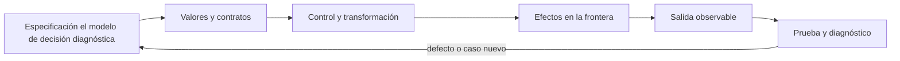

# SE-062 — Control de flujo y decisiones

[← SE-061 — Valores, expresiones, tipos y variables](https://github.com/vladimiracunadev-create/modern-software-engineering-program/blob/main/classes/part-05-fundamentos-de-programacion/se-061-valores-expresiones-tipos-y-variables/README.md) · [↑ Parte 05](https://github.com/vladimiracunadev-create/modern-software-engineering-program/blob/main/classes/part-05-fundamentos-de-programacion/README.md) · [📚 Índice completo](https://github.com/vladimiracunadev-create/modern-software-engineering-program/blob/main/classes/README.md) · [🌐 Portal](https://vladimiracunadev-create.github.io/modern-software-engineering-program/classes/SE-062.html) · [SE-063 — Iteración, recursión y recorridos →](https://github.com/vladimiracunadev-create/modern-software-engineering-program/blob/main/classes/part-05-fundamentos-de-programacion/se-063-iteracion-recursion-y-recorridos/README.md)


## Punto profesional y fundamento pedagógico

**Punto profesional.** La clase existe para diseñar control de flujo desde decisiones del dominio y caminos verificables.

**Por qué aparece aquí.** Se sitúa después de **Valores, expresiones, tipos y variables** y antes de **Iteración, recursión y recorridos**: convierte el conocimiento anterior en una decisión observable que la clase siguiente podrá reutilizar. La continuidad se comprueba en el artefacto, no por compartir vocabulario.

**Error conceptual que debe corregir.** Anidar condicionales hasta que las reglas quedan implícitas.

**Secuencia de aprendizaje.** Antes de leer la solución, el estudiante predice el resultado del caso normal y del error conceptual anterior. Luego explica un caso resuelto paso a paso, construye un contraejemplo que cambie la decisión y, sin consultar el texto, reconstruye el mecanismo y lo aplica a una entrada nueva. La secuencia usa predicción, explicación propia, contraste y recuperación. [ICAP](https://icap.education.asu.edu/research) distingue participación de construcción de conocimiento; [How People Learn II](https://nap.nationalacademies.org/catalog/24783/how-people-learn-ii-learners-contexts-and-cultures) exige conectar conocimiento previo, contexto y transferencia; la [práctica de recuperación](https://pubmed.ncbi.nlm.nih.gov/16507066/) respalda producir de nuevo la explicación tras una demora; y [Education for Life and Work](https://nap.nationalacademies.org/resource/13398/dbasse_084153.pdf) exige devolución que explique la causa del error.

**Evidencia de aprendizaje.** Decision-table.md enlazada a caminos, casos límite y ramas inalcanzables. Debe contener predicción previa, observación, explicación causal, contraejemplo, criterio de aceptación y una nota de qué dato haría cambiar la conclusión.

**Límite de la conclusión.** Cubrir ramas no equivale a cubrir combinaciones semánticas.

### Trazabilidad fuente → afirmación

| Fuente primaria u oficial | Afirmación que respalda | Lo que no prueba |
|---|---|---|
| [Python Tutorial](https://docs.python.org/3/tutorial/) | define la semántica y los límites de la API de Python utilizada en el experimento | No demuestra por sí sola que el artefacto del estudiante sea correcto. |
| [Python Language Reference](https://docs.python.org/3/reference/) | define la semántica y los límites de la API de Python utilizada en el experimento | No demuestra por sí sola que el artefacto del estudiante sea correcto. |

## Antes de empezar

Esta clase construye la **CLI diagnóstica**, implementación incremental de la especificación del modelo de decisión diagnóstica. Recupera `SE-061` y convierte una regla ya modelada en comportamiento ejecutable o comprobable. Trabaja en cambios pequeños: predicción, código, ejecución, evidencia y explicación. Ejecutar sin poder explicar el resultado no completa la práctica.

## Prerrequisitos

- Python 3.11 o posterior disponible como `python` o `python3`; registra la versión real.
- Terminal, editor de texto y Git; no se requieren paquetes externos.
- Comprender el contrato del modelo de decisión diagnóstica: entradas, resultados, errores e invariantes.

## Problema auténtico

La CLI diagnóstica clasifica resultados como sanos, lentos o fallidos. Un `if/elif` mal ordenado hace inalcanzable una rama y un `else` genérico convierte datos inválidos en fallos de red. Se debe diseñar la tabla de decisión antes del código.

## Objetivos observables

Al terminar podrás explicar el mecanismo del lenguaje, predecir una ejecución, implementar un caso normal y sus fronteras, diagnosticar un fallo controlado, proteger el comportamiento con evidencia y separar lo transferible de lo específico de Python.

## Mapa conceptual



El código no reemplaza la especificación: la materializa bajo reglas concretas del lenguaje y del entorno. La pregunta de esta clase es: **¿La decisión cubre todas las particiones y hace visible el caso no contemplado?**

## Temas y por qué importan

| Lente | Pregunta | Evidencia |
|---|---|---|
| valor | ¿qué representa y qué tipo tiene? | ejemplo inspeccionable |
| control | ¿qué camino o repetición ocurre? | traza de estados |
| contrato | ¿qué acepta, retorna y rechaza? | casos frontera |
| efecto | ¿qué cambia fuera del cálculo? | archivo o stream controlado |
| mantenimiento | ¿cómo se detecta una regresión? | prueba y diff enfocado |

## Conceptos y decisiones

### 1. Condición y verdad

`if` evalúa truthiness, que considera falsos `0`, `None` y colecciones vacías. Esa conveniencia puede mezclar ausencia, cero válido y lista sin elementos. En reglas de dominio se prefieren comparaciones explícitas para que el lector sepa qué caso se trata.

### 2. Particiones mutuamente excluyentes

Una cadena `if/elif/else` selecciona la primera condición verdadera. Las condiciones se diseñan como particiones completas sin solapamiento o con prioridad documentada. Ordenar `duration > 500` antes de `duration > 1000` vuelve inalcanzable el caso crítico.

### 3. Guard clauses

Una guarda rechaza temprano entrada inválida o estado incompatible y deja el camino principal menos anidado. Debe devolver o elevar un resultado claro. Muchas guardas desconectadas pueden dispersar reglas; se agrupan en la frontera correspondiente.

### 4. Cortocircuito

`and` deja de evaluar al encontrar falso y `or` al encontrar verdadero; además devuelven operandos, no siempre `bool`. El cortocircuito permite comprobar `value is not None and value >= 0`, pero no debe esconder una llamada con efectos en la segunda condición.

### 5. Tabla antes que ramas

Una tabla cruza estado, presupuesto y autorización para revelar combinaciones. Cada fila se convierte en caso. Si una combinación no es válida, se rechaza explícitamente; `else` no debe actuar como basurero semántico.

## Definiciones de trabajo

- **condición:** expresión interpretada para elegir control.
- **truthiness:** regla que convierte valores a contexto booleano.
- **partición:** subdominio tratado por una rama.
- **guarda:** comprobación temprana que protege el camino principal.
- **cortocircuito:** evaluación que omite operandos innecesarios.

Estas definiciones describen el uso concreto en la CLI diagnóstica. Cuando Python permita varias conductas, el contrato del programa elige una y la hace visible con validación y pruebas.

## Ejemplo mínimo

```python
duration_ms = 1_250
outcome = "ok"

if duration_ms < 0:
    label = "invalid"
elif outcome != "ok":
    label = "failed"
elif duration_ms > 1_000:
    label = "critical"
elif duration_ms > 500:
    label = "slow"
else:
    label = "healthy
```

Construye la tabla para `outcome ∈ {ok,error}` y `duration ∈ {negativa,0..500,501..1000,>1000}`. Traduce la tabla a ramas y demuestra que cada fila alcanza exactamente un resultado.

Ejecuta el fragmento en un archivo, no solo en una conversación interactiva. Conserva comando, versión, salida y explicación de cada línea relevante.

## Ejemplo profesional

La CLI diagnóstica separa validación de clasificación. Una duración inválida genera `INPUT_INVALID`; un fallo de protocolo conserva su categoría; solo resultados `ok` se comparan con presupuesto. Así las métricas no cuentan errores de datos como degradación real.

El criterio profesional es que el comportamiento pueda ser consumido, diagnosticado y cambiado sin depender de conocimiento oral ni de estado oculto.

## Práctica guiada

1. enumera dimensiones de la decisión.
2. crea tabla completa.
3. ordena ramas de específica a general.
4. añade guardas para entrada inválida.
5. prueba fronteras exactas 500 y 1000.
6. ejecuta `python -m unittest -v` cuando existan pruebas y registra el resultado exacto.

## Ejercicios

1. **Lectura:** predice valor, tipo, rama o efecto de un fragmento antes de ejecutarlo.
2. **Construcción:** añade un caso de la CLI diagnóstica siguiendo el contrato, sin mezclar I/O y cálculo.
3. **Frontera:** incorpora vacío, límite, inválido y error recuperable.
4. **Transferencia:** escribe pseudocódigo o una versión equivalente en otro lenguaje y señala diferencias.

## Reto verificable

Entrega un cambio que incluya comportamiento, caso normal, caso límite, fallo controlado y explicación. Otra persona debe poder ejecutar los comandos desde un checkout limpio y relacionar cada salida con una regla del modelo de decisión diagnóstica.

## Demostración guiada

1. Escribe la entrada y la salida esperada antes del código.
2. Ejecuta el caso mínimo y observa valores intermedios sin dejar prints permanentes en el núcleo.
3. Añade el caso frontera que obligue a decidir, no solo a teclear.
4. Introduce el fallo descrito abajo y confirma que la evidencia lo detecta.
5. Corrige, ejecuta toda la suite y revisa el diff por efectos no deseados.

## Preguntas frecuentes

### ¿Que el programa se ejecute significa que está correcto?

No. Solo demuestra que esa ejecución terminó. La corrección se refiere al contrato y requiere cubrir límites, errores y propiedades relevantes.

### ¿Debo memorizar toda la sintaxis?

No. Debes reconocer valores, control, contratos y efectos, y saber consultar la referencia oficial. Copiar sintaxis sin modelo produce defectos difíciles de diagnosticar.

### ¿Las anotaciones de tipo validan JSON?

No por sí solas. Ayudan a lectores y herramientas; los datos externos requieren parseo y validación en ejecución.

## Fallo controlado y diagnóstico

Invierte las ramas `>500` y `>1000`. Un caso de 1250 queda `slow`. Usa los casos frontera para detectar la rama inalcanzable y corrige el orden.

Registra mensaje, traceback cuando corresponda, hipótesis, caso mínimo, corrección y prueba de regresión. No ocultes el fallo con un `except` amplio ni cambies la prueba para aceptar el defecto.

## Errores comunes y cómo corregirlos

| Síntoma | Causa | Corrección |
|---|---|---|
| funciona solo con un dato | ejemplo usado como especificación | particiones y casos frontera |
| `None`, vacío y cero se mezclan | truthiness sin semántica | comparaciones explícitas |
| importar ejecuta trabajo | efectos al nivel del módulo | función `main` y composition root |
| error desaparece | captura demasiado amplia | manejar solo lo recuperable |
| refactor rompe consumidores | pruebas de detalle o contrato implícito | probar interfaz pública |

## Entorno y archivos clave

```text
work/SE-062/
├── diagnostic_cli/
│   ├── __init__.py
│   ├── domain.py
│   ├── cli.py
│   └── __main__.py
├── tests/
│   └── test_diagnostic_cli.py
└── README.md
```

No instales dependencias para resolver lo que cubre la biblioteca estándar. `README.md` conserva versión, comandos, entradas, salida, limpieza y límites. Los fragmentos son pedagógicos; intégralos solo después de entender su contrato.

## Seguridad, ética y accesibilidad

- usa fixtures sintéticos y no incluyas tokens, rutas personales ni incidentes reales;
- limita tamaño, profundidad y tiempo de entradas no confiables;
- separa stdout parseable de stderr y redacta datos sensibles;
- ofrece mensajes accionables y no dependas solo de color;
- preserva autorización como regla del núcleo, no como checkbox de UI;
- no uses `eval`, `exec` ni construcción de shell con entrada externa.

## Transferencia

Reimplementa el contrato, no la sintaxis. Identifica cómo el segundo lenguaje representa ausencia, error, mutabilidad y módulos. Conserva fixtures y resultados públicos para detectar una diferencia semántica.

## Evaluación y evidencia

| Criterio | Evidencia para aprobar |
|---|---|
| comprensión | predicción y explicación de ejecución |
| comportamiento | normal, límite e inválido según contrato |
| diseño | cálculo separado de efectos y dependencias visibles |
| diagnóstico | fallo mínimo, causa y regresión |
| reproducibilidad | versión, comandos y salidas desde checkout limpio |


## Fuentes


- [Python Tutorial](https://docs.python.org/3/tutorial/) — define la semántica y los límites de la API de Python utilizada en el experimento.
- [Python Language Reference](https://docs.python.org/3/reference/) — define la semántica y los límites de la API de Python utilizada en el experimento.

La documentación oficial define el lenguaje y la biblioteca; no demuestra que la CLI diagnóstica cumpla su dominio. Esa evidencia vive en contratos, pruebas y ejecución reproducible.

## Límites y siguiente paso

Las ramas secuenciales no modelan bien procesos largos ni estados concurrentes. La siguiente clase repite transformaciones sobre colecciones y estructuras.

## Glosario

- **condición:** expresión interpretada para elegir control.
- **truthiness:** regla que convierte valores a contexto booleano.
- **partición:** subdominio tratado por una rama.
- **guarda:** comprobación temprana que protege el camino principal.
- **cortocircuito:** evaluación que omite operandos innecesarios.

---

[← SE-061 — Valores, expresiones, tipos y variables](https://github.com/vladimiracunadev-create/modern-software-engineering-program/blob/main/classes/part-05-fundamentos-de-programacion/se-061-valores-expresiones-tipos-y-variables/README.md) · [↑ Parte 05](https://github.com/vladimiracunadev-create/modern-software-engineering-program/blob/main/classes/part-05-fundamentos-de-programacion/README.md) · [📚 Índice completo](https://github.com/vladimiracunadev-create/modern-software-engineering-program/blob/main/classes/README.md) · [🌐 Portal](https://vladimiracunadev-create.github.io/modern-software-engineering-program/classes/SE-062.html) · [SE-063 — Iteración, recursión y recorridos →](https://github.com/vladimiracunadev-create/modern-software-engineering-program/blob/main/classes/part-05-fundamentos-de-programacion/se-063-iteracion-recursion-y-recorridos/README.md)
