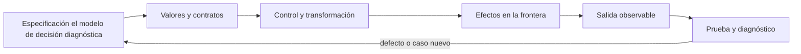

# SE-064 — Funciones, parámetros, retorno y alcance

[← SE-063 — Iteración, recursión y recorridos](https://github.com/vladimiracunadev-create/modern-software-engineering-program/blob/main/classes/part-05-fundamentos-de-programacion/se-063-iteracion-recursion-y-recorridos/README.md) · [↑ Parte 05](https://github.com/vladimiracunadev-create/modern-software-engineering-program/blob/main/classes/part-05-fundamentos-de-programacion/README.md) · [📚 Índice completo](https://github.com/vladimiracunadev-create/modern-software-engineering-program/blob/main/classes/README.md) · [🌐 Portal](https://vladimiracunadev-create.github.io/modern-software-engineering-program/classes/SE-064.html) · [SE-065 — Errores, excepciones y resultados explícitos →](https://github.com/vladimiracunadev-create/modern-software-engineering-program/blob/main/classes/part-05-fundamentos-de-programacion/se-065-errores-excepciones-y-resultados-explicitos/README.md)

> Estado: **PLANNED** · Borrador público conservado íntegramente y sometido a auditoría técnica y pedagógica.

## Punto profesional y fundamento pedagógico

**Punto profesional.** La clase existe para usar funciones como contratos con parámetros, retorno, efectos y alcance localizables.

**Por qué aparece aquí.** Se sitúa después de **Iteración, recursión y recorridos** y antes de **Errores, excepciones y resultados explícitos**: convierte el conocimiento anterior en una decisión observable que la clase siguiente podrá reutilizar. La continuidad se comprueba en el artefacto, no por compartir vocabulario.

**Error conceptual que debe corregir.** Confundir paso de argumentos con copia universal o depender de variables globales ocultas.

**Secuencia de aprendizaje.** Antes de leer la solución, el estudiante predice el resultado del caso normal y del error conceptual anterior. Luego explica un caso resuelto paso a paso, construye un contraejemplo que cambie la decisión y, sin consultar el texto, reconstruye el mecanismo y lo aplica a una entrada nueva. La secuencia usa predicción, explicación propia, contraste y recuperación. [ICAP](https://icap.education.asu.edu/research) distingue participación de construcción de conocimiento; [How People Learn II](https://nap.nationalacademies.org/catalog/24783/how-people-learn-ii-learners-contexts-and-cultures) exige conectar conocimiento previo, contexto y transferencia; la [práctica de recuperación](https://pubmed.ncbi.nlm.nih.gov/16507066/) respalda producir de nuevo la explicación tras una demora; y [Education for Life and Work](https://nap.nationalacademies.org/resource/13398/dbasse_084153.pdf) exige devolución que explique la causa del error.

**Evidencia de aprendizaje.** Call-contract.md con frame, aliasing, efecto y caso inválido. Debe contener predicción previa, observación, explicación causal, contraejemplo, criterio de aceptación y una nota de qué dato haría cambiar la conclusión.

**Límite de la conclusión.** El modelo de llamadas depende del lenguaje y runtime declarados.

### Trazabilidad fuente → afirmación

| Fuente primaria u oficial | Afirmación que respalda | Lo que no prueba |
|---|---|---|
| [Python Tutorial](https://docs.python.org/3/tutorial/) | define la semántica y los límites de la API de Python utilizada en el experimento | No demuestra por sí sola que el artefacto del estudiante sea correcto. |
| [Python Language Reference](https://docs.python.org/3/reference/) | define la semántica y los límites de la API de Python utilizada en el experimento | No demuestra por sí sola que el artefacto del estudiante sea correcto. |

## Antes de empezar

Esta clase construye la **CLI diagnóstica**, implementación incremental de la especificación del modelo de decisión diagnóstica. Recupera `SE-063` y convierte una regla ya modelada en comportamiento ejecutable o comprobable. Trabaja en cambios pequeños: predicción, código, ejecución, evidencia y explicación. Ejecutar sin poder explicar el resultado no completa la práctica.

## Prerrequisitos

- Python 3.11 o posterior disponible como `python` o `python3`; registra la versión real.
- Terminal, editor de texto y Git; no se requieren paquetes externos.
- Comprender el contrato del modelo de decisión diagnóstica: entradas, resultados, errores e invariantes.

## Problema auténtico

El prototipo de la CLI diagnóstica contiene un bloque que lee argumentos, clasifica, imprime y modifica una lista global. No puede probarse en aislamiento ni reutilizarse. Las funciones deben separar cálculo, coordinación y efectos mediante contratos pequeños.

## Objetivos observables

Al terminar podrás explicar el mecanismo del lenguaje, predecir una ejecución, implementar un caso normal y sus fronteras, diagnosticar un fallo controlado, proteger el comportamiento con evidencia y separar lo transferible de lo específico de Python.

## Mapa conceptual



El código no reemplaza la especificación: la materializa bajo reglas concretas del lenguaje y del entorno. La pregunta de esta clase es: **¿Qué promete una función y qué información debe permanecer fuera de su implementación?**

## Temas y por qué importan

| Lente | Pregunta | Evidencia |
|---|---|---|
| valor | ¿qué representa y qué tipo tiene? | ejemplo inspeccionable |
| control | ¿qué camino o repetición ocurre? | traza de estados |
| contrato | ¿qué acepta, retorna y rechaza? | casos frontera |
| efecto | ¿qué cambia fuera del cálculo? | archivo o stream controlado |
| mantenimiento | ¿cómo se detecta una regresión? | prueba y diff enfocado |

## Conceptos y decisiones

### 1. Definición, llamada y retorno

`def` crea una función; la llamada enlaza argumentos a parámetros y ejecuta un nuevo marco. `return` termina y entrega un valor; sin `return` explícito devuelve `None`. Imprimir un resultado no equivale a retornarlo: impide composición y pruebas simples.

### 2. Parámetros y argumentos

Parámetros posicionales comunican datos esenciales; keyword-only hacen visibles opciones; defaults se evalúan al definir la función. Un default mutable como `items=[]` se comparte entre llamadas. Se usa `None` y se crea la colección dentro.

### 3. Alcance y resolución de nombres

Python resuelve nombres en ámbitos local, envolvente, global y builtins. Leer global oculta una dependencia; modificarlo exige `global` y aumenta acoplamiento. La CLI diagnóstica pasa configuración y reloj como argumentos para repetir pruebas.

### 4. Pureza práctica y efectos

Una función pura depende de argumentos y retorna sin cambiar exterior; es fácil de razonar. Leer archivo, tiempo o red es efecto. No todos los efectos son malos: se aíslan en adaptadores y el núcleo recibe valores. Así el cálculo se prueba sin red ni disco.

### 5. Contrato y cohesión

Nombre, tipos, docstring, precondiciones y resultados forman el contrato. Una función cohesiva responde una pregunta a un nivel. Demasiados booleanos suelen indicar políticas mezcladas; se prefiere un objeto de opciones o funciones distintas.

## Definiciones de trabajo

- **parámetro:** nombre local declarado por una función.
- **argumento:** valor suministrado en una llamada.
- **retorno:** valor entregado al llamador.
- **alcance:** región donde un nombre se resuelve.
- **efecto:** interacción observable fuera del valor retornado.

Estas definiciones describen el uso concreto en la CLI diagnóstica. Cuando Python permita varias conductas, el contrato del programa elige una y la hace visible con validación y pruebas.

## Ejemplo mínimo

```python
def classify(duration_ms: float, *, budget_ms: float) -> str:
    # Clasifica una duración ya validada.
    if duration_ms < 0 or budget_ms <= 0:
        raise ValueError("durations must be valid")
    return "slow" if duration_ms > budget_ms else "healthy
```

Transforma un bloque que lee `input`, clasifica e imprime en `parse`, `classify` y `present`. Ejecuta `classify` con 0, límite y límite+1 sin interacción.

Ejecuta el fragmento en un archivo, no solo en una conversación interactiva. Conserva comando, versión, salida y explicación de cada línea relevante.

## Ejemplo profesional

El núcleo de la CLI diagnóstica recibe observaciones y política y retorna un resultado estructurado. La CLI traduce argumentos y códigos de salida. Un reloj inyectado permite probar deadlines sin esperar tiempo real.

El criterio profesional es que el comportamiento pueda ser consumido, diagnosticado y cambiado sin depender de conocimiento oral ni de estado oculto.

## Práctica guiada

1. marca cálculo y efectos en un bloque.
2. extrae una función con retorno.
3. haz opcional un parámetro solo si tiene default seguro.
4. elimina lectura global.
5. escribe contrato y tres llamadas frontera.
6. ejecuta `python -m unittest -v` cuando existan pruebas y registra el resultado exacto.

## Ejercicios

1. **Lectura:** predice valor, tipo, rama o efecto de un fragmento antes de ejecutarlo.
2. **Construcción:** añade un caso de la CLI diagnóstica siguiendo el contrato, sin mezclar I/O y cálculo.
3. **Frontera:** incorpora vacío, límite, inválido y error recuperable.
4. **Transferencia:** escribe pseudocódigo o una versión equivalente en otro lenguaje y señala diferencias.

## Reto verificable

Entrega un cambio que incluya comportamiento, caso normal, caso límite, fallo controlado y explicación. Otra persona debe poder ejecutar los comandos desde un checkout limpio y relacionar cada salida con una regla del modelo de decisión diagnóstica.

## Demostración guiada

1. Escribe la entrada y la salida esperada antes del código.
2. Ejecuta el caso mínimo y observa valores intermedios sin dejar prints permanentes en el núcleo.
3. Añade el caso frontera que obligue a decidir, no solo a teclear.
4. Introduce el fallo descrito abajo y confirma que la evidencia lo detecta.
5. Corrige, ejecuta toda la suite y revisa el diff por efectos no deseados.

## Preguntas frecuentes

### ¿Que el programa se ejecute significa que está correcto?

No. Solo demuestra que esa ejecución terminó. La corrección se refiere al contrato y requiere cubrir límites, errores y propiedades relevantes.

### ¿Debo memorizar toda la sintaxis?

No. Debes reconocer valores, control, contratos y efectos, y saber consultar la referencia oficial. Copiar sintaxis sin modelo produce defectos difíciles de diagnosticar.

### ¿Las anotaciones de tipo validan JSON?

No por sí solas. Ayudan a lectores y herramientas; los datos externos requieren parseo y validación en ejecución.

## Fallo controlado y diagnóstico

Define `def add(item, items=[])` y llama dos veces. Observa estado compartido. Cambia default a `None`, crea una lista nueva y prueba identidad entre resultados.

Registra mensaje, traceback cuando corresponda, hipótesis, caso mínimo, corrección y prueba de regresión. No ocultes el fallo con un `except` amplio ni cambies la prueba para aceptar el defecto.

## Errores comunes y cómo corregirlos

| Síntoma | Causa | Corrección |
|---|---|---|
| funciona solo con un dato | ejemplo usado como especificación | particiones y casos frontera |
| `None`, vacío y cero se mezclan | truthiness sin semántica | comparaciones explícitas |
| importar ejecuta trabajo | efectos al nivel del módulo | función `main` y composition root |
| error desaparece | captura demasiado amplia | manejar solo lo recuperable |
| refactor rompe consumidores | pruebas de detalle o contrato implícito | probar interfaz pública |

## Entorno y archivos clave

```text
work/SE-064/
├── diagnostic_cli/
│   ├── __init__.py
│   ├── domain.py
│   ├── cli.py
│   └── __main__.py
├── tests/
│   └── test_diagnostic_cli.py
└── README.md
```

No instales dependencias para resolver lo que cubre la biblioteca estándar. `README.md` conserva versión, comandos, entradas, salida, limpieza y límites. Los fragmentos son pedagógicos; intégralos solo después de entender su contrato.

## Seguridad, ética y accesibilidad

- usa fixtures sintéticos y no incluyas tokens, rutas personales ni incidentes reales;
- limita tamaño, profundidad y tiempo de entradas no confiables;
- separa stdout parseable de stderr y redacta datos sensibles;
- ofrece mensajes accionables y no dependas solo de color;
- preserva autorización como regla del núcleo, no como checkbox de UI;
- no uses `eval`, `exec` ni construcción de shell con entrada externa.

## Transferencia

Reimplementa el contrato, no la sintaxis. Identifica cómo el segundo lenguaje representa ausencia, error, mutabilidad y módulos. Conserva fixtures y resultados públicos para detectar una diferencia semántica.

## Evaluación y evidencia

| Criterio | Evidencia para aprobar |
|---|---|
| comprensión | predicción y explicación de ejecución |
| comportamiento | normal, límite e inválido según contrato |
| diseño | cálculo separado de efectos y dependencias visibles |
| diagnóstico | fallo mínimo, causa y regresión |
| reproducibilidad | versión, comandos y salidas desde checkout limpio |

No se asciende a `EXECUTABLE` o `TESTED` solo por incluir snippets y comandos. Esos estados requieren artefactos ejecutados y evidencia verificable más allá de esta guía.

## Fuentes


- [Python Tutorial](https://docs.python.org/3/tutorial/) — define la semántica y los límites de la API de Python utilizada en el experimento.
- [Python Language Reference](https://docs.python.org/3/reference/) — define la semántica y los límites de la API de Python utilizada en el experimento.

La documentación oficial define el lenguaje y la biblioteca; no demuestra que la CLI diagnóstica cumpla su dominio. Esa evidencia vive en contratos, pruebas y ejecución reproducible.

## Límites y siguiente paso

Funciones no sustituyen un diseño de módulos ni validación de fronteras. La próxima clase convierte fallos esperados e inesperados en contratos de error.

## Glosario

- **parámetro:** nombre local declarado por una función.
- **argumento:** valor suministrado en una llamada.
- **retorno:** valor entregado al llamador.
- **alcance:** región donde un nombre se resuelve.
- **efecto:** interacción observable fuera del valor retornado.

---

[← SE-063 — Iteración, recursión y recorridos](https://github.com/vladimiracunadev-create/modern-software-engineering-program/blob/main/classes/part-05-fundamentos-de-programacion/se-063-iteracion-recursion-y-recorridos/README.md) · [↑ Parte 05](https://github.com/vladimiracunadev-create/modern-software-engineering-program/blob/main/classes/part-05-fundamentos-de-programacion/README.md) · [📚 Índice completo](https://github.com/vladimiracunadev-create/modern-software-engineering-program/blob/main/classes/README.md) · [🌐 Portal](https://vladimiracunadev-create.github.io/modern-software-engineering-program/classes/SE-064.html) · [SE-065 — Errores, excepciones y resultados explícitos →](https://github.com/vladimiracunadev-create/modern-software-engineering-program/blob/main/classes/part-05-fundamentos-de-programacion/se-065-errores-excepciones-y-resultados-explicitos/README.md)
