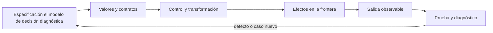

# SE-066 — Colecciones y transformación de datos

[← SE-065 — Errores, excepciones y resultados explícitos](https://github.com/vladimiracunadev-create/modern-software-engineering-program/blob/main/classes/part-05-fundamentos-de-programacion/se-065-errores-excepciones-y-resultados-explicitos/README.md) · [↑ Parte 05](https://github.com/vladimiracunadev-create/modern-software-engineering-program/blob/main/classes/part-05-fundamentos-de-programacion/README.md) · [📚 Índice completo](https://github.com/vladimiracunadev-create/modern-software-engineering-program/blob/main/classes/README.md) · [🌐 Portal](https://vladimiracunadev-create.github.io/modern-software-engineering-program/classes/SE-066.html) · [SE-067 — Entrada, salida y serialización →](https://github.com/vladimiracunadev-create/modern-software-engineering-program/blob/main/classes/part-05-fundamentos-de-programacion/se-067-entrada-salida-y-serializacion/README.md)

> Estado: **PLANNED** · Borrador público conservado íntegramente y sometido a auditoría técnica y pedagógica.

## Punto profesional y fundamento pedagógico

**Punto profesional.** La clase existe para seleccionar colecciones y transformaciones según orden, unicidad, acceso, memoria y mutabilidad.

**Por qué aparece aquí.** Se sitúa después de **Errores, excepciones y resultados explícitos** y antes de **Entrada, salida y serialización**: convierte el conocimiento anterior en una decisión observable que la clase siguiente podrá reutilizar. La continuidad se comprueba en el artefacto, no por compartir vocabulario.

**Error conceptual que debe corregir.** Encadenar transformaciones sin observar pérdidas de información o aliasing.

**Secuencia de aprendizaje.** Antes de leer la solución, el estudiante predice el resultado del caso normal y del error conceptual anterior. Luego explica un caso resuelto paso a paso, construye un contraejemplo que cambie la decisión y, sin consultar el texto, reconstruye el mecanismo y lo aplica a una entrada nueva. La secuencia usa predicción, explicación propia, contraste y recuperación. [ICAP](https://icap.education.asu.edu/research) distingue participación de construcción de conocimiento; [How People Learn II](https://nap.nationalacademies.org/catalog/24783/how-people-learn-ii-learners-contexts-and-cultures) exige conectar conocimiento previo, contexto y transferencia; la [práctica de recuperación](https://pubmed.ncbi.nlm.nih.gov/16507066/) respalda producir de nuevo la explicación tras una demora; y [Education for Life and Work](https://nap.nationalacademies.org/resource/13398/dbasse_084153.pdf) exige devolución que explique la causa del error.

**Evidencia de aprendizaje.** Collection-pipeline.md con entradas, invariantes, complejidad y contraejemplo. Debe contener predicción previa, observación, explicación causal, contraejemplo, criterio de aceptación y una nota de qué dato haría cambiar la conclusión.

**Límite de la conclusión.** La biblioteca puede cambiar constantes y detalles internos.

### Trazabilidad fuente → afirmación

| Fuente primaria u oficial | Afirmación que respalda | Lo que no prueba |
|---|---|---|
| [Python Tutorial — Data Structures](https://docs.python.org/3/tutorial/datastructures.html) | define la semántica y los límites de la API de Python utilizada en el experimento | No demuestra por sí sola que el artefacto del estudiante sea correcto. |
| [Python Language Reference](https://docs.python.org/3/reference/) | define la semántica y los límites de la API de Python utilizada en el experimento | No demuestra por sí sola que el artefacto del estudiante sea correcto. |

## Antes de empezar

Esta clase construye la **CLI diagnóstica**, implementación incremental de la especificación del modelo de decisión diagnóstica. Recupera `SE-065` y convierte una regla ya modelada en comportamiento ejecutable o comprobable. Trabaja en cambios pequeños: predicción, código, ejecución, evidencia y explicación. Ejecutar sin poder explicar el resultado no completa la práctica.

## Prerrequisitos

- Python 3.11 o posterior disponible como `python` o `python3`; registra la versión real.
- Terminal, editor de texto y Git; no se requieren paquetes externos.
- Comprender el contrato del modelo de decisión diagnóstica: entradas, resultados, errores e invariantes.

## Problema auténtico

La CLI diagnóstica almacena todo en listas de diccionarios y busca por ID repetidamente. Aparecen duplicados, orden accidental y código de transformación difícil de leer. La elección entre lista, tupla, conjunto y diccionario debe seguir operaciones e invariantes.

## Objetivos observables

Al terminar podrás explicar el mecanismo del lenguaje, predecir una ejecución, implementar un caso normal y sus fronteras, diagnosticar un fallo controlado, proteger el comportamiento con evidencia y separar lo transferible de lo específico de Python.

## Mapa conceptual



El código no reemplaza la especificación: la materializa bajo reglas concretas del lenguaje y del entorno. La pregunta de esta clase es: **¿Qué operaciones dominan y qué estructura conserva la semántica necesaria?**

## Temas y por qué importan

| Lente | Pregunta | Evidencia |
|---|---|---|
| valor | ¿qué representa y qué tipo tiene? | ejemplo inspeccionable |
| control | ¿qué camino o repetición ocurre? | traza de estados |
| contrato | ¿qué acepta, retorna y rechaza? | casos frontera |
| efecto | ¿qué cambia fuera del cálculo? | archivo o stream controlado |
| mantenimiento | ¿cómo se detecta una regresión? | prueba y diff enfocado |

## Conceptos y decisiones

### 1. Lista y secuencia

Una lista es mutable, ordenada y admite duplicados; resulta adecuada para secuencia de eventos. Acceder por índice es directo, buscar por valor es lineal. El orden debe ser parte del contrato o tratarse como incidental, no depender de él por accidente.

### 2. Tupla y registro ligero

Una tupla es una secuencia inmutable; puede expresar pares o retorno múltiple. Su posición pierde significado si crece. Para registros con muchos campos se prefieren diccionarios, dataclasses o tipos nombrados en etapas posteriores.

### 3. Conjunto

Un set representa pertenencia única y ofrece unión, intersección y diferencia. No promete un orden estable para presentación. Es ideal para IDs visitados o tags; convertir una lista a set elimina duplicados sin explicar cuál registro conservar.

### 4. Diccionario

Un dict asocia claves hashables con valores y conserva orden de inserción como propiedad del lenguaje moderno, pero su razón principal es acceso por clave. Una asignación repetida reemplaza el valor; para detectar duplicado se valida antes de insertar.

### 5. Transformaciones

Comprensiones expresan map/filter sencillos; un bucle explícito sirve cuando hay validación, varias salidas o diagnóstico. Encadenar transformaciones crea colecciones intermedias. La CLI diagnóstica separa normalizar, validar, indexar y resumir para localizar fallos.

## Definiciones de trabajo

- **secuencia:** colección ordenada accesible por posición.
- **mapping:** asociación entre claves y valores.
- **hashable:** valor con hash estable utilizable como clave.
- **comprensión:** sintaxis para construir colección desde iterable.
- **normalización:** transformación hacia una forma canónica.

Estas definiciones describen el uso concreto en la CLI diagnóstica. Cuando Python permita varias conductas, el contrato del programa elige una y la hace visible con validación y pruebas.

## Ejemplo mínimo

```python
authorized_ids = {"dns-check", "tcp-check"}
by_id = {}
for test in tests:
    test_id = test["id"]
    if test_id in by_id:
        raise ValueError(f"duplicate test id: {test_id}")
    by_id[test_id] = test

eligible = [by_id[i] for i in authorized_ids if i in by_id]
```

Dado un conjunto de pruebas con IDs repetidos y tags, crea: secuencia original, índice único, conjunto de tags y lista elegible ordenada por costo. Declara qué ocurre con duplicados.

Ejecuta el fragmento en un archivo, no solo en una conversación interactiva. Conserva comando, versión, salida y explicación de cada línea relevante.

## Ejemplo profesional

La CLI diagnóstica conserva eventos como lista inmutable por convención, usa dict para hipótesis por ID y set para autorizaciones. La salida se ordena explícitamente por `(cost, id)` para reproducibilidad; no depende del orden de un set.

El criterio profesional es que el comportamiento pueda ser consumido, diagnosticado y cambiado sin depender de conocimiento oral ni de estado oculto.

## Práctica guiada

1. lista las operaciones requeridas.
2. elige estructura por operación.
3. valida identidad antes de indexar.
4. separa transformación en etapas.
5. prueba vacío, duplicado y orden de empate.
6. ejecuta `python -m unittest -v` cuando existan pruebas y registra el resultado exacto.

## Ejercicios

1. **Lectura:** predice valor, tipo, rama o efecto de un fragmento antes de ejecutarlo.
2. **Construcción:** añade un caso de la CLI diagnóstica siguiendo el contrato, sin mezclar I/O y cálculo.
3. **Frontera:** incorpora vacío, límite, inválido y error recuperable.
4. **Transferencia:** escribe pseudocódigo o una versión equivalente en otro lenguaje y señala diferencias.

## Reto verificable

Entrega un cambio que incluya comportamiento, caso normal, caso límite, fallo controlado y explicación. Otra persona debe poder ejecutar los comandos desde un checkout limpio y relacionar cada salida con una regla del modelo de decisión diagnóstica.

## Demostración guiada

1. Escribe la entrada y la salida esperada antes del código.
2. Ejecuta el caso mínimo y observa valores intermedios sin dejar prints permanentes en el núcleo.
3. Añade el caso frontera que obligue a decidir, no solo a teclear.
4. Introduce el fallo descrito abajo y confirma que la evidencia lo detecta.
5. Corrige, ejecuta toda la suite y revisa el diff por efectos no deseados.

## Preguntas frecuentes

### ¿Que el programa se ejecute significa que está correcto?

No. Solo demuestra que esa ejecución terminó. La corrección se refiere al contrato y requiere cubrir límites, errores y propiedades relevantes.

### ¿Debo memorizar toda la sintaxis?

No. Debes reconocer valores, control, contratos y efectos, y saber consultar la referencia oficial. Copiar sintaxis sin modelo produce defectos difíciles de diagnosticar.

### ¿Las anotaciones de tipo validan JSON?

No por sí solas. Ayudan a lectores y herramientas; los datos externos requieren parseo y validación en ejecución.

## Fallo controlado y diagnóstico

Convierte registros duplicados directamente con `{x['id']: x for x in items}`. Observa pérdida silenciosa. Añade detección y un error con índice del primer y segundo registro.

Registra mensaje, traceback cuando corresponda, hipótesis, caso mínimo, corrección y prueba de regresión. No ocultes el fallo con un `except` amplio ni cambies la prueba para aceptar el defecto.

## Errores comunes y cómo corregirlos

| Síntoma | Causa | Corrección |
|---|---|---|
| funciona solo con un dato | ejemplo usado como especificación | particiones y casos frontera |
| `None`, vacío y cero se mezclan | truthiness sin semántica | comparaciones explícitas |
| importar ejecuta trabajo | efectos al nivel del módulo | función `main` y composition root |
| error desaparece | captura demasiado amplia | manejar solo lo recuperable |
| refactor rompe consumidores | pruebas de detalle o contrato implícito | probar interfaz pública |

## Entorno y archivos clave

```text
work/SE-066/
├── diagnostic_cli/
│   ├── __init__.py
│   ├── domain.py
│   ├── cli.py
│   └── __main__.py
├── tests/
│   └── test_diagnostic_cli.py
└── README.md
```

No instales dependencias para resolver lo que cubre la biblioteca estándar. `README.md` conserva versión, comandos, entradas, salida, limpieza y límites. Los fragmentos son pedagógicos; intégralos solo después de entender su contrato.

## Seguridad, ética y accesibilidad

- usa fixtures sintéticos y no incluyas tokens, rutas personales ni incidentes reales;
- limita tamaño, profundidad y tiempo de entradas no confiables;
- separa stdout parseable de stderr y redacta datos sensibles;
- ofrece mensajes accionables y no dependas solo de color;
- preserva autorización como regla del núcleo, no como checkbox de UI;
- no uses `eval`, `exec` ni construcción de shell con entrada externa.

## Transferencia

Reimplementa el contrato, no la sintaxis. Identifica cómo el segundo lenguaje representa ausencia, error, mutabilidad y módulos. Conserva fixtures y resultados públicos para detectar una diferencia semántica.

## Evaluación y evidencia

| Criterio | Evidencia para aprobar |
|---|---|
| comprensión | predicción y explicación de ejecución |
| comportamiento | normal, límite e inválido según contrato |
| diseño | cálculo separado de efectos y dependencias visibles |
| diagnóstico | fallo mínimo, causa y regresión |
| reproducibilidad | versión, comandos y salidas desde checkout limpio |

No se asciende a `EXECUTABLE` o `TESTED` solo por incluir snippets y comandos. Esos estados requieren artefactos ejecutados y evidencia verificable más allá de esta guía.

## Fuentes


- [Python Tutorial — Data Structures](https://docs.python.org/3/tutorial/datastructures.html) — define la semántica y los límites de la API de Python utilizada en el experimento.
- [Python Language Reference](https://docs.python.org/3/reference/) — define la semántica y los límites de la API de Python utilizada en el experimento.

La documentación oficial define el lenguaje y la biblioteca; no demuestra que la CLI diagnóstica cumpla su dominio. Esa evidencia vive en contratos, pruebas y ejecución reproducible.

## Límites y siguiente paso

Las colecciones en memoria no resuelven persistencia, volumen ilimitado ni concurrencia. La próxima clase define entradas, salidas y serialización reproducible.

## Glosario

- **secuencia:** colección ordenada accesible por posición.
- **mapping:** asociación entre claves y valores.
- **hashable:** valor con hash estable utilizable como clave.
- **comprensión:** sintaxis para construir colección desde iterable.
- **normalización:** transformación hacia una forma canónica.

---

[← SE-065 — Errores, excepciones y resultados explícitos](https://github.com/vladimiracunadev-create/modern-software-engineering-program/blob/main/classes/part-05-fundamentos-de-programacion/se-065-errores-excepciones-y-resultados-explicitos/README.md) · [↑ Parte 05](https://github.com/vladimiracunadev-create/modern-software-engineering-program/blob/main/classes/part-05-fundamentos-de-programacion/README.md) · [📚 Índice completo](https://github.com/vladimiracunadev-create/modern-software-engineering-program/blob/main/classes/README.md) · [🌐 Portal](https://vladimiracunadev-create.github.io/modern-software-engineering-program/classes/SE-066.html) · [SE-067 — Entrada, salida y serialización →](https://github.com/vladimiracunadev-create/modern-software-engineering-program/blob/main/classes/part-05-fundamentos-de-programacion/se-067-entrada-salida-y-serializacion/README.md)
