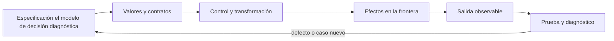

# SE-067 — Entrada, salida y serialización

[← SE-066 — Colecciones y transformación de datos](https://github.com/vladimiracunadev-create/software-engineering-learning-suite/blob/main/classes/part-05-fundamentos-de-programacion/se-066-colecciones-y-transformacion-de-datos/README.md) · [↑ Parte 05](https://github.com/vladimiracunadev-create/software-engineering-learning-suite/blob/main/classes/part-05-fundamentos-de-programacion/README.md) · [📚 Índice completo](https://github.com/vladimiracunadev-create/software-engineering-learning-suite/blob/main/classes/README.md) · [🌐 Portal](https://vladimiracunadev-create.github.io/software-engineering-learning-suite/classes/SE-067.html) · [SE-068 — Módulos, interfaces y separación de responsabilidades →](https://github.com/vladimiracunadev-create/software-engineering-learning-suite/blob/main/classes/part-05-fundamentos-de-programacion/se-068-modulos-interfaces-y-separacion-de-responsabilidades/README.md)

> Estado: **PLANNED** · Borrador público conservado íntegramente y sometido a auditoría técnica y pedagógica.

## Punto profesional y fundamento pedagógico

**Punto profesional.** La clase existe para tratar entrada, salida y serialización como fronteras que validan y preservan significado.

**Por qué aparece aquí.** Se sitúa después de **Colecciones y transformación de datos** y antes de **Módulos, interfaces y separación de responsabilidades**: convierte el conocimiento anterior en una decisión observable que la clase siguiente podrá reutilizar. La continuidad se comprueba en el artefacto, no por compartir vocabulario.

**Error conceptual que debe corregir.** Confiar en datos parseables o asumir que JSON conserva todos los tipos.

**Secuencia de aprendizaje.** Antes de leer la solución, el estudiante predice el resultado del caso normal y del error conceptual anterior. Luego explica un caso resuelto paso a paso, construye un contraejemplo que cambie la decisión y, sin consultar el texto, reconstruye el mecanismo y lo aplica a una entrada nueva. La secuencia usa predicción, explicación propia, contraste y recuperación. [ICAP](https://icap.education.asu.edu/research) distingue participación de construcción de conocimiento; [How People Learn II](https://nap.nationalacademies.org/catalog/24783/how-people-learn-ii-learners-contexts-and-cultures) exige conectar conocimiento previo, contexto y transferencia; la [práctica de recuperación](https://pubmed.ncbi.nlm.nih.gov/16507066/) respalda producir de nuevo la explicación tras una demora; y [Education for Life and Work](https://nap.nationalacademies.org/resource/13398/dbasse_084153.pdf) exige devolución que explique la causa del error.

**Evidencia de aprendizaje.** Boundary-fixtures.md con válido, límite, inválido, round trip y error. Debe contener predicción previa, observación, explicación causal, contraejemplo, criterio de aceptación y una nota de qué dato haría cambiar la conclusión.

**Límite de la conclusión.** Serializar no autentica ni cifra los datos.

### Trazabilidad fuente → afirmación

| Fuente primaria u oficial | Afirmación que respalda | Lo que no prueba |
|---|---|---|
| [Python Tutorial — Input and Output](https://docs.python.org/3/tutorial/inputoutput.html) | define la semántica y los límites de la API de Python utilizada en el experimento | No demuestra por sí sola que el artefacto del estudiante sea correcto. |
| [Python `json` documentation](https://docs.python.org/3/library/json.html) | define la semántica y los límites de la API de Python utilizada en el experimento | No demuestra por sí sola que el artefacto del estudiante sea correcto. |
| [Python `pathlib` documentation](https://docs.python.org/3/library/pathlib.html) | define la semántica y los límites de la API de Python utilizada en el experimento | No demuestra por sí sola que el artefacto del estudiante sea correcto. |

## Antes de empezar

Esta clase construye la **CLI diagnóstica**, implementación incremental de la especificación del modelo de decisión diagnóstica. Recupera `SE-066` y convierte una regla ya modelada en comportamiento ejecutable o comprobable. Trabaja en cambios pequeños: predicción, código, ejecución, evidencia y explicación. Ejecutar sin poder explicar el resultado no completa la práctica.

## Prerrequisitos

- Python 3.11 o posterior disponible como `python` o `python3`; registra la versión real.
- Terminal, editor de texto y Git; no se requieren paquetes externos.
- Comprender el contrato del modelo de decisión diagnóstica: entradas, resultados, errores e invariantes.

## Problema auténtico

La CLI diagnóstica lee JSON, pero asume encoding, esquema y tamaño; escribe directamente sobre el archivo de salida. Un corte deja contenido parcial y una entrada enorme agota memoria. I/O y serialización requieren contrato, límites y actualización recuperable.

## Objetivos observables

Al terminar podrás explicar el mecanismo del lenguaje, predecir una ejecución, implementar un caso normal y sus fronteras, diagnosticar un fallo controlado, proteger el comportamiento con evidencia y separar lo transferible de lo específico de Python.

## Mapa conceptual



El código no reemplaza la especificación: la materializa bajo reglas concretas del lenguaje y del entorno. La pregunta de esta clase es: **¿Qué contrato cruza la frontera entre bytes externos y valores internos?**

## Temas y por qué importan

| Lente | Pregunta | Evidencia |
|---|---|---|
| valor | ¿qué representa y qué tipo tiene? | ejemplo inspeccionable |
| control | ¿qué camino o repetición ocurre? | traza de estados |
| contrato | ¿qué acepta, retorna y rechaza? | casos frontera |
| efecto | ¿qué cambia fuera del cálculo? | archivo o stream controlado |
| mantenimiento | ¿cómo se detecta una regresión? | prueba y diff enfocado |

## Conceptos y decisiones

### 1. Texto, bytes y encoding

Un archivo contiene bytes; abrir en modo texto decodifica con un encoding. Declarar UTF-8 evita depender de configuración local. Nueva línea y normalización pueden variar. Un `UnicodeDecodeError` describe una frontera, no un texto «corrupto» universal.

### 2. Streams y recursos

Archivos y stdin/stdout son streams con ciclo de vida. `with` garantiza cierre del archivo abierto. Leer todo es simple pero no escala; iterar por líneas limita memoria. La estrategia debe imponer tamaño y cantidad máximos antes de confiar en entrada.

### 3. JSON no es el modelo

JSON ofrece null, boolean, número, texto, array y objeto; no valida campos, unidades ni rangos. Después de `json.load` se comprueba estructura. Números no distinguen entero de decimal de dominio, y claves siempre son texto.

### 4. Salida estable

Para automatización, stdout contiene un documento o líneas bien definidas y stderr mensajes humanos. Orden de claves no debe ser contrato salvo declaración. `ensure_ascii=False` preserva lectura UTF-8; indentación es presentación, no semántica.

### 5. Escritura recuperable

Se escribe a temporal en el mismo sistema de archivos, se vacía/cierra y se reemplaza el destino. El reemplazo reduce ventanas parciales, pero no es una transacción universal ni garantiza durabilidad sin fsync. El programa conserva backup o no sobrescribe según riesgo.

## Definiciones de trabajo

- **encoding:** regla entre bytes y caracteres.
- **stream:** secuencia de datos leída o escrita progresivamente.
- **serialización:** conversión entre valores y formato transferible.
- **esquema:** restricciones de forma y campos.
- **escritura atómica:** reemplazo observado como cambio indivisible bajo supuestos del sistema.

Estas definiciones describen el uso concreto en la CLI diagnóstica. Cuando Python permita varias conductas, el contrato del programa elige una y la hace visible con validación y pruebas.

## Ejemplo mínimo

```python
import json
from pathlib import Path

def read_observations(path: Path) -> list[dict]:
    with path.open(encoding="utf-8") as stream:
        payload = json.load(stream)
    if not isinstance(payload, list):
        raise ValueError("expected a JSON array")
    return payload
```

Lee un JSON válido, uno malformado, uno con raíz objeto y uno con duración negativa. Distingue error de sintaxis, forma y regla de dominio.

Ejecuta el fragmento en un archivo, no solo en una conversación interactiva. Conserva comando, versión, salida y explicación de cada línea relevante.

## Ejemplo profesional

La CLI diagnóstica acepta `--input -` para stdin y emite JSON en stdout. Limita bytes, valida cada registro y escribe reportes a temporal antes de reemplazar. Un `--dry-run` muestra destino y cantidad sin modificar archivos.

El criterio profesional es que el comportamiento pueda ser consumido, diagnosticado y cambiado sin depender de conocimiento oral ni de estado oculto.

## Práctica guiada

1. declara encoding y esquema mínimo.
2. lee con context manager.
3. separa parseo de validación.
4. envía errores a stderr.
5. simula interrupción antes del reemplazo.
6. ejecuta `python -m unittest -v` cuando existan pruebas y registra el resultado exacto.

## Ejercicios

1. **Lectura:** predice valor, tipo, rama o efecto de un fragmento antes de ejecutarlo.
2. **Construcción:** añade un caso de la CLI diagnóstica siguiendo el contrato, sin mezclar I/O y cálculo.
3. **Frontera:** incorpora vacío, límite, inválido y error recuperable.
4. **Transferencia:** escribe pseudocódigo o una versión equivalente en otro lenguaje y señala diferencias.

## Reto verificable

Entrega un cambio que incluya comportamiento, caso normal, caso límite, fallo controlado y explicación. Otra persona debe poder ejecutar los comandos desde un checkout limpio y relacionar cada salida con una regla del modelo de decisión diagnóstica.

## Demostración guiada

1. Escribe la entrada y la salida esperada antes del código.
2. Ejecuta el caso mínimo y observa valores intermedios sin dejar prints permanentes en el núcleo.
3. Añade el caso frontera que obligue a decidir, no solo a teclear.
4. Introduce el fallo descrito abajo y confirma que la evidencia lo detecta.
5. Corrige, ejecuta toda la suite y revisa el diff por efectos no deseados.

## Preguntas frecuentes

### ¿Que el programa se ejecute significa que está correcto?

No. Solo demuestra que esa ejecución terminó. La corrección se refiere al contrato y requiere cubrir límites, errores y propiedades relevantes.

### ¿Debo memorizar toda la sintaxis?

No. Debes reconocer valores, control, contratos y efectos, y saber consultar la referencia oficial. Copiar sintaxis sin modelo produce defectos difíciles de diagnosticar.

### ¿Las anotaciones de tipo validan JSON?

No por sí solas. Ayudan a lectores y herramientas; los datos externos requieren parseo y validación en ejecución.

## Fallo controlado y diagnóstico

Escribe `{` directamente en el archivo final y provoca una excepción. El destino queda inválido. Repite con temporal y verifica que el archivo anterior permanezca íntegro.

Registra mensaje, traceback cuando corresponda, hipótesis, caso mínimo, corrección y prueba de regresión. No ocultes el fallo con un `except` amplio ni cambies la prueba para aceptar el defecto.

## Errores comunes y cómo corregirlos

| Síntoma | Causa | Corrección |
|---|---|---|
| funciona solo con un dato | ejemplo usado como especificación | particiones y casos frontera |
| `None`, vacío y cero se mezclan | truthiness sin semántica | comparaciones explícitas |
| importar ejecuta trabajo | efectos al nivel del módulo | función `main` y composition root |
| error desaparece | captura demasiado amplia | manejar solo lo recuperable |
| refactor rompe consumidores | pruebas de detalle o contrato implícito | probar interfaz pública |

## Entorno y archivos clave

```text
work/SE-067/
├── diagnostic_cli/
│   ├── __init__.py
│   ├── domain.py
│   ├── cli.py
│   └── __main__.py
├── tests/
│   └── test_diagnostic_cli.py
└── README.md
```

No instales dependencias para resolver lo que cubre la biblioteca estándar. `README.md` conserva versión, comandos, entradas, salida, limpieza y límites. Los fragmentos son pedagógicos; intégralos solo después de entender su contrato.

## Seguridad, ética y accesibilidad

- usa fixtures sintéticos y no incluyas tokens, rutas personales ni incidentes reales;
- limita tamaño, profundidad y tiempo de entradas no confiables;
- separa stdout parseable de stderr y redacta datos sensibles;
- ofrece mensajes accionables y no dependas solo de color;
- preserva autorización como regla del núcleo, no como checkbox de UI;
- no uses `eval`, `exec` ni construcción de shell con entrada externa.

## Transferencia

Reimplementa el contrato, no la sintaxis. Identifica cómo el segundo lenguaje representa ausencia, error, mutabilidad y módulos. Conserva fixtures y resultados públicos para detectar una diferencia semántica.

## Evaluación y evidencia

| Criterio | Evidencia para aprobar |
|---|---|
| comprensión | predicción y explicación de ejecución |
| comportamiento | normal, límite e inválido según contrato |
| diseño | cálculo separado de efectos y dependencias visibles |
| diagnóstico | fallo mínimo, causa y regresión |
| reproducibilidad | versión, comandos y salidas desde checkout limpio |

No se asciende a `EXECUTABLE` o `TESTED` solo por incluir snippets y comandos. Esos estados requieren artefactos ejecutados y evidencia verificable más allá de esta guía.

## Fuentes


- [Python Tutorial — Input and Output](https://docs.python.org/3/tutorial/inputoutput.html) — define la semántica y los límites de la API de Python utilizada en el experimento.
- [Python `json` documentation](https://docs.python.org/3/library/json.html) — define la semántica y los límites de la API de Python utilizada en el experimento.
- [Python `pathlib` documentation](https://docs.python.org/3/library/pathlib.html) — define la semántica y los límites de la API de Python utilizada en el experimento.
- [Python Tutorial — Errors and Exceptions](https://docs.python.org/3/tutorial/errors.html) — define la semántica y los límites de la API de Python utilizada en el experimento.

La documentación oficial define el lenguaje y la biblioteca; no demuestra que la CLI diagnóstica cumpla su dominio. Esa evidencia vive en contratos, pruebas y ejecución reproducible.

## Límites y siguiente paso

JSON no conserva todos los tipos ni define evolución de esquema. La siguiente clase separa el programa en módulos e interfaces.

## Glosario

- **encoding:** regla entre bytes y caracteres.
- **stream:** secuencia de datos leída o escrita progresivamente.
- **serialización:** conversión entre valores y formato transferible.
- **esquema:** restricciones de forma y campos.
- **escritura atómica:** reemplazo observado como cambio indivisible bajo supuestos del sistema.

---

[← SE-066 — Colecciones y transformación de datos](https://github.com/vladimiracunadev-create/software-engineering-learning-suite/blob/main/classes/part-05-fundamentos-de-programacion/se-066-colecciones-y-transformacion-de-datos/README.md) · [↑ Parte 05](https://github.com/vladimiracunadev-create/software-engineering-learning-suite/blob/main/classes/part-05-fundamentos-de-programacion/README.md) · [📚 Índice completo](https://github.com/vladimiracunadev-create/software-engineering-learning-suite/blob/main/classes/README.md) · [🌐 Portal](https://vladimiracunadev-create.github.io/software-engineering-learning-suite/classes/SE-067.html) · [SE-068 — Módulos, interfaces y separación de responsabilidades →](https://github.com/vladimiracunadev-create/software-engineering-learning-suite/blob/main/classes/part-05-fundamentos-de-programacion/se-068-modulos-interfaces-y-separacion-de-responsabilidades/README.md)
