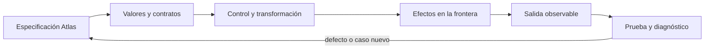

# SE-068 — Módulos, interfaces y separación de responsabilidades

[← SE-067 — Entrada, salida y serialización](https://github.com/vladimiracunadev-create/software-engineering-learning-suite/blob/main/classes/part-05-fundamentos-de-programacion/se-067-entrada-salida-y-serializacion/README.md) · [↑ Parte 05](https://github.com/vladimiracunadev-create/software-engineering-learning-suite/blob/main/classes/part-05-fundamentos-de-programacion/README.md) · [📚 Índice completo](https://github.com/vladimiracunadev-create/software-engineering-learning-suite/blob/main/classes/README.md) · [🌐 Portal](https://vladimiracunadev-create.github.io/software-engineering-learning-suite/classes/SE-068.html) · [SE-069 — Pruebas tempranas y diseño por ejemplos →](https://github.com/vladimiracunadev-create/software-engineering-learning-suite/blob/main/classes/part-05-fundamentos-de-programacion/se-069-pruebas-tempranas-y-diseno-por-ejemplos/README.md)

> Estado: **GUIDED** · Clase desarrollada y revisada cualitativamente.

## Antes de empezar

Esta clase construye **Brújula**, la implementación incremental de la especificación Atlas. Recupera `SE-067` y convierte una regla ya modelada en comportamiento ejecutable o comprobable. Trabaja en cambios pequeños: predicción, código, ejecución, evidencia y explicación. Ejecutar sin poder explicar el resultado no completa la práctica.

## Prerrequisitos

- Python 3.11 o posterior disponible como `python` o `python3`; registra la versión real.
- Terminal, editor de texto y Git; no se requieren paquetes externos.
- Comprender el contrato de Atlas: entradas, resultados, errores e invariantes.

## Problema auténtico

Brújula funciona en `main.py`, pero cualquier cambio de formato afecta clasificación y pruebas. Importar el archivo ejecuta la CLI. Se necesita separar dominio, adaptadores y presentación sin crear módulos vacíos ni ciclos.

## Objetivos observables

Al terminar podrás explicar el mecanismo del lenguaje, predecir una ejecución, implementar un caso normal y sus fronteras, diagnosticar un fallo controlado, proteger el comportamiento con evidencia y separar lo transferible de lo específico de Python.

## Mapa conceptual



El código no reemplaza la especificación: la materializa bajo reglas concretas del lenguaje y del entorno. La pregunta de esta clase es: **¿Qué responsabilidad cambia por una razón distinta y qué contrato permite reemplazarla?**

## Temas y por qué importan

| Lente | Pregunta | Evidencia |
|---|---|---|
| valor | ¿qué representa y qué tipo tiene? | ejemplo inspeccionable |
| control | ¿qué camino o repetición ocurre? | traza de estados |
| contrato | ¿qué acepta, retorna y rechaza? | casos frontera |
| efecto | ¿qué cambia fuera del cálculo? | archivo o stream controlado |
| mantenimiento | ¿cómo se detecta una regresión? | prueba y diff enfocado |

## Conceptos y decisiones

### 1. Módulo y namespace

Un módulo es código cargable con su namespace. La primera importación ejecuta su nivel superior y se guarda en `sys.modules`; por eso el nivel superior evita I/O inesperado. `if __name__ == '__main__'` separa ejecución directa de importación.

### 2. Interfaz pública

La interfaz es el conjunto de nombres y comportamientos que consumidores usan. Un guion bajo comunica detalle interno por convención, pero no impone privacidad. Se documentan tipos, errores y efectos, no solo firmas.

### 3. Separación por política y mecanismo

El dominio decide elegibilidad; el adaptador JSON traduce bytes; la CLI coordina. Esta frontera permite probar reglas sin archivos y cambiar formato sin tocar cálculo. Separar cada función en archivo distinto aumenta navegación sin reducir acoplamiento.

### 4. Dependencias dirigidas

El núcleo no importa la CLI ni detalles de almacenamiento. Adaptadores dependen del contrato del núcleo. Un ciclo de imports suele revelar responsabilidades mezcladas o constantes compartidas en el lugar incorrecto.

### 5. Inyección y composición

La función principal recibe colaboradores —loader, clock, writer— o valores ya obtenidos. La composición ocurre en una raíz pequeña. No hace falta framework: pasar una función como argumento basta para sustituir I/O en pruebas.

## Definiciones de trabajo

- **módulo:** unidad de código con namespace propio.
- **interfaz:** comportamiento público esperado por consumidores.
- **adaptador:** traducción entre contrato interno y sistema externo.
- **dependencia:** conocimiento de un componente sobre otro.
- **composition root:** punto donde se ensamblan colaboradores.

Estas definiciones describen el uso concreto en Brújula. Cuando Python permita varias conductas, el contrato del programa elige una y la hace visible con validación y pruebas.

## Ejemplo mínimo

```python
# compass/domain.py
def choose_next(hypotheses, tests, authorized_ids):
    eligible = [t for t in tests if t["id"] in authorized_ids]
    return min(eligible, key=lambda t: (t["cost"], t["id"]), default=None)

# compass/__main__.py
from .cli import main
raise SystemExit(main())
```

Divide un script en `domain.py`, `json_io.py`, `cli.py` y `__main__.py`. Dibuja flechas de importación y elimina toda flecha del dominio hacia CLI/I/O.

Ejecuta el fragmento en un archivo, no solo en una conversación interactiva. Conserva comando, versión, salida y explicación de cada línea relevante.

## Ejemplo profesional

Brújula expone `choose_next` como interfaz de dominio, estable y sin efectos. La CLI convierte excepciones de frontera a códigos de salida. Los módulos no imprimen al importarse y el paquete puede ejecutarse con `python -m compass`.

El criterio profesional es que el comportamiento pueda ser consumido, diagnosticado y cambiado sin depender de conocimiento oral ni de estado oculto.

## Práctica guiada

1. marca razones de cambio.
2. define interfaz del núcleo.
3. mueve efectos a adaptadores.
4. dibuja grafo de imports.
5. prueba que importar no emite salida.
6. ejecuta `python -m unittest -v` cuando existan pruebas y registra el resultado exacto.

## Ejercicios

1. **Lectura:** predice valor, tipo, rama o efecto de un fragmento antes de ejecutarlo.
2. **Construcción:** añade un caso de Brújula siguiendo el contrato, sin mezclar I/O y cálculo.
3. **Frontera:** incorpora vacío, límite, inválido y error recuperable.
4. **Transferencia:** escribe pseudocódigo o una versión equivalente en otro lenguaje y señala diferencias.

## Reto verificable

Entrega un cambio que incluya comportamiento, caso normal, caso límite, fallo controlado y explicación. Otra persona debe poder ejecutar los comandos desde un checkout limpio y relacionar cada salida con una regla de Atlas.

## Demostración guiada

1. Escribe la entrada y la salida esperada antes del código.
2. Ejecuta el caso mínimo y observa valores intermedios sin dejar prints permanentes en el núcleo.
3. Añade el caso frontera que obligue a decidir, no solo a teclear.
4. Introduce el fallo descrito abajo y confirma que la evidencia lo detecta.
5. Corrige, ejecuta toda la suite y revisa el diff por efectos no deseados.

## Preguntas frecuentes

### ¿Que el programa se ejecute significa que está correcto?

No. Solo demuestra que esa ejecución terminó. La corrección se refiere al contrato y requiere cubrir límites, errores y propiedades relevantes.

### ¿Debo memorizar toda la sintaxis?

No. Debes reconocer valores, control, contratos y efectos, y saber consultar la referencia oficial. Copiar sintaxis sin modelo produce defectos difíciles de diagnosticar.

### ¿Las anotaciones de tipo validan JSON?

No por sí solas. Ayudan a lectores y herramientas; los datos externos requieren parseo y validación en ejecución.

## Fallo controlado y diagnóstico

Importa `cli` desde `domain` para reutilizar una constante mientras `cli` importa `domain`. Reproduce el ciclo; mueve el concepto al módulo dueño o pásalo como parámetro.

Registra mensaje, traceback cuando corresponda, hipótesis, caso mínimo, corrección y prueba de regresión. No ocultes el fallo con un `except` amplio ni cambies la prueba para aceptar el defecto.

## Errores comunes y cómo corregirlos

| Síntoma | Causa | Corrección |
|---|---|---|
| funciona solo con un dato | ejemplo usado como especificación | particiones y casos frontera |
| `None`, vacío y cero se mezclan | truthiness sin semántica | comparaciones explícitas |
| importar ejecuta trabajo | efectos al nivel del módulo | función `main` y composition root |
| error desaparece | captura demasiado amplia | manejar solo lo recuperable |
| refactor rompe consumidores | pruebas de detalle o contrato implícito | probar interfaz pública |

## Entorno y archivos clave

```text
work/SE-068/
├── compass/
│   ├── __init__.py
│   ├── domain.py
│   ├── cli.py
│   └── __main__.py
├── tests/
│   └── test_compass.py
└── README.md
```

No instales dependencias para resolver lo que cubre la biblioteca estándar. `README.md` conserva versión, comandos, entradas, salida, limpieza y límites. Los fragmentos son pedagógicos; intégralos solo después de entender su contrato.

## Seguridad, ética y accesibilidad

- usa fixtures sintéticos y no incluyas tokens, rutas personales ni incidentes reales;
- limita tamaño, profundidad y tiempo de entradas no confiables;
- separa stdout parseable de stderr y redacta datos sensibles;
- ofrece mensajes accionables y no dependas solo de color;
- preserva autorización como regla del núcleo, no como checkbox de UI;
- no uses `eval`, `exec` ni construcción de shell con entrada externa.

## Transferencia

Reimplementa el contrato, no la sintaxis. Identifica cómo el segundo lenguaje representa ausencia, error, mutabilidad y módulos. Conserva fixtures y resultados públicos para detectar una diferencia semántica.

## Evaluación y evidencia

| Criterio | Evidencia para aprobar |
|---|---|
| comprensión | predicción y explicación de ejecución |
| comportamiento | normal, límite e inválido según contrato |
| diseño | cálculo separado de efectos y dependencias visibles |
| diagnóstico | fallo mínimo, causa y regresión |
| reproducibilidad | versión, comandos y salidas desde checkout limpio |

No se asciende a `EXECUTABLE` o `TESTED` solo por incluir snippets y comandos. Esos estados requieren artefactos ejecutados y evidencia verificable más allá de esta guía.

## Fuentes

- [Python Tutorial — Modules](https://docs.python.org/3/tutorial/modules.html): referencia oficial para el mecanismo y los límites explicados.
- [Python Language Reference](https://docs.python.org/3/reference/): referencia oficial para el mecanismo y los límites explicados.
- [SWEBOK Guide v4.0a](https://www.computer.org/education/bodies-of-knowledge/software-engineering): referencia oficial para el mecanismo y los límites explicados.

La documentación oficial define el lenguaje y la biblioteca; no demuestra que Brújula cumpla su dominio. Esa evidencia vive en contratos, pruebas y ejecución reproducible.

## Límites y siguiente paso

Modularidad no garantiza buena API ni compatibilidad futura. La próxima clase usa ejemplos como pruebas tempranas para presionar el diseño.

## Glosario

- **módulo:** unidad de código con namespace propio.
- **interfaz:** comportamiento público esperado por consumidores.
- **adaptador:** traducción entre contrato interno y sistema externo.
- **dependencia:** conocimiento de un componente sobre otro.
- **composition root:** punto donde se ensamblan colaboradores.

---

[← SE-067 — Entrada, salida y serialización](https://github.com/vladimiracunadev-create/software-engineering-learning-suite/blob/main/classes/part-05-fundamentos-de-programacion/se-067-entrada-salida-y-serializacion/README.md) · [↑ Parte 05](https://github.com/vladimiracunadev-create/software-engineering-learning-suite/blob/main/classes/part-05-fundamentos-de-programacion/README.md) · [📚 Índice completo](https://github.com/vladimiracunadev-create/software-engineering-learning-suite/blob/main/classes/README.md) · [🌐 Portal](https://vladimiracunadev-create.github.io/software-engineering-learning-suite/classes/SE-068.html) · [SE-069 — Pruebas tempranas y diseño por ejemplos →](https://github.com/vladimiracunadev-create/software-engineering-learning-suite/blob/main/classes/part-05-fundamentos-de-programacion/se-069-pruebas-tempranas-y-diseno-por-ejemplos/README.md)
