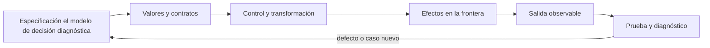

# SE-069 — Pruebas tempranas y diseño por ejemplos

[← SE-068 — Módulos, interfaces y separación de responsabilidades](https://github.com/vladimiracunadev-create/modern-software-engineering-program/blob/main/classes/part-05-fundamentos-de-programacion/se-068-modulos-interfaces-y-separacion-de-responsabilidades/README.md) · [↑ Parte 05](https://github.com/vladimiracunadev-create/modern-software-engineering-program/blob/main/classes/part-05-fundamentos-de-programacion/README.md) · [📚 Índice completo](https://github.com/vladimiracunadev-create/modern-software-engineering-program/blob/main/classes/README.md) · [🌐 Portal](https://vladimiracunadev-create.github.io/modern-software-engineering-program/classes/SE-069.html) · [SE-070 — Legibilidad, nombres y mantenimiento básico →](https://github.com/vladimiracunadev-create/modern-software-engineering-program/blob/main/classes/part-05-fundamentos-de-programacion/se-070-legibilidad-nombres-y-mantenimiento-basico/README.md)


## Punto profesional y fundamento pedagógico

**Punto profesional.** La clase existe para usar ejemplos para descubrir particiones y propiedades antes de fijar implementación.

**Por qué aparece aquí.** Se sitúa después de **Módulos, interfaces y separación de responsabilidades** y antes de **Legibilidad, nombres y mantenimiento básico**: convierte el conocimiento anterior en una decisión observable que la clase siguiente podrá reutilizar. La continuidad se comprueba en el artefacto, no por compartir vocabulario.

**Error conceptual que debe corregir.** Escribir pruebas que solo confirman casos felices ya conocidos.

**Secuencia de aprendizaje.** Antes de leer la solución, el estudiante predice el resultado del caso normal y del error conceptual anterior. Luego explica un caso resuelto paso a paso, construye un contraejemplo que cambie la decisión y, sin consultar el texto, reconstruye el mecanismo y lo aplica a una entrada nueva. La secuencia usa predicción, explicación propia, contraste y recuperación. [ICAP](https://icap.education.asu.edu/research) distingue participación de construcción de conocimiento; [How People Learn II](https://nap.nationalacademies.org/catalog/24783/how-people-learn-ii-learners-contexts-and-cultures) exige conectar conocimiento previo, contexto y transferencia; la [práctica de recuperación](https://pubmed.ncbi.nlm.nih.gov/16507066/) respalda producir de nuevo la explicación tras una demora; y [Education for Life and Work](https://nap.nationalacademies.org/resource/13398/dbasse_084153.pdf) exige devolución que explique la causa del error.

**Evidencia de aprendizaje.** Test-design.md con particiones, límites, propiedad y mutación que la suite detecta. Debe contener predicción previa, observación, explicación causal, contraejemplo, criterio de aceptación y una nota de qué dato haría cambiar la conclusión.

**Límite de la conclusión.** Una suite finita reduce riesgo; no prueba ausencia de defectos.

### Trazabilidad fuente → afirmación

| Fuente primaria u oficial | Afirmación que respalda | Lo que no prueba |
|---|---|---|
| [Python `unittest` documentation](https://docs.python.org/3/library/unittest.html) | define la semántica y los límites de la API de Python utilizada en el experimento | No demuestra por sí sola que el artefacto del estudiante sea correcto. |
| [SWEBOK Guide v4.0a](https://www.computer.org/education/bodies-of-knowledge/software-engineering) | sitúa la decisión dentro de construcción, diseño, pruebas y práctica profesional de ingeniería de software | No demuestra por sí sola que el artefacto del estudiante sea correcto. |
| [Python Tutorial](https://docs.python.org/3/tutorial/) | define la semántica y los límites de la API de Python utilizada en el experimento | No demuestra por sí sola que el artefacto del estudiante sea correcto. |

## Antes de empezar

Esta clase construye la **CLI diagnóstica**, implementación incremental de la especificación del modelo de decisión diagnóstica. Recupera `SE-068` y convierte una regla ya modelada en comportamiento ejecutable o comprobable. Trabaja en cambios pequeños: predicción, código, ejecución, evidencia y explicación. Ejecutar sin poder explicar el resultado no completa la práctica.

## Prerrequisitos

- Python 3.11 o posterior disponible como `python` o `python3`; registra la versión real.
- Terminal, editor de texto y Git; no se requieren paquetes externos.
- Comprender el contrato del modelo de decisión diagnóstica: entradas, resultados, errores e invariantes.

## Problema auténtico

La CLI diagnóstica se prueba al final con una entrada feliz. Duplicados, empate, vacío y errores de archivo reaparecen después de refactorizar. Las pruebas tempranas deben derivarse del contrato y dar retroalimentación sobre la interfaz, no congelar detalles internos.

## Objetivos observables

Al terminar podrás explicar el mecanismo del lenguaje, predecir una ejecución, implementar un caso normal y sus fronteras, diagnosticar un fallo controlado, proteger el comportamiento con evidencia y separar lo transferible de lo específico de Python.

## Mapa conceptual



El código no reemplaza la especificación: la materializa bajo reglas concretas del lenguaje y del entorno. La pregunta de esta clase es: **¿Qué ejemplo cambia una decisión de diseño y qué defecto evitará que regrese?**

## Temas y por qué importan

| Lente | Pregunta | Evidencia |
|---|---|---|
| valor | ¿qué representa y qué tipo tiene? | ejemplo inspeccionable |
| control | ¿qué camino o repetición ocurre? | traza de estados |
| contrato | ¿qué acepta, retorna y rechaza? | casos frontera |
| efecto | ¿qué cambia fuera del cálculo? | archivo o stream controlado |
| mantenimiento | ¿cómo se detecta una regresión? | prueba y diff enfocado |

## Conceptos y decisiones

### 1. Ejemplo como especificación

Un ejemplo nombra entrada, acción y resultado observable. Primero se seleccionan particiones y fronteras; después se codifica. Un ejemplo aislado no define todo el dominio, pero varios ejemplos pueden revelar vocabulario y una interfaz incómoda.

### 2. Arrange–Act–Assert

Arrange prepara el estado mínimo; Act ejecuta una sola conducta; Assert comprueba resultado relevante. Mezclar varias acciones y docenas de asserts dificulta localizar intención. Los nombres de prueba expresan condición y consecuencia.

### 3. Pruebas de valor, error y efecto

El núcleo se prueba por retorno y excepciones de contrato. Adaptadores verifican archivos temporales, stdout/stderr y códigos de salida. Simular todo produce confianza ficticia; tocar red real vuelve la prueba frágil. Se elige la frontera adecuada.

### 4. Dobles y determinismo

Un fake en memoria o función inyectada controla reloj e I/O. El doble debe respetar el contrato relevante, no duplicar implementación. Semillas, tiempo y orden se fijan cuando afectan el resultado. Una prueba flaky es una señal a diagnosticar, no a reintentar indefinidamente.

### 5. Prueba de regresión

Al corregir un defecto se añade primero el caso que falla, se verifica rojo por la razón correcta, se corrige y se conserva. Cobertura indica ejecución, no calidad de oráculos. Se priorizan decisiones y riesgos.

## Definiciones de trabajo

- **oráculo:** criterio que decide el resultado esperado.
- **fixture:** estado preparado para una prueba.
- **doble:** sustituto controlado de un colaborador.
- **regresión:** defecto corregido que reaparece.
- **flaky:** prueba con resultado no determinista sin cambio relevante.

Estas definiciones describen el uso concreto en la CLI diagnóstica. Cuando Python permita varias conductas, el contrato del programa elige una y la hace visible con validación y pruebas.

## Ejemplo mínimo

```python
import unittest
from diagnostic_cli.domain import choose_next

class ChooseNextTests(unittest.TestCase):
    def test_returns_none_when_no_test_is_authorized(self):
        tests = [{"id": "dns", "cost": 1}]
        self.assertIsNone(choose_next([], tests, set()))

if __name__ == "__main__":
    unittest.main()
```

Escribe casos para lista vacía, una prueba autorizada, dos con distinto costo y empate por ID. Ejecuta primero contra una implementación incompleta y confirma que al menos uno falla por la regla esperada.

Ejecuta el fragmento en un archivo, no solo en una conversación interactiva. Conserva comando, versión, salida y explicación de cada línea relevante.

## Ejemplo profesional

La suite de la CLI diagnóstica separa pruebas de dominio y CLI. Usa `TemporaryDirectory`, captura stdout/stderr y ejecuta la CLI como consumidor. Cada bug recibe una regresión; las pruebas no afirman conectividad real no simulada.

El criterio profesional es que el comportamiento pueda ser consumido, diagnosticado y cambiado sin depender de conocimiento oral ni de estado oculto.

## Práctica guiada

1. deriva particiones del contrato.
2. nombra comportamiento.
3. escribe Arrange–Act–Assert.
4. observa rojo antes de corregir.
5. refactoriza conservando verde.
6. ejecuta `python -m unittest -v` cuando existan pruebas y registra el resultado exacto.

## Ejercicios

1. **Lectura:** predice valor, tipo, rama o efecto de un fragmento antes de ejecutarlo.
2. **Construcción:** añade un caso de la CLI diagnóstica siguiendo el contrato, sin mezclar I/O y cálculo.
3. **Frontera:** incorpora vacío, límite, inválido y error recuperable.
4. **Transferencia:** escribe pseudocódigo o una versión equivalente en otro lenguaje y señala diferencias.

## Reto verificable

Entrega un cambio que incluya comportamiento, caso normal, caso límite, fallo controlado y explicación. Otra persona debe poder ejecutar los comandos desde un checkout limpio y relacionar cada salida con una regla del modelo de decisión diagnóstica.

## Demostración guiada

1. Escribe la entrada y la salida esperada antes del código.
2. Ejecuta el caso mínimo y observa valores intermedios sin dejar prints permanentes en el núcleo.
3. Añade el caso frontera que obligue a decidir, no solo a teclear.
4. Introduce el fallo descrito abajo y confirma que la evidencia lo detecta.
5. Corrige, ejecuta toda la suite y revisa el diff por efectos no deseados.

## Preguntas frecuentes

### ¿Que el programa se ejecute significa que está correcto?

No. Solo demuestra que esa ejecución terminó. La corrección se refiere al contrato y requiere cubrir límites, errores y propiedades relevantes.

### ¿Debo memorizar toda la sintaxis?

No. Debes reconocer valores, control, contratos y efectos, y saber consultar la referencia oficial. Copiar sintaxis sin modelo produce defectos difíciles de diagnosticar.

### ¿Las anotaciones de tipo validan JSON?

No por sí solas. Ayudan a lectores y herramientas; los datos externos requieren parseo y validación en ejecución.

## Fallo controlado y diagnóstico

Afirma el valor de una variable interna y la prueba se rompe al cambiar algoritmo sin cambiar resultado. Sustituye por la salida o efecto público que protege el requisito.

Registra mensaje, traceback cuando corresponda, hipótesis, caso mínimo, corrección y prueba de regresión. No ocultes el fallo con un `except` amplio ni cambies la prueba para aceptar el defecto.

## Errores comunes y cómo corregirlos

| Síntoma | Causa | Corrección |
|---|---|---|
| funciona solo con un dato | ejemplo usado como especificación | particiones y casos frontera |
| `None`, vacío y cero se mezclan | truthiness sin semántica | comparaciones explícitas |
| importar ejecuta trabajo | efectos al nivel del módulo | función `main` y composition root |
| error desaparece | captura demasiado amplia | manejar solo lo recuperable |
| refactor rompe consumidores | pruebas de detalle o contrato implícito | probar interfaz pública |

## Entorno y archivos clave

```text
work/SE-069/
├── diagnostic_cli/
│   ├── __init__.py
│   ├── domain.py
│   ├── cli.py
│   └── __main__.py
├── tests/
│   └── test_diagnostic_cli.py
└── README.md
```

No instales dependencias para resolver lo que cubre la biblioteca estándar. `README.md` conserva versión, comandos, entradas, salida, limpieza y límites. Los fragmentos son pedagógicos; intégralos solo después de entender su contrato.

### Laboratorio integrado de la Parte 05

Audita las quince pruebas de [`labs/part-05-diagnostic-cli`](https://github.com/vladimiracunadev-create/modern-software-engineering-program/tree/main/labs/part-05-diagnostic-cli) y clasifícalas como ejemplo, frontera, error, propiedad, integración o consumidor. Antes de corregir nada, agrega una regresión que falle por la razón prevista. Explica también qué no probarías: atributos privados o el orden interno de guard clauses no merecen fijarse si el contrato observable se conserva. La cobertura se argumenta por riesgos y particiones, no solo por líneas ejecutadas.

## Seguridad, ética y accesibilidad

- usa fixtures sintéticos y no incluyas tokens, rutas personales ni incidentes reales;
- limita tamaño, profundidad y tiempo de entradas no confiables;
- separa stdout parseable de stderr y redacta datos sensibles;
- ofrece mensajes accionables y no dependas solo de color;
- preserva autorización como regla del núcleo, no como checkbox de UI;
- no uses `eval`, `exec` ni construcción de shell con entrada externa.

## Transferencia

Reimplementa el contrato, no la sintaxis. Identifica cómo el segundo lenguaje representa ausencia, error, mutabilidad y módulos. Conserva fixtures y resultados públicos para detectar una diferencia semántica.

## Evaluación y evidencia

| Criterio | Evidencia para aprobar |
|---|---|
| comprensión | predicción y explicación de ejecución |
| comportamiento | normal, límite e inválido según contrato |
| diseño | cálculo separado de efectos y dependencias visibles |
| diagnóstico | fallo mínimo, causa y regresión |
| reproducibilidad | versión, comandos y salidas desde checkout limpio |


## Fuentes


- [Python `unittest` documentation](https://docs.python.org/3/library/unittest.html) — define la semántica y los límites de la API de Python utilizada en el experimento.
- [SWEBOK Guide v4.0a](https://www.computer.org/education/bodies-of-knowledge/software-engineering) — sitúa la decisión dentro de construcción, diseño, pruebas y práctica profesional de ingeniería de software.
- [Python Tutorial](https://docs.python.org/3/tutorial/) — define la semántica y los límites de la API de Python utilizada en el experimento.

La documentación oficial define el lenguaje y la biblioteca; no demuestra que la CLI diagnóstica cumpla su dominio. Esa evidencia vive en contratos, pruebas y ejecución reproducible.

## Límites y siguiente paso

Pruebas no demuestran ausencia de defectos ni sustituyen revisión y análisis. La próxima clase mejora legibilidad sin cambiar comportamiento protegido.

## Glosario

- **oráculo:** criterio que decide el resultado esperado.
- **fixture:** estado preparado para una prueba.
- **doble:** sustituto controlado de un colaborador.
- **regresión:** defecto corregido que reaparece.
- **flaky:** prueba con resultado no determinista sin cambio relevante.

---

[← SE-068 — Módulos, interfaces y separación de responsabilidades](https://github.com/vladimiracunadev-create/modern-software-engineering-program/blob/main/classes/part-05-fundamentos-de-programacion/se-068-modulos-interfaces-y-separacion-de-responsabilidades/README.md) · [↑ Parte 05](https://github.com/vladimiracunadev-create/modern-software-engineering-program/blob/main/classes/part-05-fundamentos-de-programacion/README.md) · [📚 Índice completo](https://github.com/vladimiracunadev-create/modern-software-engineering-program/blob/main/classes/README.md) · [🌐 Portal](https://vladimiracunadev-create.github.io/modern-software-engineering-program/classes/SE-069.html) · [SE-070 — Legibilidad, nombres y mantenimiento básico →](https://github.com/vladimiracunadev-create/modern-software-engineering-program/blob/main/classes/part-05-fundamentos-de-programacion/se-070-legibilidad-nombres-y-mantenimiento-basico/README.md)
