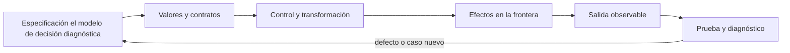

# SE-070 — Legibilidad, nombres y mantenimiento básico

[← SE-069 — Pruebas tempranas y diseño por ejemplos](https://github.com/vladimiracunadev-create/modern-software-engineering-program/blob/main/classes/part-05-fundamentos-de-programacion/se-069-pruebas-tempranas-y-diseno-por-ejemplos/README.md) · [↑ Parte 05](https://github.com/vladimiracunadev-create/modern-software-engineering-program/blob/main/classes/part-05-fundamentos-de-programacion/README.md) · [📚 Índice completo](https://github.com/vladimiracunadev-create/modern-software-engineering-program/blob/main/classes/README.md) · [🌐 Portal](https://vladimiracunadev-create.github.io/modern-software-engineering-program/classes/SE-070.html) · [SE-071 — Taller: transferir una solución entre lenguajes →](https://github.com/vladimiracunadev-create/modern-software-engineering-program/blob/main/classes/part-05-fundamentos-de-programacion/se-071-taller-transferir-una-solucion-entre-lenguajes/README.md)


## Punto profesional y fundamento pedagógico

**Punto profesional.** La clase existe para evaluar legibilidad por el costo de comprender y cambiar, no por preferencias estéticas.

**Por qué aparece aquí.** Se sitúa después de **Pruebas tempranas y diseño por ejemplos** y antes de **Taller: transferir una solución entre lenguajes**: convierte el conocimiento anterior en una decisión observable que la clase siguiente podrá reutilizar. La continuidad se comprueba en el artefacto, no por compartir vocabulario.

**Error conceptual que debe corregir.** Aplicar nombres o formato sin mejorar el modelo.

**Secuencia de aprendizaje.** Antes de leer la solución, el estudiante predice el resultado del caso normal y del error conceptual anterior. Luego explica un caso resuelto paso a paso, construye un contraejemplo que cambie la decisión y, sin consultar el texto, reconstruye el mecanismo y lo aplica a una entrada nueva. La secuencia usa predicción, explicación propia, contraste y recuperación. [ICAP](https://icap.education.asu.edu/research) distingue participación de construcción de conocimiento; [How People Learn II](https://nap.nationalacademies.org/catalog/24783/how-people-learn-ii-learners-contexts-and-cultures) exige conectar conocimiento previo, contexto y transferencia; la [práctica de recuperación](https://pubmed.ncbi.nlm.nih.gov/16507066/) respalda producir de nuevo la explicación tras una demora; y [Education for Life and Work](https://nap.nationalacademies.org/resource/13398/dbasse_084153.pdf) exige devolución que explique la causa del error.

**Evidencia de aprendizaje.** Maintenance-change.md con tarea antes/después, diff y explicación de carga cognitiva. Debe contener predicción previa, observación, explicación causal, contraejemplo, criterio de aceptación y una nota de qué dato haría cambiar la conclusión.

**Límite de la conclusión.** Una medición local no demuestra mantenibilidad a largo plazo.

### Trazabilidad fuente → afirmación

| Fuente primaria u oficial | Afirmación que respalda | Lo que no prueba |
|---|---|---|
| [SWEBOK Guide v4.0a](https://www.computer.org/education/bodies-of-knowledge/software-engineering) | sitúa la decisión dentro de construcción, diseño, pruebas y práctica profesional de ingeniería de software | No demuestra por sí sola que el artefacto del estudiante sea correcto. |
| [Python Tutorial](https://docs.python.org/3/tutorial/) | define la semántica y los límites de la API de Python utilizada en el experimento | No demuestra por sí sola que el artefacto del estudiante sea correcto. |
| [Python Language Reference](https://docs.python.org/3/reference/) | define la semántica y los límites de la API de Python utilizada en el experimento | No demuestra por sí sola que el artefacto del estudiante sea correcto. |

## Antes de empezar

Esta clase construye la **CLI diagnóstica**, implementación incremental de la especificación del modelo de decisión diagnóstica. Recupera `SE-069` y convierte una regla ya modelada en comportamiento ejecutable o comprobable. Trabaja en cambios pequeños: predicción, código, ejecución, evidencia y explicación. Ejecutar sin poder explicar el resultado no completa la práctica.

## Prerrequisitos

- Python 3.11 o posterior disponible como `python` o `python3`; registra la versión real.
- Terminal, editor de texto y Git; no se requieren paquetes externos.
- Comprender el contrato del modelo de decisión diagnóstica: entradas, resultados, errores e invariantes.

## Problema auténtico

La CLI diagnóstica pasa pruebas, pero usa nombres crípticos, funciones largas y comentarios que contradicen el código. La legibilidad no es cosmética: determina si una persona puede detectar una regla rota y modificarla con riesgo acotado.

## Objetivos observables

Al terminar podrás explicar el mecanismo del lenguaje, predecir una ejecución, implementar un caso normal y sus fronteras, diagnosticar un fallo controlado, proteger el comportamiento con evidencia y separar lo transferible de lo específico de Python.

## Mapa conceptual



El código no reemplaza la especificación: la materializa bajo reglas concretas del lenguaje y del entorno. La pregunta de esta clase es: **¿Puede una persona cambiar el comportamiento correcto sin reconstruir toda la intención?**

## Temas y por qué importan

| Lente | Pregunta | Evidencia |
|---|---|---|
| valor | ¿qué representa y qué tipo tiene? | ejemplo inspeccionable |
| control | ¿qué camino o repetición ocurre? | traza de estados |
| contrato | ¿qué acepta, retorna y rechaza? | casos frontera |
| efecto | ¿qué cambia fuera del cálculo? | archivo o stream controlado |
| mantenimiento | ¿cómo se detecta una regresión? | prueba y diff enfocado |

## Conceptos y decisiones

### 1. Nombres como modelo

Un nombre revela rol, unidad y alcance: `remaining_budget_ms` supera `b`. Los nombres no deben repetir el tipo sin intención ni prometer más que la función. `validate` es ambiguo si no dice qué acepta o retorna.

### 2. Nivel de abstracción

Una función legible mantiene un nivel: coordinar fases o calcular una regla, no ambos. Mezclar `json.loads`, política de autorización y `print` obliga a saltar entre detalles. Extraer debe crear conceptos, no fragmentos arbitrarios.

### 3. Comentarios y docstrings

El código explica cómo; un comentario útil registra por qué existe una decisión no obvia, límite o fuente. Un comentario que repite la línea se desactualiza. La docstring de API declara contrato, errores y efectos con brevedad.

### 4. Duplicación y simetría

Duplicar una regla permite divergencia; extraerla prematuramente puede unir casos que cambian por razones distintas. Se elimina duplicación de conocimiento, no toda semejanza textual. Estructuras paralelas se presentan con forma y orden consistentes.

### 5. Refactorización protegida

Un cambio estructural conserva comportamiento observable. Primero se caracteriza con pruebas, después se cambia en pasos pequeños y se revisa el diff. Renombrar, extraer y simplificar por separado hace reversible la decisión.

## Definiciones de trabajo

- **legibilidad:** facilidad para reconstruir intención y comportamiento.
- **abstracción:** concepto que oculta detalle bajo contrato.
- **duplicación de conocimiento:** misma regla mantenida en varios lugares.
- **refactorización:** cambio de estructura que preserva comportamiento.
- **caracterización:** prueba que captura conducta existente.

Estas definiciones describen el uso concreto en la CLI diagnóstica. Cuando Python permita varias conductas, el contrato del programa elige una y la hace visible con validación y pruebas.

## Ejemplo mínimo

```python
def remaining_budget_ms(total_ms: float, elapsed_ms: float) -> float:
    # Return non-negative time available for the next diagnostic step.
    if total_ms < 0 or elapsed_ms < 0:
        raise ValueError("budgets cannot be negative")
    return max(0.0, total_ms - elapsed_ms)
```

Toma una función de 25 líneas que parsea, decide e imprime. Marca niveles, renombra cinco conceptos y extrae una función pura. Las mismas pruebas deben pasar antes y después.

Ejecuta el fragmento en un archivo, no solo en una conversación interactiva. Conserva comando, versión, salida y explicación de cada línea relevante.

## Ejemplo profesional

La CLI diagnóstica adopta vocabulario del modelo de decisión diagnóstica en código y mensajes. El README define convenciones de unidades y errores. Cada refactor mantiene commits pequeños, pruebas verdes y una explicación de qué cambio futuro facilita.

El criterio profesional es que el comportamiento pueda ser consumido, diagnosticado y cambiado sin depender de conocimiento oral ni de estado oculto.

## Práctica guiada

1. lee una función sin editar y resume intención.
2. subraya nombres que ocultan unidad.
3. separa niveles de abstracción.
4. elimina un comentario redundante.
5. refactoriza con pruebas y revisa diff.
6. ejecuta `python -m unittest -v` cuando existan pruebas y registra el resultado exacto.

## Ejercicios

1. **Lectura:** predice valor, tipo, rama o efecto de un fragmento antes de ejecutarlo.
2. **Construcción:** añade un caso de la CLI diagnóstica siguiendo el contrato, sin mezclar I/O y cálculo.
3. **Frontera:** incorpora vacío, límite, inválido y error recuperable.
4. **Transferencia:** escribe pseudocódigo o una versión equivalente en otro lenguaje y señala diferencias.

## Reto verificable

Entrega un cambio que incluya comportamiento, caso normal, caso límite, fallo controlado y explicación. Otra persona debe poder ejecutar los comandos desde un checkout limpio y relacionar cada salida con una regla del modelo de decisión diagnóstica.

## Demostración guiada

1. Escribe la entrada y la salida esperada antes del código.
2. Ejecuta el caso mínimo y observa valores intermedios sin dejar prints permanentes en el núcleo.
3. Añade el caso frontera que obligue a decidir, no solo a teclear.
4. Introduce el fallo descrito abajo y confirma que la evidencia lo detecta.
5. Corrige, ejecuta toda la suite y revisa el diff por efectos no deseados.

## Preguntas frecuentes

### ¿Que el programa se ejecute significa que está correcto?

No. Solo demuestra que esa ejecución terminó. La corrección se refiere al contrato y requiere cubrir límites, errores y propiedades relevantes.

### ¿Debo memorizar toda la sintaxis?

No. Debes reconocer valores, control, contratos y efectos, y saber consultar la referencia oficial. Copiar sintaxis sin modelo produce defectos difíciles de diagnosticar.

### ¿Las anotaciones de tipo validan JSON?

No por sí solas. Ayudan a lectores y herramientas; los datos externos requieren parseo y validación en ejecución.

## Fallo controlado y diagnóstico

Extrae una función genérica `process(data, flag)` para dos reglas parecidas. El booleano cambia significado según llamada. Reemplaza por nombres específicos o un concepto de dominio real.

Registra mensaje, traceback cuando corresponda, hipótesis, caso mínimo, corrección y prueba de regresión. No ocultes el fallo con un `except` amplio ni cambies la prueba para aceptar el defecto.

## Errores comunes y cómo corregirlos

| Síntoma | Causa | Corrección |
|---|---|---|
| funciona solo con un dato | ejemplo usado como especificación | particiones y casos frontera |
| `None`, vacío y cero se mezclan | truthiness sin semántica | comparaciones explícitas |
| importar ejecuta trabajo | efectos al nivel del módulo | función `main` y composition root |
| error desaparece | captura demasiado amplia | manejar solo lo recuperable |
| refactor rompe consumidores | pruebas de detalle o contrato implícito | probar interfaz pública |

## Entorno y archivos clave

```text
work/SE-070/
├── diagnostic_cli/
│   ├── __init__.py
│   ├── domain.py
│   ├── cli.py
│   └── __main__.py
├── tests/
│   └── test_diagnostic_cli.py
└── README.md
```

No instales dependencias para resolver lo que cubre la biblioteca estándar. `README.md` conserva versión, comandos, entradas, salida, limpieza y límites. Los fragmentos son pedagógicos; intégralos solo después de entender su contrato.

### Laboratorio integrado de la Parte 05

Selecciona una tarea de mantenimiento real en [`labs/part-05-diagnostic-cli`](https://github.com/vladimiracunadev-create/modern-software-engineering-program/tree/main/labs/part-05-diagnostic-cli), por ejemplo añadir un outcome, y registra qué archivos y símbolos debes comprender. Refactoriza un nombre o extrae una función bajo la suite; compara el esfuerzo antes/después y conserva un diff donde un cambio «más limpio» altere el contrato para explicar por qué fue rechazado. Legibilidad se evalúa por menor ambigüedad al cambiar, no por una cuota de líneas.

## Seguridad, ética y accesibilidad

- usa fixtures sintéticos y no incluyas tokens, rutas personales ni incidentes reales;
- limita tamaño, profundidad y tiempo de entradas no confiables;
- separa stdout parseable de stderr y redacta datos sensibles;
- ofrece mensajes accionables y no dependas solo de color;
- preserva autorización como regla del núcleo, no como checkbox de UI;
- no uses `eval`, `exec` ni construcción de shell con entrada externa.

## Transferencia

Reimplementa el contrato, no la sintaxis. Identifica cómo el segundo lenguaje representa ausencia, error, mutabilidad y módulos. Conserva fixtures y resultados públicos para detectar una diferencia semántica.

## Evaluación y evidencia

| Criterio | Evidencia para aprobar |
|---|---|
| comprensión | predicción y explicación de ejecución |
| comportamiento | normal, límite e inválido según contrato |
| diseño | cálculo separado de efectos y dependencias visibles |
| diagnóstico | fallo mínimo, causa y regresión |
| reproducibilidad | versión, comandos y salidas desde checkout limpio |


## Fuentes


- [SWEBOK Guide v4.0a](https://www.computer.org/education/bodies-of-knowledge/software-engineering) — sitúa la decisión dentro de construcción, diseño, pruebas y práctica profesional de ingeniería de software.
- [Python Tutorial](https://docs.python.org/3/tutorial/) — define la semántica y los límites de la API de Python utilizada en el experimento.
- [Python Language Reference](https://docs.python.org/3/reference/) — define la semántica y los límites de la API de Python utilizada en el experimento.

La documentación oficial define el lenguaje y la biblioteca; no demuestra que la CLI diagnóstica cumpla su dominio. Esa evidencia vive en contratos, pruebas y ejecución reproducible.

## Límites y siguiente paso

Legibilidad depende de audiencia y contexto; una métrica no la certifica. La siguiente clase prueba transferibilidad al llevar la misma solución a Rust.

## Glosario

- **legibilidad:** facilidad para reconstruir intención y comportamiento.
- **abstracción:** concepto que oculta detalle bajo contrato.
- **duplicación de conocimiento:** misma regla mantenida en varios lugares.
- **refactorización:** cambio de estructura que preserva comportamiento.
- **caracterización:** prueba que captura conducta existente.

---

[← SE-069 — Pruebas tempranas y diseño por ejemplos](https://github.com/vladimiracunadev-create/modern-software-engineering-program/blob/main/classes/part-05-fundamentos-de-programacion/se-069-pruebas-tempranas-y-diseno-por-ejemplos/README.md) · [↑ Parte 05](https://github.com/vladimiracunadev-create/modern-software-engineering-program/blob/main/classes/part-05-fundamentos-de-programacion/README.md) · [📚 Índice completo](https://github.com/vladimiracunadev-create/modern-software-engineering-program/blob/main/classes/README.md) · [🌐 Portal](https://vladimiracunadev-create.github.io/modern-software-engineering-program/classes/SE-070.html) · [SE-071 — Taller: transferir una solución entre lenguajes →](https://github.com/vladimiracunadev-create/modern-software-engineering-program/blob/main/classes/part-05-fundamentos-de-programacion/se-071-taller-transferir-una-solucion-entre-lenguajes/README.md)
