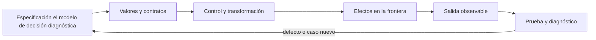

# SE-071 — Taller: transferir una solución entre lenguajes

[← SE-070 — Legibilidad, nombres y mantenimiento básico](https://github.com/vladimiracunadev-create/modern-software-engineering-program/blob/main/classes/part-05-fundamentos-de-programacion/se-070-legibilidad-nombres-y-mantenimiento-basico/README.md) · [↑ Parte 05](https://github.com/vladimiracunadev-create/modern-software-engineering-program/blob/main/classes/part-05-fundamentos-de-programacion/README.md) · [📚 Índice completo](https://github.com/vladimiracunadev-create/modern-software-engineering-program/blob/main/classes/README.md) · [🌐 Portal](https://vladimiracunadev-create.github.io/modern-software-engineering-program/classes/SE-071.html) · [SE-072 — Proyecto: herramienta de línea de comandos probada →](https://github.com/vladimiracunadev-create/modern-software-engineering-program/blob/main/classes/part-05-fundamentos-de-programacion/se-072-proyecto-herramienta-de-linea-de-comandos-probada/README.md)


## Punto profesional y fundamento pedagógico

**Punto profesional.** La clase existe para transferir una solución entre lenguajes preservando contrato y haciendo visibles diferencias semánticas.

**Por qué aparece aquí.** Se sitúa después de **Legibilidad, nombres y mantenimiento básico** y antes de **Proyecto: herramienta de línea de comandos probada**: convierte el conocimiento anterior en una decisión observable que la clase siguiente podrá reutilizar. La continuidad se comprueba en el artefacto, no por compartir vocabulario.

**Error conceptual que debe corregir.** Traducir sintaxis y declarar equivalencia.

**Secuencia de aprendizaje.** Antes de leer la solución, el estudiante predice el resultado del caso normal y del error conceptual anterior. Luego explica un caso resuelto paso a paso, construye un contraejemplo que cambie la decisión y, sin consultar el texto, reconstruye el mecanismo y lo aplica a una entrada nueva. La secuencia usa predicción, explicación propia, contraste y recuperación. [ICAP](https://icap.education.asu.edu/research) distingue participación de construcción de conocimiento; [How People Learn II](https://nap.nationalacademies.org/catalog/24783/how-people-learn-ii-learners-contexts-and-cultures) exige conectar conocimiento previo, contexto y transferencia; la [práctica de recuperación](https://pubmed.ncbi.nlm.nih.gov/16507066/) respalda producir de nuevo la explicación tras una demora; y [Education for Life and Work](https://nap.nationalacademies.org/resource/13398/dbasse_084153.pdf) exige devolución que explique la causa del error.

**Evidencia de aprendizaje.** Semantic-contrast.md con ausencia, error, mutabilidad, orden y pruebas comunes. Debe contener predicción previa, observación, explicación causal, contraejemplo, criterio de aceptación y una nota de qué dato haría cambiar la conclusión.

**Límite de la conclusión.** Una comparación de dos lenguajes no establece superioridad general.

### Trazabilidad fuente → afirmación

| Fuente primaria u oficial | Afirmación que respalda | Lo que no prueba |
|---|---|---|
| [The Rust Programming Language](https://doc.rust-lang.org/stable/book/) | documenta ownership, tipos de error, traits y concurrencia usados como contraste semántico | No demuestra por sí sola que el artefacto del estudiante sea correcto. |
| [Python Tutorial](https://docs.python.org/3/tutorial/) | define la semántica y los límites de la API de Python utilizada en el experimento | No demuestra por sí sola que el artefacto del estudiante sea correcto. |
| [Python `unittest` documentation](https://docs.python.org/3/library/unittest.html) | define la semántica y los límites de la API de Python utilizada en el experimento | No demuestra por sí sola que el artefacto del estudiante sea correcto. |

## Antes de empezar

Esta clase construye la **CLI diagnóstica**, implementación incremental de la especificación del modelo de decisión diagnóstica. Recupera `SE-070` y convierte una regla ya modelada en comportamiento ejecutable o comprobable. Trabaja en cambios pequeños: predicción, código, ejecución, evidencia y explicación. Ejecutar sin poder explicar el resultado no completa la práctica.

## Prerrequisitos

- Python 3.11 o posterior disponible como `python` o `python3`; registra la versión real.
- Terminal, editor de texto y Git; no se requieren paquetes externos.
- Comprender el contrato del modelo de decisión diagnóstica: entradas, resultados, errores e invariantes.

## Problema auténtico

El taller traslada `choose_next` de Python a Rust. Una traducción línea por línea ignora ownership, `Option`, `Result`, iteradores y tipos; una reescritura libre puede cambiar empate y errores. La transferencia debe preservar contrato y pruebas mientras adopta mecanismos idiomáticos.

## Objetivos observables

Al terminar podrás explicar el mecanismo del lenguaje, predecir una ejecución, implementar un caso normal y sus fronteras, diagnosticar un fallo controlado, proteger el comportamiento con evidencia y separar lo transferible de lo específico de Python.

## Mapa conceptual



El código no reemplaza la especificación: la materializa bajo reglas concretas del lenguaje y del entorno. La pregunta de esta clase es: **¿Qué pertenece al problema y qué pertenecía accidentalmente al lenguaje?**

## Temas y por qué importan

| Lente | Pregunta | Evidencia |
|---|---|---|
| valor | ¿qué representa y qué tipo tiene? | ejemplo inspeccionable |
| control | ¿qué camino o repetición ocurre? | traza de estados |
| contrato | ¿qué acepta, retorna y rechaza? | casos frontera |
| efecto | ¿qué cambia fuera del cálculo? | archivo o stream controlado |
| mantenimiento | ¿cómo se detecta una regresión? | prueba y diff enfocado |

## Conceptos y decisiones

### 1. Semántica antes que sintaxis

Primero se congela entrada, salida, orden de empate, errores y casos. Luego se busca una representación equivalente. `None` puede mapear a `Option`; excepción recuperable a `Result`; dict heterogéneo a struct. La equivalencia se juzga por comportamiento, no por parecido textual.

### 2. Tipos y estados representables

Python permite estructuras incompletas hasta validarlas en ejecución. Rust puede usar enum para resultados y struct para registros, haciendo imposibles combinaciones. Ese beneficio exige decidir ownership y conversiones en fronteras.

### 3. Mutabilidad y ownership

En Python varios nombres pueden referir al mismo objeto mutable. Rust controla préstamos y movimiento en compilación. Copiar listas para silenciar el compilador puede ser costoso; se elige préstamo cuando la función solo lee y ownership cuando debe conservar o transformar.

### 4. Iteradores y control

Una comprensión Python y una cadena de iteradores Rust pueden expresar filtrar y mínimo. La versión idiomática sigue siendo legible si cada etapa representa una regla. No se comprime el código hasta perder el lugar de validación o el criterio de desempate.

### 5. Pruebas comunes

Un fixture JSON válido para ambos lenguajes y una tabla de resultados forman el oráculo compartido. Se comparan salida normalizada y errores de contrato. Diferencias de formato de traceback o mensaje interno no deben congelarse como equivalencia.

## Definiciones de trabajo

- **semántica:** comportamiento y significado observable.
- **idiomático:** alineado con convenciones y mecanismos del lenguaje.
- **ownership:** reglas sobre posesión y vida de valores en Rust.
- **Option:** tipo Rust para presencia o ausencia.
- **equivalencia funcional:** mismo resultado contractual para casos compartidos.

Estas definiciones describen el uso concreto en la CLI diagnóstica. Cuando Python permita varias conductas, el contrato del programa elige una y la hace visible con validación y pruebas.

## Ejemplo mínimo

```python
# Python
def choose_next(tests, authorized):
    eligible = (t for t in tests if t["id"] in authorized)
    return min(eligible, key=lambda t: (t["cost"], t["id"]), default=None)

// Rust: la firma hace explícita la ausencia
fn choose_next<'a>(tests: &'a [Test], authorized: &HashSet<String>) -> Option<&'a Test>
```

Define tres fixtures compartidos: sin elegibles, un elegible y empate. Escribe la firma Python y Rust y explica cómo se representa ausencia, lectura y error inválido.

Ejecuta el fragmento en un archivo, no solo en una conversación interactiva. Conserva comando, versión, salida y explicación de cada línea relevante.

## Ejemplo profesional

El taller ejecuta el mismo archivo de casos en ambas implementaciones y compara JSON canónico. Un documento separa equivalencia funcional, diferencias de tipos, costo y experiencia de mantenimiento. No declara un lenguaje ganador universal.

El criterio profesional es que el comportamiento pueda ser consumido, diagnosticado y cambiado sin depender de conocimiento oral ni de estado oculto.

## Práctica guiada

1. congela contrato y fixtures.
2. identifica rasgos Python accidentales.
3. diseña tipos Rust.
4. implementa o bosqueja versión idiomática.
5. compara resultados y límites.
6. ejecuta `python -m unittest -v` cuando existan pruebas y registra el resultado exacto.

## Ejercicios

1. **Lectura:** predice valor, tipo, rama o efecto de un fragmento antes de ejecutarlo.
2. **Construcción:** añade un caso de la CLI diagnóstica siguiendo el contrato, sin mezclar I/O y cálculo.
3. **Frontera:** incorpora vacío, límite, inválido y error recuperable.
4. **Transferencia:** escribe pseudocódigo o una versión equivalente en otro lenguaje y señala diferencias.

## Reto verificable

Entrega un cambio que incluya comportamiento, caso normal, caso límite, fallo controlado y explicación. Otra persona debe poder ejecutar los comandos desde un checkout limpio y relacionar cada salida con una regla del modelo de decisión diagnóstica.

## Demostración guiada

1. Escribe la entrada y la salida esperada antes del código.
2. Ejecuta el caso mínimo y observa valores intermedios sin dejar prints permanentes en el núcleo.
3. Añade el caso frontera que obligue a decidir, no solo a teclear.
4. Introduce el fallo descrito abajo y confirma que la evidencia lo detecta.
5. Corrige, ejecuta toda la suite y revisa el diff por efectos no deseados.

## Preguntas frecuentes

### ¿Que el programa se ejecute significa que está correcto?

No. Solo demuestra que esa ejecución terminó. La corrección se refiere al contrato y requiere cubrir límites, errores y propiedades relevantes.

### ¿Debo memorizar toda la sintaxis?

No. Debes reconocer valores, control, contratos y efectos, y saber consultar la referencia oficial. Copiar sintaxis sin modelo produce defectos difíciles de diagnosticar.

### ¿Las anotaciones de tipo validan JSON?

No por sí solas. Ayudan a lectores y herramientas; los datos externos requieren parseo y validación en ejecución.

## Fallo controlado y diagnóstico

Traduce un dict opcional a struct con campos vacíos para evitar `Option`. Aparece un estado inválido. Rediseña con enum/Option y ajusta la frontera de parseo.

Registra mensaje, traceback cuando corresponda, hipótesis, caso mínimo, corrección y prueba de regresión. No ocultes el fallo con un `except` amplio ni cambies la prueba para aceptar el defecto.

## Errores comunes y cómo corregirlos

| Síntoma | Causa | Corrección |
|---|---|---|
| funciona solo con un dato | ejemplo usado como especificación | particiones y casos frontera |
| `None`, vacío y cero se mezclan | truthiness sin semántica | comparaciones explícitas |
| importar ejecuta trabajo | efectos al nivel del módulo | función `main` y composition root |
| error desaparece | captura demasiado amplia | manejar solo lo recuperable |
| refactor rompe consumidores | pruebas de detalle o contrato implícito | probar interfaz pública |

## Entorno y archivos clave

```text
work/SE-071/
├── diagnostic_cli/
│   ├── __init__.py
│   ├── domain.py
│   ├── cli.py
│   └── __main__.py
├── tests/
│   └── test_diagnostic_cli.py
└── README.md
```

No instales dependencias para resolver lo que cubre la biblioteca estándar. `README.md` conserva versión, comandos, entradas, salida, limpieza y límites. Los fragmentos son pedagógicos; intégralos solo después de entender su contrato.

### Laboratorio integrado de la Parte 05

Compila `ports/diagnostic_core.rs` de [`labs/part-05-diagnostic-cli`](https://github.com/vladimiracunadev-create/modern-software-engineering-program/tree/main/labs/part-05-diagnostic-cli) y ejecútalo contra `contract-cases.tsv`. Compara con Python tipos numéricos, ownership del texto, `HashMap`, errores y código de salida. Las cuatro fixtures deben producir el mismo contrato observable, pero no copies clases ni arquitectura línea por línea. Declara qué quedó fuera del puerto —parser JSON, streaming y empaquetado— para no confundir equivalencia parcial con portabilidad total.

## Seguridad, ética y accesibilidad

- usa fixtures sintéticos y no incluyas tokens, rutas personales ni incidentes reales;
- limita tamaño, profundidad y tiempo de entradas no confiables;
- separa stdout parseable de stderr y redacta datos sensibles;
- ofrece mensajes accionables y no dependas solo de color;
- preserva autorización como regla del núcleo, no como checkbox de UI;
- no uses `eval`, `exec` ni construcción de shell con entrada externa.

## Transferencia

Reimplementa el contrato, no la sintaxis. Identifica cómo el segundo lenguaje representa ausencia, error, mutabilidad y módulos. Conserva fixtures y resultados públicos para detectar una diferencia semántica.

## Evaluación y evidencia

| Criterio | Evidencia para aprobar |
|---|---|
| comprensión | predicción y explicación de ejecución |
| comportamiento | normal, límite e inválido según contrato |
| diseño | cálculo separado de efectos y dependencias visibles |
| diagnóstico | fallo mínimo, causa y regresión |
| reproducibilidad | versión, comandos y salidas desde checkout limpio |


## Fuentes


- [The Rust Programming Language](https://doc.rust-lang.org/stable/book/) — documenta ownership, tipos de error, traits y concurrencia usados como contraste semántico.
- [Python Tutorial](https://docs.python.org/3/tutorial/) — define la semántica y los límites de la API de Python utilizada en el experimento.
- [Python `unittest` documentation](https://docs.python.org/3/library/unittest.html) — define la semántica y los límites de la API de Python utilizada en el experimento.

La documentación oficial define el lenguaje y la biblioteca; no demuestra que la CLI diagnóstica cumpla su dominio. Esa evidencia vive en contratos, pruebas y ejecución reproducible.

## Límites y siguiente paso

El taller no enseña Rust completo ni compara rendimiento con un microbenchmark. El proyecto final integra el recorrido en una CLI Python probada.

## Glosario

- **semántica:** comportamiento y significado observable.
- **idiomático:** alineado con convenciones y mecanismos del lenguaje.
- **ownership:** reglas sobre posesión y vida de valores en Rust.
- **Option:** tipo Rust para presencia o ausencia.
- **equivalencia funcional:** mismo resultado contractual para casos compartidos.

---

[← SE-070 — Legibilidad, nombres y mantenimiento básico](https://github.com/vladimiracunadev-create/modern-software-engineering-program/blob/main/classes/part-05-fundamentos-de-programacion/se-070-legibilidad-nombres-y-mantenimiento-basico/README.md) · [↑ Parte 05](https://github.com/vladimiracunadev-create/modern-software-engineering-program/blob/main/classes/part-05-fundamentos-de-programacion/README.md) · [📚 Índice completo](https://github.com/vladimiracunadev-create/modern-software-engineering-program/blob/main/classes/README.md) · [🌐 Portal](https://vladimiracunadev-create.github.io/modern-software-engineering-program/classes/SE-071.html) · [SE-072 — Proyecto: herramienta de línea de comandos probada →](https://github.com/vladimiracunadev-create/modern-software-engineering-program/blob/main/classes/part-05-fundamentos-de-programacion/se-072-proyecto-herramienta-de-linea-de-comandos-probada/README.md)
