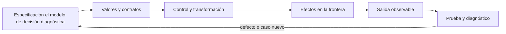

# SE-072 — Proyecto: herramienta de línea de comandos probada

[← SE-071 — Taller: transferir una solución entre lenguajes](https://github.com/vladimiracunadev-create/modern-software-engineering-program/blob/main/classes/part-05-fundamentos-de-programacion/se-071-taller-transferir-una-solucion-entre-lenguajes/README.md) · [↑ Parte 05](https://github.com/vladimiracunadev-create/modern-software-engineering-program/blob/main/classes/part-05-fundamentos-de-programacion/README.md) · [📚 Índice completo](https://github.com/vladimiracunadev-create/modern-software-engineering-program/blob/main/classes/README.md) · [🌐 Portal](https://vladimiracunadev-create.github.io/modern-software-engineering-program/classes/SE-072.html) · [SE-073 — Programación imperativa y estado mutable →](https://github.com/vladimiracunadev-create/modern-software-engineering-program/blob/main/classes/part-06-paradigmas-de-programacion/se-073-programacion-imperativa-y-estado-mutable/README.md)


## Punto profesional y fundamento pedagógico

**Punto profesional.** La clase existe para integrar CLI, validación, archivos, pruebas y diagnóstico en una herramienta reproducible.

**Por qué aparece aquí.** Se sitúa después de **Taller: transferir una solución entre lenguajes** y antes de **Programación imperativa y estado mutable**: convierte el conocimiento anterior en una decisión observable que la clase siguiente podrá reutilizar. La continuidad se comprueba en el artefacto, no por compartir vocabulario.

**Error conceptual que debe corregir.** Aceptar una salida correcta sin contrato de errores ni códigos de retorno.

**Secuencia de aprendizaje.** Antes de leer la solución, el estudiante predice el resultado del caso normal y del error conceptual anterior. Luego explica un caso resuelto paso a paso, construye un contraejemplo que cambie la decisión y, sin consultar el texto, reconstruye el mecanismo y lo aplica a una entrada nueva. La secuencia usa predicción, explicación propia, contraste y recuperación. [ICAP](https://icap.education.asu.edu/research) distingue participación de construcción de conocimiento; [How People Learn II](https://nap.nationalacademies.org/catalog/24783/how-people-learn-ii-learners-contexts-and-cultures) exige conectar conocimiento previo, contexto y transferencia; la [práctica de recuperación](https://pubmed.ncbi.nlm.nih.gov/16507066/) respalda producir de nuevo la explicación tras una demora; y [Education for Life and Work](https://nap.nationalacademies.org/resource/13398/dbasse_084153.pdf) exige devolución que explique la causa del error.

**Evidencia de aprendizaje.** CLI, fixtures, pruebas, help, códigos de salida y ejecución desde checkout limpio. Debe contener predicción previa, observación, explicación causal, contraejemplo, criterio de aceptación y una nota de qué dato haría cambiar la conclusión.

**Límite de la conclusión.** El proyecto no se considera distribuible ni compatible fuera de versiones declaradas.

### Trazabilidad fuente → afirmación

| Fuente primaria u oficial | Afirmación que respalda | Lo que no prueba |
|---|---|---|
| [Python `argparse` documentation](https://docs.python.org/3/library/argparse.html) | define la semántica y los límites de la API de Python utilizada en el experimento | No demuestra por sí sola que el artefacto del estudiante sea correcto. |
| [Python `unittest` documentation](https://docs.python.org/3/library/unittest.html) | define la semántica y los límites de la API de Python utilizada en el experimento | No demuestra por sí sola que el artefacto del estudiante sea correcto. |
| [Python `json` documentation](https://docs.python.org/3/library/json.html) | define la semántica y los límites de la API de Python utilizada en el experimento | No demuestra por sí sola que el artefacto del estudiante sea correcto. |

## Antes de empezar

Esta clase construye la **CLI diagnóstica**, implementación incremental de la especificación del modelo de decisión diagnóstica. Recupera `SE-071` y convierte una regla ya modelada en comportamiento ejecutable o comprobable. Trabaja en cambios pequeños: predicción, código, ejecución, evidencia y explicación. Ejecutar sin poder explicar el resultado no completa la práctica.

## Prerrequisitos

- Python 3.11 o posterior disponible como `python` o `python3`; registra la versión real.
- Terminal, editor de texto y Git; no se requieren paquetes externos.
- Comprender el contrato del modelo de decisión diagnóstica: entradas, resultados, errores e invariantes.

## Problema auténtico

El proyecto entrega la CLI diagnóstica como CLI probada. Lee la especificación del modelo de decisión diagnóstica, selecciona la siguiente prueba autorizada y emite una explicación. Debe comportarse bien con ayuda, entrada inválida, archivos, pipes, cancelación y códigos de salida; un script que funciona solo desde el IDE no alcanza.

## Objetivos observables

Al terminar podrás explicar el mecanismo del lenguaje, predecir una ejecución, implementar un caso normal y sus fronteras, diagnosticar un fallo controlado, proteger el comportamiento con evidencia y separar lo transferible de lo específico de Python.

## Mapa conceptual



El código no reemplaza la especificación: la materializa bajo reglas concretas del lenguaje y del entorno. La pregunta de esta clase es: **¿Puede otra persona instalar, usar, automatizar, diagnosticar y mantener la herramienta?**

## Temas y por qué importan

| Lente | Pregunta | Evidencia |
|---|---|---|
| valor | ¿qué representa y qué tipo tiene? | ejemplo inspeccionable |
| control | ¿qué camino o repetición ocurre? | traza de estados |
| contrato | ¿qué acepta, retorna y rechaza? | casos frontera |
| efecto | ¿qué cambia fuera del cálculo? | archivo o stream controlado |
| mantenimiento | ¿cómo se detecta una regresión? | prueba y diff enfocado |

## Conceptos y decisiones

### 1. Contrato CLI

Nombre, subcomandos, opciones, stdin/stdout/stderr y códigos de salida son interfaz pública. `--help` incluye propósito y ejemplos; argumentos inválidos fallan antes de modificar estado. La salida humana y JSON se seleccionan explícitamente.

### 2. Arquitectura de la CLI diagnóstica

`domain.py` conserva reglas puras; `json_io.py` valida frontera; `cli.py` traduce argumentos y errores; `__main__.py` compone. El núcleo no conoce terminal ni rutas. Esa separación permite usarlo después como biblioteca.

### 3. Validación y seguridad

Se limita tamaño, cantidad y profundidad; rutas se tratan como datos y no se concatenan en shell. Los mensajes redactan contenido sensible. La herramienta no ejecuta la prueba recomendada: produce un plan para revisión humana, manteniendo autorización como invariante.

### 4. Pruebas de consumidor

Las unitarias cubren dominio; integración ejecuta `python -m diagnostic_cli` con archivos temporales y captura streams/códigos. Casos incluyen ayuda, normal, sin elegibles, JSON malformado, duplicado, permiso simulado y salida existente.

### 5. Entrega y operación

README declara Python soportado, ejecución, formatos, ejemplos, limitaciones y limpieza. Una versión se identifica en `--version`. El proyecto no afirma paquete publicado si solo vive en repositorio. La demostración incluye caso sano, fallo y recuperación.

## Definiciones de trabajo

- **CLI:** interfaz consumida mediante argumentos y streams.
- **código de salida:** entero que comunica resultado al proceso llamador.
- **stdout:** stream de resultado normal.
- **stderr:** stream de diagnóstico.
- **dry-run:** modo que valida y explica sin aplicar efectos.

Estas definiciones describen el uso concreto en la CLI diagnóstica. Cuando Python permita varias conductas, el contrato del programa elige una y la hace visible con validación y pruebas.

## Ejemplo mínimo

```python
# diagnostic_cli/cli.py
import argparse

def parser() -> argparse.ArgumentParser:
    value = argparse.ArgumentParser(prog="diagnostic_cli", description="Choose the next authorized diagnostic test")
    value.add_argument("--input", required=True)
    value.add_argument("--format", choices=("text", "json"), default="text")
    return value

def main(argv=None) -> int:
    args = parser().parse_args(argv)
    # load → validate → choose → present
    return 0
```

Define la matriz comando/entrada/salida/código para ayuda, ejecución válida, sin opción elegible, archivo ausente y JSON inválido. Automatiza al menos esos cinco casos.

Ejecuta el fragmento en un archivo, no solo en una conversación interactiva. Conserva comando, versión, salida y explicación de cada línea relevante.

## Ejemplo profesional

La CLI diagnóstica acepta un paquete del modelo de decisión diagnóstica, genera recomendación y explica cobertura/costo. `--dry-run` valida sin escribir; JSON va a stdout y diagnóstico a stderr. La entrega incluye 12+ pruebas, fixtures pequeños, README y evidencia reproducible en Windows y Unix o una matriz honesta de lo no ejecutado.

El criterio profesional es que el comportamiento pueda ser consumido, diagnosticado y cambiado sin depender de conocimiento oral ni de estado oculto.

## Práctica guiada

1. congela contrato CLI.
2. implementa núcleo y adaptadores.
3. añade límites y códigos.
4. prueba como proceso consumidor.
5. ejecuta caso sano, fallo y recuperación.
6. entrega a una persona sin contexto.
7. ejecuta `python -m unittest -v` cuando existan pruebas y registra el resultado exacto.

## Ejercicios

1. **Lectura:** predice valor, tipo, rama o efecto de un fragmento antes de ejecutarlo.
2. **Construcción:** añade un caso de la CLI diagnóstica siguiendo el contrato, sin mezclar I/O y cálculo.
3. **Frontera:** incorpora vacío, límite, inválido y error recuperable.
4. **Transferencia:** escribe pseudocódigo o una versión equivalente en otro lenguaje y señala diferencias.

## Reto verificable

Entrega un cambio que incluya comportamiento, caso normal, caso límite, fallo controlado y explicación. Otra persona debe poder ejecutar los comandos desde un checkout limpio y relacionar cada salida con una regla del modelo de decisión diagnóstica.

## Demostración guiada

1. Escribe la entrada y la salida esperada antes del código.
2. Ejecuta el caso mínimo y observa valores intermedios sin dejar prints permanentes en el núcleo.
3. Añade el caso frontera que obligue a decidir, no solo a teclear.
4. Introduce el fallo descrito abajo y confirma que la evidencia lo detecta.
5. Corrige, ejecuta toda la suite y revisa el diff por efectos no deseados.

## Preguntas frecuentes

### ¿Que el programa se ejecute significa que está correcto?

No. Solo demuestra que esa ejecución terminó. La corrección se refiere al contrato y requiere cubrir límites, errores y propiedades relevantes.

### ¿Debo memorizar toda la sintaxis?

No. Debes reconocer valores, control, contratos y efectos, y saber consultar la referencia oficial. Copiar sintaxis sin modelo produce defectos difíciles de diagnosticar.

### ¿Las anotaciones de tipo validan JSON?

No por sí solas. Ayudan a lectores y herramientas; los datos externos requieren parseo y validación en ejecución.

## Fallo controlado y diagnóstico

Haz que la CLI imprima un traceback y retorne 0 ante JSON inválido. Añade traducción de frontera, mensaje accionable en stderr y código no cero; conserva traceback solo bajo `--debug`.

Registra mensaje, traceback cuando corresponda, hipótesis, caso mínimo, corrección y prueba de regresión. No ocultes el fallo con un `except` amplio ni cambies la prueba para aceptar el defecto.

## Errores comunes y cómo corregirlos

| Síntoma | Causa | Corrección |
|---|---|---|
| funciona solo con un dato | ejemplo usado como especificación | particiones y casos frontera |
| `None`, vacío y cero se mezclan | truthiness sin semántica | comparaciones explícitas |
| importar ejecuta trabajo | efectos al nivel del módulo | función `main` y composition root |
| error desaparece | captura demasiado amplia | manejar solo lo recuperable |
| refactor rompe consumidores | pruebas de detalle o contrato implícito | probar interfaz pública |

## Entorno y archivos clave

```text
work/SE-072/
├── diagnostic_cli/
│   ├── __init__.py
│   ├── domain.py
│   ├── cli.py
│   └── __main__.py
├── tests/
│   └── test_diagnostic_cli.py
└── README.md
```

No instales dependencias para resolver lo que cubre la biblioteca estándar. `README.md` conserva versión, comandos, entradas, salida, limpieza y límites. Los fragmentos son pedagógicos; intégralos solo después de entender su contrato.

## Seguridad, ética y accesibilidad

- usa fixtures sintéticos y no incluyas tokens, rutas personales ni incidentes reales;
- limita tamaño, profundidad y tiempo de entradas no confiables;
- separa stdout parseable de stderr y redacta datos sensibles;
- ofrece mensajes accionables y no dependas solo de color;
- preserva autorización como regla del núcleo, no como checkbox de UI;
- no uses `eval`, `exec` ni construcción de shell con entrada externa.

## Transferencia

Reimplementa el contrato, no la sintaxis. Identifica cómo el segundo lenguaje representa ausencia, error, mutabilidad y módulos. Conserva fixtures y resultados públicos para detectar una diferencia semántica.

## Evaluación y evidencia

| Criterio | Evidencia para aprobar |
|---|---|
| comprensión | predicción y explicación de ejecución |
| comportamiento | normal, límite e inválido según contrato |
| diseño | cálculo separado de efectos y dependencias visibles |
| diagnóstico | fallo mínimo, causa y regresión |
| reproducibilidad | versión, comandos y salidas desde checkout limpio |


## Fuentes


- [Python `argparse` documentation](https://docs.python.org/3/library/argparse.html) — define la semántica y los límites de la API de Python utilizada en el experimento.
- [Python `unittest` documentation](https://docs.python.org/3/library/unittest.html) — define la semántica y los límites de la API de Python utilizada en el experimento.
- [Python `json` documentation](https://docs.python.org/3/library/json.html) — define la semántica y los límites de la API de Python utilizada en el experimento.
- [Python `pathlib` documentation](https://docs.python.org/3/library/pathlib.html) — define la semántica y los límites de la API de Python utilizada en el experimento.
- [SWEBOK Guide v4.0a](https://www.computer.org/education/bodies-of-knowledge/software-engineering) — sitúa la decisión dentro de construcción, diseño, pruebas y práctica profesional de ingeniería de software.

La documentación oficial define el lenguaje y la biblioteca; no demuestra que la CLI diagnóstica cumpla su dominio. Esa evidencia vive en contratos, pruebas y ejecución reproducible.

## Límites y siguiente paso

El proyecto demuestra fundamentos y un contrato local; no publica paquete, no ejecuta diagnósticos reales ni certifica seguridad productiva. La Parte 6 comparará paradigmas para evolucionar el mismo comportamiento.

## Glosario

- **CLI:** interfaz consumida mediante argumentos y streams.
- **código de salida:** entero que comunica resultado al proceso llamador.
- **stdout:** stream de resultado normal.
- **stderr:** stream de diagnóstico.
- **dry-run:** modo que valida y explica sin aplicar efectos.

---

[← SE-071 — Taller: transferir una solución entre lenguajes](https://github.com/vladimiracunadev-create/modern-software-engineering-program/blob/main/classes/part-05-fundamentos-de-programacion/se-071-taller-transferir-una-solucion-entre-lenguajes/README.md) · [↑ Parte 05](https://github.com/vladimiracunadev-create/modern-software-engineering-program/blob/main/classes/part-05-fundamentos-de-programacion/README.md) · [📚 Índice completo](https://github.com/vladimiracunadev-create/modern-software-engineering-program/blob/main/classes/README.md) · [🌐 Portal](https://vladimiracunadev-create.github.io/modern-software-engineering-program/classes/SE-072.html) · [SE-073 — Programación imperativa y estado mutable →](https://github.com/vladimiracunadev-create/modern-software-engineering-program/blob/main/classes/part-06-paradigmas-de-programacion/se-073-programacion-imperativa-y-estado-mutable/README.md)
