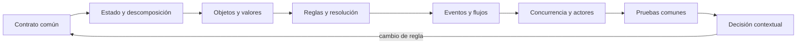

# Parte 06 — Paradigmas de programación

La CLI diagnóstica ya ejecuta una regla, pero una única implementación puede ocultar decisiones accidentales del lenguaje. El motor de reglas comparado toma el mismo dominio —seleccionar la siguiente prueba autorizada— y lo expresa con modelos distintos. La comparación no premia el código más corto: exige equivalencia observable, límites explícitos y una explicación de qué cambio futuro facilita o dificulta cada representación.

## Pregunta rectora

> ¿Qué paradigma hace visibles el estado, las reglas y los efectos de una decisión sin deformar el problema?

## Antes del recorrido clase por clase

Esta parte no presenta paradigmas como etiquetas ni como una competencia de sintaxis. Cada clase vuelve sobre **motor de reglas comparado**, mantiene un contrato común y cambia deliberadamente el modelo de estado, control, composición o tiempo. Así puede distinguirse una diferencia semántica de una diferencia accidental del lenguaje.

El diagrama muestra la progresión del razonamiento, no una arquitectura recomendada. Las pruebas comunes impiden declarar equivalencia por parecido visual; el retorno obliga a revalidar cuando cambia el contrato.

## Resultados acumulativos

Podrás reconocer dónde vive el estado, quién controla la secuencia, cómo se componen transformaciones y qué forma adopta un fallo en modelos imperativos, procedurales, orientados a objetos, funcionales, declarativos, lógicos, orientados a eventos, reactivos y de actores.

Al finalizar podrás justificar una combinación, señalar adaptadores y pérdidas, y rechazar una elección que no se sostenga ante casos límite o costo operativo.

## Prerrequisitos enlazados

- [Parte 4 — Pensamiento computacional](https://github.com/vladimiracunadev-create/modern-software-engineering-program/blob/main/classes/part-04-pensamiento-computacional-y-resolucion-de-problemas/): modelado, invariantes, corrección y complejidad.
- [Parte 5 — Fundamentos de programación](https://github.com/vladimiracunadev-create/modern-software-engineering-program/blob/main/classes/part-05-fundamentos-de-programacion/): valores, control, funciones, errores, pruebas y la CLI diagnóstica.
- Python 3.11+, Git y terminal; runtimes adicionales son opcionales y deben declararse.

## Bloques y progresión

1. **Estado y descomposición:** las clases 73–76 localizan mutación, contratos, identidad y composición.
2. **Reglas y resolución:** las clases 77–78 separan descripción, reglas, unificación y búsqueda.
3. **Tiempo, eventos y concurrencia:** las clases 79–81 introducen orden temporal, presión, cancelación y aislamiento.
4. **Comparación y transferencia:** las clases 82–84 comparan, ensayan y justifican una decisión contextual.

## Guía razonada clase por clase

El motor de reglas comparado mantiene una regla, un corpus y un contrato observables para que la comparación
sea justa. Cada clase cambia dónde vive el estado, quién controla el flujo o cómo se
expresan efectos y fallos; después obliga a explicar la consecuencia y entrega evidencia
que la implementación siguiente debe conservar.

### Bloque 1 — Estado, descomposición, identidad y valores

#### SE-073 — Programación imperativa y estado mutable

El motor de reglas comparado comienza como una secuencia de comandos que actualiza prioridad, autorización y
siguiente prueba. La clase hace visible el tiempo: asignación, aliasing y retorno
temprano pueden dejar un estado intermedio que otro paso observa. Mutar no es el defecto;
el problema es no declarar propietario, vida útil e invariante.

El estudiante traza cada transición y provoca un fallo por orden de actualización. La
evidencia registra estado inicial, comando, estado final y regla violada. `SE-074`
conserva esa semántica, pero divide la secuencia en procedimientos con contratos para
reducir el espacio de razonamiento.

#### SE-074 — Programación procedural y descomposición funcional

Extraer funciones al azar puede ocultar dependencias en globales y producir un programa
fragmentado, no modular. La clase descompone por transformación coherente, define
entradas, salidas y efectos, y distingue coordinación de cálculo. El orden sigue siendo
imperativo, pero cada paso gana una frontera verificable.

El motor de reglas comparado separa validación, puntuación, autorización y selección; las pruebas sustituyen
una etapa y observan su contrato. El estudiante compara cohesión y acoplamiento antes y
después. Cuando los datos poseen identidad y deben proteger invariantes durante varias
operaciones, `SE-075` evalúa encapsulación y mensajes.

#### SE-075 — Orientación a objetos, mensajes y encapsulación

Una clase sintáctica no garantiza encapsulación. La lección pregunta qué entidad conserva
identidad, qué comportamiento puede modificarla y qué representación debe quedar oculta.
Herencia no se presenta como reutilización gratuita: puede acoplar invariantes y romper
sustituibilidad.

El motor de reglas comparado modela casos y política como colaboradores, prueba mensajes y evita exponer
colecciones mutables. El estudiante compara composición con herencia y construye un
contraejemplo de objeto anémico. `SE-076` elimina identidad accidental para observar la
misma regla como composición de valores y efectos aislados.

#### SE-076 — Programación funcional, composición e inmutabilidad

Expresar la decisión como transformación permite razonar con entrada y salida, pero una
aplicación real todavía lee, escribe y falla. La clase trabaja funciones puras,
inmutabilidad, funciones de orden superior y composición, y ubica efectos en fronteras
en lugar de negar su existencia.

El motor de reglas comparado produce una nueva decisión sin modificar el caso original y usa propiedades para
comprobar determinismo e idempotencia donde corresponden. Se mide también el costo de
copias y estructuras. `SE-077` eleva el nivel: declara relaciones y deja que otro
mecanismo elija el orden de ejecución.

### Bloque 2 — Declarar relaciones y hacer visible la búsqueda

#### SE-077 — Programación declarativa y basada en reglas

Una regla declara qué condiciones sostienen una conclusión; un motor decide cómo
evaluarla. La clase separa semántica declarada de estrategia operacional, estudia
prioridad, conflicto y explicación, y muestra que escribir condiciones como datos no
elimina orden, costo ni ambigüedad.

El motor de reglas comparado externaliza reglas de elegibilidad y conserva la traza de cuál se activó. El
estudiante prueba solapamiento, ausencia y actualización de reglas. `SE-078` profundiza
la separación mediante hechos, variables, unificación y resolución, donde una consulta
puede producir varias respuestas.

#### SE-078 — Programación lógica y resolución

La programación lógica formula relaciones y deja que un motor unifique términos y
explore alternativas. La clase explica hechos, reglas, variables, sustituciones,
backtracking y el efecto operacional del orden; una consulta que termina en un corpus
pequeño puede divergir al reordenar reglas o ampliar datos.

El estudiante expresa autorización y dependencia del motor de reglas comparado, sigue un árbol de resolución
y limita una búsqueda recursiva. La evidencia distingue verdad lógica de comportamiento
del motor. `SE-079` cambia el origen del control: la decisión ya no empieza por una
llamada directa, sino por eventos que llegan en el tiempo.

### Bloque 3 — Tiempo, flujos y concurrencia

#### SE-079 — Programación orientada a eventos

Cuando el flujo lo inicia un evento externo, orden, duplicación y entrega tardía pasan a
ser parte del dominio. La clase diferencia evento de comando y estado, diseña handlers
pequeños y observa colas, correlación y reentrada. Publicar no garantiza que alguien
procese ni que lo haga una sola vez.

El motor de reglas comparado reacciona a observación añadida, autorización revocada y tiempo agotado. El
estudiante reproduce un evento duplicado y conserva causalidad mediante identificadores
e idempotencia. `SE-080` representa la secuencia completa como flujo con terminación,
error, cancelación y diferencia de ritmos.

#### SE-080 — Programación reactiva y flujos

Un flujo puede emitir cero, uno o muchos valores y luego completar o fallar. La clase
explica operadores como transformaciones, suscripción, evaluación diferida, presión y
cancelación. Una cadena compacta puede ocultar dónde se perdió un evento o qué scheduler
introdujo concurrencia.

El motor de reglas comparado filtra observaciones autorizadas, calcula prioridades y cancela al vencer el
presupuesto. El estudiante usa pruebas temporales y reproduce un consumidor lento. Si
varias unidades deben conservar estado independiente mientras procesan mensajes,
`SE-081` introduce actores y supervisión.

#### SE-081 — Programación concurrente y actores

Un actor encapsula estado y procesa mensajes según el modelo del runtime; eso evita
memoria mutable compartida directa, pero no elimina carreras lógicas, buzones crecientes
ni fallos distribuidos. La clase distingue concurrencia de paralelismo y estudia
ordenamiento, supervisión, enlaces y reinicio.

El motor de reglas comparado asigna un actor por caso y otro para política. El estudiante provoca mensajes
fuera de orden y caída de un actor, luego observa recuperación y pérdida posible. La
comparación revela fuerzas incompatibles que `SE-082` debe combinar sin crear una
arquitectura de paradigmas ornamentales.

### Bloque 4 — Elegir, comparar y transferir

#### SE-082 — Selección y combinación responsable de paradigmas

No existe un paradigma ganador fuera de una carga y un equipo. La clase construye una
matriz de fuerzas: cambio dominante, estado, tiempo, explicabilidad, fallos, ecosistema y
costo de integración. Combinar modelos añade adaptadores y pérdidas semánticas que deben
ser más baratos que el problema resuelto.

El estudiante propone dos arquitecturas del motor de reglas comparado, identifica fronteras y define una
condición que haría revertir la elección. La decisión se sostiene con el corpus común,
no con preferencia personal. `SE-083` somete cinco modelos a la misma regla y a una
revisión cruzada.

#### SE-083 — Taller: una regla de negocio en cinco paradigmas

El taller implementa una regla de selección en versiones imperativa, orientada a
objetos, funcional, basada en reglas y orientada a eventos. Antes de comparar, fija
entrada, salida, errores, casos límite y observabilidad; de otro modo cada versión
resolvería un problema distinto.

Las pruebas comunes detectan equivalencia y las trazas revelan estado, control y efectos.
El estudiante introduce un cambio y registra qué representación localiza o dispersa la
modificación. `SE-084` amplía el experimento y convierte la comparación en una decisión
reproducible, con límites declarados.

#### SE-084 — Proyecto: comparación semántica con pruebas comunes

El proyecto entrega al menos dos implementaciones completas del motor de reglas comparado junto a contrato,
corpus, propiedades, trazas y entorno. No se puntúa cantidad de paradigmas: se evalúa si
la comparación distingue semántica, lenguaje, runtime y experiencia del equipo.

La aceptación cubre éxito, inválido, empate, repetición, secuencia y cancelación, y exige
una recomendación distinta para dos escenarios de cambio. Se declara qué se ejecutó y
qué solo se razonó. La Parte 7 conservará el contrato y preguntará qué representación de
datos sostiene su carga con costos aceptables.

## Resumen operativo del recorrido

| Clase | Capacidad que construye | Pregunta que resuelve | Evidencia acumulativa |
|---|---|---|---|
| [SE-073](https://github.com/vladimiracunadev-create/modern-software-engineering-program/blob/main/classes/part-06-paradigmas-de-programacion/se-073-programacion-imperativa-y-estado-mutable/) | Programación imperativa y estado mutable | ¿Cómo cambia una decisión cuando el estado se modifica paso a paso? | Traza de transiciones e invariante roto |
| [SE-074](https://github.com/vladimiracunadev-create/modern-software-engineering-program/blob/main/classes/part-06-paradigmas-de-programacion/se-074-programacion-procedural-y-descomposicion-funcional/) | Programación procedural y descomposición funcional | ¿Dónde cortar un procedimiento para que cada paso tenga un contrato comprobable? | Mapa de procedimientos, contratos y efectos |
| [SE-075](https://github.com/vladimiracunadev-create/modern-software-engineering-program/blob/main/classes/part-06-paradigmas-de-programacion/se-075-orientacion-a-objetos-mensajes-y-encapsulacion/) | Orientación a objetos, mensajes y encapsulación | ¿Cuándo una identidad con comportamiento protege mejor una invariante que un conjunto de funciones? | Modelo de objetos y prueba de encapsulación |
| [SE-076](https://github.com/vladimiracunadev-create/modern-software-engineering-program/blob/main/classes/part-06-paradigmas-de-programacion/se-076-programacion-funcional-composicion-e-inmutabilidad/) | Programación funcional, composición e inmutabilidad | ¿Qué se gana al expresar la decisión como transformación de valores sin efectos ocultos? | Pipeline puro, propiedades y frontera de efectos |
| [SE-077](https://github.com/vladimiracunadev-create/modern-software-engineering-program/blob/main/classes/part-06-paradigmas-de-programacion/se-077-programacion-declarativa-y-basada-en-reglas/) | Programación declarativa y basada en reglas | ¿Qué significa declarar una relación sin fijar todos los pasos para obtenerla? | Reglas, conflictos y traza de activación |
| [SE-078](https://github.com/vladimiracunadev-create/modern-software-engineering-program/blob/main/classes/part-06-paradigmas-de-programacion/se-078-programacion-logica-y-resolucion/) | Programación lógica y resolución | ¿Cómo produce respuestas un motor lógico a partir de relaciones, variables y búsqueda? | Consulta, unificación y árbol de resolución |
| [SE-079](https://github.com/vladimiracunadev-create/modern-software-engineering-program/blob/main/classes/part-06-paradigmas-de-programacion/se-079-programacion-orientada-a-eventos/) | Programación orientada a eventos | ¿Cómo conservar causalidad y control cuando el flujo lo inicia un evento externo? | Registro causal y manejo de duplicados |
| [SE-080](https://github.com/vladimiracunadev-create/modern-software-engineering-program/blob/main/classes/part-06-paradigmas-de-programacion/se-080-programacion-reactiva-y-flujos/) | Programación reactiva y flujos | ¿Cómo modelar un flujo que produce cero, uno o muchos valores y también termina o falla? | Flujo probado con error, presión y cancelación |
| [SE-081](https://github.com/vladimiracunadev-create/modern-software-engineering-program/blob/main/classes/part-06-paradigmas-de-programacion/se-081-programacion-concurrente-y-actores/) | Programación concurrente y actores | ¿Qué garantías ofrece aislar estado por actor y comunicarse mediante mensajes? | Actores, buzones y recuperación supervisada |
| [SE-082](https://github.com/vladimiracunadev-create/modern-software-engineering-program/blob/main/classes/part-06-paradigmas-de-programacion/se-082-seleccion-y-combinacion-responsable-de-paradigmas/) | Selección y combinación responsable de paradigmas | ¿Cómo elegir y combinar paradigmas a partir de fuerzas del problema y evidencia? | Matriz de fuerzas y condición de reversión |
| [SE-083](https://github.com/vladimiracunadev-create/modern-software-engineering-program/blob/main/classes/part-06-paradigmas-de-programacion/se-083-taller-una-regla-de-negocio-en-cinco-paradigmas/) | Taller: una regla de negocio en cinco paradigmas | ¿Qué diferencias reales aparecen al implementar la misma regla en cinco modelos? | Cinco implementaciones y pruebas contractuales |
| [SE-084](https://github.com/vladimiracunadev-create/modern-software-engineering-program/blob/main/classes/part-06-paradigmas-de-programacion/se-084-proyecto-comparacion-semantica-con-pruebas-comunes/) | Proyecto: comparación semántica con pruebas comunes | ¿Cómo sostener una comparación semántica reproducible sin declarar un ganador universal? | Corpus, trazas e informe de decisión contextual |

## Proyecto integrador

El proyecto **SE-084** entrega un corpus versionado, al menos dos implementaciones ejecutables, pruebas contractuales compartidas, propiedades, trazas comparables y un informe de decisión para dos cargas distintas. No existe un ganador universal: la recomendación debe vincular fuerzas, evidencia, consecuencias y condición de reversión.

## Criterios de salida

- las doce clases explican todos sus temas mediante mecanismos, ejemplos y límites;
- cada implementación conserva autorización, explicación y errores del contrato;
- el corpus cubre normal, límite, inválido, empate, repetición y secuencia;
- las métricas separan lenguaje, runtime, paradigma y entorno;
- otra persona reproduce comandos y resultados desde checkout limpio;
- el informe declara lo observado, lo inferido y lo no ejecutado.

## Preguntas de control por bloque

- ¿Dónde vive el estado y quién puede cambiarlo?
- ¿Qué estrategia ejecuta una descripción declarativa o una consulta lógica?
- ¿Qué ocurre cuando productor, consumidor y cancelación avanzan a ritmos distintos?
- ¿Qué evidencia cambiaría la elección de paradigma?

## Fuentes de la parte

- [Python Language Reference](https://docs.python.org/3/reference/) — semántica de sentencias, funciones, clases, generadores y corrutinas; autoridad: Python Software Foundation.
- [The Rust Programming Language](https://doc.rust-lang.org/stable/book/) — ownership, enums, traits, errores y concurrencia sin carreras de datos; autoridad: Rust project.
- [SWI-Prolog Reference Manual](https://www.swi-prolog.org/pldoc/man?section=intro) — hechos, reglas, unificación, búsqueda y límites operacionales; autoridad: SWI-Prolog project.
- [ReactiveX Observable Contract](https://reactivex.io/documentation/contract.html) — notificaciones, terminación, errores y control de flujo observable; autoridad: ReactiveX project.
- [Erlang System Documentation: Processes](https://www.erlang.org/doc/system/ref_man_processes.html) — procesos, buzones, envío de mensajes, enlaces y monitores; autoridad: Erlang/OTP project.
- [SWEBOK Guide v4.0a](https://www.computer.org/education/bodies-of-knowledge/software-engineering) — construcción, diseño y fundamentos profesionales; autoridad: IEEE Computer Society.

Las fuentes se vinculan también dentro de cada clase. Definen semántica y mecanismos; la adecuación del motor de reglas comparado se demuestra con el caso, las pruebas y la comparación.
