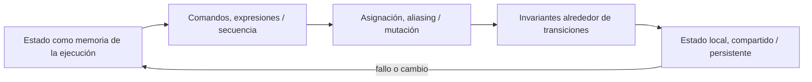

# SE-073 — Programación imperativa y estado mutable

[← SE-072 — Proyecto: herramienta de línea de comandos probada](https://github.com/vladimiracunadev-create/software-engineering-learning-suite/blob/main/classes/part-05-fundamentos-de-programacion/se-072-proyecto-herramienta-de-linea-de-comandos-probada/README.md) · [↑ Parte 06](https://github.com/vladimiracunadev-create/software-engineering-learning-suite/blob/main/classes/part-06-paradigmas-de-programacion/README.md) · [📚 Índice completo](https://github.com/vladimiracunadev-create/software-engineering-learning-suite/blob/main/classes/README.md) · [🌐 Portal](https://vladimiracunadev-create.github.io/software-engineering-learning-suite/classes/SE-073.html) · [SE-074 — Programación procedural y descomposición funcional →](https://github.com/vladimiracunadev-create/software-engineering-learning-suite/blob/main/classes/part-06-paradigmas-de-programacion/se-074-programacion-procedural-y-descomposicion-funcional/README.md)

> Estado: **PLANNED** · Borrador público conservado íntegramente y sometido a auditoría técnica y pedagógica.

## Punto profesional y fundamento pedagógico

**Punto profesional.** La clase existe para usar estado mutable con propietario, vida útil e invariantes visibles.

**Por qué aparece aquí.** Se sitúa después de **Proyecto: herramienta de línea de comandos probada** y antes de **Programación procedural y descomposición funcional**: convierte el conocimiento anterior en una decisión observable que la clase siguiente podrá reutilizar. La continuidad se comprueba en el artefacto, no por compartir vocabulario.

**Error conceptual que debe corregir.** Suponer que asignación local evita aliasing o estados intermedios.

**Secuencia de aprendizaje.** Antes de leer la solución, el estudiante predice el resultado del caso normal y del error conceptual anterior. Luego explica un caso resuelto paso a paso, construye un contraejemplo que cambie la decisión y, sin consultar el texto, reconstruye el mecanismo y lo aplica a una entrada nueva. La secuencia usa predicción, explicación propia, contraste y recuperación. [ICAP](https://icap.education.asu.edu/research) distingue participación de construcción de conocimiento; [How People Learn II](https://nap.nationalacademies.org/catalog/24783/how-people-learn-ii-learners-contexts-and-cultures) exige conectar conocimiento previo, contexto y transferencia; la [práctica de recuperación](https://pubmed.ncbi.nlm.nih.gov/16507066/) respalda producir de nuevo la explicación tras una demora; y [Education for Life and Work](https://nap.nationalacademies.org/resource/13398/dbasse_084153.pdf) exige devolución que explique la causa del error.

**Evidencia de aprendizaje.** State-transitions.md con traza, alias, invariante y retorno temprano defectuoso. Debe contener predicción previa, observación, explicación causal, contraejemplo, criterio de aceptación y una nota de qué dato haría cambiar la conclusión.

**Límite de la conclusión.** El caso secuencial no resuelve concurrencia ni persistencia.

### Trazabilidad fuente → afirmación

| Fuente primaria u oficial | Afirmación que respalda | Lo que no prueba |
|---|---|---|
| [Python Language Reference](https://docs.python.org/3/reference/) | Semántica de sentencias, funciones, clases, generadores y corrutinas; autoridad: Python Software Foundation | No demuestra por sí sola que el artefacto del estudiante sea correcto. |
| [The Rust Programming Language](https://doc.rust-lang.org/stable/book/) | Ownership, enums, traits, errores y concurrencia sin carreras de datos; autoridad: Rust project | No demuestra por sí sola que el artefacto del estudiante sea correcto. |
| [SWEBOK Guide v4.0a](https://www.computer.org/education/bodies-of-knowledge/software-engineering) | Construcción, diseño y fundamentos profesionales; autoridad: IEEE Computer Society | No demuestra por sí sola que el artefacto del estudiante sea correcto. |

## Antes de empezar

Esta clase continúa el **motor de reglas comparado de la Parte 06**. Recupera la evidencia de la clase anterior, añade una decisión propia de **Programación imperativa y estado mutable** y deja un artefacto que la clase siguiente deberá consumir. La pregunta activa es: **¿Cómo cambia una decisión cuando el estado se modifica paso a paso?**

## Prerrequisitos

- Haber completado la clase anterior o reconstruir su contrato y evidencia.
- Python 3.11 o posterior, terminal, editor y Git; un segundo runtime es opcional y debe declararse.
- Trabajar con fixtures sintéticos: ninguna observación necesita datos de una persona o sistema real.

## Problema auténtico

El motor de reglas comparado acumula observaciones en una estructura compartida. Dos ramas actualizan prioridad y autorización; el resultado depende del orden y un retorno temprano deja el contador incoherente.

## Objetivos observables

Al terminar podrás explicar los cinco mecanismos de esta clase, predecir su comportamiento antes de ejecutar, construir un caso normal y uno límite, diagnosticar el fallo controlado, comparar una alternativa y entregar evidencia que otra persona pueda reproducir.

## Mapa conceptual



El mapa se lee como una cadena de razonamiento, no como fases obligatorias del runtime. La flecha de retorno indica que un fallo o cambio de requisito obliga a revisar el modelo inicial; no autoriza a parchear solo la última salida.

## Temas y por qué importan

| Tema | Por qué cambia una decisión profesional | Evidencia mínima |
|---|---|---|
| Estado como memoria de la ejecución | Una variable mutable conserva información entre instrucciones. | Predicción, traza causal y contraejemplo de **Estado como memoria de la ejecución** en `state-transitions.md` |
| Comandos, expresiones y secuencia | Un comando produce un efecto; una expresión produce un valor, aunque algunos lenguajes permiten mezclar ambos papeles. | Predicción, traza causal y contraejemplo de **Comandos, expresiones y secuencia** en `state-transitions.md` |
| Asignación, aliasing y mutación | Dos nombres pueden referirse al mismo objeto mutable. | Predicción, traza causal y contraejemplo de **Asignación, aliasing y mutación** en `state-transitions.md` |
| Invariantes alrededor de transiciones | La disciplina no consiste en prohibir mutación, sino en acotarla. | Predicción, traza causal y contraejemplo de **Invariantes alrededor de transiciones** en `state-transitions.md` |
| Estado local, compartido y persistente | El estado local desaparece al terminar la activación; el compartido puede ser observado por varios componentes; el persistente sobrevive al proceso. | Predicción, traza causal y contraejemplo de **Estado local, compartido y persistente** en `state-transitions.md` |
## Conceptos y decisiones

### 1. Estado como memoria de la ejecución

Una variable mutable conserva información entre instrucciones. El mecanismo es temporal: leer obtiene el valor actual, asignar lo reemplaza y la siguiente instrucción observa la nueva versión. Esa comodidad exige identificar propietario, vida útil e invariante; de otro modo el resultado depende de un orden que el nombre de la función no revela.

### 2. Comandos, expresiones y secuencia

Un comando produce un efecto; una expresión produce un valor, aunque algunos lenguajes permiten mezclar ambos papeles. La secuencia impone un antes y un después. Reordenar dos comandos solo es seguro cuando no comparten dependencias ni efectos, una condición que debe demostrarse y no asumirse.

### 3. Asignación, aliasing y mutación

Dos nombres pueden referirse al mismo objeto mutable. Modificar mediante un alias cambia lo visto por el otro sin que exista una nueva asignación local. Copia superficial, copia profunda e inmutabilidad resuelven problemas distintos; copiar indiscriminadamente también puede romper identidad o elevar el costo.

### 4. Invariantes alrededor de transiciones

La disciplina no consiste en prohibir mutación, sino en acotarla. Antes de una transición se comprueban precondiciones; después deben sostenerse invariantes como prioridad no negativa y autorización preservada. Una función que deja estado intermedio observable rompe el razonamiento incluso si luego intenta repararlo.

### 5. Estado local, compartido y persistente

El estado local desaparece al terminar la activación; el compartido puede ser observado por varios componentes; el persistente sobrevive al proceso. Tratarlos como equivalentes oculta concurrencia, fallos parciales y recuperación. El motor de reglas comparado empieza con estado local y documenta explícitamente cuándo una frontera obliga a otro modelo.

## Definiciones de trabajo

- **estado como memoria de la ejecución:** una variable mutable conserva información entre instrucciones.
- **comandos, expresiones y secuencia:** un comando produce un efecto; una expresión produce un valor, aunque algunos lenguajes permiten mezclar ambos papeles.
- **asignación, aliasing y mutación:** dos nombres pueden referirse al mismo objeto mutable.
- **invariantes alrededor de transiciones:** la disciplina no consiste en prohibir mutación, sino en acotarla.
- **estado local, compartido y persistente:** el estado local desaparece al terminar la activación; el compartido puede ser observado por varios componentes; el persistente sobrevive al proceso.

Las definiciones son operativas para el motor de reglas comparado. No convierten términos con historia más amplia en sinónimos y deben contrastarse con la documentación primaria enlazada al final.

## Ejemplo mínimo

```python
state = {"score": 2, "authorized": True}
state["score"] += 3
if state["authorized"] and state["score"] >= 5:
    state["next"] = "inspect-transport"
assert state == {"score": 5, "authorized": True, "next": "inspect-transport"}
```

Antes de ejecutar, predice estado, resultado y error. Después registra versión, comando y salida. Si el fragmento es pseudocódigo o pertenece a otro lenguaje, etiquétalo como tal y no afirmes que fue ejecutado.

## Ejemplo profesional

En el motor de reglas comparado, una recomendación contiene acción, evidencia usada, versión de política y explicación. La implementación de esta clase debe conservar ese contrato aunque cambie la forma interna. El caso profesional no pregunta únicamente si devuelve una cadena: pregunta quién puede producirla, qué estado observa, cómo falla y qué rastro permite disputar una decisión incorrecta.

Compara el caso normal con autorización falsa, evidencia incompleta, empate y repetición. Un mecanismo es apropiado cuando esas diferencias quedan visibles y localizadas; es peligroso cuando dependen de orden accidental, estado oculto o una convención que el consumidor no puede conocer.

## Práctica guiada

1. Copia el contrato de entrada y salida antes de escribir implementación.
2. Predice el caso normal y un límite; identifica la invariante que no puede romperse.
3. Implementa la versión mínima sin I/O dentro del núcleo.
4. Ejecuta el caso y conserva comando, versión y salida bajo `evidence/`.
5. Introduce el fallo controlado, reduce la reproducción y formula dos hipótesis rivales.
6. Corrige la causa, añade regresión y ejecuta el conjunto completo.
7. Compara con otro paradigma o lenguaje indicando qué semántica se preserva.

## Ejercicios

1. **Lectura:** dibuja una traza de cinco pasos y marca dónde cambia estado o control.
2. **Construcción:** añade una regla del motor de reglas comparado sin alterar los fixtures anteriores.
3. **Frontera:** cubre vacío, empate, no autorizado e inválido con resultados distintos.
4. **Contraste:** reescribe una pieza con otro modelo y explica una mejora y una pérdida.

## Reto verificable

Entrega implementación, fixtures, pruebas y un informe corto. Se aprueba si otra persona ejecuta desde checkout limpio, obtiene los mismos resultados y puede relacionar cada rama o transformación con una regla del dominio. No se aprueba por cantidad de archivos ni por usar la sintaxis característica del paradigma.

## Caso conductor

El motor de reglas comparado recibe una observación autorizada, evalúa reglas y devuelve una recomendación explicable. En esta clase, ejecuta el caso `latency_ms=900`, el límite `latency_ms=800`, el contraejemplo `authorized=false` y una entrada incompleta. Cambia después una sola regla y revisa qué archivos, pruebas y trazas debieron modificarse. Esa superficie de cambio alimenta la comparación final de la parte.

## Preguntas frecuentes

### ¿Un paradigma determina toda la arquitectura?

No. Puede organizar un núcleo o una frontera sin dominar el sistema completo. Combinar modelos es válido si los adaptadores preservan identidad, orden, errores y evidencia.

### ¿Menos líneas significan una solución mejor?

No. La brevedad puede quitar duplicación o esconder decisiones. Se evalúan semántica, diagnóstico, costo de cambio y adecuación a la carga.

### ¿Debo instalar todos los lenguajes mencionados?

No. Python basta para la práctica base. Si usas Prolog, Rust o Erlang, registra versión y comandos; si solo analizas notación, decláralo como análisis no ejecutado.

## Fallo controlado y diagnóstico

Introduce un retorno después de incrementar `score` pero antes de registrar `next`. La salida parece un rechazo normal, aunque el estado quedó parcialmente modificado. Captura el estado antes/después, formula la invariante y mueve la transición a una operación atómica a nivel del dominio.

Registra síntoma, entrada mínima, hipótesis, observación que descarta cada hipótesis, causa, corrección y prueba de regresión. No cambies simultáneamente implementación, fixture y expectativa.

## Errores comunes y cómo corregirlos

| Síntoma | Causa probable | Corrección |
|---|---|---|
| dos pruebas aisladas pasan y juntas fallan | estado o dependencia compartida | aislar propietario y reiniciar fixture |
| implementación corta pero opaca | semántica delegada sin contrato | documentar transición, error y orden |
| modelos “equivalentes” divergen | fixtures normalizan diferencias reales | comparar contrato antes de presentación |
| reintento duplica resultado | efecto sin identidad ni idempotencia | correlacionar y probar repetición |
| diagrama y código cuentan historias distintas | visual ornamental o desactualizado | trazar el mismo caso en ambos |

## Entorno y archivos clave

```text
work/SE-073/
├── README.md
├── rule_engine/
│   ├── domain.py
│   └── se_073.py
├── fixtures/cases.json
├── tests/test_se_073.py
└── evidence/diagnosis.md
```

El `README` declara plataforma, runtimes, comandos, limpieza y límites. Evita dependencias externas cuando la biblioteca estándar permita observar el mecanismo; si agregas una, fija procedencia y versión.

## Seguridad, ética y accesibilidad

- la autorización forma parte del dominio y no se infiere por ausencia de rechazo;
- no uses `eval`, reglas descargadas ni serialización insegura;
- limita colas, recursión, tamaño de entrada y tiempo de evaluación;
- redacta trazas y conserva una explicación textual además de color o animación;
- una recomendación automatizada debe poder revisarse, impugnarse y corregirse;
- respeta licencias de ejemplos y atribuye adaptaciones.

## Transferencia

Traslada un fixture al segundo modelo o lenguaje. Compara representación de ausencia, error, mutabilidad, orden y cancelación. La transferencia está lograda cuando el contrato se conserva y las diferencias están explicadas, no cuando la sintaxis se parece.

## Evaluación y evidencia

| Criterio | Evidencia para aprobar |
|---|---|
| comprensión | explicación causal de los cinco mecanismos |
| corrección | normal, límite, inválido y contraejemplo |
| diseño | estado, efectos y contrato localizables |
| diagnóstico | reproducción mínima y regresión |
| transferencia | comparación semántica, no estética |
| reproducibilidad | versiones, comandos, salida y límites |

Los snippets no elevan la clase a `EXECUTABLE` o `TESTED`: esos estados requieren artefactos versionados y ejecuciones verificadas fuera de la guía.

## Fuentes


- [Python Language Reference](https://docs.python.org/3/reference/) — Semántica de sentencias, funciones, clases, generadores y corrutinas; autoridad: Python Software Foundation.
- [The Rust Programming Language](https://doc.rust-lang.org/stable/book/) — Ownership, enums, traits, errores y concurrencia sin carreras de datos; autoridad: Rust project.
- [SWI-Prolog Reference Manual](https://www.swi-prolog.org/pldoc/man?section=intro) — Hechos, reglas, unificación, búsqueda y límites operacionales; autoridad: SWI-Prolog project.
- [ReactiveX Observable Contract](https://reactivex.io/documentation/contract.html) — Notificaciones, terminación, errores y control de flujo observable; autoridad: ReactiveX project.
- [Erlang System Documentation: Processes](https://www.erlang.org/doc/system/ref_man_processes.html) — Procesos, buzones, envío de mensajes, enlaces y monitores; autoridad: Erlang/OTP project.
- [SWEBOK Guide v4.0a](https://www.computer.org/education/bodies-of-knowledge/software-engineering) — Construcción, diseño y fundamentos profesionales; autoridad: IEEE Computer Society.

Cada fuente respalda el mecanismo indicado; ninguna demuestra que la implementación del motor de reglas comparado sea correcta. Esa afirmación depende de fixtures, pruebas, trazas y revisión reproducible.

## Límites y siguiente paso

La ejecución secuencial no explica por sí sola concurrencia, persistencia ni consistencia distribuida. La siguiente clase reduce superficie mutable mediante procedimientos con contratos estrechos.

## Glosario

- **estado como memoria de la ejecución:** una variable mutable conserva información entre instrucciones.
- **comandos, expresiones y secuencia:** un comando produce un efecto; una expresión produce un valor, aunque algunos lenguajes permiten mezclar ambos papeles.
- **asignación, aliasing y mutación:** dos nombres pueden referirse al mismo objeto mutable.
- **invariantes alrededor de transiciones:** la disciplina no consiste en prohibir mutación, sino en acotarla.
- **estado local, compartido y persistente:** el estado local desaparece al terminar la activación; el compartido puede ser observado por varios componentes; el persistente sobrevive al proceso.

---

[← SE-072 — Proyecto: herramienta de línea de comandos probada](https://github.com/vladimiracunadev-create/software-engineering-learning-suite/blob/main/classes/part-05-fundamentos-de-programacion/se-072-proyecto-herramienta-de-linea-de-comandos-probada/README.md) · [↑ Parte 06](https://github.com/vladimiracunadev-create/software-engineering-learning-suite/blob/main/classes/part-06-paradigmas-de-programacion/README.md) · [📚 Índice completo](https://github.com/vladimiracunadev-create/software-engineering-learning-suite/blob/main/classes/README.md) · [🌐 Portal](https://vladimiracunadev-create.github.io/software-engineering-learning-suite/classes/SE-073.html) · [SE-074 — Programación procedural y descomposición funcional →](https://github.com/vladimiracunadev-create/software-engineering-learning-suite/blob/main/classes/part-06-paradigmas-de-programacion/se-074-programacion-procedural-y-descomposicion-funcional/README.md)
