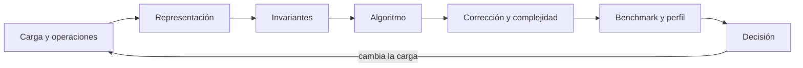

# Parte 07 — Estructuras de datos y algoritmos

El motor de reglas comparado acordó una semántica; la biblioteca de estructuras y algoritmos debe ejecutarla sobre miles de casos que llegan, cambian de prioridad, se relacionan y expiran. Esta parte evita el catálogo de estructuras: cada clase modifica el mismo motor de priorización y obliga a explicar operaciones, invariantes, costo teórico, comportamiento empírico y condición en que la elección deja de servir.

## Pregunta rectora

> ¿Qué representación sostiene las operaciones dominantes de una carga real sin perder corrección en los límites?

## Antes del recorrido clase por clase

Esta parte no presenta estructuras como un catálogo de nombres ni confunde complejidad
asintótica con rendimiento observado. Cada clase vuelve sobre **biblioteca de estructuras y algoritmos**, declara la carga
y sus operaciones dominantes, protege invariantes y contrasta predicción con medición.
Así puede distinguirse una elección estructural de una coincidencia de benchmark.

El diagrama no prescribe una estructura concreta. El retorno indica que una elección
debe reabrirse cuando cambia la proporción de operaciones, el tamaño, la distribución o
el presupuesto; una medición verde bajo la carga anterior no valida la nueva.

## Resultados acumulativos

Podrás diseñar una representación desde la carga, demostrar invariantes, implementar búsquedas y recorridos, comparar estrategias voraces, dinámicas y de exploración, e interpretar benchmarks y perfiles sin convertir una medición aislada en una afirmación universal.

Al finalizar podrás defender una estructura y un algoritmo mediante contrato,
invariantes, análisis y medición, y podrás indicar con precisión qué cambio de carga o
recursos invalida tu recomendación.

## Prerrequisitos enlazados

- [Parte 4 — Pensamiento computacional](https://github.com/vladimiracunadev-create/modern-software-engineering-program/blob/main/classes/part-04-pensamiento-computacional-y-resolucion-de-problemas/): modelado, invariantes, corrección y complejidad.
- [Parte 5 — Fundamentos de programación](https://github.com/vladimiracunadev-create/modern-software-engineering-program/blob/main/classes/part-05-fundamentos-de-programacion/): valores, control, funciones, errores, pruebas y la CLI diagnóstica.
- Python 3.11+, Git y terminal; runtimes adicionales son opcionales y deben declararse.

## Bloques y progresión

1. **Colecciones fundamentales:** las clases 85–87 contrastan secuencias, colas, prioridades, mapas y conjuntos.
2. **Jerarquías, grafos y búsqueda:** las clases 88–90 modelan jerarquías, grafos, búsqueda, orden y selección.
3. **Estrategias y estructuras avanzadas:** las clases 91–93 estudian decisiones locales, subproblemas, exploración e índices especializados.
4. **Medición y biblioteca:** las clases 94–96 miden, deciden por carga y entregan una biblioteca comparada.

## Guía razonada clase por clase

La biblioteca de estructuras y algoritmos mantiene casos, operaciones y criterios de corrección estables mientras cambia la
representación. Cada clase explica qué operación mejora, cuál se encarece, qué invariante
sostiene la estructura y qué evidencia permite abandonar la elección cuando cambia la
carga.

### Bloque 1 — Elegir colecciones por sus operaciones

#### SE-085 — Arreglos, listas y secuencias

Una secuencia promete orden e iteración, pero su representación decide costo de acceso,
inserción y localidad. La clase compara almacenamiento contiguo, arreglo dinámico y
nodos enlazados sin atribuir a la interfaz propiedades de una implementación concreta.

El estudiante caracteriza el flujo de casos de la biblioteca de estructuras y algoritmos, predice operaciones dominantes y
mide recorridos e inserciones con tamaños crecientes. La evidencia incluye un escenario
donde cada alternativa pierde. `SE-086` añade políticas de extracción —LIFO, FIFO y
prioridad— que convierten orden en comportamiento del sistema.

#### SE-086 — Pilas, colas, deques y prioridades

Pila, cola y deque restringen qué extremo se consulta; un heap garantiza acceso al
elemento prioritario, no orden total. La clase relaciona estas propiedades con undo,
trabajo pendiente, ventanas y planificación, y hace explícita la regla de desempate para
evitar resultados dependientes de detalles internos.

La biblioteca de estructuras y algoritmos encola casos, actualiza prioridad y reproduce starvation. El estudiante registra
invariante, costo y política de equidad. Para encontrar un caso por identidad sin
recorrer toda la cola, `SE-087` introduce mapas, conjuntos y el contrato de igualdad y
hash.

#### SE-087 — Tablas hash, mapas y conjuntos

Una tabla hash traduce clave a ubicación esperada, pero necesita igualdad coherente,
hash estable y estrategia de colisión. La clase diferencia mapa de conjunto y explica
promedio frente a peor caso, redimensionamiento y riesgo de usar objetos mutables como
clave.

El estudiante indexa casos de la biblioteca de estructuras y algoritmos y prueba duplicados, colisiones controladas y claves
ausentes. La evidencia separa pertenencia de orden. Cuando la consulta depende de
prefijos o jerarquías, `SE-088` usa árboles y tries con invariantes más fuertes.

### Bloque 2 — Representar jerarquías, relaciones y consultas

#### SE-088 — Árboles, tries y estructuras jerárquicas

Un árbol expresa una jerarquía; un árbol de búsqueda añade orden y un trie comparte
prefijos. La clase explica raíz, subárbol, balance, rotaciones y recorridos, y muestra
cómo una inserción adversarial degrada un BST no balanceado hasta comportarse como lista.

La biblioteca de estructuras y algoritmos organiza categorías y comandos por prefijo. El estudiante verifica invariante,
serializa sin perder estructura y compara profundidad. Dependencias con múltiples rutas
y ciclos ya no caben en una jerarquía; `SE-089` generaliza el modelo a grafos.

#### SE-089 — Grafos y recorridos

Un grafo representa relaciones arbitrarias mediante vértices y aristas; la elección
entre lista y matriz de adyacencia depende de densidad y consultas. La clase compara BFS
y DFS, mantiene visitados y reconstruye causa del camino, no solo alcance.

La biblioteca de estructuras y algoritmos modela propagación entre servicios y busca la primera dependencia alcanzable. El
estudiante prueba ciclos, componentes y rutas inexistentes, registrando distancia y
predecesor. `SE-090` estudia cuándo ordenar, buscar o seleccionar evita trabajo y qué
precondición exige cada algoritmo.

#### SE-090 — Búsqueda, ordenamiento y selección

Búsqueda binaria requiere orden compatible; ordenar cuesta y puede no justificarse para
una única consulta. La clase distingue estabilidad, clave, comparación total, selección
`top-k` y búsqueda lineal, y muestra cómo valores especiales o comparadores incoherentes
rompen garantías.

El estudiante compara consultas de la biblioteca de estructuras y algoritmos bajo distintas frecuencias y prueba empates.
Entrega una decisión que incluye costo de preparar y mantener el orden. Cuando la
solución depende de una secuencia de elecciones y no solo de ordenar datos, `SE-091`
contrasta voracidad y programación dinámica.

### Bloque 3 — Diseñar estrategias y estructuras especializadas

#### SE-091 — Algoritmos voraces y programación dinámica

Una estrategia voraz toma la mejor opción local y solo es correcta cuando una propiedad
lo justifica. La programación dinámica conserva resultados de subproblemas superpuestos
y necesita estado suficiente. La clase exige argumento o contraejemplo, no confianza en
que un ejemplo pequeño funcionó.

La biblioteca de estructuras y algoritmos asigna un presupuesto de pruebas. El estudiante construye un caso donde la elección
local falla, formula recurrencia y compara memoria. `SE-092` estudia problemas donde hay
que explorar alternativas o dividir instancias independientes.

#### SE-092 — Backtracking, divide y vencerás

Backtracking explora un árbol de decisiones y poda solo cuando puede demostrar que una
rama no sirve; divide y vencerás resuelve subproblemas independientes y combina. La
clase separa ambos mecanismos y hace visibles profundidad, factor de ramificación y
presupuesto.

El estudiante programa una selección restringida en la biblioteca de estructuras y algoritmos, ordena decisiones para podar
y registra soluciones incompletas al agotar tiempo. Después contrasta con una
descomposición independiente. `SE-093` amplía el repertorio con índices probabilísticos
y estructuras que conservan versiones.

#### SE-093 — Índices, probabilísticas y estructuras persistentes

Un índice acelera una consulta a cambio de espacio y mantenimiento; un Bloom filter
acepta falsos positivos controlados, no falsos negativos bajo su contrato; una
estructura persistente conserva versiones compartiendo partes. La clase explicita qué
garantía se intercambia en cada caso.

La biblioteca de estructuras y algoritmos usa un filtro para evitar búsquedas costosas y snapshots para comparar decisiones.
El estudiante mide tasa observada, prueba borrado o reconstrucción y calcula memoria.
Estas estructuras prometen costos que `SE-094` debe comprobar con un experimento y un
perfil representativos.

### Bloque 4 — Medir, decidir y entregar

#### SE-094 — Complejidad empírica, benchmarks y perfiles

Un benchmark responde a una carga, entorno y protocolo; un profiler atribuye tiempo o
memoria dentro de esa ejecución. La clase controla calentamiento, generación de datos,
repetición y variación, separa construcción de consulta y evita inferir complejidad
universal desde pocos puntos.

El estudiante contrasta predicciones de la biblioteca de estructuras y algoritmos con curvas y perfiles, busca el cuello de
botella y registra versiones. El informe incluye una medición que no permite decidir.
`SE-095` usa toda esa evidencia para escoger por carga y no por familiaridad.

#### SE-095 — Taller: elegir por carga y no por costumbre

El taller entrega dos cargas con proporciones distintas de inserción, actualización,
consulta, `top-k` y recorrido. La misma estructura no tiene que ganar ambas. El
estudiante define antes criterios de corrección y presupuesto, propone alternativas y
predice el cruce.

La revisión exige invariantes, pruebas de límites, benchmark y condición de reversión.
Una recomendación sin explicar la operación sacrificada no se acepta. `SE-096` empaqueta
las alternativas y su evidencia como biblioteca comparable por otra persona.

#### SE-096 — Proyecto: biblioteca comparada con casos límite

El proyecto entrega implementaciones intercambiables de operaciones de la biblioteca de estructuras y algoritmos, una API
común, propiedades, corpus de cargas y mediciones reproducibles. No busca demostrar que
una estructura es superior, sino permitir elegir con corrección bajo condiciones
declaradas.

La aceptación cubre vacío, duplicado, empate, actualización, ciclo y escala; separa
resultados funcionales de rendimiento. El informe declara plataformas y variabilidad.
La regresión de prioridades empatadas que aparece al cambiar entorno será el síntoma que
la Parte 8 investigará con el entorno reproducible de diagnóstico.

## Resumen operativo del recorrido

| Clase | Capacidad que construye | Pregunta que resuelve | Evidencia acumulativa |
|---|---|---|---|
| [SE-085](https://github.com/vladimiracunadev-create/modern-software-engineering-program/blob/main/classes/part-07-estructuras-de-datos-y-algoritmos/se-085-arreglos-listas-y-secuencias/) | Arreglos, listas y secuencias | ¿Qué cambia al elegir almacenamiento contiguo, secuencia dinámica o nodos enlazados? | Perfil de operaciones y comparación de secuencias |
| [SE-086](https://github.com/vladimiracunadev-create/modern-software-engineering-program/blob/main/classes/part-07-estructuras-de-datos-y-algoritmos/se-086-pilas-colas-deques-y-prioridades/) | Pilas, colas, deques y prioridades | ¿Cómo cambia el comportamiento cuando la estructura impone LIFO, FIFO o prioridad? | Cola priorizada con desempate y caso de starvation |
| [SE-087](https://github.com/vladimiracunadev-create/modern-software-engineering-program/blob/main/classes/part-07-estructuras-de-datos-y-algoritmos/se-087-tablas-hash-mapas-y-conjuntos/) | Tablas hash, mapas y conjuntos | ¿Qué exige una búsqueda por clave para seguir siendo correcta y predecible? | Índice por clave con colisiones y duplicados probados |
| [SE-088](https://github.com/vladimiracunadev-create/modern-software-engineering-program/blob/main/classes/part-07-estructuras-de-datos-y-algoritmos/se-088-arboles-tries-y-estructuras-jerarquicas/) | Árboles, tries y estructuras jerárquicas | ¿Qué invariante convierte una jerarquía en una estructura buscable? | Árbol/trie validado, recorrido y caso degenerado |
| [SE-089](https://github.com/vladimiracunadev-create/modern-software-engineering-program/blob/main/classes/part-07-estructuras-de-datos-y-algoritmos/se-089-grafos-y-recorridos/) | Grafos y recorridos | ¿Cómo explorar relaciones arbitrarias sin perder visitados, distancia ni causa del camino? | Grafo de dependencias con ruta y predecesores |
| [SE-090](https://github.com/vladimiracunadev-create/modern-software-engineering-program/blob/main/classes/part-07-estructuras-de-datos-y-algoritmos/se-090-busqueda-ordenamiento-y-seleccion/) | Búsqueda, ordenamiento y selección | ¿Qué precondición permite buscar, ordenar o seleccionar con una garantía concreta? | Comparación de búsqueda, orden estable y top-k |
| [SE-091](https://github.com/vladimiracunadev-create/modern-software-engineering-program/blob/main/classes/part-07-estructuras-de-datos-y-algoritmos/se-091-algoritmos-voraces-y-programacion-dinamica/) | Algoritmos voraces y programación dinámica | ¿Cuándo una elección local es segura y cuándo debe conservarse historia de subproblemas? | Contraejemplo voraz y recurrencia verificada |
| [SE-092](https://github.com/vladimiracunadev-create/modern-software-engineering-program/blob/main/classes/part-07-estructuras-de-datos-y-algoritmos/se-092-backtracking-divide-y-venceras/) | Backtracking, divide y vencerás | ¿Cómo explorar alternativas sin confundir búsqueda exhaustiva, poda y descomposición independiente? | Árbol de búsqueda, poda y presupuesto explícitos |
| [SE-093](https://github.com/vladimiracunadev-create/modern-software-engineering-program/blob/main/classes/part-07-estructuras-de-datos-y-algoritmos/se-093-indices-probabilisticas-y-estructuras-persistentes/) | Índices, probabilísticas y estructuras persistentes | ¿Qué garantía se intercambia al usar un índice especializado, probabilidad o versiones persistentes? | Filtro medido y snapshots con memoria declarada |
| [SE-094](https://github.com/vladimiracunadev-create/modern-software-engineering-program/blob/main/classes/part-07-estructuras-de-datos-y-algoritmos/se-094-complejidad-empirica-benchmarks-y-perfiles/) | Complejidad empírica, benchmarks y perfiles | ¿Cómo medir costo sin convertir ruido, calentamiento o una carga irreal en conclusión? | Protocolo, curvas, variación y perfil atribuible |
| [SE-095](https://github.com/vladimiracunadev-create/modern-software-engineering-program/blob/main/classes/part-07-estructuras-de-datos-y-algoritmos/se-095-taller-elegir-por-carga-y-no-por-costumbre/) | Taller: elegir por carga y no por costumbre | ¿Cómo elegir una estructura por perfil de operaciones en lugar de preferencia personal? | Matriz de decisión para dos cargas rivales |
| [SE-096](https://github.com/vladimiracunadev-create/modern-software-engineering-program/blob/main/classes/part-07-estructuras-de-datos-y-algoritmos/se-096-proyecto-biblioteca-comparada-con-casos-limite/) | Proyecto: biblioteca comparada con casos límite | ¿Cómo entregar una biblioteca comparada cuya corrección y rendimiento puedan discutirse con evidencia? | Biblioteca, propiedades, corpus y reporte comparado |

## Proyecto integrador

El proyecto **SE-096** entrega una biblioteca con API común, al menos dos estructuras o
algoritmos intercambiables, pruebas de propiedades, casos límite, cargas versionadas,
benchmarks y perfiles reproducibles. El informe recomienda una alternativa para dos
perfiles de operaciones distintos y declara el punto en que la decisión debe revisarse.

## Criterios de salida

- las doce clases explican todos sus temas mediante mecanismos, ejemplos y límites;
- cada implementación conserva la misma semántica observable y sus invariantes;
- el corpus cubre vacío, duplicado, empate, actualización, ciclo y crecimiento;
- las métricas separan construcción, consulta, tiempo, memoria, runtime y entorno;
- otra persona reproduce comandos y resultados desde checkout limpio;
- el informe declara lo observado, lo inferido y lo no ejecutado.

## Preguntas de control por bloque

- ¿Qué operaciones dominan la carga y qué representación las favorece?
- ¿Qué invariante sostiene la corrección y qué caso intenta romperlo?
- ¿Qué costo predice el análisis y qué parte confirma o contradice la medición?
- ¿Qué cambio de distribución, escala o memoria obliga a sustituir la elección?

## Fuentes de la parte

- [MIT 6.006 Introduction to Algorithms](https://ocw.mit.edu/courses/6-006-introduction-to-algorithms-spring-2020/) — estructuras, algoritmos, corrección y análisis de complejidad; autoridad: MIT OpenCourseWare.
- [Python Data Model](https://docs.python.org/3/reference/datamodel.html) — semántica de secuencias, conjuntos, mappings, igualdad y hash; autoridad: Python Software Foundation.
- [Python Standard Library](https://docs.python.org/3/library/index.html) — deque, heapq, bisect, graphlib y contenedores disponibles; autoridad: Python Software Foundation.
- [Python Debugging and Profiling](https://docs.python.org/3/library/debug.html) — timeit, cProfile y tracemalloc con sus límites; autoridad: Python Software Foundation.
- [Mathematics for Computer Science](https://ocw.mit.edu/courses/6-042j-mathematics-for-computer-science-spring-2015/) — inducción, grafos, conteo y razonamiento discreto; autoridad: MIT OpenCourseWare.
- [SWEBOK Guide v4.0a](https://www.computer.org/education/bodies-of-knowledge/software-engineering) — construcción, medición y fundamentos de ingeniería; autoridad: IEEE Computer Society.

Las fuentes se vinculan también dentro de cada clase. Definen semántica y mecanismos; la adecuación de la biblioteca de estructuras y algoritmos se demuestra con el caso, las pruebas y la comparación.
