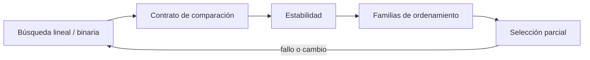

# SE-090 — Búsqueda, ordenamiento y selección

[← SE-089 — Grafos y recorridos](https://github.com/vladimiracunadev-create/modern-software-engineering-program/blob/main/classes/part-07-estructuras-de-datos-y-algoritmos/se-089-grafos-y-recorridos/README.md) · [↑ Parte 07](https://github.com/vladimiracunadev-create/modern-software-engineering-program/blob/main/classes/part-07-estructuras-de-datos-y-algoritmos/README.md) · [📚 Índice completo](https://github.com/vladimiracunadev-create/modern-software-engineering-program/blob/main/classes/README.md) · [🌐 Portal](https://vladimiracunadev-create.github.io/modern-software-engineering-program/classes/SE-090.html) · [SE-091 — Algoritmos voraces y programación dinámica →](https://github.com/vladimiracunadev-create/modern-software-engineering-program/blob/main/classes/part-07-estructuras-de-datos-y-algoritmos/se-091-algoritmos-voraces-y-programacion-dinamica/README.md)


## Punto profesional y fundamento pedagógico

**Punto profesional.** La clase existe para seleccionar búsqueda, ordenamiento y selección por precondiciones y estabilidad.

**Por qué aparece aquí.** Se sitúa después de **Grafos y recorridos** y antes de **Algoritmos voraces y programación dinámica**: convierte el conocimiento anterior en una decisión observable que la clase siguiente podrá reutilizar. La continuidad se comprueba en el artefacto, no por compartir vocabulario.

**Error conceptual que debe corregir.** Comparar solo tiempo final o ignorar que los datos ya están ordenados.

**Secuencia de aprendizaje.** Antes de leer la solución, el estudiante predice el resultado del caso normal y del error conceptual anterior. Luego explica un caso resuelto paso a paso, construye un contraejemplo que cambie la decisión y, sin consultar el texto, reconstruye el mecanismo y lo aplica a una entrada nueva. La secuencia usa predicción, explicación propia, contraste y recuperación. [ICAP](https://icap.education.asu.edu/research) distingue participación de construcción de conocimiento; [How People Learn II](https://nap.nationalacademies.org/catalog/24783/how-people-learn-ii-learners-contexts-and-cultures) exige conectar conocimiento previo, contexto y transferencia; la [práctica de recuperación](https://pubmed.ncbi.nlm.nih.gov/16507066/) respalda producir de nuevo la explicación tras una demora; y [Education for Life and Work](https://nap.nationalacademies.org/resource/13398/dbasse_084153.pdf) exige devolución que explique la causa del error.

**Evidencia de aprendizaje.** Algorithm-comparison.md con entradas, comparaciones, estabilidad y umbral. Debe contener predicción previa, observación, explicación causal, contraejemplo, criterio de aceptación y una nota de qué dato haría cambiar la conclusión.

**Límite de la conclusión.** Un microbenchmark no reemplaza análisis de crecimiento.

### Trazabilidad fuente → afirmación

| Fuente primaria u oficial | Afirmación que respalda | Lo que no prueba |
|---|---|---|
| [MIT 6.006 Introduction to Algorithms](https://ocw.mit.edu/courses/6-006-introduction-to-algorithms-spring-2020/) | Estructuras, algoritmos, corrección y análisis de complejidad; autoridad: MIT OpenCourseWare | No demuestra por sí sola que el artefacto del estudiante sea correcto. |
| [Python Standard Library](https://docs.python.org/3/library/index.html) | Deque, heapq, bisect, graphlib y contenedores disponibles; autoridad: Python Software Foundation | No demuestra por sí sola que el artefacto del estudiante sea correcto. |
| [Python Debugging and Profiling](https://docs.python.org/3/library/debug.html) | Timeit, cprofile y tracemalloc con sus límites; autoridad: Python Software Foundation | No demuestra por sí sola que el artefacto del estudiante sea correcto. |

## Antes de empezar

Esta clase continúa la **biblioteca de estructuras y algoritmos de la Parte 07**. Recupera la evidencia de la clase anterior, añade una decisión propia de **Búsqueda, ordenamiento y selección** y deja un artefacto que la clase siguiente deberá consumir. La pregunta activa es: **¿Qué precondición permite buscar, ordenar o seleccionar con una garantía concreta?**

## Prerrequisitos

- Haber completado la clase anterior o reconstruir su contrato y evidencia.
- Python 3.11 o posterior, terminal, editor y Git; un segundo runtime es opcional y debe declararse.
- Trabajar con fixtures sintéticos: ninguna observación necesita datos de una persona o sistema real.

## Problema auténtico

La biblioteca de estructuras y algoritmos ordena todo el backlog para mostrar los cinco casos principales. La salida es correcta, pero paga más trabajo que el necesario y un comparador no transitivo cambia resultados.

## Objetivos observables

Al terminar podrás explicar los cinco mecanismos de esta clase, predecir su comportamiento antes de ejecutar, construir un caso normal y uno límite, diagnosticar el fallo controlado, comparar una alternativa y entregar evidencia que otra persona pueda reproducir.

## Mapa conceptual



El mapa se lee como una cadena de razonamiento, no como fases obligatorias del runtime. La flecha de retorno indica que un fallo o cambio de requisito obliga a revisar el modelo inicial; no autoriza a parchear solo la última salida.

## Temas y por qué importan

| Tema | Por qué cambia una decisión profesional | Evidencia mínima |
|---|---|---|
| Búsqueda lineal y binaria | La búsqueda lineal no exige orden y puede detenerse al hallar; la binaria descarta media región bajo secuencia ordenada y acceso por índice. | Predicción, traza causal y contraejemplo de **Búsqueda lineal y binaria** en `algorithm-comparison.md` |
| Contrato de comparación | Ordenar requiere una relación consistente, normalmente total o una clave total derivada. | Predicción, traza causal y contraejemplo de **Contrato de comparación** en `algorithm-comparison.md` |
| Estabilidad | Un sort estable conserva orden relativo entre claves iguales. | Predicción, traza causal y contraejemplo de **Estabilidad** en `algorithm-comparison.md` |
| Familias de ordenamiento | Merge sort garantiza `n log n` y usa memoria adicional; quicksort depende de pivote y puede degradar; heapsort acota tiempo y opera con otros compromisos. | Predicción, traza causal y contraejemplo de **Familias de ordenamiento** en `algorithm-comparison.md` |
| Selección parcial | Para top-k, un heap de tamaño `k` evita ordenar todo y usa espacio acotado. | Predicción, traza causal y contraejemplo de **Selección parcial** en `algorithm-comparison.md` |
## Conceptos y decisiones

### 1. Búsqueda lineal y binaria

La búsqueda lineal no exige orden y puede detenerse al hallar; la binaria descarta media región bajo secuencia ordenada y acceso por índice. Si el orden se rompe entre consultas, el resultado puede ser incorrecto sin error.

### 2. Contrato de comparación

Ordenar requiere una relación consistente, normalmente total o una clave total derivada. Antisimetría, transitividad y tratamiento de iguales importan. Fechas sin zona o valores ausentes deben normalizarse antes del comparador.

### 3. Estabilidad

Un sort estable conserva orden relativo entre claves iguales. Permite ordenar por varias claves en pasadas o preservar llegada como desempate. Si la estabilidad no está garantizada, depender de ella convierte presentación en comportamiento accidental.

### 4. Familias de ordenamiento

Merge sort garantiza `n log n` y usa memoria adicional; quicksort depende de pivote y puede degradar; heapsort acota tiempo y opera con otros compromisos. Runtimes usan híbridos; comprenderlos evita inferir implementación desde el nombre `sort`.

### 5. Selección parcial

Para top-k, un heap de tamaño `k` evita ordenar todo y usa espacio acotado. Quickselect ofrece selección esperada lineal bajo pivotes adecuados. La mejor opción depende de si llegan datos en streaming, si k cambia y si se necesita salida ordenada.

## Definiciones de trabajo

- **búsqueda lineal y binaria:** la búsqueda lineal no exige orden y puede detenerse al hallar; la binaria descarta media región bajo secuencia ordenada y acceso por índice.
- **contrato de comparación:** ordenar requiere una relación consistente, normalmente total o una clave total derivada.
- **estabilidad:** un sort estable conserva orden relativo entre claves iguales.
- **familias de ordenamiento:** merge sort garantiza `n log n` y usa memoria adicional; quicksort depende de pivote y puede degradar; heapsort acota tiempo y opera con otros compromisos.
- **selección parcial:** para top-k, un heap de tamaño `k` evita ordenar todo y usa espacio acotado.

Las definiciones son operativas para la biblioteca de estructuras y algoritmos. No convierten términos con historia más amplia en sinónimos y deben contrastarse con la documentación primaria enlazada al final.

## Ejemplo mínimo

```python
import heapq
cases = [(8, "a"), (2, "b"), (9, "c"), (5, "d")]
top_two = heapq.nlargest(2, cases)
assert top_two == [(9, "c"), (8, "a")]
```

Antes de ejecutar, predice estado, resultado y error. Después registra versión, comando y salida. Si el fragmento es pseudocódigo o pertenece a otro lenguaje, etiquétalo como tal y no afirmes que fue ejecutado.

## Ejemplo profesional

En la biblioteca de estructuras y algoritmos, un caso conserva identidad, prioridad, dependencias, instante de llegada y estado de resolución. La implementación de esta clase debe conservar ese contrato aunque cambie la forma interna. El caso profesional no pregunta únicamente si produce una salida: pregunta quién puede producirla, qué estado observa, cómo falla y qué rastro permite disputar una decisión incorrecta.

Compara el caso normal con autorización falsa, evidencia incompleta, empate y repetición. Un mecanismo es apropiado cuando esas diferencias quedan visibles y localizadas; es peligroso cuando dependen de orden accidental, estado oculto o una convención que el consumidor no puede conocer.

## Práctica guiada

1. Copia el contrato de entrada y salida antes de escribir implementación.
2. Predice el caso normal y un límite; identifica la invariante que no puede romperse.
3. Implementa la versión mínima sin I/O dentro del núcleo.
4. Ejecuta el caso y conserva comando, versión y salida bajo `evidence/`.
5. Introduce el fallo controlado, reduce la reproducción y formula dos hipótesis rivales.
6. Corrige la causa, añade regresión y ejecuta el conjunto completo.
7. Compara con otro paradigma o lenguaje indicando qué semántica se preserva.

## Ejercicios

1. **Lectura:** dibuja una traza de cinco pasos y marca dónde cambia estado o control.
2. **Construcción:** añade una operación dominante y demuestra la invariante que conserva.
3. **Frontera:** cubre vacío, empate, no autorizado e inválido con resultados distintos.
4. **Contraste:** reescribe una pieza con otro modelo y explica una mejora y una pérdida.

## Reto verificable

Entrega implementación, fixtures, pruebas y un informe corto. Se aprueba si otra persona ejecuta desde checkout limpio, obtiene los mismos resultados y puede relacionar cada rama o transformación con una regla del dominio. No se aprueba por cantidad de archivos ni por usar la sintaxis característica del paradigma.

## Caso conductor

La biblioteca de estructuras y algoritmos recibe casos del motor de reglas comparado, mantiene una frontera de trabajo priorizada y explica por qué el siguiente caso es elegible. Ejecuta una carga pequeña trazable, duplicados, prioridades iguales y una dependencia ausente. Cambia después una sola regla o condición y revisa qué archivos, pruebas y trazas debieron modificarse. Esa superficie de cambio alimenta el proyecto final de la parte.

## Preguntas frecuentes

### ¿Un paradigma determina toda la arquitectura?

No. Puede organizar un núcleo o una frontera sin dominar el sistema completo. Combinar modelos es válido si los adaptadores preservan identidad, orden, errores y evidencia.

### ¿Menos líneas significan una solución mejor?

No. La brevedad puede quitar duplicación o esconder decisiones. Se evalúan semántica, diagnóstico, costo de cambio y adecuación a la carga.

### ¿Debo instalar todos los lenguajes mencionados?

No. Python basta para la práctica base. Si usas Prolog, Rust o Erlang, registra versión y comandos; si solo analizas notación, decláralo como análisis no ejecutado.

## Fallo controlado y diagnóstico

Usa una clave aleatoria durante el sort y observa violación de consistencia. Calcula claves una vez y prueba estabilidad con prioridades iguales.

Registra síntoma, entrada mínima, hipótesis, observación que descarta cada hipótesis, causa, corrección y prueba de regresión. No cambies simultáneamente implementación, fixture y expectativa.

## Errores comunes y cómo corregirlos

| Síntoma | Causa probable | Corrección |
|---|---|---|
| dos pruebas aisladas pasan y juntas fallan | estado o dependencia compartida | aislar propietario y reiniciar fixture |
| implementación corta pero opaca | semántica delegada sin contrato | documentar transición, error y orden |
| modelos “equivalentes” divergen | fixtures normalizan diferencias reales | comparar contrato antes de presentación |
| reintento duplica resultado | efecto sin identidad ni idempotencia | correlacionar y probar repetición |
| diagrama y código cuentan historias distintas | visual ornamental o desactualizado | trazar el mismo caso en ambos |

## Entorno y archivos clave

```text
work/SE-090/
├── README.md
├── algorithm_library/
│   ├── domain.py
│   └── se_090.py
├── fixtures/cases.json
├── tests/test_se_090.py
└── evidence/diagnosis.md
```

El `README` declara plataforma, runtimes, comandos, limpieza y límites. Evita dependencias externas cuando la biblioteca estándar permita observar el mecanismo; si agregas una, fija procedencia y versión.

## Seguridad, ética y accesibilidad

- la autorización forma parte del dominio y no se infiere por ausencia de rechazo;
- no uses `eval`, reglas descargadas ni serialización insegura;
- limita colas, recursión, tamaño de entrada y tiempo de evaluación;
- redacta trazas y conserva una explicación textual además de color o animación;
- una recomendación automatizada debe poder revisarse, impugnarse y corregirse;
- respeta licencias de ejemplos y atribuye adaptaciones.

## Transferencia

Traslada un fixture al segundo modelo o lenguaje. Compara representación de ausencia, error, mutabilidad, orden y cancelación. La transferencia está lograda cuando el contrato se conserva y las diferencias están explicadas, no cuando la sintaxis se parece.

## Evaluación y evidencia

| Criterio | Evidencia para aprobar |
|---|---|
| comprensión | explicación causal de los cinco mecanismos |
| corrección | normal, límite, inválido y contraejemplo |
| diseño | estado, efectos y contrato localizables |
| diagnóstico | reproducción mínima y regresión |
| transferencia | comparación semántica, no estética |
| reproducibilidad | versiones, comandos, salida y límites |


## Fuentes


- [MIT 6.006 Introduction to Algorithms](https://ocw.mit.edu/courses/6-006-introduction-to-algorithms-spring-2020/) — Estructuras, algoritmos, corrección y análisis de complejidad; autoridad: MIT OpenCourseWare.
- [Python Data Model](https://docs.python.org/3/reference/datamodel.html) — Semántica de secuencias, conjuntos, mappings, igualdad y hash; autoridad: Python Software Foundation.
- [Python Standard Library](https://docs.python.org/3/library/index.html) — Deque, heapq, bisect, graphlib y contenedores disponibles; autoridad: Python Software Foundation.
- [Python Debugging and Profiling](https://docs.python.org/3/library/debug.html) — Timeit, cprofile y tracemalloc con sus límites; autoridad: Python Software Foundation.
- [Mathematics for Computer Science](https://ocw.mit.edu/courses/6-042j-mathematics-for-computer-science-spring-2015/) — Inducción, grafos, conteo y razonamiento discreto; autoridad: MIT OpenCourseWare.
- [SWEBOK Guide v4.0a](https://www.computer.org/education/bodies-of-knowledge/software-engineering) — Construcción, medición y fundamentos de ingeniería; autoridad: IEEE Computer Society.

Cada fuente respalda el mecanismo indicado; ninguna demuestra que la implementación de la biblioteca de estructuras y algoritmos sea correcta. Esa afirmación depende de fixtures, pruebas, trazas y revisión reproducible.

## Límites y siguiente paso

Elegir top-k no resuelve decisiones secuenciales con subproblemas o restricciones. La siguiente clase compara estrategias voraces y programación dinámica.

## Glosario

- **búsqueda lineal y binaria:** la búsqueda lineal no exige orden y puede detenerse al hallar; la binaria descarta media región bajo secuencia ordenada y acceso por índice.
- **contrato de comparación:** ordenar requiere una relación consistente, normalmente total o una clave total derivada.
- **estabilidad:** un sort estable conserva orden relativo entre claves iguales.
- **familias de ordenamiento:** merge sort garantiza `n log n` y usa memoria adicional; quicksort depende de pivote y puede degradar; heapsort acota tiempo y opera con otros compromisos.
- **selección parcial:** para top-k, un heap de tamaño `k` evita ordenar todo y usa espacio acotado.

---

[← SE-089 — Grafos y recorridos](https://github.com/vladimiracunadev-create/modern-software-engineering-program/blob/main/classes/part-07-estructuras-de-datos-y-algoritmos/se-089-grafos-y-recorridos/README.md) · [↑ Parte 07](https://github.com/vladimiracunadev-create/modern-software-engineering-program/blob/main/classes/part-07-estructuras-de-datos-y-algoritmos/README.md) · [📚 Índice completo](https://github.com/vladimiracunadev-create/modern-software-engineering-program/blob/main/classes/README.md) · [🌐 Portal](https://vladimiracunadev-create.github.io/modern-software-engineering-program/classes/SE-090.html) · [SE-091 — Algoritmos voraces y programación dinámica →](https://github.com/vladimiracunadev-create/modern-software-engineering-program/blob/main/classes/part-07-estructuras-de-datos-y-algoritmos/se-091-algoritmos-voraces-y-programacion-dinamica/README.md)
